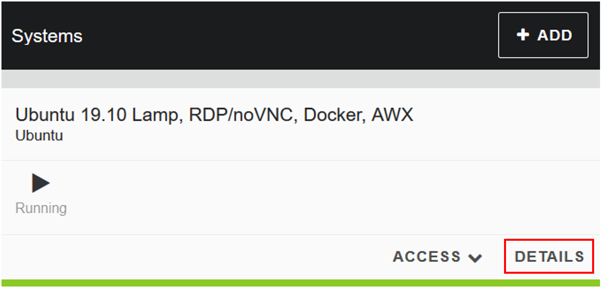
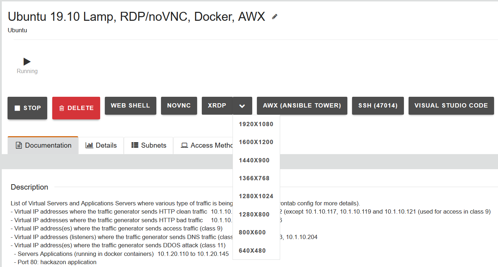
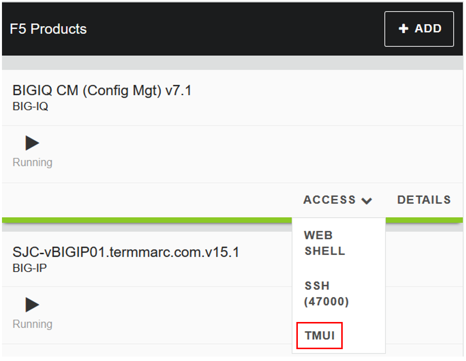
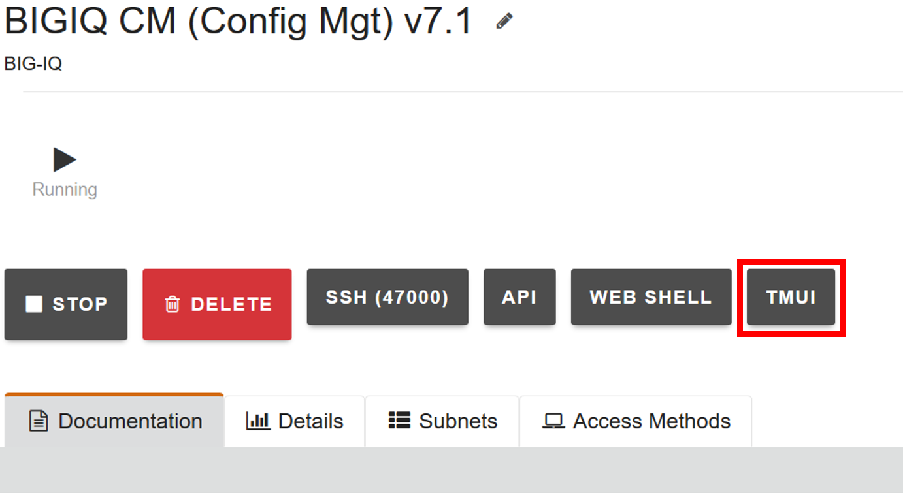

**Lab 1: Manage AS3 Templates on BIG-IQ**

   **Exercise 1.1 – Import AS3 templates**

   **Credentials**

   **Username Password Notes**

   admin purple123 local

   paula paula radius

   david david radius

From the lab environment, launch an RDP session to access the Ubuntu
Desktop. To do this, in your lab deployment, click on the
**Details** button of the \ *Ubuntu Lamp Server* system and from the
**XRDP** option\ *,* click on the drop-down and select the resolution
that works for your laptop.

**Note**

Modern laptops with higher resolutions you might want to use 1440x900
and once XRDP is launched Zoom to 200%)

If the RDP session does not render correctly or the resolution poor, you
can access via **NOVNC** or connect to the BIG-IP and BIG-IQ CM XUI
directly.

|image0|

|image1|

To access the BIG-IQ directly, click on the ACCESS button under BIGIQ CM
and select TMUI or by clicking on the **Details** button of
the \ *BIG-IQ CM (Config Mgt) 7.1)* system, and select the **TMUI.**

|image2|

|image3|

View AS3 templates section

1. From within the LAMP server RDP session, logon to BIG-IQ as **admin**
      by opening a browser and go to: \ https://10.1.1.4 or directly via
      the TMUI as shown above.

2. Go to Applications > Application Templates and review the top section
      which is titled \ **AS3 Templates**.

A new BIG-IQ v7.x deployment will NOT include AS3 templates out of the
box. If you want to start using AS3 templates which are provided by F5,
then those AS3 templates can be found through the following
link: \ https://github.com/f5devcentral/f5-big-iq

**Note**

   *The F5 default AS3 BIG-IQ templates are already imported in the lab
   environment blueprint. The following instructions are informational
   only.*

Import AS3 BIG-IQ templates

1. Select \ **Import Templates** at the right top corner. You will be
   taken to the BIG-IQ AS3 Template Library on GitHub.

..

   |image4|

2. Make yourself familiar with the GitHub page and understand which AS3
   templates are available.

3. The AS3 templates are already imported in BIG-IQ and you don’t need
   to perform step 4.

4. Use the provided instructions on the GitHub page to import the
   templates into BIG-IQ.

..

   **Note**

   The F5 default AS3 BIG-IQ templates are already imported in the lab
   environment blueprint.

5. Walk through the provided templates and select them to understand the
   structure. If familiar with AS3 you will notice the structure.
   Otherwise, visit \ `AS3 Example
   declarations <https://clouddocs.f5.com/products/extensions/f5-appsvcs-extension/latest/userguide/examples.html.>`__.

..

   **Exercise 1.2 – Deploy application via BIG-IQ using a default AS3
   template**

Create HTTPS Service using AS3 via BIG-IQ GUI
---------------------------------------------

In this exercise we will create an application service using an AS3
template. The service will include a pool with two pool members (server
addresses) listening on port 80, a virtual server listening on port 443
and various profiles to offload SSL to the pool members.

First, we attempt to create an application service as application owner
Paula.

1. Log in as \ **paula** in BIG-IQ.

2. In the \ **Applications** page click on **Create** to create an
   Application Service

|image5|

================================================================================================
Application properties:
================================================================================================
-  Grouping = New Application

-  Application Name = \ **LAB 1.2**

-  Description = My first AS3 template deployment with BIG-IQ
Select an Application Service Template:
-  Template Type = Select AS3-F5-HTTPS-offload-lb-existing-cert-template-big-iq-default-v1 [AS3]
================================================================================================

**Warning**

   You will notice that the template is not available. If we want Paula
   to deploy this template, we first need to have the template assigned
   to her by an administrator.

3. Logout as \ **paula** and login to BIG-IQ as **david**. (if asked:
   Leave site? Select: Leave)

4. Select \ **Applications > Application Templates** and notice the
   ‘Published’ templates. The template \ **Paula** wants to use is
   listed as a ‘Published’ template.

|image6|

5. Go to \ **System > Role Management > Roles** and
   select \ **Application Roles** under the \ **CUSTOM ROLES** section.
   Here you will see the collection of the Custom Application Roles.

|image7|

6. **Paula** is assigned to the
   exiting Application Creator VMware custom role. Select it and scroll
   down to AS3 Templates. As you can see, \ **Paula** does not have
   permission to deploy an AS3 application
   using AS3-F5-HTTPS-offload-lb-existing-cert-template.

|image8|

7. Select AS3-F5-HTTPS-offload-lb-existing-cert-template-big-iq-default-v1 AS3
   Template and click the arrow to get it in
   the \ **‘Selected’** section. Then, select \ **Save & Close**.

8. Logout as David and log back in as \ **Paula** and
   click \ **Create** to create an application.

9. Select Create Application to Create an Application Service:

|image9|

================================================================================================
**Application Properties**
================================================================================================
-  Grouping = New Application

-  Application Name = \ **LAB­­ 1.2**

-  Description = My first AS3 template deployment with BIG-IQ
Select an Application Service Template:
-  Template Type = Select AS3-F5-HTTPS-offload-lb-existing-cert-template-big-iq-default-v1 [AS3]
**General Properties**
-  Application Service Name = https_app_service

-  Target = SEA-vBIGIP01.termmarc.com

-  Tenant = tenant1
**Pool**
-  Name = Pool

-  Members

   -  Server Addresses = 10.1.20.120 and 10.1.20.121

      -  Click on the + sign to add another field for the next server address

   -  Service Port = 80
**TLS_Server:** Keep defaults
**Certificate:** Keep defaults
**Service_HTTPS**
-  Virtual address = 10.1.10.120

-  Keep other defaults
**Analytics_Profile:**

Select:

-  Collect Method

-  Collect Operating System and Browser

-  Collect Response Code

-  Collect Client-Side Statistics
================================================================================================

|image10|

10. Go to View Sample API Request in the right upper corner and select
    it. You will have a full AS3 declaration schema, scroll through it
    and hit close when done.

|image11|

11. Click \ **Create**.

12. Check that the Application LAB 1.2 has been created.

|image12|

**Note**

   If not visible, refresh the page.

13. Select \ **LAB 1.2** Application. You will
    notice \ **LAB1.2 **\ acts as a group of Application Services where
    underneath multiple services can be grouped. The next window will
    show you that a new Application Service has been created
    named: tenant1_https_app_service.

|image13|

14. Now, let’s look on the BIG-IP and verify the Application is
    correctly deployed in partition tenant1.

Logon to SEA-vBIGIP01.termmarc.com BIG-IP as **admin** from the lab
environment. Select the partition tenant1 and look at the objects
created on the BIG-IP.

|image14|

15. You can test the application service by open a browser in the Ubuntu
       Jumphost and type the Virtual Server IP address 10.1.10.120. You
       should see the Hackazon website.

16. Back on the BIG-IQ as \ **paula**,
       select tenant1_https_app_service Application Service and look
       HTTP traffic analytics.

|image15|

**Note**

   An HTTP traffic generator is running on the Jumphost.

**Exercise 1.3 - Modify template**

Through the GUI *and when allowed*, the application owner can make small
modifications.

1. In tenant1_https_app_service, select Servers >> Configuration and add
   a Pool Member.

-  Click the + next to the second Server Address and add: 10.1.20.122.

-  Click \ **Save & Close**.

|image16|

2. Once the configuration change has completed in BIG-IQ, login
   to SEA-vBIGIP01.termmarc.com at **admin** and navigate to
   (partition tenant1) Local Traffic > Pools and find \ **Pool**. It
   will have tenant1/https_app_service as the partition/path (or use
   search). Select Pool and go to members.

|image17|

3. Now back to the BIG-IQ and tenant1_https_app_service application and
   select \ **Application Service > Configuration.** Scroll down in the
   AS3 declaration and find that the schema has added the second pool
   member.

|image18|

|image19|

**Note**

If application services are deployed directly to a BIG-IP using an AS3
template (JSON declaration) from a client other than BIG-IQ such as
Postman or Ansible, you cannot modify the application service via the
BIG-IQ. However, when deploying an AS3 template from BIG-IQ, you can.
The BIG-IQ GUI only allows you to modify what has been permitted (made
‘editable’) when the template was created. With a configuration deployed
through the API directly to the BIG-IP and not via BIG-IQ, you would
need to redeploy to add additional services.

.. |image4| image:: images/lab1/image5.png
   :width: 6.5in
   :height: 2.07361in
.. |image5| image:: images/lab1/image6.png
   :width: 6.5in
   :height: 2.81528in
.. |image6| image:: images/lab1/image7.png
   :width: 6.5in
   :height: 2.22778in
.. |image7| image:: images/lab1/image8.png
   :width: 6.5in
   :height: 2.39097in
.. |image8| image:: images/lab1/image9.png
   :width: 6.5in
   :height: 2.88194in
.. |image9| image:: images/lab1/image10.png
   :width: 6.5in
   :height: 2.98056in
.. |image10| image:: images/lab1/image11.png
   :width: 6.5in
   :height: 6.32222in
.. |image11| image:: images/lab1/image12.png
   :width: 6.5in
   :height: 5.00278in
.. |image12| image:: images/lab1/image13.png
   :width: 6.5in
   :height: 3.15417in
.. |image13| image:: images/lab1/image14.png
   :width: 6.5in
   :height: 2.60069in
.. |image14| image:: images/lab1/image15.png
   :width: 6.5in
   :height: 1.98819in
.. |image15| image:: images/lab1/image16.png
   :width: 6.5in
   :height: 2.72361in
.. |image16| image:: images/lab1/image17.png
   :width: 6.5in
   :height: 2.77639in
.. |image17| image:: images/lab1/image18.png
   :width: 6.5in
   :height: 2.68264in
.. |image18| image:: images/lab1/image19.png
   :width: 6.5in
   :height: 2.91944in
.. |image19| image:: images/lab1/image20.png
   :width: 6.5in
   :height: 6.14167in
