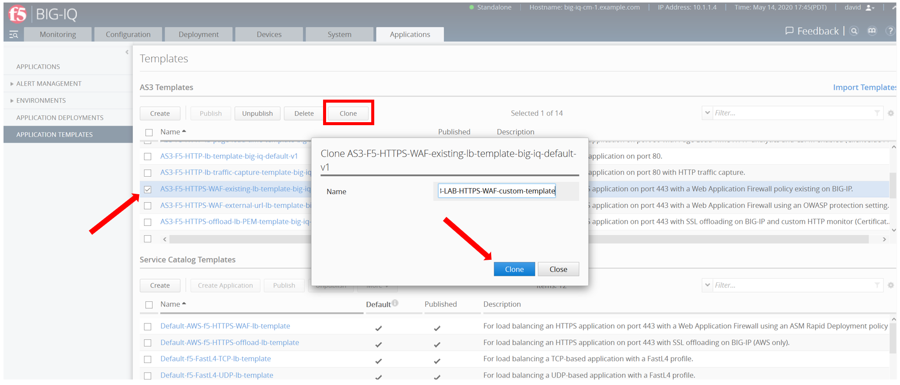
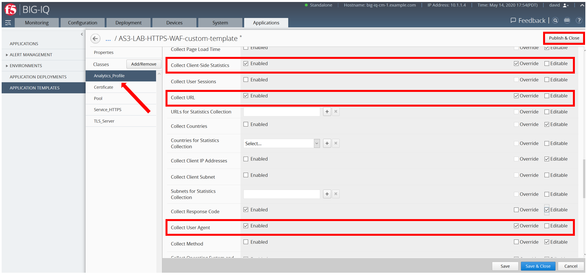
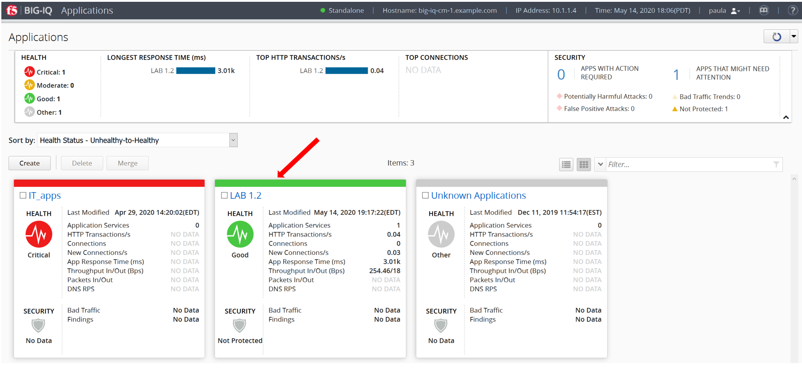
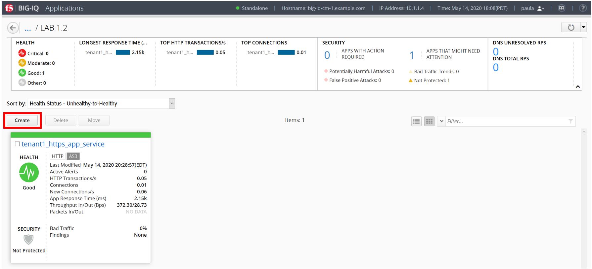
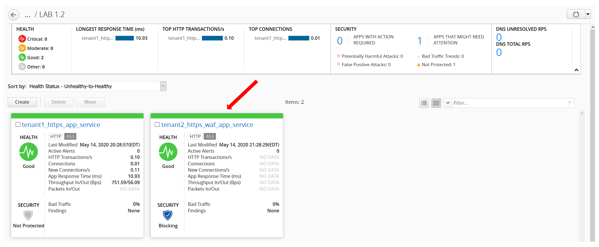
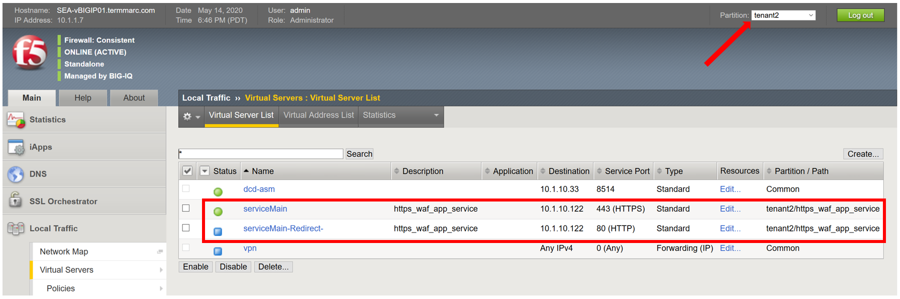
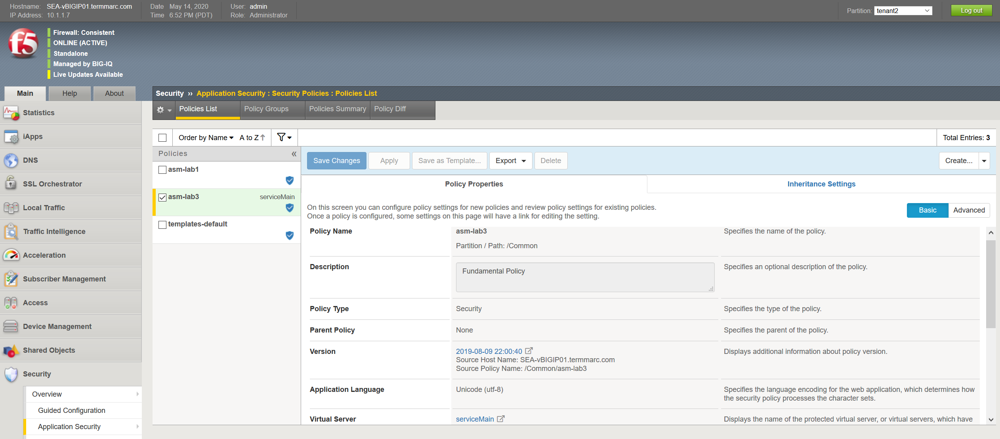

Lab 2: Working with custom AS3 Templates in BIG-IQ
---------------------------------------------------

.. include:: ../labaccess.rst

Exercise 2.1 – Create Custom AS3 template via BIG-IQ GUI
^^^^^^^^^^^^^^^^^^^^^^^^^^^^^^^^^^^^^^^^^^^^^^^^^^^^^^^^

We imported the default “out-of-the-box” AS3 templates (available
on https://github.com/f5devcentral/f5-big-iq) that can be used for
deploying an application service. However, it is a good practice to
clone the default AS3 templates and use them for your custom needs.

1. From within the LAMP server RDP session, logon to BIG-IQ as **admin**
      by opening a browser and go to: ``https://10.1.1.4`` or directly via
      the TMUI.

10. From within the LAMP server RDP session, logon on **BIG-IQ** as **david** *(david\david)*
    by opening a browser and go to: ``https://10.1.1.4`` or directly via
    the TMUI as shown above.
    Go to the Applications > Application Templates and select AS3-F5-HTTPS-WAF-existing-lb-template-big-iq-default-v1 and
    click on **Clone**.

3. Name the cloned template: AS3-LAB-HTTPS-WAF-custom-template and click
   Clone.

..

   |image0|

4. Open the template called AS3-LAB-HTTPS-WAF-custom-template and select
   the Analytics_Profile. Change to Override the Properties for
   Collect Client-Side Statistics, as well
   as Collect URL and Collect User Agent. Ensure the Enable checkbox is
   selected for these.

|image1|

.. note:: Collect Response Code, Collect Method, and Collect Operating System and Browser 
          are already enabled by default in the AS3 schema.

5. Click **Save & Close**.

6. Select AS3-LAB-HTTPS-WAF-custom-template and click **Publish**.

Exercise 2.2 – Deploy application via BIG-IQ using a customized AS3 template
^^^^^^^^^^^^^^^^^^^^^^^^^^^^^^^^^^^^^^^^^^^^^^^^^^^^^^^^^^^^^^^^^^^^^^^^^^^^

1. In this exercise Paula is going to create an application service that
   includes a Web Application Firewall (WAF) profile to secure the
   application. You should be familiar with the other configuration
   components from the prior lab.

2. Before **Paula** can use this AS3 template, David needs to update her
   role. Use the previous steps in lab **1.2** to add AS3 Template
   AS3-LAB-HTTPS-WAF-custom-template to Application Creator VMware
   custom role assigned to **Paula**.

3. Login as Paula and select previously created **LAB 1.2** Application
   and click **Create**.

|image2|

4. Select Create to create an Application Service:

|image3|

+-------------------------------------------------------------------+
| Application properties:                                           |
+===================================================================+
| -  Grouping = Part of an Existing Application                     |
|                                                                   |
| -  Application Name = **LAB 1.2**                                 |
|                                                                   |
| -  Description = My second AS3 template deployment with BIG-IQ    |
+-------------------------------------------------------------------+
| Select an Application Service Template:                           |
+-------------------------------------------------------------------+
| -  Template Type = Select AS3-LAB-HTTPS-WAF-custom-template [AS3] |
+-------------------------------------------------------------------+
| General Properties:                                               |
+-------------------------------------------------------------------+
| -  Application Service Name = https_waf_app_service               |
|                                                                   |
| -  Target = SEA-vBIGIP01.termmarc.com                             |
|                                                                   |
| -  Tenant = tenant2                                               |
+-------------------------------------------------------------------+
| Analytics_Profile. Keep default                                   |
+-------------------------------------------------------------------+
| Pool                                                              |
+-------------------------------------------------------------------+
| -  Members:                                                       |
|                                                                   |
| -  Service Address = 10.1.20.123                                  |
+-------------------------------------------------------------------+
| Service_HTTPS                                                     |
+-------------------------------------------------------------------+
| -  Virtual addresses: 10.1.10.122                                 |
|                                                                   |
| -  policyWAF: /Common/**asm-lab3**                                |
|                                                                   |
| -  Keep other defaults                                            |
+-------------------------------------------------------------------+
| Certificate: Keep defaults                                        |
+-------------------------------------------------------------------+
| TLS_Server: Keep defaults                                         |
+-------------------------------------------------------------------+

|image4|

4. Click **Create**.

5. Check the Application Service https_waf_app_service has been created
   under Application LAB 1.2.

|image5|

6. Now, let’s look on the BIG-IP and verify the Application is correctly
   deployed in partition tenant2.

Logon to SEA-vBIGIP01.termmarc.com BIG-IP from the lab environment.
Select the partition tenant2 and look at the objects created on the
BIG-IP.

|image6|

-  Notice that new https_waf_app_service comes with a redirect.

-  Select the serviceMain virtual server, Select Security and hit
   Policies. The asm-lab3 Application Security Policy is Enabled and the
   Log Profile has a Log Profile selected.

-  Go to Security > Application Security > Security Policies and select
   the **asm-lab3** policy to get more detail of the deployed
   application security policy.

-  The enforced WAF policy is taken from a Github repository which
   contains F5 WAF ready templates:
   https://github.com/f5devcentral/f5-asm-policy-templates, please use
   the URL to get yourself familiar with other available WAF ready
   templates.

|image7|

6. Back to the BIG-IQ and logged in as **Paula**, select
   tenant2_https_waf_app_service. What is the enforced Protection Mode?

.. |image4| image:: images/lab2/image5.png
   :width: 6.5in
   :height: 7.00417in

