Lab 3: AS3 Application creation and deletion using AWX/Ansible Tower and BIG-IQ
-------------------------------------------------------------------------------

Paula has been tasked with the creation of a new application on the BIG-IP  that has been requested by the application owner. 
Paula will use AS3 declaration and BIG-IQ to build the application on the appropriate BIG-IPs using an 
Ansible Playbook that is stored in their GitHub repository.

.. include:: ./accesslab.rst

Exercise 3.1 – Application Creation
^^^^^^^^^^^^^^^^^^^^^^^^^^^^^^^^^^^

1. Click on the *AWX (Ansible Tower)* button on the system *Ubuntu
   Lamp Server* in the Lab Environment. Use admin/purple123 to
   authenticate.

|image26|

2. Navigate to the **Projects** page and click on the refresh button
   to get the latest version of the templates.

|image27|

2a. Log out of *AWX (Ansible Tower)* as Admin and logon on as **paul** *(paul\\paul)*

|image48|

Click on *Sign In*

|image49|

3. Navigate to the **Templates** page and click on *job Template* beside **(Agility 2020) New_AS3_App** to review the template

|image28|

4. Make sure the **PLAYBOOK** *lab/f5-ansible-bigiq-as3-demo/tower/app_create.yml* is selected. Click on *LAUNCH*

|image29|

.. note:: You can go on the `GitHub repository <https://github.com/f5devcentral/f5-big-iq-lab/tree/develop/lab/f5-ansible-bigiq-as3-demo/tower>`__
          and check review the playbooks and Jinja2 templates.

|image30|

5. **CREDENTIAL**: Select *BIG-IQ Creds* as **Credential Type**. Then
   select *paul-iq*. Click on *NEXT*

   |image31|

6. **SURVEY**: Enter below information regarding your application
   service definition. Click on *NEXT*

+-----------------+-------------------------------+
| **APP NAME:**   | MyAppDeployedWithAnsibleTower |
+=================+===============================+
| **APP TYPE:**   | http_app or waf_app           |
+-----------------+-------------------------------+
| **SERVICE IP:** | 10.1.10.122                  |
+-----------------+-------------------------------+
| **NODES:**      | 10.1.20.120 and 10.1.20.121   |
+-----------------+-------------------------------+

|image32|

7. **PREVIEW**: Review the summary of the template deployment. 
   Click on *LAUNCH*

   |image33|

8. Follow the Job deployment of the Ansible playbook.

   |image34|

.. note:: The *FAILED - RETRYING* messages are expected as the playbook runs into a LOOP to check 
          the AS3 task completion and will show failed until loop is completed.

9. When the job is completed, check the **PLAY RECAP** and make sure that *failed=* status is **0**.

    |image35|

10. From within the LAMP server RDP/noVNC session, logon on **BIG-IQ** as **paul** *(paul\\paul)*
    by opening a browser and go to: ``https://10.1.1.4`` or directly via
    the TMUI as shown above.
    Go to Application tab and check the application is displayed and analytics
    are showing.

11. Select *Unknown Applications* Application tile

|image36|

12. Select *MyAppDeployedWithAnsibleTower_M...* Application Service. 

    |image37|

**! Warning**

*Starting 7.0, BIG-IQ displays AS3 application services created using
the AS3 Declare API as Unknown Applications. You can move those
application services using the GUI, the *`Move/Merge
API <https://clouddocs.f5.com/products/big-iq/mgmt-api/latest/ApiReferences/bigiq_public_api_ref/r_public_api_references.html>`__* or
create it directly into Application in BIG-IQ using the *`Deploy
API <https://clouddocs.f5.com/products/big-iq/mgmt-api/latest/ApiReferences/bigiq_public_api_ref/r_public_api_references.html>`__* to
define the BIG-IQ Application name.*

13. Review the HTTP traffic analytics.

    |image38|

Exercise 3.2 – Application Deletion
^^^^^^^^^^^^^^^^^^^^^^^^^^^^^^^^^^^

The application owner has informed Paul that the application is no longer needed and needs to be deleted from. Paul will use an AS3 declaration and BIG-IQ to remove the previously added application from the BIG-IPs. 

1. Navigate to the **Templates** page and review *(Agility 2020) Delete_AS3_App*

|image39|

2. Make sure
   the **PLAYBOOK** *lab/f5-ansible-bigiq-as3-demo/tower/app_delete.yml* is
   selected. Click on the *Launch* button to start a job using this
   template*. 

|image40|

.. note:: You can go on the `GitHub repository <https://github.com/f5devcentral/f5-big-iq-lab/tree/develop/lab/f5-ansible-bigiq-as3-demo/tower>`_
          and check review the playbooks and Jinja2 templates.

3. **CREDENTIAL**: Select *BIG-IQ Creds* as **Credential Type**. Then
   select *paul-iq*. Click on *NEXT*

   |image41|

4. **SURVEY**: Enter below information regarding your application
   service definition. Click on *NEXT.*

+-----------+-------------------------------+
| APP NAME: | MyAppDeployedWithAnsibleTower |
+-----------+-------------------------------+

|image42|

5. **PREVIEW**: Review the summary of the template deployment. 
   Click on *LAUNCH*

   |image43|

6. Follow the JOB deployment of the Ansible playbook.

   |image44|

.. note:: The *FAILED - RETRYING* messages are expected as the playbook runs into a LOOP to check the AS3 task 
          completion and will show failed until loop is completed.

7.  When the job is completed, check the **PLAY RECAP** and make sure that *failed=* status is **0**.

   |image45|

8. Logon on **BIG-IQ** as **paul** *(paula\\paula)*, go to
    Application tab and check the application is displayed and analytics
    are showing.
9. Select *Unknown Applications* Application tile

|image46|

Notice that the application is now deleted.

|image47|

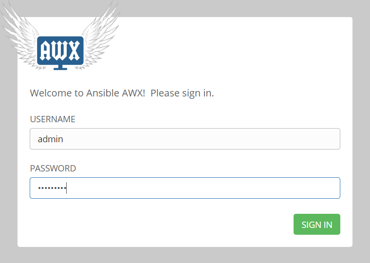
.. |image27| image:: images/lab3/image28.png
   :width: 7.49167in
   :height: 3.6933in
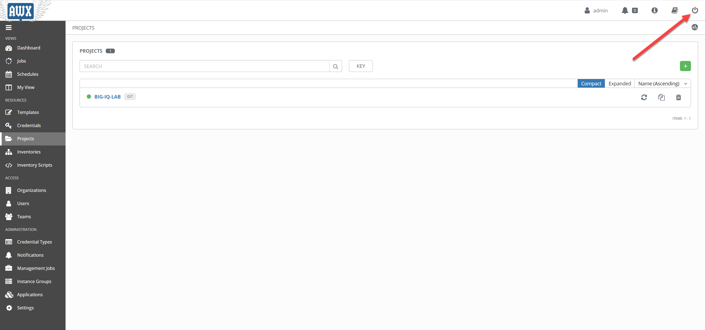
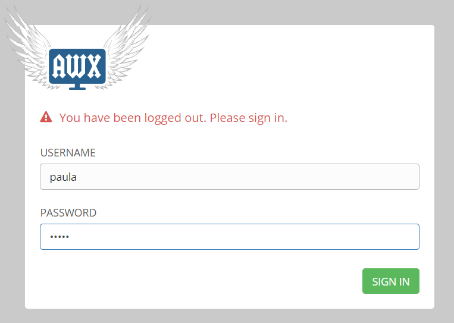
.. |image28| image:: images/lab3/image29b.png
   :width: 7.52216in
   :height: 3.70833in
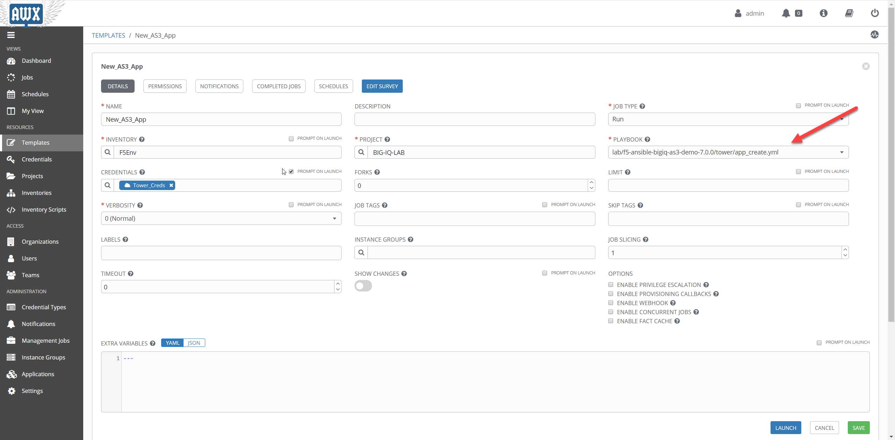
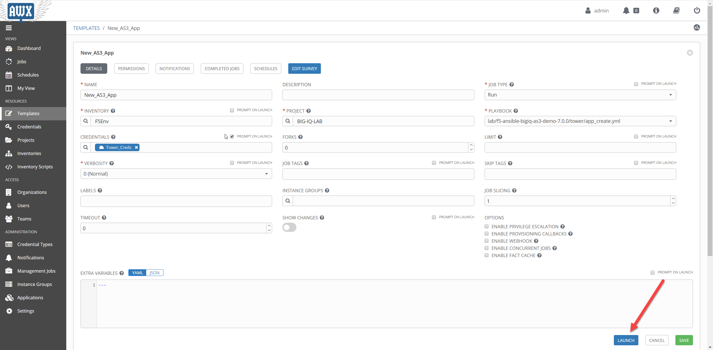
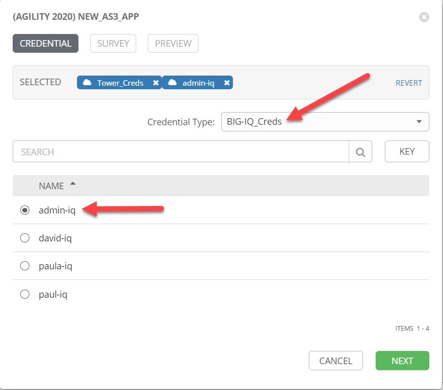
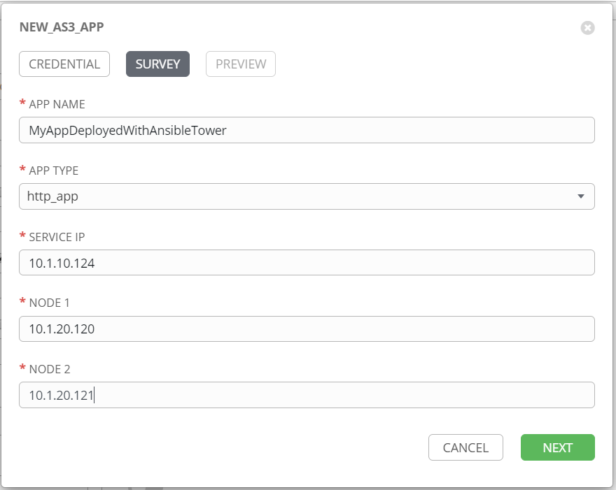
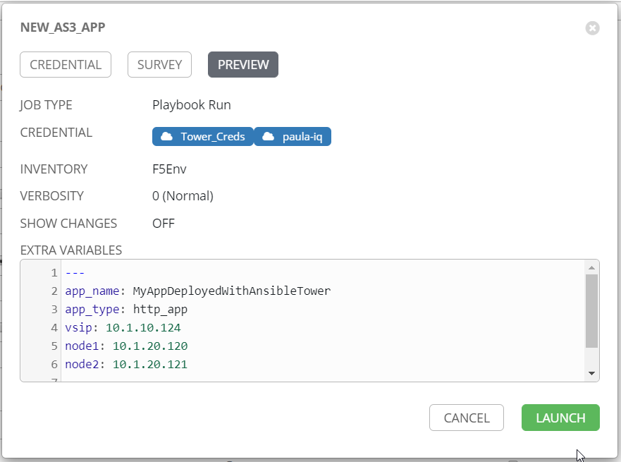
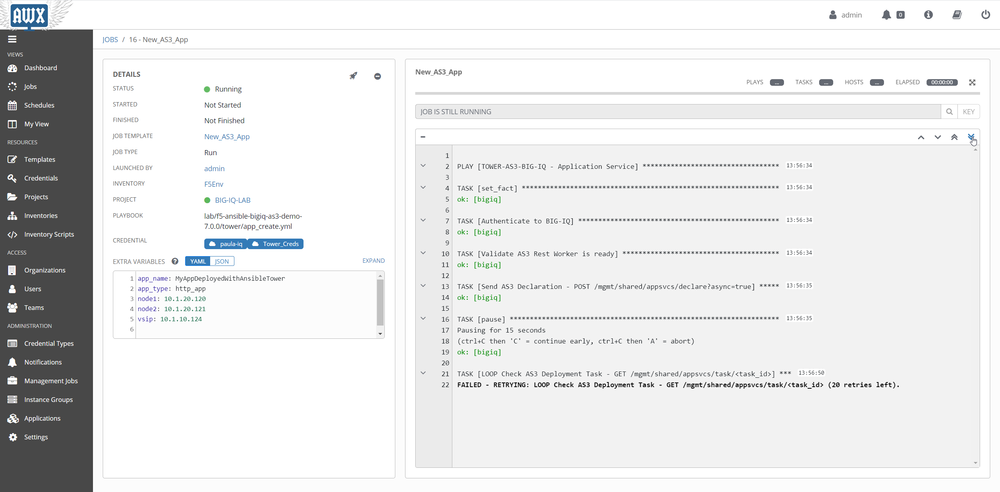
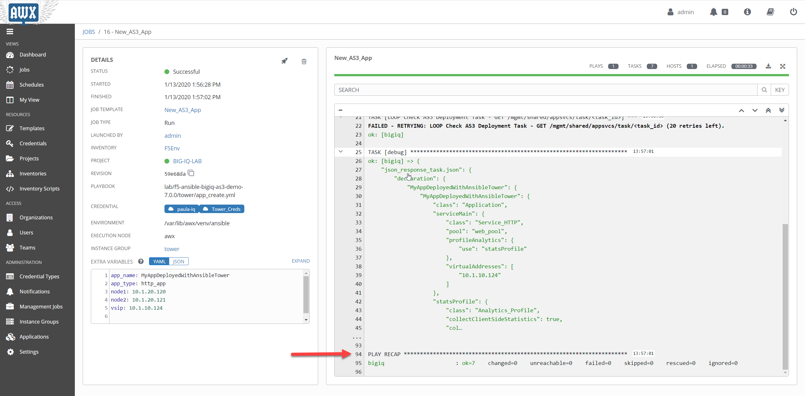
.. |image36| image:: images/lab3/image37.png
   :width: 7.55in
   :height: 3.68215in
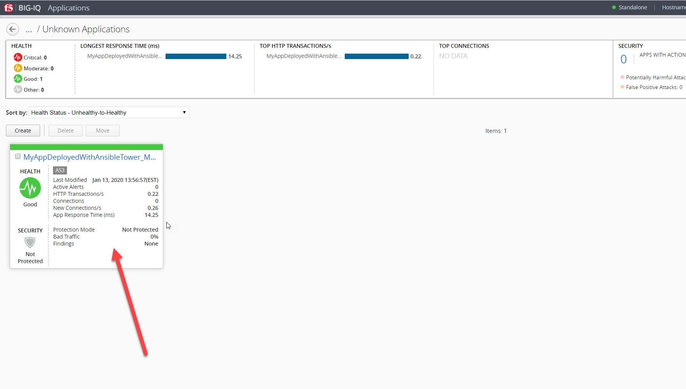
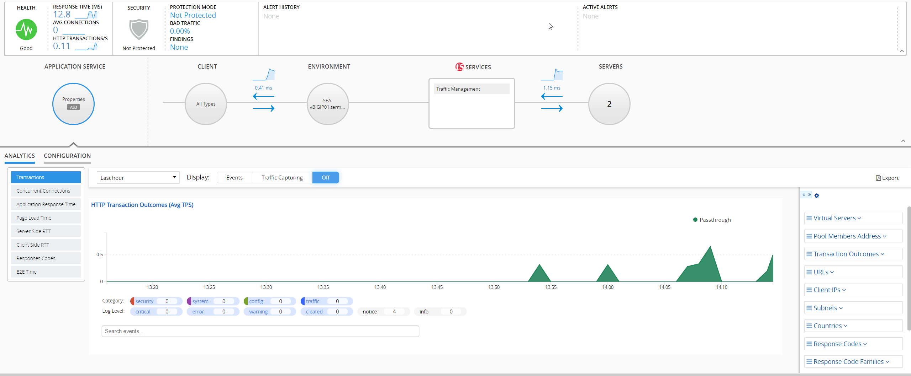
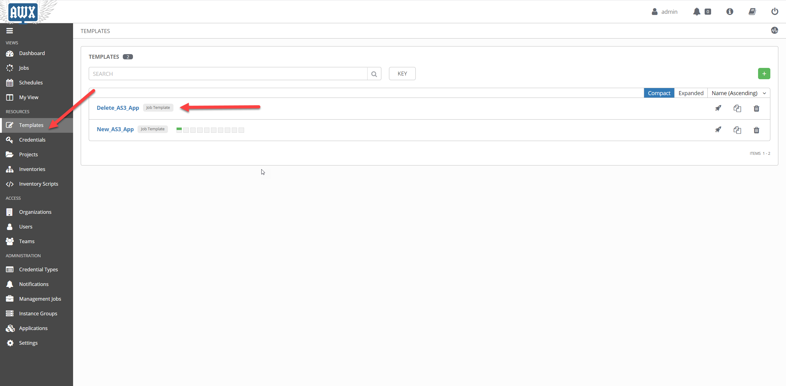
.. |image40| image:: images/lab3/image41.png
   :width: 7.31818in
   :height: 3.60778in
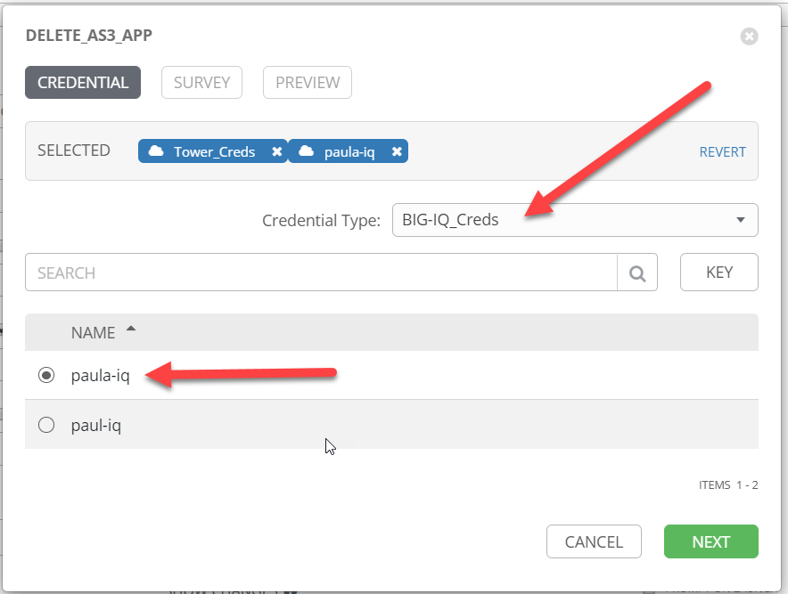
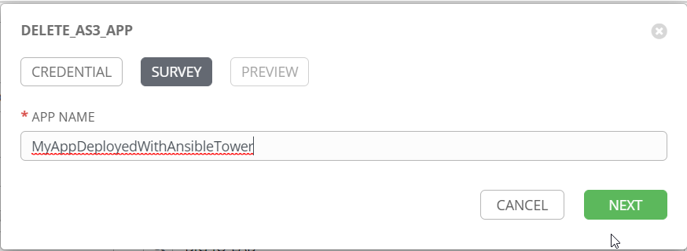
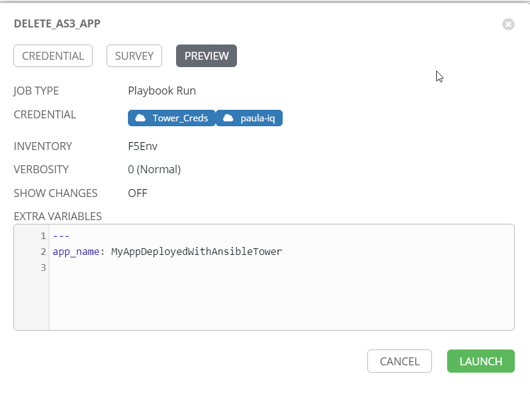
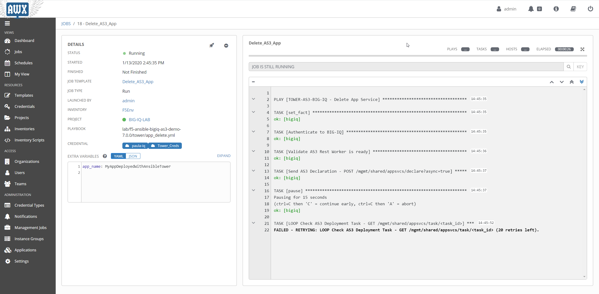
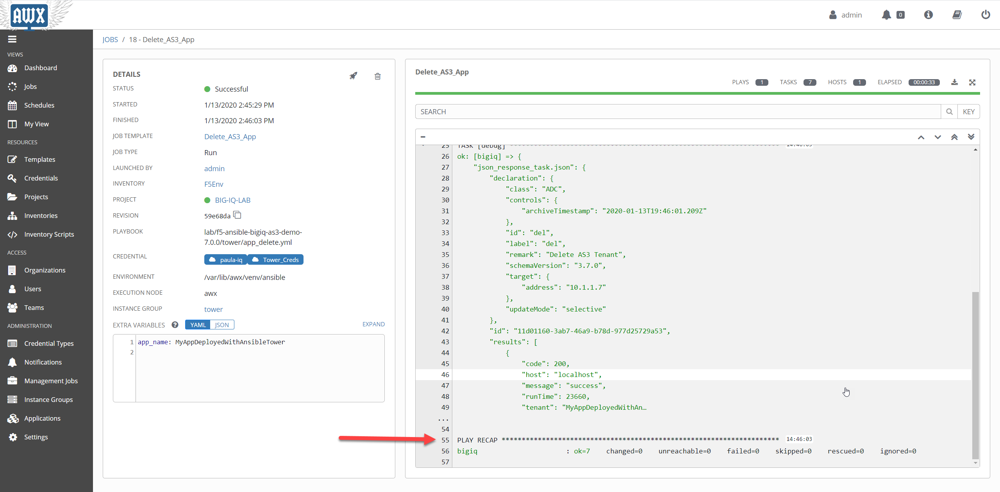
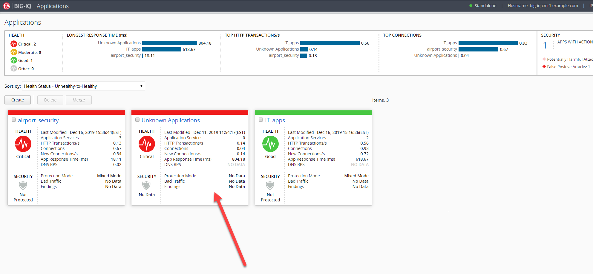
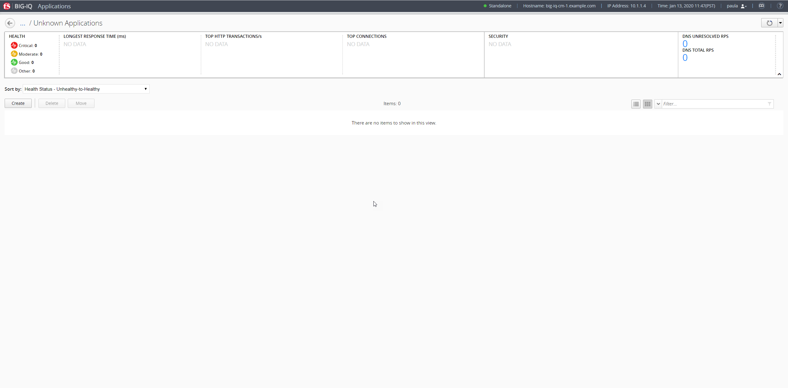
