Lab 5: Visibility for Legacy applications in the Applications tab
-----------------------------------------------------------------

In BIG-IQ v7.1, an admin can now add “legacy” (or “brownfield”) applications into the Application dashboard 
without having to re-deploy the application using a template. The Legacy applications will provide the same
analytic views as those applications deployed via a template, however the configuration sections are read-only, 
except for enable, disable, force-offline operations for Pools and Virtual Servers.

For more information about requirements and recommendations for creating a BIG-IQ Application Service with existing device 
configurations, please consult `K02142132`_.

.. _K02142132: https://support.f5.com/csp/article/K02142132

.. warning:: `BIG-IQ Application Service Sizing Guidelines`_

.. _BIG-IQ Application Service Sizing Guidelines: https://techdocs.f5.com/en-us/bigiq-7-1-0/big-iq-sizing-guidelines/big-iq-sizing-guidelines.html#big-iq-sizing-guidelines

Exercise 5.1 – TCP Legacy Application Creation
^^^^^^^^^^^^^^^^^^^^^^^^^^^^^^^^^^^^^^^^^^^^^^

In this lab you will add an existing legacy application (by choosing the virtual server(s) representing that application) 
to the Application dashboard. Note this will not "re-deploy" the application or change anything on the BIG-IP itself. 
Rather this will take the virtual server and all its child objects and group them together as an Application 
within the Application dashboard of BIG-IQ.

1. Login to BIG-IQ as **david** by opening a browser and go to: ``https://10.1.1.4``

2. Navigate to Applications > Applications. Click on **Create** to Create an Application Service:

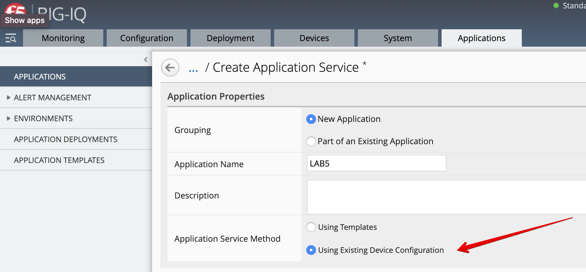

Fill out the necessary fields.

+----------------------------------------------------------------------------------+
| Application properties:                                                          |
+----------------------------------------------------------------------------------+
| * Grouping = New Application                                                     |
| * Application Name = ``LAB5``                                                    |
+----------------------------------------------------------------------------------+
| Application Service Method properties:                                           |
+----------------------------------------------------------------------------------+
| Select: Using Existing Device Configuration                                      |
+----------------------------------------------------------------------------------+
| General Properties:                                                              |
+----------------------------------------------------------------------------------+
| * Application Service Name = ``legacy-app-service``                              |
| * Target = ``SEA-vBIGIP01.termmarc.com``                                         |
| * Application Service Type = ``TCP``                                             |
+----------------------------------------------------------------------------------+
| Virtual Servers: ``vip142``                                                      |
+----------------------------------------------------------------------------------+

Move *vip142* over to the **Selected** column and then scroll down.

.. image:: images/lab5a-2.png
  :scale: 40%
  :align: center

.. note::  A warning will show if there is no analytics profile attached to at least one of the VIP selected.
           You can add up to 5 Virtual IP addresses to a single Legacy Application Service.

3. Click on **View Sample API Request** in the right upper corner to see the API call
   which could be used to create this legacy application service on BIG-IQ using automation.

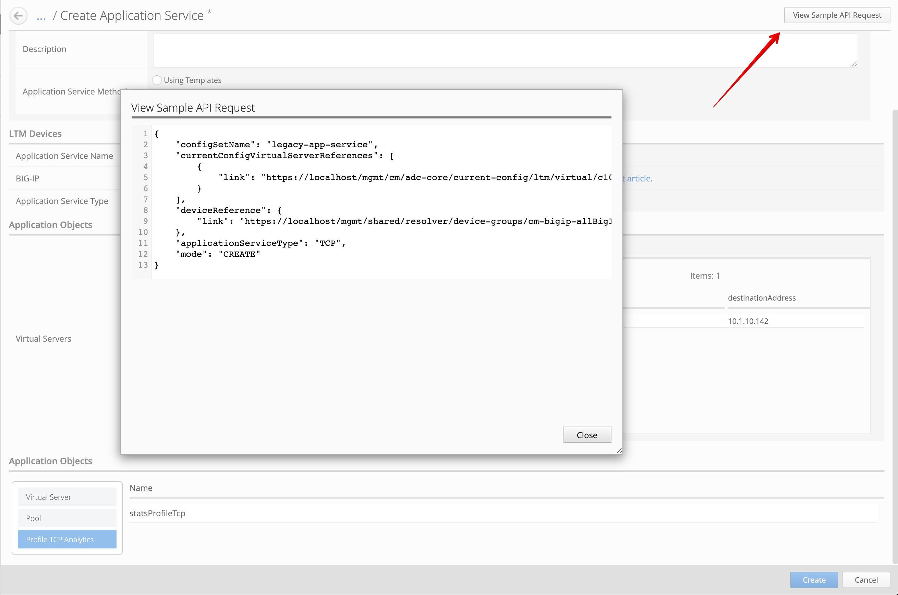

4. Go back to the list of objects and click on *Profile HTTP Analytics*.
   Notice the the Analytics profile is attached to the VIP.

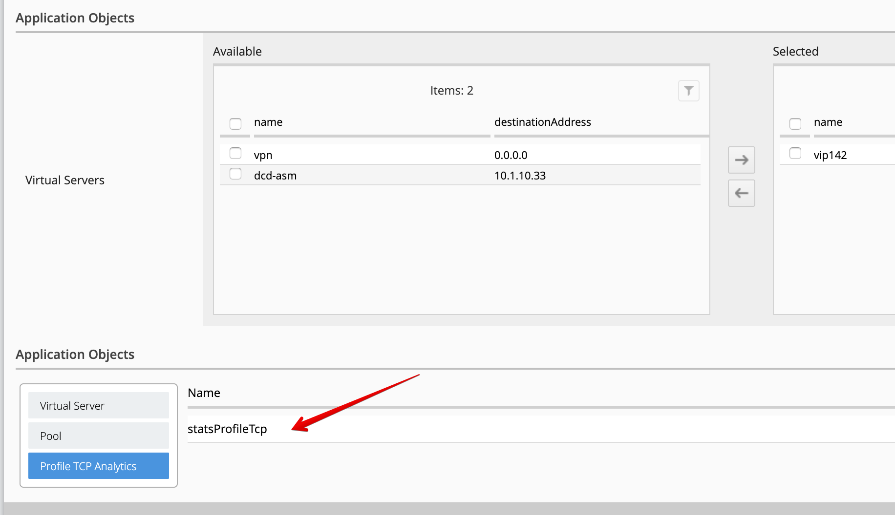

.. warning:: Review carefully `K02142132`_: Requirements and recommendations for creating a BIG-IQ application service with existing device configurations

.. _K02142132: https://support.f5.com/csp/article/K02142132

5. Click **Create**.
  
6. Check the Application ``LAB5`` has been created. Click on it to see the application.
   You should see an application called ``legacy-app-service``. Notice the label *LEGACY* is showing on the applications grid/tile.
   This is an indication that this application was not created with a template, and will be treated as a **legacy** 
   application.

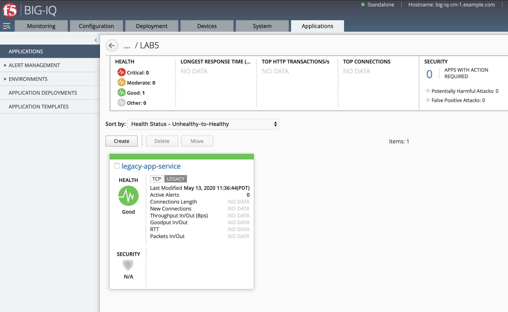

Drill down into the application dashboard and wait for the analytics to show on the dashboard. 

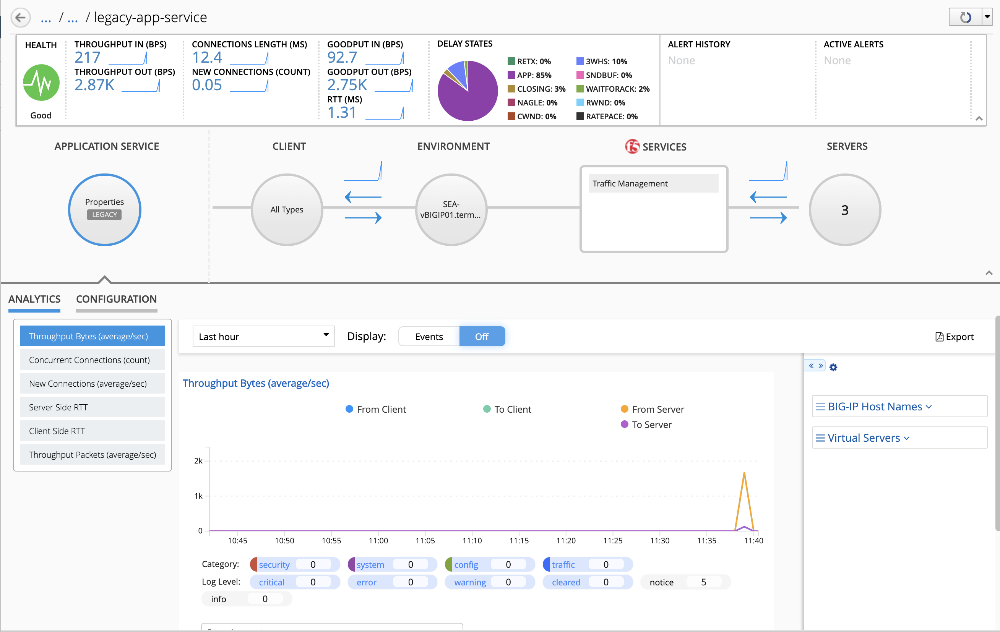

7. Let now review the TCP analytics profile attached to the VIP. 
   This TCP analytics profile will define the analytics being sent by AVR to the BIG-IQ DCD(s).

8. Go to **Configuration > Local Traffic > Virtual Servers** and filter on ``vip142`` and look for the name of the TCP analytics profile.

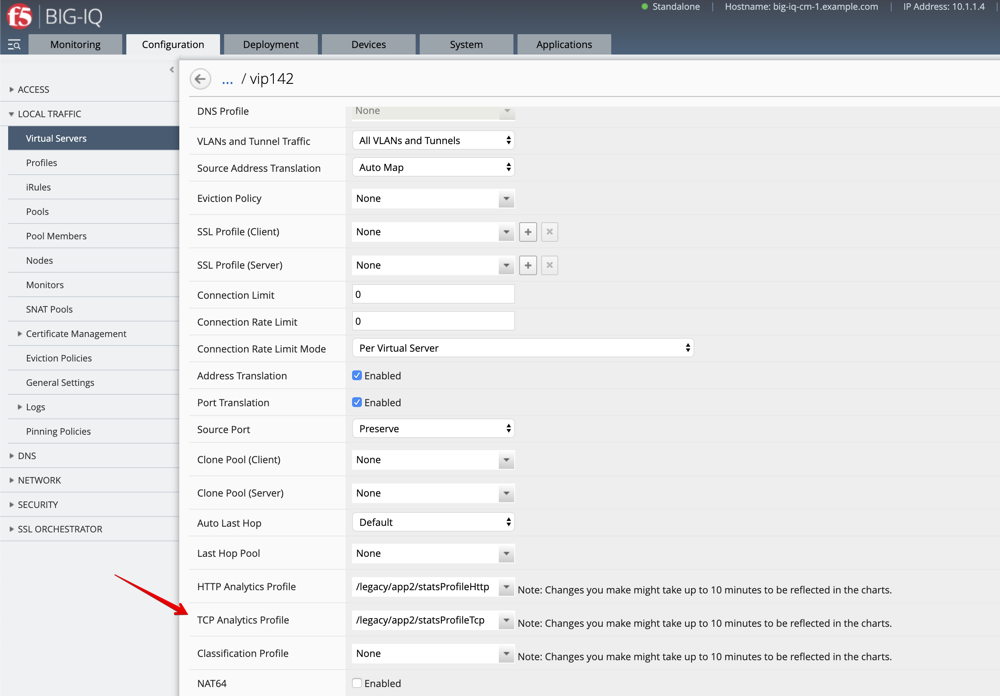

9. Go to **Configuration > Local Traffic > Profiles** and look for ``app2`` TCP analytics profiles.
   You can use the filter to look for the profile.

.. image:: images/lab5a-8.png
  :scale: 40%
  :align: center

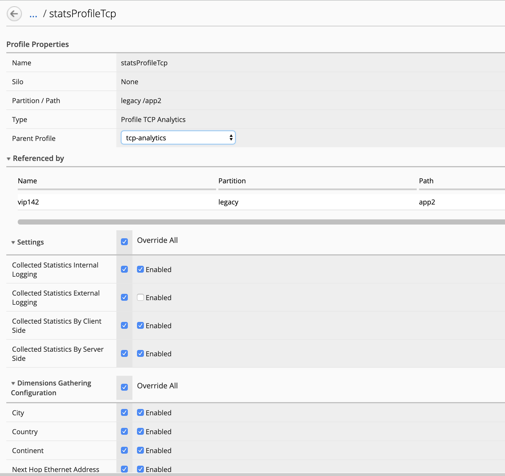

Exercise 5.2 – Legacy Application and RBAC
^^^^^^^^^^^^^^^^^^^^^^^^^^^^^^^^^^^^^^^^^^

1. Here we are going to add RBAC to the newly created legacy application. Go to **System > User Management > Users** and select **Paula**.

Add ``Lab5 Manager`` Role as seen below.

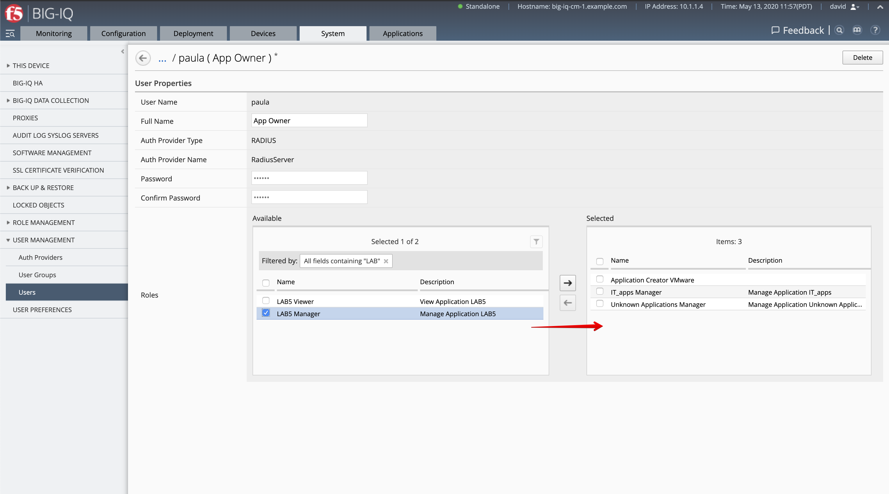

Next add the ``legacy-app-service`` and ``backend_site20tcp`` Roles and then Click **Save & Close**.

.. image:: images/lab5a-11.png
  :scale: 40%
  :align: center

2. Now logout from the david session and Login to BIG-IQ as **paula**.

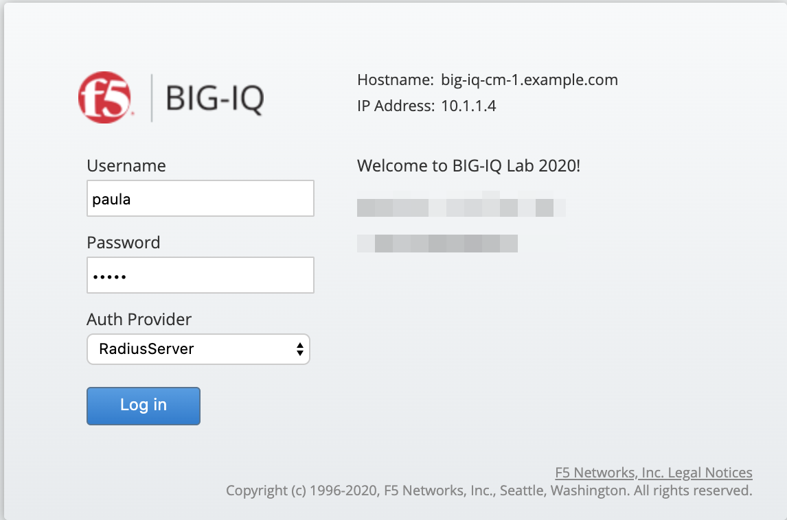

3. Select ``LAB5`` Application.

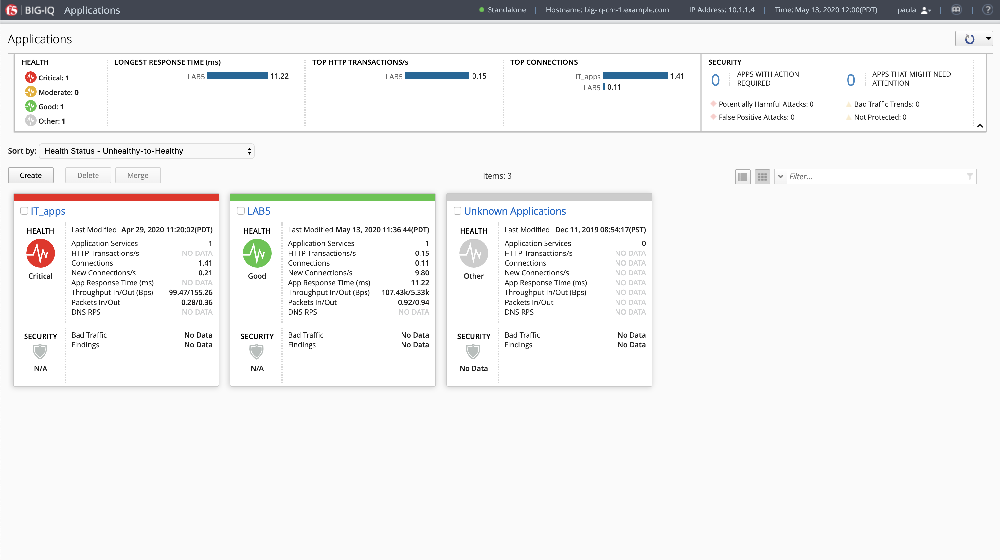

Then click on ``legacy-app-service`` Application Service.

.. image:: images/lab5a-14.png
  :scale: 40%
  :align: center

4. You are now on the Paula's Application Services dashboard. 

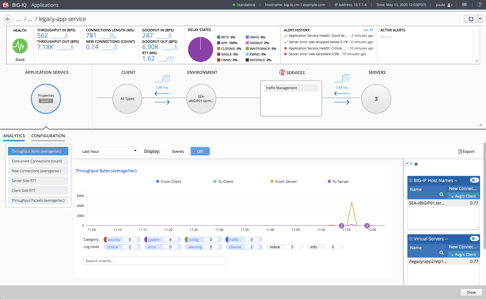

5. Click on Server on the right side of the screen. Select Configuration and try to disable one of the Pool Member.

.. image:: images/lab5a-16.png
  :scale: 40%
  :align: center

6. Confirm the pool member is disabled.

.. image:: images/lab5a-17.png
  :scale: 40%
  :align: center

7. Now, look at the changes in the analytics and then re-enable the pool member.

.. note:: If you don't see traffic, launch a xRDP/noVNC session to have access to the Ubuntu Desktop, 
          open a browser and navigate to ``http://10.1.10.142`` or open a terminal and run the following 
          command ``curl http://10.1.10.142``.

Exercise 5.3 – Troubleshooting latency and packet loss
^^^^^^^^^^^^^^^^^^^^^^^^^^^^^^^^^^^^^^^^^^^^^^^^^^^^^^

For this exercise, we are going to use a different application service (deployed using AS3) which uses different application backend servers.

We are going to identify latency and packet loss issues happening on an application sitting behind the BIG-IP.

1. Connect as **paula** on BIG-IQ. Select the application service ``backend_site20tcp`` located under ``IT_apps`` application.

Notice the alerts raised. The server side RTT exceeded the critical threshold of 100ms. Since the traffic is sent in bursts
you may not see an **Active Alert**. You can view the **Alert History** to see the last time the application exceeded the threshold.

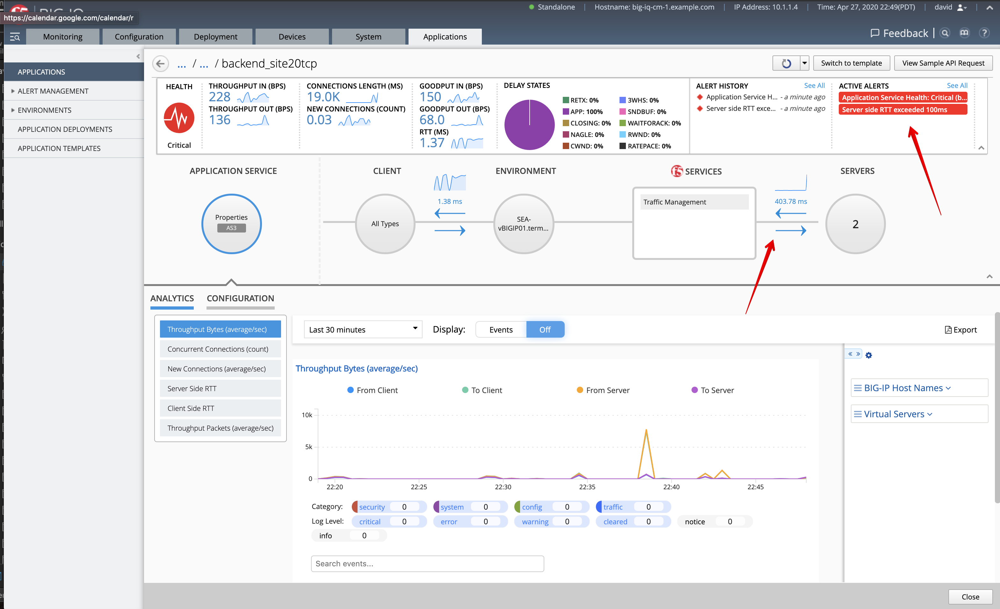

2. Look for the details of the alert. A delay of ~300ms between the F5 BIG-IP and the application server can be observed.

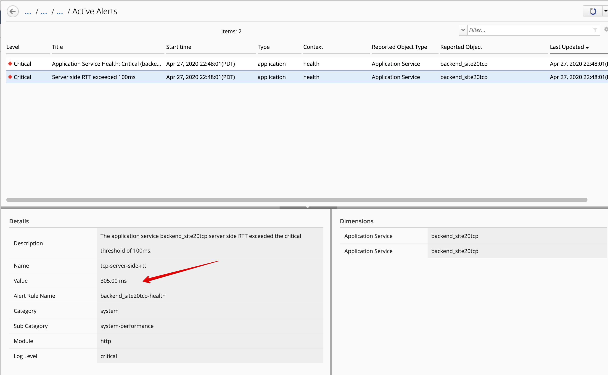

|

3. Now, let's look at the Server Side Goodput, especially at the *Connection Duration* under **Remote Host IP Addresses** dimension.

The connection duration metric isn't showing by default in the dimension, you will need to right click, select **Columns** and add it. 
Notice one of the pool member is almost double the duration of the other.

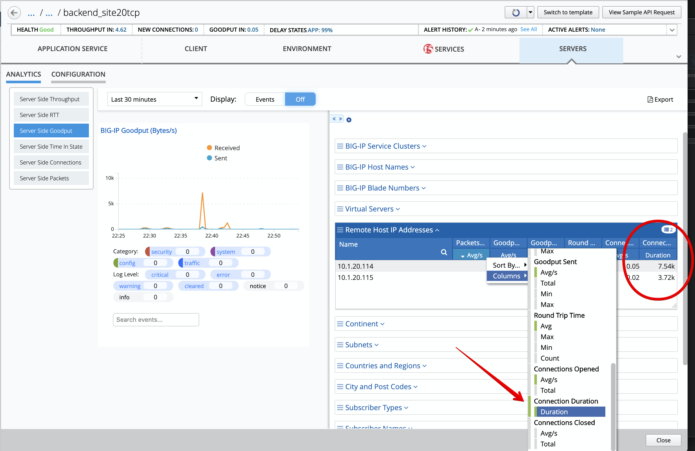

|

.. note:: We have added 300ms delay to an NGINX instance running in a docker container acting as an application server in this lab.

4. We are now going to remove the healthy node and only keep the NGINX node. Navigate to the Configuration tab in the application dashboard
   and delete the node ``10.1.20.115:8081``. Then click **Save**.

.. image:: images/lab5b-4.png
  :align: center
  :scale: 40%

|

5. From the lab environment, launch a xRDP/noVNC session to have access to the Ubuntu Desktop. 
To do this, in your lab environment, click on the *Access* button
of the *Ubuntu Lamp Server* system and select *noVNC* or *xRDP*.

.. note:: Modern laptops with higher resolutions you might want to use 1440x900 and once XRDP is launched Zoom to 200%.

Open a terminal and run the following commands:

.. code::

    f5student@ip-10-1-1-5:~$ docker exec nginx tc qdisc change dev eth0 root netem loss 70%

    f5student@ip-10-1-1-5:~$ curl http://10.1.10.124
    curl: (56) Recv failure: Connection reset by peer

You may run the curl command multiple times. Here we removed the delay and add a packet loss of 70%.

6. Back to BIG-IQ Application dashboard, navigate to the **Server Side Packets** and look a the packets loss showing on the dashboard.
This completes the TCP analytics lab.

.. image:: images/lab5b-5.png
  :align: center
  :scale: 40%

|
