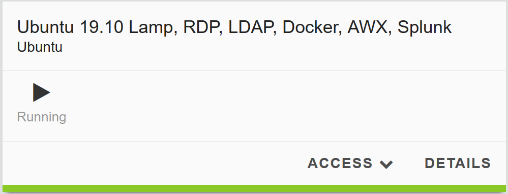
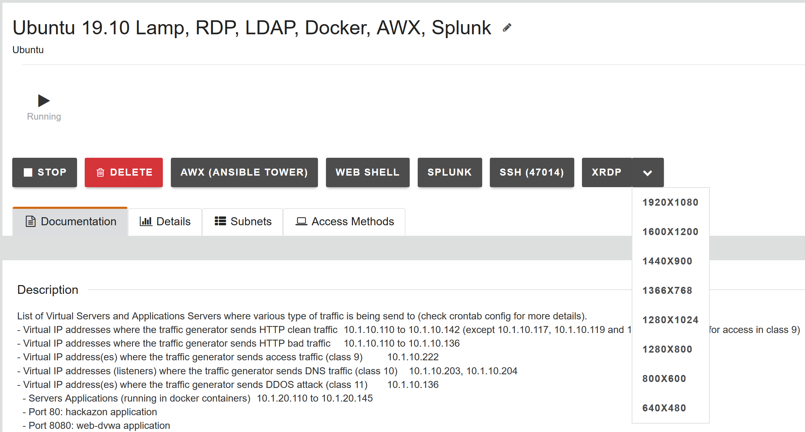
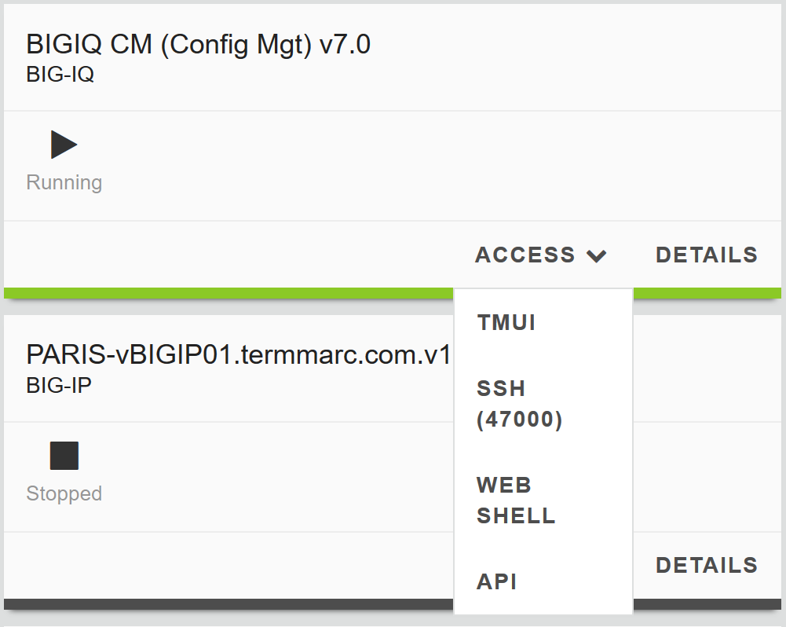

From the lab environment, launch an RDP session to access the Ubuntu
Desktop. To do this, in your lab deployment, click on the
*DETAILS* button of the *Ubuntu Lamp Server* system and from the
*XRDP,* click on the drop-down and select the resolution that works for
your laptop.

.. note:: Modern laptops with higher resolutions you might want to use 1440x900 and once XRDP is launched Zoom to 200%)

If the RDP session does not render correctly or the resolution poor, you
can try to use the *noVNC* option or complete the labs by going directly to the BIG-IP and BIG-IQ CM XUI.

|image0|

|image1|

To access the BIG-IQ directly, click on the ACCESS button under BIGIQ CM
and select TMUI.

|image2|

