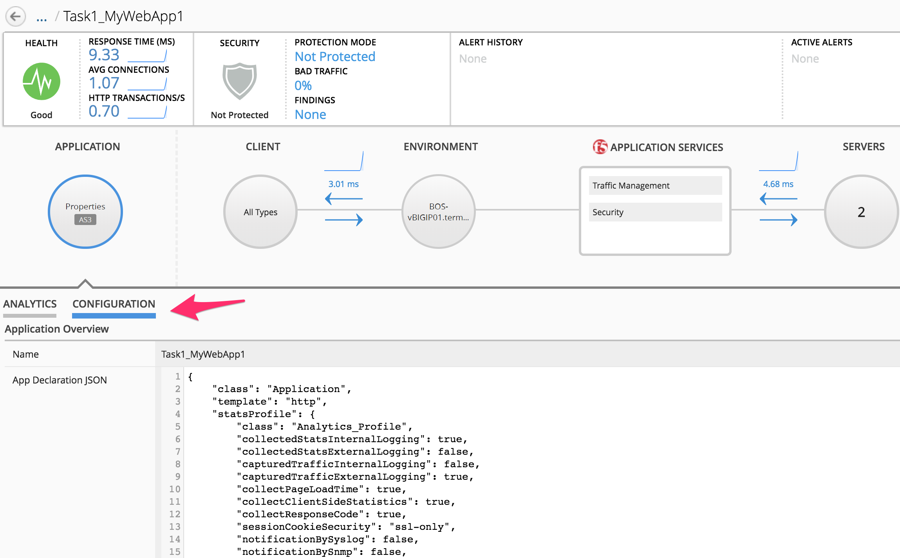

Lab 2.1: Application Creation using AS3 through BIG-IQ
------------------------------------------------------

From UDF, launch a Console/RDP session to have access to the Ubuntu Desktop. To do this, in your UDF deployment, click on the *Access* button
of the *Ubuntu Lamp Server* system and select *Console* or *XRDP*.

.. note:: Modern laptops with higher resolutions you might want to use 1440x900 and once XRDP is launched Zoom to 200%)

.. image:: ../../pictures/udf_ubuntu.png
    :align: left
    :scale: 70%

|

You can also directly using Postman on your laptop and use the following URL (Go to **BIGIQ CM (Config Mgt)** > **Access Methods** > **API**):

.. image:: ../../pictures/udf_bigiq_api.png
    :align: center
    :scale: 80%

|

Open Chrome and Postman.

For Postman, click right and click on execute (wait ~2 minutes).

.. note:: If Postman does not open, open a terminal, type ``postman`` to open postman.

.. image:: ../../pictures/postman.png
    :align: center
    :scale: 100%

|

Using the declarative AS3 API, let's send the following BIG-IP configuration through BIG-IQ:

Using Postman select ``BIG-IQ Token (david)`` available in the Collections.
Press Send. This, will save the token value as _f5_token. If your token expires, obtain a new token by resending the ``BIG-IQ Token``

.. note:: The token timeout is set to 5 min. If you get the 401 authorization error, request a new token.

|lab-1-1|

Task 1 - HTTP Application Service
~~~~~~~~~~~~~~~~~~~~~~~~~~~~~~~~~

This declaration will create an HTTP application on BIG-IQ using an HTTP template. This declaration abstracts the complexity of having to configure all the HTTP defaults such as cookies, persistance, etc...

1. Copy below example of an AS3 Declaration into a JSON validator. The validator is your IDE (Integrated development environment) or you can use an `online tool`_.

   .. note:: It is recommended to `validate your AS3 declaration`_ against the schema using Microsoft Visual Studio Code.

   .. _validate your AS3 declaration: https://clouddocs.f5.com/products/extensions/f5-appsvcs-extension/latest/userguide/validate.html

   .. _online tool: https://www.jsonschemavalidator.net/

.. code-block:: yaml
   :linenos:
   :emphasize-lines: 12,28,44,45

   {
       "class": "AS3",
       "action": "deploy",
       "persist": true,
       "declaration": {
           "class": "ADC",
           "schemaVersion": "3.7.0",
           "id": "example-declaration-01",
           "label": "Task1",
           "remark": "Task 1 - HTTP Application Service",
           "target": {
               "address": "<BIG-IP ip address>"
           },
           "Task1": {
               "class": "Tenant",
               "MyWebApp1http": {
                   "class": "Application",
                   "template": "http",
                   "statsProfile": {
                       "class": "Analytics_Profile",
                       "collectClientSideStatistics": true,
                       "collectOsAndBrowser": false,
                       "collectMethod": false
                   },
                   "serviceMain": {
                       "class": "Service_HTTP",
                       "virtualAddresses": [
                           "<virtual>"
                       ],
                       "pool": "web_pool",
                       "profileAnalytics": {
                           "use": "statsProfile"
                       }
                   },
                   "web_pool": {
                       "class": "Pool",
                       "monitors": [
                           "http"
                       ],
                       "members": [
                           {
                               "servicePort": 80,
                               "serverAddresses": [
                                   "<node1>",
                                   "<node2>"
                               ],
                               "shareNodes": true
                           }
                       ]
                   }
               }
           }
       }
   }

2. Now that the AS3 declation is validated, let's add the target (BIG-IP device)::

    "target": {
        "address": "10.1.1.8"
    },

.. note:: The target BIG-IP is standalone but it could be configured as an HA pair.
          If you want, configure the HA in auto-sync mode. Configure the BIG-IP cluster in BIG-IQ.
          The target in this case can be either device.

Modify the Virtual Address to 10.1.10.111 and the serverAddresses to 10.1.20.110 and 10.1.20.111.

3. Using Postman, use the **BIG-IQ Token (david)** collections to authenticate you on the BIG-IQ and save the token.
   If your token expires, obtain a new token by resending the ``BIG-IQ Token (david)``.

   .. warning:: The token timeout is set to 5 min. If you get the 401 authorization error, request a new token.

4. Use the **BIG-IQ AS3 Declaration** collection in order to create the service on the BIG-IP through BIG-IQ.
Copy/Paste the AS3 declaration from the validator to the declaration body into Postman:

   POST https\:\/\/10.1.1.4/mgmt/shared/appsvcs/declare?async=true
   
   This will give you an ID which you can query using the **BIG-IQ Check AS3 Deployment Task**

5. Use the **BIG-IQ Check AS3 Deployment Task** collection to ensure that the AS3 deployment is successfull without errors: 

   GET https\:\/\/10.1.1.4/mgmt/shared/appsvcs/task/<id>
   
.. note:: Notice that the app deployment may take a few minutes.

6. Logon on **BOS-vBIGIP01.termmarc.com** and verify the Application is correctly deployed in partition Task1.

7. Logon on **BIG-IQ** as **david**, go to Application tab and check the application is displayed and analytics are showing.

|lab-1-3|

.. warning:: Starting 7.0, BIG-IQ displays AS3 application services created using the AS3 Declare API as Unknown Applications.
             You can move those application services using the GUI, the `Move/Merge API`_ or create it directly into 
             Application in BIG-IQ using the `Deploy API`_ to define the BIG-IQ Application name.

Click on your Application, Properties > CONFIGURATION, look at AS3 Declaration.

|lab-1-4|

Task 2 - HTTPS Offload
~~~~~~~~~~~~~~~~~~~~~~

Now we are going to create another service but this time, we will do some SSL offloading.

1. Using Postman, use the **BIG-IQ AS3 Declaration** collection in order to create the service on the BIG-IP through BIG-IQ.
Copy/Paste the below AS3 declaration into the body (Postman):

   POST https\:\/\/10.1.1.4/mgmt/shared/appsvcs/declare?async=true
   
   This will give you an ID which you can query using the **BIG-IQ Check AS3 Deployment Task**

.. code-block:: yaml
   :linenos:

   {
       "class": "AS3",
       "action": "deploy",
       "persist": true,
       "declaration": {
           "class": "ADC",
           "schemaVersion": "3.7.0",
           "id": "isc-lab",
           "label": "Task2",
           "remark": "Task 2 - HTTPS Application Service",
           "target": {
               "address": "10.1.1.8"
           },
           "Task2": {
               "class": "Tenant",
               "MyWebApp2https": {
                   "class": "Application",
                   "template": "https",
                   "statsProfile": {
                       "class": "Analytics_Profile",
                       "collectClientSideStatistics": true,
                       "collectOsAndBrowser": false,
                       "collectMethod": false
                   },
                   "serviceMain": {
                       "class": "Service_HTTPS",
                       "virtualAddresses": [
                           "10.1.10.113"
                       ],
                       "pool": "web_pool",
                       "profileAnalytics": {
                           "use": "statsProfile"
                       },
                       "serverTLS": "webtls"
                   },
                   "web_pool": {
                       "class": "Pool",
                       "monitors": [
                           "http"
                       ],
                       "members": [
                           {
                               "servicePort": 80,
                               "serverAddresses": [
                                   "10.1.20.112",
                                   "10.1.20.113"
                               ],
                               "shareNodes": true
                           }
                       ]
                   },
                   "webtls": {
                       "class": "TLS_Server",
                       "certificates": [
                           {
                               "certificate": "webcert"
                           }
                       ]
                   },
                   "webcert": {
                       "class": "Certificate",
                       "certificate": {
                           "bigip": "/Common/default.crt"
                       },
                       "privateKey": {
                           "bigip": "/Common/default.key"
                       }
                   }
               }
           }
       }
   }

2. Using Postman, use the **BIG-IQ Token (david)** collections to authenticate you on the BIG-IQ and save the token.
   If your token expires, obtain a new token by resending the ``BIG-IQ Token (david)``.

   .. warning:: The token timeout is set to 5 min. If you get the 401 authorization error, request a new token.

3. Use the **BIG-IQ Check AS3 Deployment Task** calls to ensure that the AS3 deployment is successfull without errors: 

   GET https\:\/\/10.1.1.4/mgmt/shared/appsvcs/task/<id>

4. Logon on **BIG-IQ** as **david**, go to Application tab and check the application is displayed and analytics are showing.

.. warning:: Starting 7.0, BIG-IQ displays AS3 application services created using the AS3 Declare API as Unknown Applications.
             You can move those application services using the GUI, the `Move/Merge API`_ or create it directly into 
             Application in BIG-IQ using the `Deploy API`_ to define the BIG-IQ Application name.

Task 3a - HTTPS Application with Web Application Firewall
~~~~~~~~~~~~~~~~~~~~~~~~~~~~~~~~~~~~~~~~~~~~~~~~~~~~~~~~~

This declaration will create an HTTPS application on BIG-IQ using an HTTPS template, a WAF policy and a security Log Profile.

.. note:: The ASM policy & Log Profiles need to be deployed first in BIG-IP if it exists only on BIG-IQ.
             Attached the policy to the ``inactive`` virtual server under the Web Application Security Configuration menu, then deploy it.

Update the WAF policy section below with the policy available on BIG-IP::

 "policyWAF": {
          "bigip": "/Common/templates-default"
        }

.. code-block:: yaml
   :linenos:
   :emphasize-lines: 36

   {
       "class": "AS3",
       "action": "deploy",
       "persist": true,
       "declaration": {
           "class": "ADC",
           "schemaVersion": "3.7.0",
           "id": "isc-lab",
           "label": "Task3a",
           "remark": "Task 3a - HTTPS Application with WAF",
           "target": {
               "address": "10.1.1.8"
           },
           "Task3": {
               "class": "Tenant",
               "MyWebApp3waf": {
                   "class": "Application",
                   "template": "https",
                   "statsProfile": {
                       "class": "Analytics_Profile",
                       "collectClientSideStatistics": true,
                       "collectOsAndBrowser": false,
                       "collectMethod": false
                   },
                   "serviceMain": {
                       "class": "Service_HTTPS",
                       "virtualAddresses": [
                           "10.1.10.123"
                       ],
                       "pool": "web_pool",
                       "profileAnalytics": {
                           "use": "statsProfile"
                       },
                       "serverTLS": "webtls",
                       "policyWAF": {
                           "bigip": "/Common/<WAF policy>"
                       },
                       "securityLogProfiles": [
                           {
                              "bigip": "/Common/templates-default"
                           }
                       ]
                   },
                   "web_pool": {
                       "class": "Pool",
                       "monitors": [
                           "http"
                       ],
                       "members": [
                           {
                               "servicePort": 80,
                               "serverAddresses": [
                                   "10.1.20.122",
                                   "10.1.20.123"
                               ],
                               "shareNodes": true
                           }
                       ]
                   },
                   "webtls": {
                       "class": "TLS_Server",
                       "certificates": [
                           {
                               "certificate": "webcert"
                           }
                       ]
                   },
                   "webcert": {
                       "class": "Certificate",
                       "certificate": {
                           "bigip": "/Common/default.crt"
                       },
                       "privateKey": {
                           "bigip": "/Common/default.key"
                       }
                   }
               }
           }
       }
   }

1. Using Postman, use the **BIG-IQ Token (david)** collections to authenticate you on the BIG-IQ and save the token.
   If your token expires, obtain a new token by resending the ``BIG-IQ Token (david)``.

   .. warning:: The token timeout is set to 5 min. If you get the 401 authorization error, request a new token.

2. Use the **BIG-IQ AS3 Declaration** call in order to create the service on the BIG-IP through BIG-IQ.
Copy/Paste the above AS3 declaration into the declaration body into Postman (DON'T FORGET TO UPDATE THE WAF Policy):

   POST https\:\/\/10.1.1.4/mgmt/shared/appsvcs/declare?async=true
   
   This will give you an ID which you can query using the **BIG-IQ Check AS3 Deployment Task**

3. Use the **BIG-IQ Check AS3 Deployment Task** Postman calls to ensure that the AS3 deployment is successfull without errors: 

   GET https\:\/\/10.1.1.4/mgmt/shared/appsvcs/task/<id>

4. Logon on **BIG-IQ** as **david**, go to Application tab and check the application is displayed and analytics are showing.

.. warning:: Starting 7.0, BIG-IQ displays AS3 application services created using the AS3 Declare API as Unknown Applications.
             You can move those application services using the GUI, the `Move/Merge API`_ or create it directly into 
             Application in BIG-IQ using the `Deploy API`_ to define the BIG-IQ Application name.

Task 4 - Generic Services
~~~~~~~~~~~~~~~~~~~~~~~~~

.. note:: Note that because this declaration uses the generic template, the service does not have to be named serviceMain

Modify the Generic virtual with something other than <generic_virtual>.

.. code-block:: yaml
   :linenos:
   :emphasize-lines: 25

   {
       "class": "AS3",
       "action": "deploy",
       "persist": true,
       "declaration": {
           "class": "ADC",
           "schemaVersion": "3.7.0",
           "id": "isc-lab",
           "label": "Task4",
           "remark": "Task 4 - Generic Services",
           "target": {
               "address": "10.1.1.8"
           },
           "Task4": {
               "class": "Tenant",
               "MyWebApp4generic": {
                   "class": "Application",
                   "template": "generic",
                   "statsProfile": {
                       "class": "Analytics_Profile",
                       "collectClientSideStatistics": true,
                       "collectOsAndBrowser": false,
                       "collectMethod": false
                   },
                   "<generic_virtual>": {
                       "class": "Service_Generic",
                       "virtualAddresses": [
                           "10.1.10.127"
                       ],
                       "virtualPort": 8080,
                       "pool": "web_pool",
                       "profileAnalytics": {
                           "use": "statsProfile"
                       }
                   },
                   "web_pool": {
                       "class": "Pool",
                       "monitors": [
                           "tcp"
                       ],
                       "members": [
                           {
                               "servicePort": 80,
                               "serverAddresses": [
                                   "10.1.20.126",
                                   "10.1.20.127"
                               ],
                               "shareNodes": true
                           }
                       ]
                   }
               }
           }
       }
   }

1. Using Postman, use the **BIG-IQ Token (david)** collections to authenticate you on the BIG-IQ and save the token.
   If your token expires, obtain a new token by resending the ``BIG-IQ Token (david)``.

   .. warning:: The token timeout is set to 5 min. If you get the 401 authorization error, request a new token.
   
2. Using Postman, use the **BIG-IQ AS3 Declaration** call in order to create the service on the BIG-IP through BIG-IQ.
Copy/Paste the above AS3 declaration into the declaration body of Postman:

   POST https\:\/\/10.1.1.4/mgmt/shared/appsvcs/declare?async=true
   
   This will give you an ID which you can query using the **BIG-IQ Check AS3 Deployment Task**

3. Use the **BIG-IQ Check AS3 Deployment Task** calls to ensure that the AS3 deployment is successfull without errors: 

   GET https\:\/\/10.1.1.4/mgmt/shared/appsvcs/task/<id>

4. Logon on **BIG-IQ** as **david**, go to Application tab and check the application is displayed and analytics are showing.

.. warning:: Starting 7.0, BIG-IQ displays AS3 application services created using the AS3 Declare API as Unknown Applications.
             You can move those application services using the GUI, the `Move/Merge API`_ or create it directly into 
             Application in BIG-IQ using the `Deploy API`_ to define the BIG-IQ Application name.

.. _Move/Merge API: https://clouddocs.f5.com/products/big-iq/mgmt-api/latest/ApiReferences/bigiq_public_api_ref/r_public_api_references.html
.. _Deploy API: https://clouddocs.f5.com/products/big-iq/mgmt-api/latest/ApiReferences/bigiq_public_api_ref/r_public_api_references.html

.. |lab-1-1| image:: ../pictures/module2/lab-1-1.png
   :scale: 60%
.. |lab-1-3| image:: ../pictures/module2/lab-1-3.png
   :scale: 60%

.. |lab-1-5| image:: ../pictures/module2/lab-1-5.png
   :scale: 40%