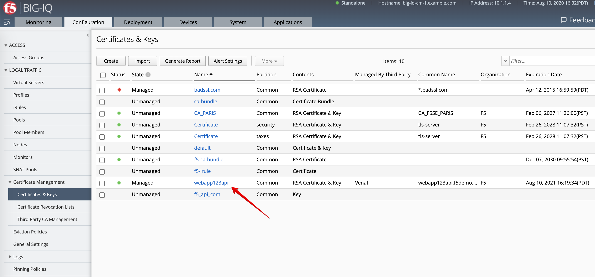
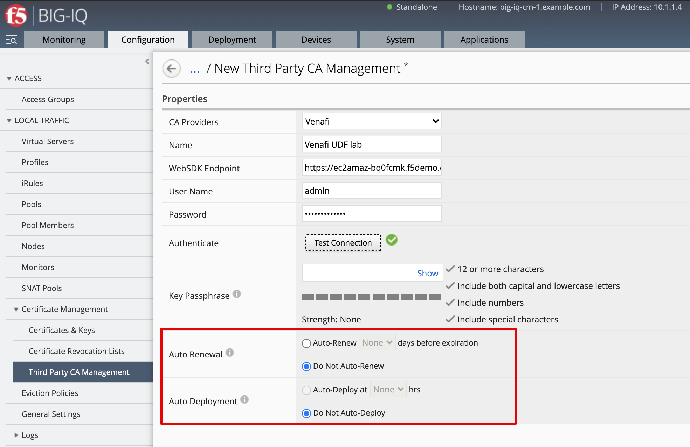

Lab 2.11: Create and deploy a SSL Certificate & Key from Venafi with BIG-IQ and AS3 using Ansible
-------------------------------------------------------------------------------------------------

.. note:: Estimated time to complete: **15 minutes**

In this lab, we are going to see the same workflow as `Class 6 Module 1 Lab 1.4`_ to create the SSL Certificate & Key on BIG-IQ signed with Venafi Platform,
deploy those SSL object to a BIG-IP and create the HTTPS offload application service using AS3.

Instead of doing all the necessary steps using BIG-IQ user interface, we are going to use Ansible.

This lab will be using following F5 Ansible Galaxy roles:
    - `bigiq_pinning_deploy_objects`_ **ansible Role**: Pin objects (e.g. Cert & Key) on BIG-IQ and deploy it to BIG-IP(s).
    - `atc_deploy`_  **ansible Role**: Allows AS3 declaration to be sent to `automation tool chain`_ service.

.. _bigiq_pinning_deploy_objects: https://galaxy.ansible.com/f5devcentral/bigiq_pinning_deploy_objects
.. _atc_deploy: https://galaxy.ansible.com/f5devcentral/atc_deploy
.. _automation tool chain: https://www.f5.com/products/automation-and-orchestration

.. include:: /accesslab.rst

Workflow
^^^^^^^^

1. Configured third-party certificate provider on BIG-IQ UI
2. SSL Certificate & Key and AS3 HTTPS offload application service creation via the API

Configured third-party certificate provider on BIG-IQ
^^^^^^^^^^^^^^^^^^^^^^^^^^^^^^^^^^^^^^^^^^^^^^^^^^^^^

Follow `Class 6 Module 1 Lab 1.4`_ to configure Venafi with BIG-IQ for Certificate Management.

.. note:: We are not automating this step as setting up Venafi with BIG-IQ is a one time operation.

SSL Certificate & Key and AS3 HTTPS offload application service creation 
^^^^^^^^^^^^^^^^^^^^^^^^^^^^^^^^^^^^^^^^^^^^^^^^^^^^^^^^^^^^^^^^^^^^^^^^

1. Connect via ``SSH`` to the system *Ubuntu Lamp Server*.

2. Execute the playbook ``bigiq_as3_deploy_venafi_certificate_as3_app.yml``::

    cd /home/f5/f5-ansible-bigiq-as3-demo
    docker build -t f5-big-iq-onboarding .
    ./ansible_helper ansible-playbook /ansible/bigiq_as3_deploy_venafi_certificate_as3_app.yml -i /ansible/hosts --extra-vars "cn=webapp123api"

.. note:: You can change the Common Name (CN) of the certificate by updating the variable ``cn``. Add ``-vvv`` if you want to get the debug output.

You can look at the details of the Ansible Playbook source on the `GitHub repository`_.

.. _GitHub repository: https://github.com/f5devcentral/f5-big-iq-lab/blob/develop/lab/f5-ansible-bigiq-as3-demo/bigiq_as3_deploy_venafi_certificate_as3_app.yml

3. Login on **BIG-IQ** as **david**, go to Applications tab and check the application is displayed and analytics are showing. 

|lab-11-1|

4. Navigate to Configuration tab > Local Traffic > Certificate Management > Certificates & Keys and check the certificate expiration date of ``webapp123api``.

|lab-11-2|

5. With BIG-IQ and Venafi, the certificate can be automatically renewed prior the expiration date.
This feature can be configured under the Third Party CA Management Venafi config under the section *Automatic renewal*.

|lab-11-3|

**Certificate Auto Renewal** triggers an automatic renewal of certificates prior to expiration. 
You configure renewal by number of days prior to certificate expiration.
          
**Certificate Auto Deployment** allows BIG-IQ to automatically deploy renewed certificates to its managed BIG-IP systems. 
You configure the time of day at which the automatic deployment occurs.

          
.. _Class 6 Module 1 Lab 1.4: ../../class6/module1/lab4.html#configured-third-party-certificate-provider-on-big-iq

.. |lab-11-2| image:: ../pictures/module2/lab-11-2.png
   :scale: 40%

