Lab 2.12: AS3 Application Creation using GitLab CI/CD pipeline, Ansible and BIG-IQ
----------------------------------------------------------------------------------

.. note:: Estimated time to complete: **25 minutes**

In this lab, we are going to use GitLab to store the BIG-IP configuration (AS3 declaration) and deploy it through BIG-IQ to BIG-IP using Ansible.
We are leveraging a **CI/CD pipeline** in GitLab in order to make changes on the BIG-IP device.

**Ansible** is an open-source software provisioning, configuration management, and application-deployment 
tool enabling infrastructure as code.

**GitLab** is a web-based DevOps lifecycle tool that provides a Git-repository manager providing wiki, 
issue-tracking and continuous integration and deployment pipeline features. 

GitLab will keep track of the changes and control **user access** to the application service configuration of the F5 BIG-IP.
We are using BIG-IQ to provide **visibility with enhanced analytics** (HTTP/TCP) to the DevOps/Application owner.

This lab will be using the following F5 Ansible Galaxy roles:
    - `atc_deploy`_  **ansible Role**: Allows AS3 declaration to be sent to `automation tool chain`_ service.
    - `bigiq_move_app_dashboard`_ **ansible Role**: Move Application Service(s) in BIG-IQ Application Dashboard.

.. _atc_deploy: https://galaxy.ansible.com/f5devcentral/atc_deploy
.. _bigiq_move_app_dashboard: https://galaxy.ansible.com/f5devcentral/bigiq_move_app_dashboard
.. _automation tool chain: https://www.f5.com/products/automation-and-orchestration

.. include:: /accesslab.rst

Workflow
^^^^^^^^

1. Start GitLab and create new a project
2. Clone gitlab project and deploy AS3 HTTP application service to a BIG-IP through BIG-IQ
3. Infrastructure as code: add a new pool member to the AS3 app service through GitLab

Start GitLab and create new a project
^^^^^^^^^^^^^^^^^^^^^^^^^^^^^^^^^^^^^

1. Connect via ``SSH`` to the system *Ubuntu Lamp Server*.

2. Execute the following commands::

    ./gitlab/start-gitlab.sh

3. Wait ~10 min to open GitLab web UI from the lab environment. Click on the *ACCESS* button of the **Ubuntu Lamp Server** system and click on
   *GitLab*. The login/password is ``root/purple123``. Or open ``http://localhost:7002`` from a browser in the Jumphost.

.. note:: You can check GitLab status with ``docker exec gitlab_gitlab_1 gitlab-ctl status`` and GitLab logs with ``docker logs gitlab_gitlab_1``.

|lab-12-1|

4. Create a new project and name it ``mywebapp``.

|lab-12-2|

Select *Initialize repository with a README*.

|lab-12-3|

5. Copy the Jumphost *Ubuntu Lamp Server* ssh public key::

    cat ~/.ssh/id_rsa.pub 

6. Back in GitLab, click on **Add SSH Key**.

|lab-12-4|

Paste the public key and click om **Add Key**.

|lab-12-5|

7. Let's now configure the gitlab runner with this project.
   This runner will be used to trigger pipelines when a commit is done on the project and allow us to automatically trigger a set of tasks.
   
First Let's open your project, click **Your Projects**.

|lab-12-6|

Click on ``mywebapp``.

|lab-12-7|

Navigate the CI/CD option copy the token value.

Click on Settings > CI/CD.

|lab-12-8|

Find and expand the **Runner** section.

|lab-12-9|

Finally copy the token value.

|lab-12-10|

8. Back in the Linux Jumphost, run the following command to register the gitlab runner using the token value::

    ./gitlab/gitlab-runner-register.sh <token>

9. In GitLab, confirm the GitLab runner is correctly attached to your project. Navigate to the same location where you copy the token.

|lab-12-11|

Clone gitlab project and deploy AS3 HTTP application service to a BIG-IP through BIG-IQ
^^^^^^^^^^^^^^^^^^^^^^^^^^^^^^^^^^^^^^^^^^^^^^^^^^^^^^^^^^^^^^^^^^^^^^^^^^^^^^^^^^^^^^^

1. From the Linux Jumphost, clone the repository::

    git clone ssh://git@localhost:7022/root/mywebapp.git

2. Or order to be able to commit and push changes, we will need to configure the user email and name in git::

    git config --global user.email "admin@example.com"
    git config --global user.name "root"

3. Copy the lab files into the ``mywebapp`` repository::

    cd mywebapp
    cp -r ~/gitlab/lab1/* ~/gitlab/lab1/.gitlab-ci.yml .
    ls -la
    ls -l as3

This folder contains:
   - **.gitlab-ci.yml**: pipeline definition
   - **hosts**: ansible host file with BIG-IQ access information
   - **bigiq_as3_deploy.yml**: ansible playbook to deploy the AS3 application services
   - **as3/my_http_app_service1.json**: AS3 declaration defining HTTP application service load balancer

You can look at each file on the lab `GitHub repository`_.

.. _GitHub repository: https://github.com/f5devcentral/f5-big-iq-lab/tree/develop/lab/gitlab/lab1

4. Add and commit the new files to the ``mywebapp`` repository::

    git status
    git add .
    git status
    git commit -m "Add .gitlab-ci.yml, Ansible playbook, host file and AS3 declaration"
    git status

5. Push the changes to gitlab::

    git push origin master

6. Back in gitlab, navigate under jobs and click on the running jobs, display output.

|lab-12-12|

Follow the execution of the job and wait for it to end.

|lab-12-13|

7. Login on **BIG-IQ** as **david**, go to Applications tab, under``Unknown Applications`` Application, check the application is there and analytics are showing.

|lab-12-14|

.. warning:: Starting 7.0, BIG-IQ displays AS3 application services created using the AS3 Declare API as Unknown Applications.
             You can move those application services using the GUI, the `Move/Merge API`_, `bigiq_move_app_dashboard`_ F5 Ansible Galaxy role 
             or create it directly into Application in BIG-IQ using the `Deploy API`_ to define the BIG-IQ Application name.

.. _Move/Merge API: https://clouddocs.f5.com/products/big-iq/mgmt-api/latest/ApiReferences/bigiq_public_api_ref/r_as3_move_merge.html
.. _Deploy API: https://clouddocs.f5.com/products/big-iq/mgmt-api/latest/ApiReferences/bigiq_public_api_ref/r_as3_deploy.html
.. _bigiq_move_app_dashboard: https://galaxy.ansible.com/f5devcentral/bigiq_move_app_dashboard

Infrastructure as code: add a new pool member to the AS3 app service through GitLab
^^^^^^^^^^^^^^^^^^^^^^^^^^^^^^^^^^^^^^^^^^^^^^^^^^^^^^^^^^^^^^^^^^^^^^^^^^^^^^^^^^^

1. Now, let's add a new pool member to our HTTP application service. Edit the file ``as3/my_http_app_service1.json``::

    vi as3/my_http_app_service1.json

Add the pool member ``10.1.20.111`` as showing below:

.. code-block:: yaml
   :linenos:
   :emphasize-lines: 6

   "members": [
   {
      "servicePort": 80,
      "serverAddresses": [
      "10.1.20.110",
      "10.1.20.111"
      ],
      "shareNodes": true
   }

3. Commit and push the changes::

    git add as3/my_http_app_service1.json
    git commit -m "Add new pool member 10.1.20.111"
    git status
    git push origin master

4. Back in gitlab, navigate under jobs and click on the running jobs, display output.

|lab-12-15|

5. Login on **BIG-IQ** as **david**, go to Applications tab and check the new pool member has been added.

|lab-12-16|

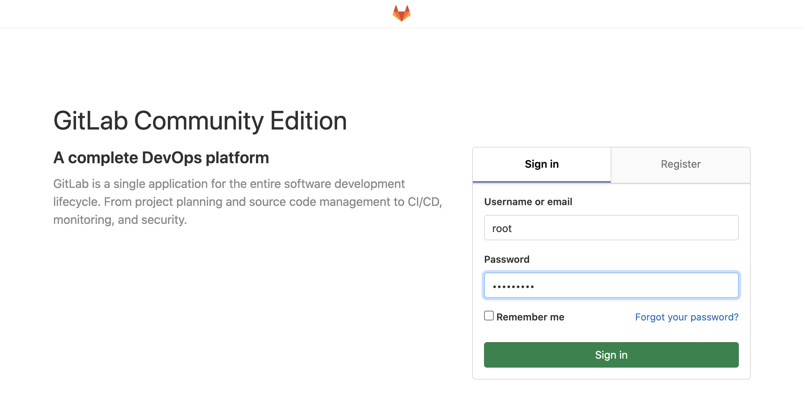

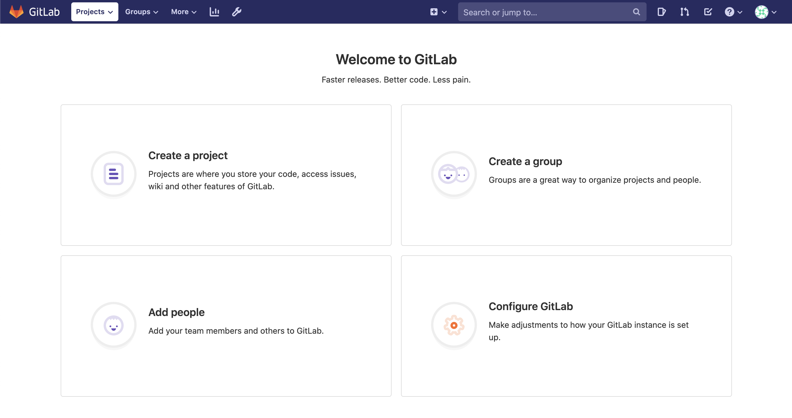

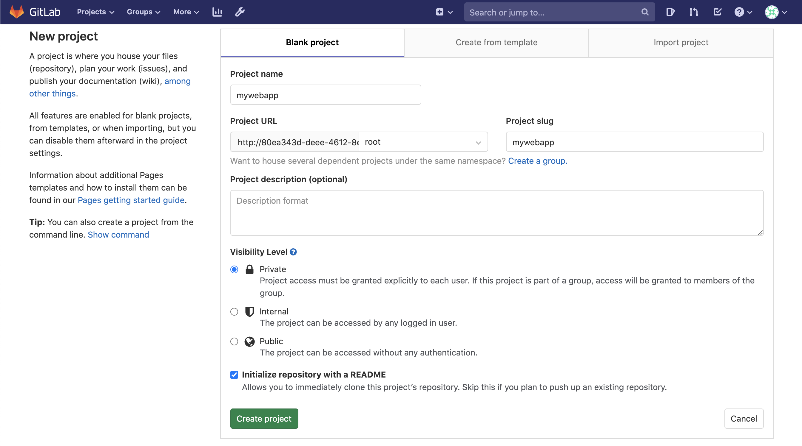

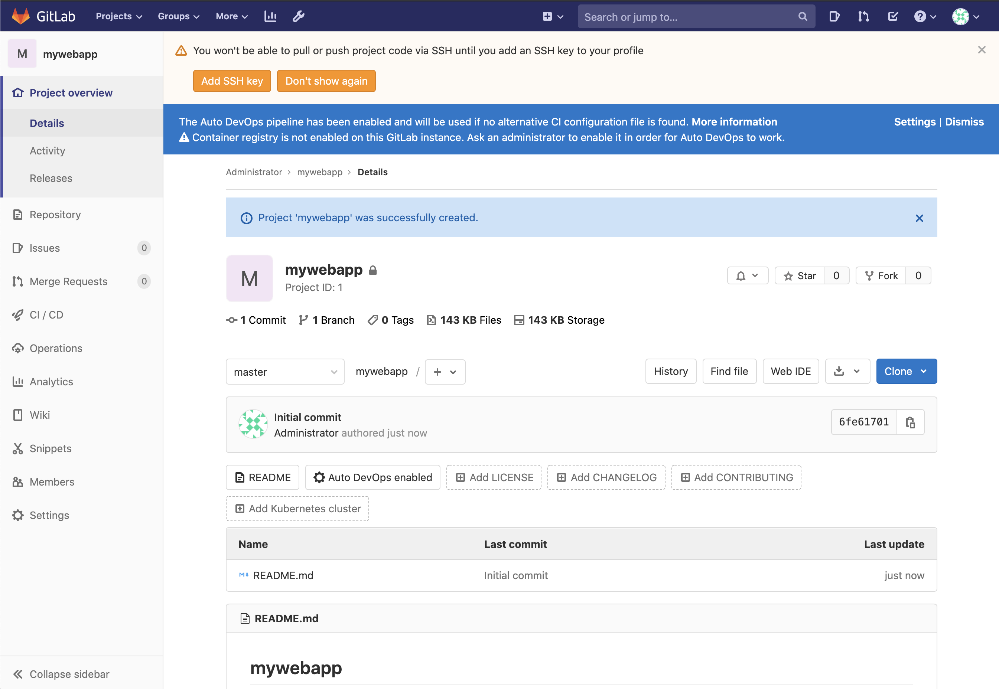

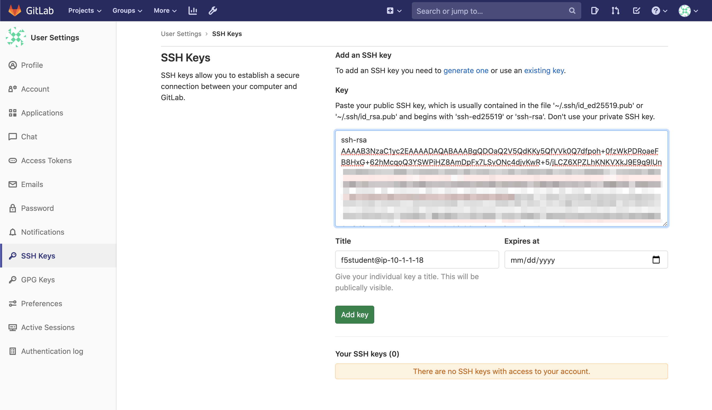

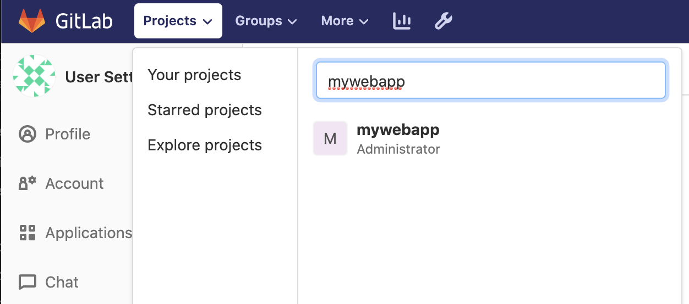

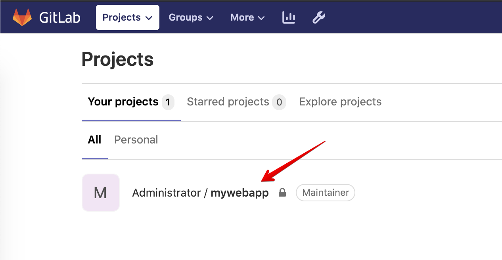

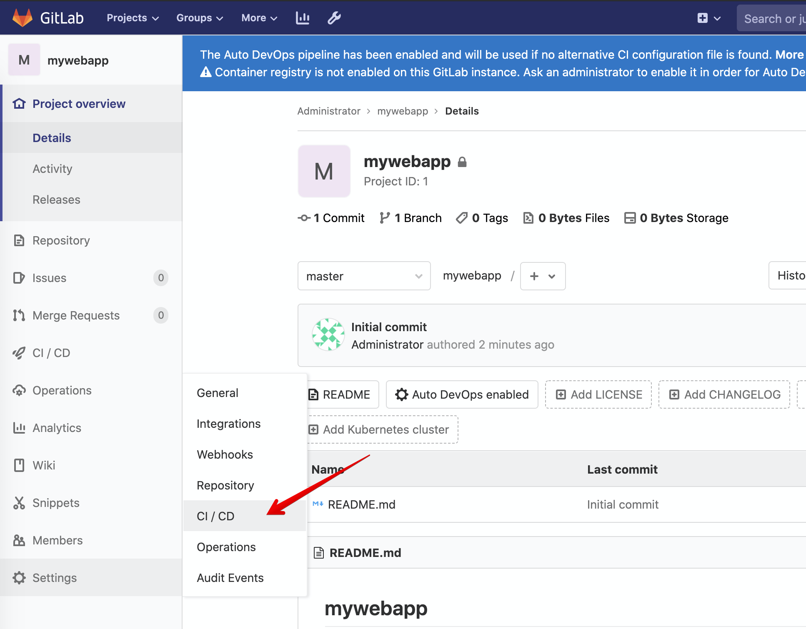

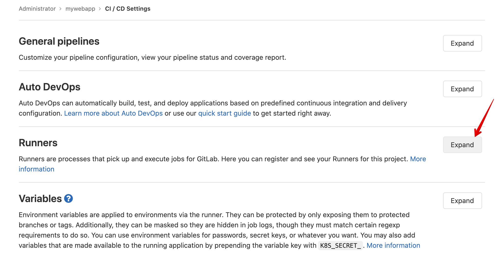

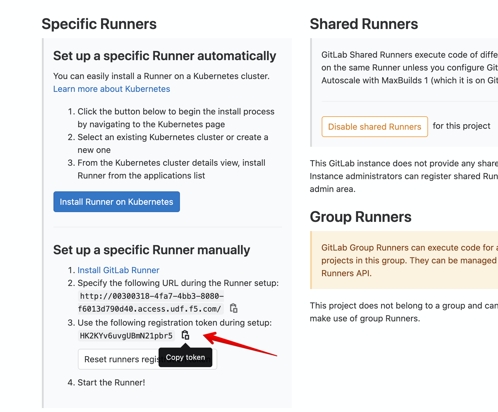

.. |lab-12-11| image:: ../pictures/module2/lab-12-11.png
   :scale: 40%

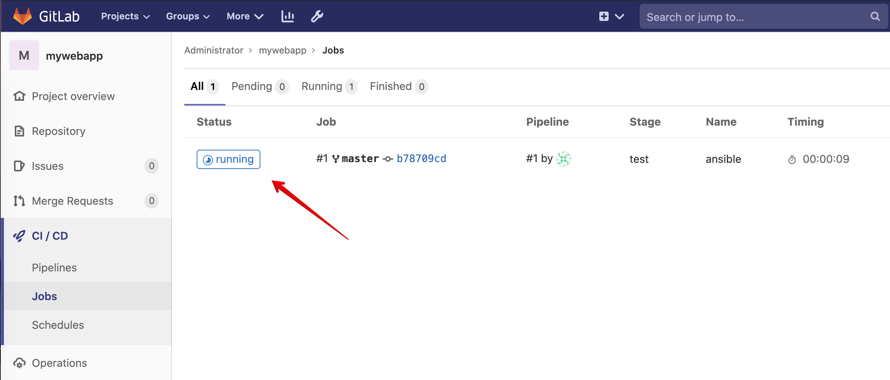

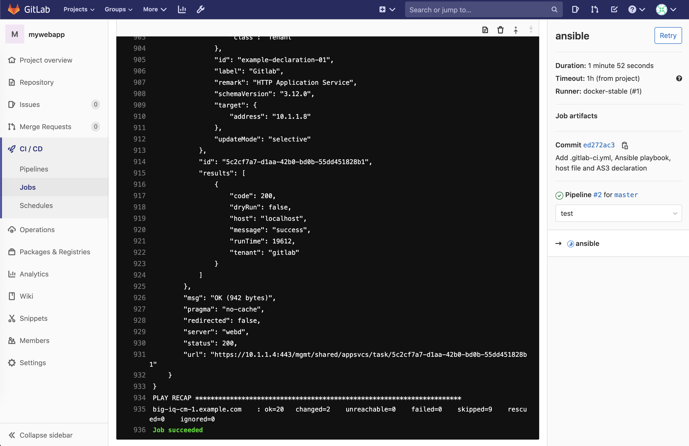

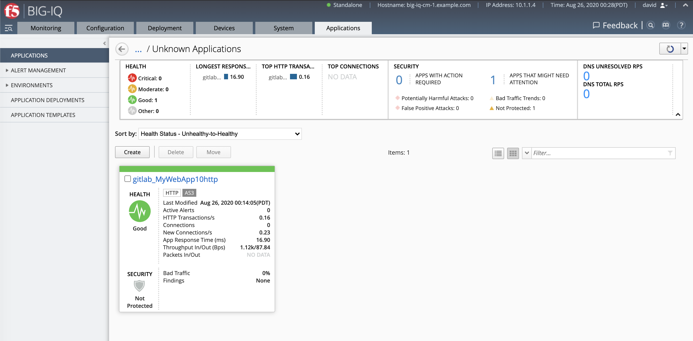

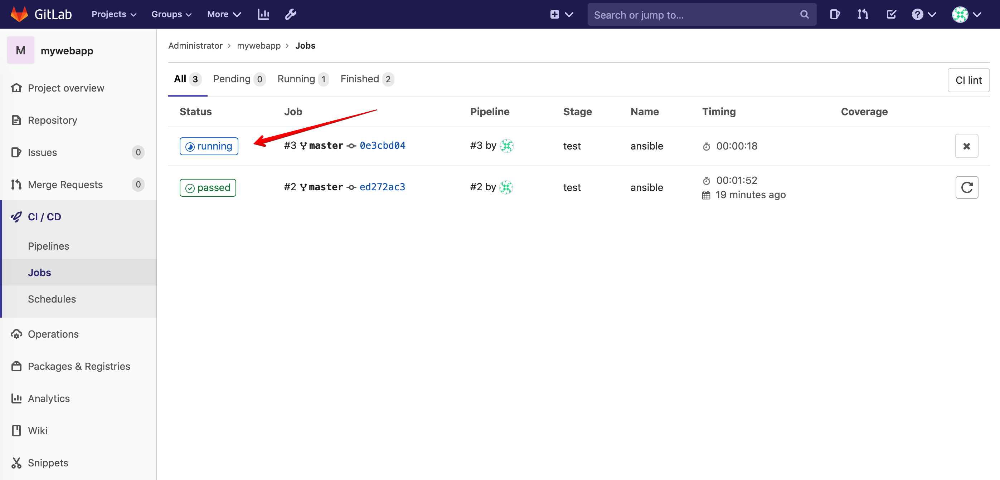

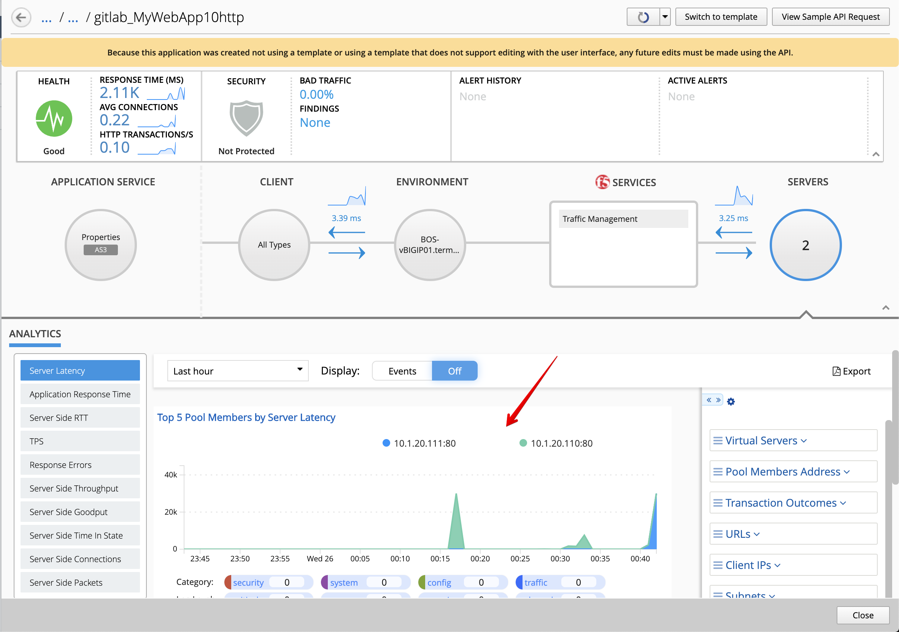