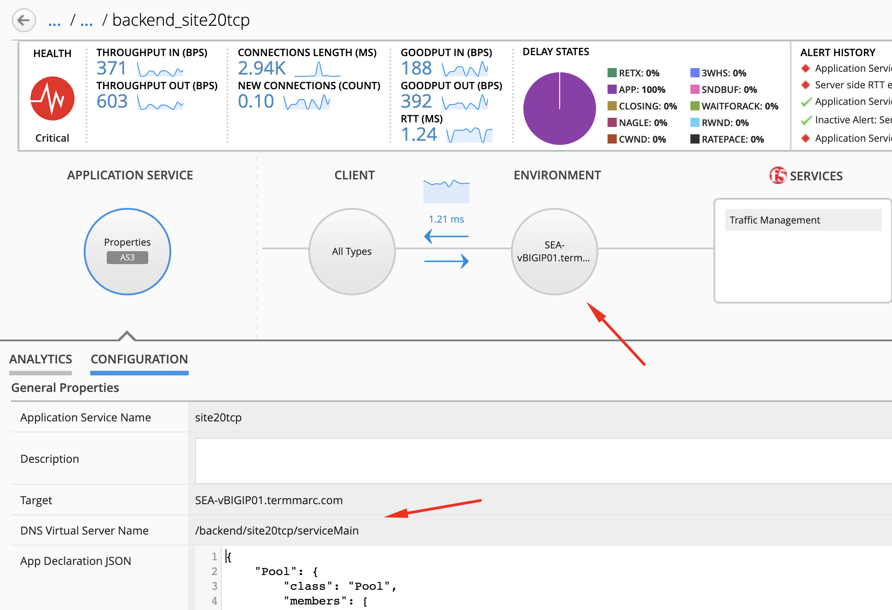
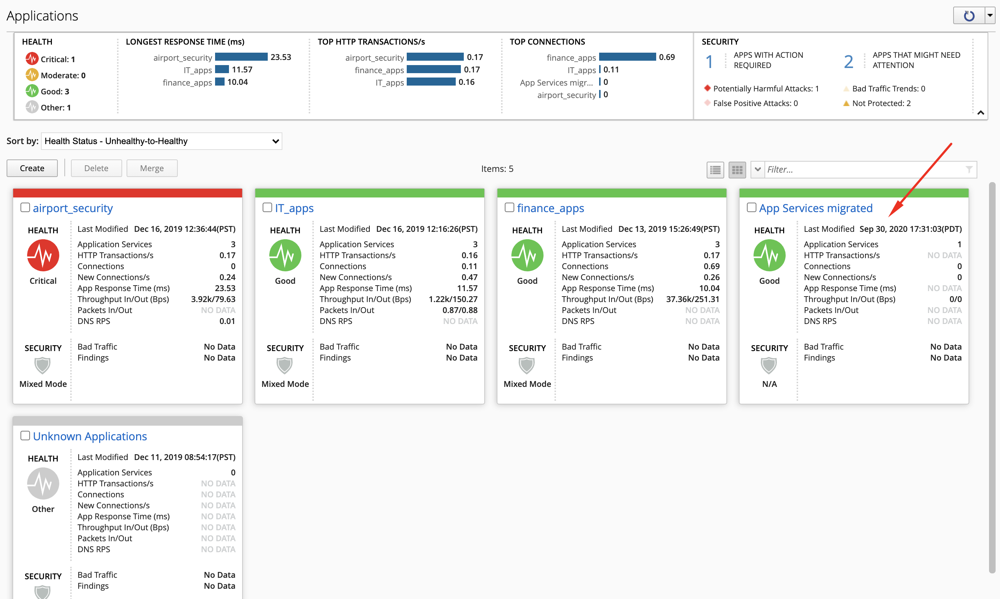
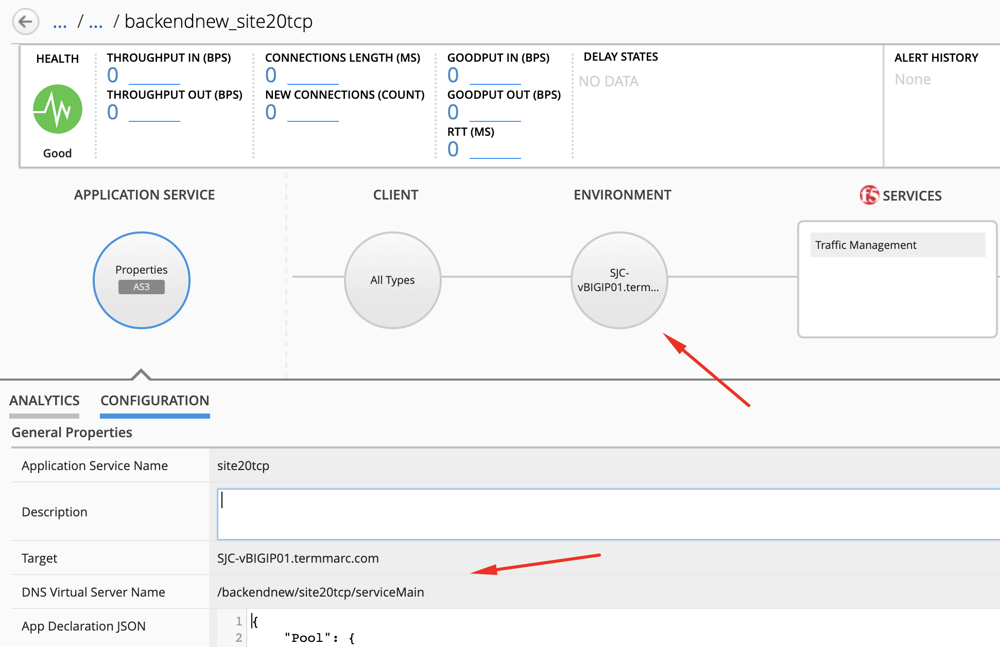

Lab 2.13: Migrate AS3 application service(s) with its referenced objects from a BIG-IP to another BIG-IP
--------------------------------------------------------------------------------------------------------

.. note:: Estimated time to complete: **15 minutes**

In this lab, we are going show you how to use Ansible to migrate Application Services from one BIG-IP to another.

For the example, we are going to migrate a backend application service running on the Seattle BIG-IP to the San Jose BIG-IP (visit *Getting Started* page for more details on the lab topology.)

This lab will be using the following F5 Ansible Galaxy role:
    - `bigiq_migrate_apps`_  **ansible Role**: Migrate AS3 application service(s) with its referenced objects from a BIG-IP to another BIG-IP.

.. include:: /accesslab.rst

Tasks
^^^^^

1. Let's look at the Ansible playbook ``bigiq_as3_migrate_apps.yml``.

.. code-block:: yaml
   :linenos:
   :emphasize-lines: 6,7,8,9

      - name: Migrate AS3 application service(s) from a BIG-IP to another.
        include_role:
          name: f5devcentral.bigiq_migrate_apps
        vars:
          dir_as3: /ansible/tmp
          device_address: 10.1.1.7
          tenant_to_migrate: backend
          new_device_address: 10.1.1.11
          new_tenant_name: backendnew
          new_bigiq_app_name: "App Services migrated"
        register: status

This playbook is using the `bigiq_migrate_apps`_ ansible role to move all AS3 application services from ``10.1.1.7`` in tenant ``backend`` to ``10.1.1.11`` in a tenant ``backendnew``.

2. Login on **BIG-IQ** as **david**, go to Applications tab and navigate under **IT_apps** > **backend_site24tcp**.

|lab-13-1|

2. Connect via ``SSH`` to the system *Ubuntu Lamp Server* and ::

    cd /home/f5/f5-ansible-bigiq-as3-demo
    vi Dockerfile

   Add the following line at the end::

    RUN ansible-galaxy install f5devcentral.bigiq_migrate_apps --force

   Build the ansible runner docker::

    docker build -t f5-ansible-runner .

   Check ansible version and galaxy roles installed::

    ./ansible_helper ansible-playbook --version
    ./ansible_helper ansible-galaxy list

3. Now, let's execute the playbook::

    ./ansible_helper ansible-playbook /ansible/bigiq_as3_migrate_apps.yml -i /ansible/hosts

When the tasks are completed, check the PLAY RECAP and make sure there nothing failed.

PLAY RECAP *******************************************************************************************************************
big-iq-cm-1.example.com    : k=64   changed=11   unreachable=0    failed=0    skipped=28   rescued=0    ignored=0   

4. Back on **BIG-IQ** on the Applications tab and navigate under **App Services migrated** > **backendnew_site24tcp**.

|lab-13-2|

|

|lab-13-3|

5. Now we have validated the backend application services have been migrated over to ``10.1.1.11``, let's remove the old application services on ``10.1.1.7``.
   Go back on the *Ubuntu Lamp Server* and edit the ansible playbook::

    cd /home/f5/f5-ansible-bigiq-as3-demo
    vi bigiq_as3_migrate_apps.yml

Let's add the 2 variables to the playbook ``remove_old_tenant`` and ``cleanup_only`` which will only run the part where we remove the old tenant on ``10.1.1.7``.

.. code-block:: yaml
   :linenos:
   :emphasize-lines: 11,12

      - name: Migrate AS3 application service(s) from a BIG-IP to another.
        include_role:
          name: f5devcentral.bigiq_migrate_apps
        vars:
          dir_as3: /ansible/tmp
          device_address: 10.1.1.7
          tenant_to_migrate: backend
          new_device_address: 10.1.1.11
          new_tenant_name: backendnew
          new_bigiq_app_name: "App Services migrated"
          remove_old_tenant: true
          cleanup_only: true
        register: status

.. note:: This lab execute the creation of the app services in a new tenant and deletion of the old tenant in 2 steps but they could be done in 1 step.
          In this case, just add ``remove_old_tenant: true`` in the initial playbook.

6. Now, let's execute the playbook again with the new variables::

    ./ansible_helper ansible-playbook /ansible/bigiq_as3_migrate_apps.yml -i /ansible/hosts

   Answer yes to the following question::

    Are you sure you want to delete tenant backend and all its content on 10.1.1.7?

    Do you want to proceed? (yes/no):

7. Back on the BIG-IQ Application dashboard, verify the Application Service **backend_site24tcp** under **IT_apps** has been removed.

.. _bigiq_migrate_apps: https://galaxy.ansible.com/f5devcentral/bigiq_migrate_apps

