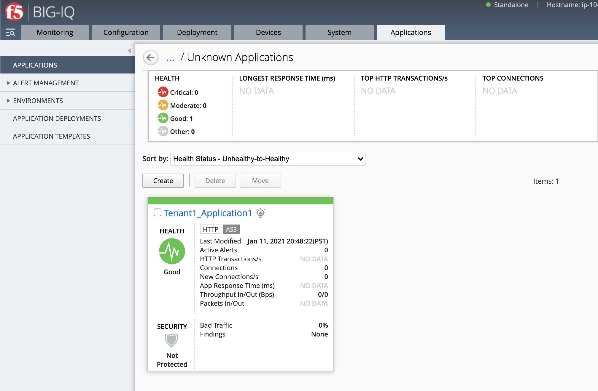
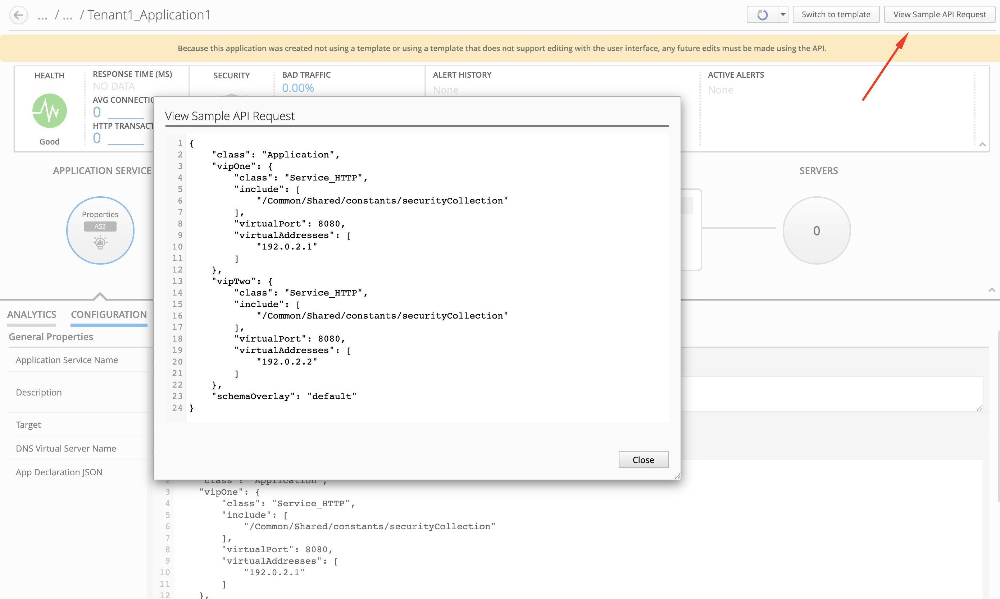
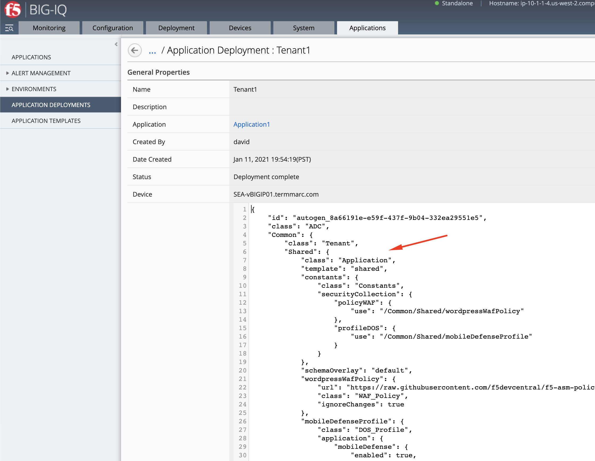

Lab 2.14: Application Creation using AS3 with shared objects through BIG-IQ (new 8.0)
-------------------------------------------------------------------------------------

.. note:: Estimated time to complete: **10 minutes**

In this lab, we are going to show you how to create and AS3 application referencing AS3 objects in /Common/Shared using the API. 
You can find more details on how to use the Shared Application in AS3 on the `AS3 Declaration Purpose and Function`_ page.

.. _AS3 Declaration Purpose and Function: https://clouddocs.f5.com/products/extensions/f5-appsvcs-extension/latest/refguide/declaration-purpose-function.html

We will use a declaration taken from the `AS3 miscellaneous examples`_ which will create 2 HTTP application services referencing the same WAF security policy.

.. _AS3 miscellaneous examples: https://clouddocs.f5.com/products/extensions/f5-appsvcs-extension/latest/declarations/miscellaneous.html#using-the-include-property-to-reference-one-section-of-a-declaration-in-another-section

1. Copy below example of an AS3 Declaration into the IDE (Integrated development environment) available within the lab environment, 
   click on the *Access* button of the *Ubuntu Lamp Server* system and select *Visual Studio Code*.

   .. note:: It is recommended to `validate your AS3 declaration`_ against the schema using Microsoft Visual Studio Code.

   .. _validate your AS3 declaration: https://clouddocs.f5.com/products/extensions/f5-appsvcs-extension/latest/userguide/validate.html

.. code-block:: yaml
   :linenos:
   :emphasize-lines: 12-54,66,76

   {
       "$schema": "https://raw.githubusercontent.com/F5Networks/f5-appsvcs-extension/master/schema/latest/as3-schema.json",
       "class": "AS3",
       "action": "deploy",
       "persist": true,
       "declaration": {
          "class": "ADC",
          "schemaVersion": "3.25.0",
          "target": {
               "address": "10.1.1.7"
           },
          "Common": {
              "class": "Tenant",
              "Shared": {
                  "class": "Application",
                  "template": "shared",
                  "wordpressWafPolicy": {
                      "class": "WAF_Policy",
                      "url": "https://raw.githubusercontent.com/f5devcentral/f5-asm-policy-templates/master/owasp_ready_template/owasp-auto-tune-v1.1.xml",
                      "ignoreChanges": true
                  },
                  "mobileDefenseProfile": {
                      "class": "DOS_Profile",
                      "application": {
                          "scrubbingDuration": 42,
                          "remoteTriggeredBlackHoleDuration": 10,
                          "mobileDefense": {
                              "enabled": true,
                              "allowAndroidPublishers": [{
                                  "bigip": "/Common/default.crt"
                              }],
                              "allowAndroidRootedDevice": true,
                              "allowIosPackageNames": [
                                  "theName"
                              ],
                              "allowJailbrokenDevices": true,
                              "allowEmulators": true,
                              "clientSideChallengeMode": "challenge"
                          }
                      }
                  },
                  "constants": {
                      "class": "Constants",
                      "securityCollection": {
                          "policyWAF": {
                              "use": "/Common/Shared/wordpressWafPolicy"
                          },
                          "profileDOS": {
                              "use": "/Common/Shared/mobileDefenseProfile"
                          }
                      }
                  }
              }
          },
          "Tenant1": {
              "class": "Tenant",
              "Application1": {
                  "class": "Application",
                  "vipOne": {
                      "class": "Service_HTTP",
                      "virtualPort": 8080,
                      "virtualAddresses": [
                          "192.0.2.1"
                      ],
                      "include": [
                          "/Common/Shared/constants/securityCollection"
                      ]
                  },
                  "vipTwo": {
                      "class": "Service_HTTP",
                      "virtualPort": 8080,
                      "virtualAddresses": [
                          "192.0.2.2"
                      ],
                      "include": [
                          "/Common/Shared/constants/securityCollection"
                      ]
                  }
              }
          }
       }
   }

2. Now that the AS3 declaration is validated, use the **Visual Studio code REST client extension** and authenticate to BIG-IQ (follow |location_link_vscode_restclient|).

.. |location_link_vscode_restclient| raw:: html

   <a href="/training/community/big-iq-cloud-edition/html/vscode_restclient.html" target="_blank">instructions</a>

.. note:: Instead of using the Visual Studio Code REST client extension, you can also use F5 vscode extension. See `Module 2 Lab 9`_ to see how to.

.. _Module 2 Lab 9: ./lab9.html

3. Use the **BIG-IQ AS3 Declaration** call in order to create the service on the BIG-IP through BIG-IQ.
   The method and URL used will be ``POST https://10.1.1.4/mgmt/shared/appsvcs/declare?async=true``.
   Copy/Paste the AS3 declaration to the body under the call using the REST client VS code extension.
   
   This will give you an ID which you can query using the **BIG-IQ Check AS3 Deployment Task**.

.. image:: ../pictures/module2/lab-14-1.gif
  :scale: 60%
  :align: center

4. Use the **BIG-IQ Check AS3 Deployment Task** call to ensure that the AS3 deployment is successful without errors: 

   ``GET https://10.1.1.4/mgmt/shared/appsvcs/task/<id>``
   
.. note:: Notice that the app deployment may take a few minutes.

.. image:: ../pictures/module2/lab-14-2.gif
  :scale: 60%
  :align: center

5. Login on **BIG-IQ** as **david**, go to Applications tab and check the application is displayed.
   Note that because the WAF policy is shared between the 2 app services, the protection mode isn't reflected on the BIG-IQ dashboard.

.. warning:: Starting 7.0, BIG-IQ displays AS3 application services created using the AS3 Declare API as Unknown Applications.
             You can move those application services using the GUI, the `Move/Merge API`_, `bigiq_move_app_dashboard`_ F5 Ansible Galaxy role 
             or create it directly into Application in BIG-IQ using the `Deploy API`_ to define the BIG-IQ Application name.

.. _Move/Merge API: https://clouddocs.f5.com/products/big-iq/mgmt-api/v0.0/ApiReferences/bigiq_public_api_ref/r_as3_move_merge.html
.. _Deploy API: https://clouddocs.f5.com/products/big-iq/mgmt-api/v0.0/ApiReferences/bigiq_public_api_ref/r_as3_deploy.html
.. _bigiq_move_app_dashboard: https://galaxy.ansible.com/f5devcentral/bigiq_move_app_dashboard

6. Click on your Application Service called **Tenant1_Application1**, then View Sample API Request, look at the AS3 declaration.

7. Finally, navigate under **Applications > Application Deployments** where David can look at the full definition of the app service including the objects in /Common/Shared.

