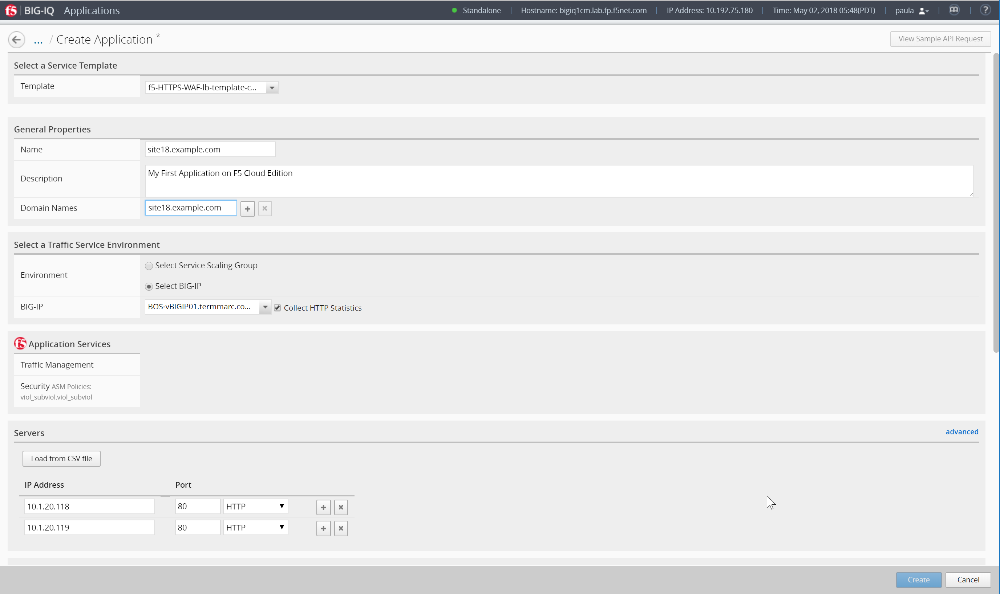
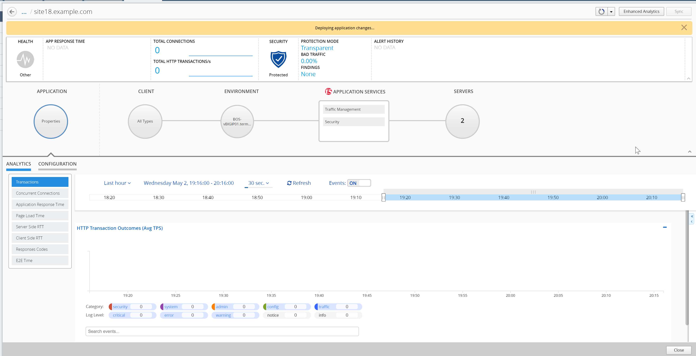
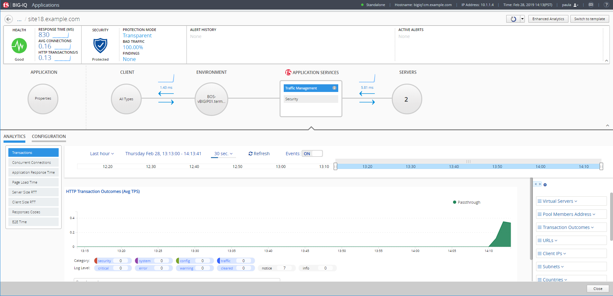

Lab 2.3: Create Application using Service Catalog Template
----------------------------------------------------------
.. warning:: Starting BIG-IQ 6.1, AS3 should be the preferred method to deploy application services through BIG-IQ.

Connect as **paula** to create a new application, and click on *Create*, select the template previously created ``f5-HTTPS-WAF-lb-template-custom1``.

Type in a Name for the application you are creating.

- Application Name: ``site18.example.com``

To help identify this application when you want to use it later, in the Description field, type in a brief description for the application you are creating.

- Description: ``My First Application on F5 Cloud Edition``

Type  the domain of your application (then the ASM policy will always be transparent for this domain)

- Domain Names: ``site18.example.com``

For Device, select the name of the device you want to deploy this application to. (if the HTTP statistics are not enabled, they can be enabled later on after the application is deployed)

- BIG-IP: Select ``BOS-vBIGIP01.termmarc.com`` and check ``Collect HTTP Statistics``

Determine the objects that you want to deploy in this application.
To omit any of the objects defined in this template, click the  (X) icon that corresponds to that object.
To create additional copies of any of the objects defined in this template, click the  (+) icon that corresponds to that object.

In the example, fill out the Server's IP addresses/ports (nodes) and virtual servers names, IPs and ports.

- Servers (Pool Member): ``10.1.20.118`` and ``10.1.20.119``
- Service Port: ``80``

.. note:: Nodes and pool members are “device specific objects”

- Name WAF & LB (Virtual Server): ``vs_site18.example.com_https``
- Destination Address: ``10.1.10.118``
- Destination Network Mask: ``255.255.255.255``
- Service Port: ``443``

- Name HTTP Redirect (Virtual Server): ``vs_site18.example.com_redirect``
- Destination Address: ``10.1.10.118``
- Destination Network Mask: ``255.255.255.255``
- Service Port: ``80``

.. image:: ../pictures/module2/img_module2_lab3_2.png
  :align: center
  :scale: 50%

Then Click on Create (bottom right of the window).
The Application is deployed.

.. note:: In case the Application fails, connect as **david** (or **marco**) and go to Applications > Application Deployments to have more details on the failure. You try retry in case of failure.

.. note:: You can tail the logs: /var/log/restjavad.0.log

In Paula's Dashboard, she can see her Application.

.. image:: ../pictures/module2/img_module2_lab3_4.png
  :align: center
  :scale: 50%

|

Click on the Application and check the details (alarms, security enabled, configuration, ...)

|

Click on Traffic Management > Configuration

.. image:: ../pictures/module2/img_module2_lab3_6.png
  :align: center
  :scale: 50%

|

.. note:: A traffic generator located on the *Ubuntu Lamp Server* server, is sending good traffic every minute to the virtual servers.

Paula can update Application Health Alert Rules by clicking on the Health Icon on the top left of the Application Dashboard.

.. image:: ../pictures/module2/img_module2_lab3_7.png
  :align: center
  :scale: 50%

|

.. image:: ../pictures/module2/img_module2_lab3_8.png
  :align: center
  :scale: 50%
