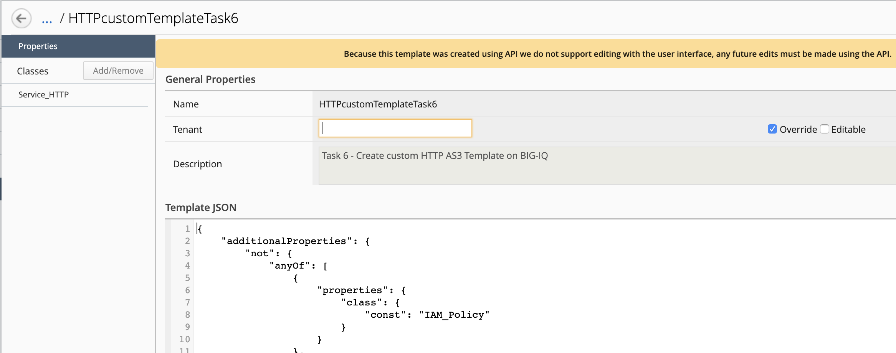
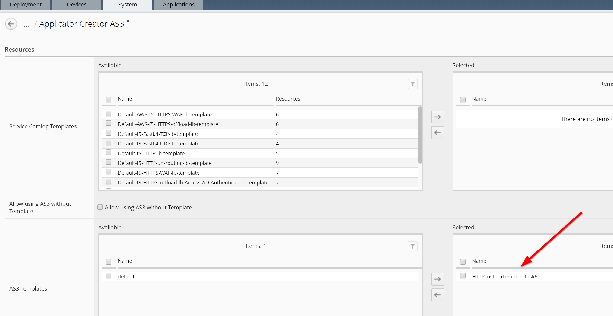
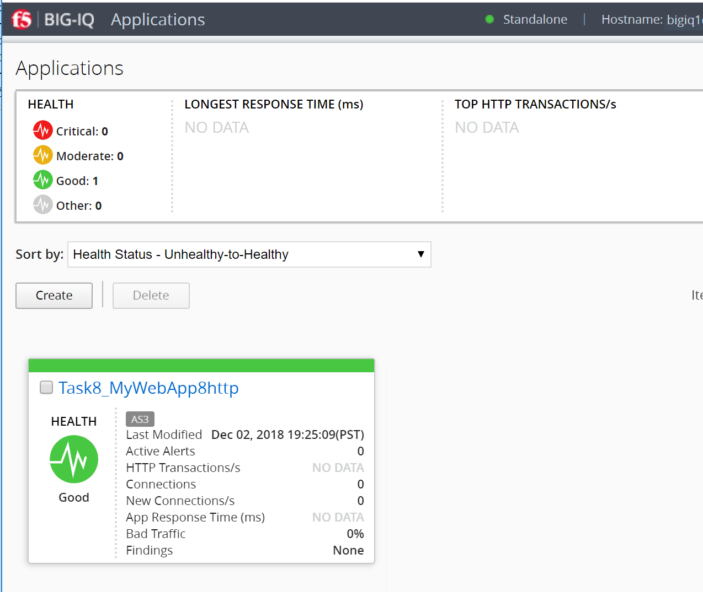

Lab 2.3: Deploying AS3 Templates on BIG-IQ
------------------------------------------

Task 6 - Create custom HTTP AS3 Template on BIG-IQ
~~~~~~~~~~~~~~~~~~~~~~~~~~~~~~~~~~~~~~~~~~~~~~~~~~

.. warning:: AS3 Templates cannot be created through BIG-IQ UI but only using the API in 6.1.
             Go to `Module 2`_ for more details on how to create a AS3 Template using the UI start BIG-IQ 7.0.

.. _Module 2: ../module2/module2.html

Administrators will employ the BIG-IQ Service Catalog to construct and manage a set of JSON Schema templates.  Non-administrative users may be selectively allowed to deploy configurations using these templates according to BIG-IQ RBAC policies.  The purpose of the templates is to filter the information being supplied to AS3 in 3 ways:

- Force the inclusion of specific AS3 class objects
- Restrict specific AS3 properties and/or classes
- Override specific AS3 default property values

.. note:: BIG-IQ 7.0 will bring a User Interface to create and manage the AS3 templates.

The following examples demonstrate how these goals can be met with JSON Schema.

1. Enforcing Changes to AS3 Classes

In order to trigger schema enforcement of each class in the template other than Tenant and Application, specify the class name(s) and reference(s) in the Application class additionalProperties, like this:

.. code-block:: yaml
   :linenos:

    "additionalProperties": {
        "allOf": [
            {
                "if": {"properties": {"class": {"const": "Service_HTTP"}}},
                "then": { "$ref": "#/definitions/Service_HTTP" }
            },
            {
                "if": {"properties": {"class": {"const": "HTTP_Profile"}}},
                "then": { "$ref": "#/definitions/HTTP_Profile" }
            }
        ]
    }

2. Overriding an AS3 Default Value

To override a default, specify the property name, type, and new default like this snippet for the HTTP_Profile class: 

.. code-block:: yaml
   :linenos:

    "xForwardedFor": {
        "type": "boolean",
        "default": true
    }

3. Setting a Static Value

To force a property to a specific value and accept no other, specify the property name, type, and const.  To add the static value when the user omits the property, specify the default as well, like this snippet added to the Service_HTTP class:

.. code-block:: yaml
   :linenos:

    "virtualPort": {
        "type": "integer",
        "const": 8080,
        "default": 8080
    }

4. Disallowing One or More Properties

To reject a specific property whenever it appears in a declaration, specify that property within dependencies, like this snippet added to the Service_HTTP class:

.. code-block:: yaml
   :linenos:

    "dependencies": {
        "policyIAM": { "not": {} },
        "policyWAF": { "not": {} }
    }

5. Disallowing All Properties Except Those Specified

To act on a handful of properties and reject all others, make sure to include a stub for the "class" property and specify:

.. code-block:: yaml
   :linenos:

    "additionalProperties": false

6. Disallowing One or More Classes

To reject an entire class, specify this not anyOf properties clause within the Application class additionalProperties object:

.. code-block:: yaml

   :linenos:
    "additionalProperties": {
        "not": {
            "anyOf": [
                {"properties": {"class": {"const": "TCP_Profile"}}},
                {"properties": {"class": {"const": "TLS_Client"}}}
            ]
        }
    }

7. Disallowing All But 1 or 2 Classes

To allow just 1 or 2 classes, use an if-then construct within additionalProperties:

.. code-block:: yaml
   :linenos:

    "additionalProperties": {
        "if": {
            "properties": {"class": {"const": "Service_L4"}}
        },
        "then": { "$ref": "#/definitions/Service_L4" },
        "else": {
                "if": { "not": {"properties": {"class": {"const": "Pool"}}}},
                "then": false
        }
    }

------------

In this task, we will create a template which require a Service_HTTP object, force the service port to 8080, and prevent WAF (ASM) and IAM (APM) configuration.

1. Using Postman, use the **BIG-IQ Token (david)** collections to authenticate you on the BIG-IQ and save the token.
   If your token expires, obtain a new token by resending the ``BIG-IQ Token (david)``.

   .. warning:: The token timeout is set to 5 min. If you get the 401 authorization error, request a new token.

2. Copy the below example of an AS3 service template into the Postman **BIG-IQ AS3 Template Creation** call.
It will create a new template in BIG-IQ AS3 Service Catalogue:

    POST https\:\/\/10.1.1.4/mgmt/cm/global/appsvcs-templates

.. code-block:: yaml
   :linenos:

    {
        "description": "Task 6 - Create custom HTTP AS3 Template on BIG-IQ",
        "name": "HTTPcustomTemplateTask6",
        "published": "true",
        "schemaOverlay": {
            "type": "object",
            "properties": {
                "class": {
                    "type": "string",
                    "const": "Application"
                },
                "schemaOverlay": {},
                "label": {},
                "remark": {},
                "template": {},
                "enable": {},
                "constants": {}
            },
            "additionalProperties": {
                "allOf": [
                    {
                        "if": {
                            "properties": {
                                "class": {
                                    "const": "Service_HTTP"
                                }
                            }
                        },
                        "then": {
                            "$ref": "#/definitions/Service_HTTP"
                        }
                    }
                ],
                "not": {
                    "anyOf": [
                        {
                            "properties": {
                                "class": {
                                    "const": "IAM_Policy"
                                }
                            }
                        },
                        {
                            "properties": {
                                "class": {
                                    "const": "WAF_Policy"
                                }
                            }
                        }
                    ]
                }
            },
            "required": [
                "class"
            ],
            "definitions": {
                "Service_HTTP": {
                    "type": "object",
                    "properties": {
                        "virtualPort": {
                            "type": "integer",
                            "const": 8080,
                            "default": 8080
                        }
                    },
                    "dependencies": {
                        "policyIAM": {
                            "not": {}
                        },
                        "policyWAF": {
                            "not": {}
                        }
                    },
                    "additionalProperties": true
                }
            }
        }
    }

3. Logon on BIG-IQ, go to Application tab, then Application Templates. Look at the custom template created previous through the API.

|lab-3-1|

Note the AS3 Template cannot be created through BIG-IQ UI but only using the API. You can only delete a AS3 templates from the BIG-IQ UI.

You can see the Template in JSON format if you click on it.

|lab-3-2|

.. note:: For help with JSON Schema, there are lots of resources, but one good place to start is https://json-schema.org/learn.

Task 7 - Admin set RBAC for Oliva on BIG-IQ
~~~~~~~~~~~~~~~~~~~~~~~~~~~~~~~~~~~~~~~~~~~

Let's update now Oliva's service catalog.

Logon on BIG-IQ as **david** go to the System tab, Role Management, Roles, CUSTOM ROLES, Application Roles, select **Application Creator AS3** 
and the custom role linked to the custom HTTP template previously created. Remove the **default** template from the allowed list. 
Click **Save & Close**.

|lab-3-3|

Task 8 - Deploy the HTTP Application Service using a Custom Template
~~~~~~~~~~~~~~~~~~~~~~~~~~~~~~~~~~~~~~~~~~~~~~~~~~~~~~~~~~~~~~~~~~~~

Now, let's deploy an application as **Oliva** using the AS3 template previously created in Task 6. Note in the below declaration, 
the virtualPort is set to 9090 while in the template, we force the virtualPort to a specific value and accept no other.

1. Using Postman, use the **BIG-IQ Token (olivia)** collections to authenticate you on the BIG-IQ and save the token.
   If your token expires, obtain a new token by resending the ``BIG-IQ Token (olivia)``.

   .. warning:: The token timeout is set to 5 min. If you get the 401 authorization error, request a new token.

2. Copy below example of an AS3 Declaration into the body of the **BIG-IQ AS3 Declaration** collection in order to create the service on the BIG-IP through BIG-IQ:

POST https\:\/\/10.1.1.4/mgmt/shared/appsvcs/declare?async=true

.. code-block:: yaml
   :linenos:
   :emphasize-lines: 29

    {
        "class": "AS3",
        "action": "deploy",
        "declaration": {
            "class": "ADC",
            "schemaVersion": "3.7.0",
            "id": "isc-lab",
            "label": "Task8",
            "target": {
                "address": "10.1.1.8"
            },
            "Task8": {
                "class": "Tenant",
                "MyWebApp8http": {
                    "class": "Application",
                    "schemaOverlay": "HTTPcustomTemplateTask6",
                    "template": "http",
                    "statsProfile": {
                        "class": "Analytics_Profile",
                        "collectClientSideStatistics": true,
                        "collectOsAndBrowser": false,
                        "collectMethod": false
                    },
                    "serviceMain": {
                        "class": "Service_HTTP",
                        "virtualAddresses": [
                            "10.1.10.133"
                        ],
                        "virtualPort": 9090,
                        "pool": "pool_8",
                        "profileAnalytics": {
                            "use": "statsProfile"
                        }
                    },
                    "pool_8": {
                        "class": "Pool",
                        "monitors": [
                            "http"
                        ],
                        "members": [
                            {
                                "servicePort": 80,
                                "serverAddresses": [
                                    "10.1.20.132",
                                    "10.1.20.133"
                                ],
                                "shareNodes": true
                            }
                        ]
                    }
                }
            }
        }
    }

  
This will give you an ID which you can query using the **BIG-IQ Check AS3 Deployment Task**.

3. Use the **BIG-IQ Check AS3 Deployment Task** Postman calls to ensure that the AS3 deployment is successfull without errors: 

   GET https\:\/\/10.1.1.4/mgmt/shared/appsvcs/task/<id>

4. As expected, note the error message returned due to the static value set in the template::

     "response": "declaration is invalid according to provided schema overlay: data['serviceMain'].virtualPort should be equal to constant",
                "status": 422

5. Update the ``virtualPort`` to **8080** and re-send the declaration.

6. Logon on **BOS-vBIGIP01.termmarc.com** and verify the Application is correctly deployed in partition Task8.

7. Logon on **BIG-IQ** as Olivia, go to Application tab and check the application is displayed and analytics are showing.

.. warning:: Starting 7.0, BIG-IQ displays AS3 application services created using the AS3 Declare API as Unknown Applications.
             You can move those application services using the GUI, the `Move/Merge API`_ or create it directly into 
             Application in BIG-IQ using the `Deploy API`_ to define the BIG-IQ Application name.

.. _Move/Merge API: https://clouddocs.f5.com/products/big-iq/mgmt-api/latest/ApiReferences/bigiq_public_api_ref/r_public_api_references.html
.. _Deploy API: https://clouddocs.f5.com/products/big-iq/mgmt-api/latest/ApiReferences/bigiq_public_api_ref/r_public_api_references.html

|lab-3-4|

.. |lab-3-1| image:: ../pictures/module2/lab-3-1.png
   :scale: 60%

