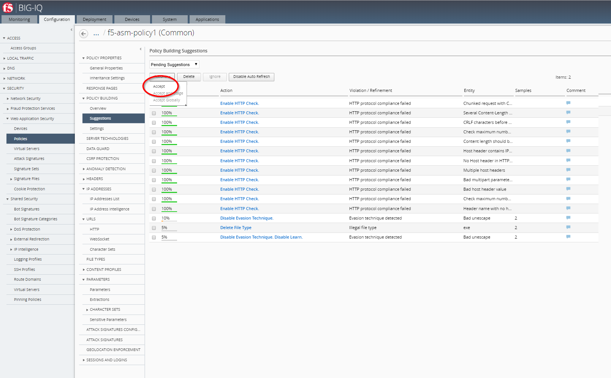
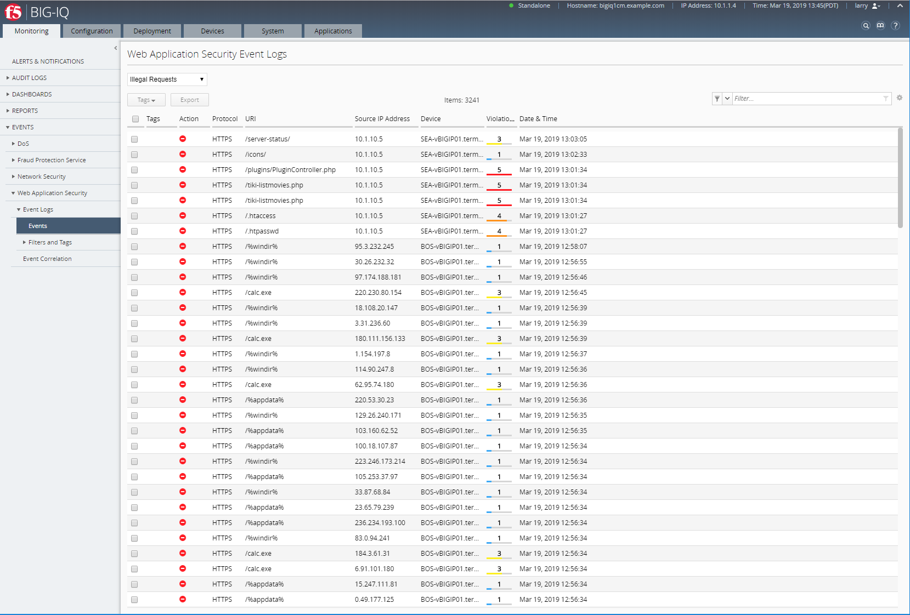

Lab 2.4: Security workflow (Service Catalog Templates)
------------------------------------------------------
.. warning:: Starting BIG-IQ 6.1, AS3 should be the preferred method to deploy application services through BIG-IQ.

Connect as **larry**

1. Larry check the Web Application Security for ``f5-asm-policy1`` ASM Policy.

Go to Configuration > SECURITY > Web Application Security > Policies

Click on Suggestions, then **Accept** the Learning.

|

.. note:: in case the app is deployed on a BIG-IP HA pair, the learning is not sync unless the failover group is set to automatic or the centrally builder feature is used.

2. Go to Deployment > EVALUATE & DEPLOY > Web Application Security

Under Deployments, click on **Create**. Name your Deployment, select BOS-vBIGIP01.termmarc.com, choose method **Deploy immediately**, then click on **Create**.

.. image:: ../pictures/module2/img_module2_lab4_3b.png
  :align: center
  :scale: 50%

|

3. Go back to Configuration > SECURITY > Web Application Security > Policies

Update the Enforcement Mode to ``Blocking`` (this might be already set to Blocking in the BP, if the case, move on).

.. image:: ../pictures/module2/img_module2_lab4_4.png
  :align: center
  :scale: 50%

|

Connect as **paula**

Select ``site18.example.com``

1. **Paula** enforce the policy APPLICATION SERVICES > Security > CONFIGURATION tab > click on ``Start Blocking``

.. image:: ../pictures/module2/img_module2_lab4_5.png
  :align: center
  :scale: 50%

|

After Blocking is turned on:

.. image:: ../pictures/module2/img_module2_lab4_6.png
  :align: center
  :scale: 50%

|

.. note:: The Enforcement Mode is controlled by the Application owner, the Host Name of the application (FQDN) will be configured in the ASM Policy.
          For more information, read following article https://support.f5.com/csp/article/K67438310

.. note:: The BIG-IQ Web Application Security module does not support changes to ASM Blocking Mode when managing BIG-IP devices running 14.1.0. The issue is tracked as ID 750683 (BIG-IP).

.. image:: ../pictures/module2/img_module2_lab4_6a.png
  :align: center
  :scale: 50%

|

2. Let's generate some bad traffic, connect on the *Ubuntu Lamp Server* server and launch the following script:

``# /home/f5/scripts/generate_http_bad_traffic.sh``

3. In Application Dashboard, navigate to the Security Statistics and notice the Malicious Transactions.

Connect as **larry**

1. Check ASM type of attacks

Monitoring > EVENTS > Web Application Security > Event Logs > Events

2. Stop the bad traffic script, connect on the *Ubuntu Lamp Server* server and ``CTRL+C``.
