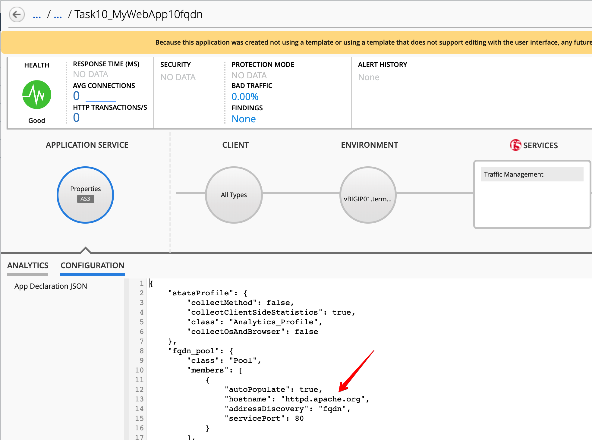

Lab 2.5: FQDN and Service Discovery
-----------------------------------

.. note:: Estimated time to complete: **5 minutes**

.. include:: /accesslab.rst

Tasks
^^^^^

Connect via ``SSH`` to the system *Ubuntu Lamp Server*.

Execute the playbooks for each tasks

- Task 10: HTTP Application Service using an FQDN pool to identify pool members::

    cd /home/f5/f5-ansible-bigiq-as3-demo
    ./cmd_bigiq_as3_apps_creation.sh as3_bigiq_task10_create_http_app_fqdn_nodes.json

You can look at the details of the AS3 declaration on the `GitHub repository`_.

.. _GitHub repository: https://github.com/f5devcentral/f5-big-iq-lab/blob/develop/lab/f5-ansible-bigiq-as3-demo/as3/as3_bigiq_task10_create_http_app_fqdn_nodes.json

Connect as **david** and check on BIG-IQ the application has been correctly created.

|lab-5-1|

.. warning:: Starting 7.0, BIG-IQ displays AS3 application services created using the AS3 Declare API as Unknown Applications.
             You can move those application services using the GUI, the `Move/Merge API`_, `bigiq_move_app_dashboard`_ F5 Ansible Galaxy role 
             or create it directly into Application in BIG-IQ using the `Deploy API`_ to define the BIG-IQ Application name.

.. _Move/Merge API: https://clouddocs.f5.com/products/big-iq/mgmt-api/latest/ApiReferences/bigiq_public_api_ref/r_as3_move_merge.html
.. _Deploy API: https://clouddocs.f5.com/products/big-iq/mgmt-api/latest/ApiReferences/bigiq_public_api_ref/r_as3_deploy.html

.. _atc_deploy: https://galaxy.ansible.com/f5devcentral/atc_deploy
.. _bigiq_move_app_dashboard: https://galaxy.ansible.com/f5devcentral/bigiq_move_app_dashboard
.. _automation tool chain: https://www.f5.com/products/automation-and-orchestration

Connect on the BIG-IP and look at the **fqdn_pool**:

|lab-5-2|

.. |lab-5-2| image:: ../pictures/module2/lab-5-2.png
   :scale: 60%

.. warning:: BIG-IQ won't display the number of servers in the dashboard for FQDN nodes.