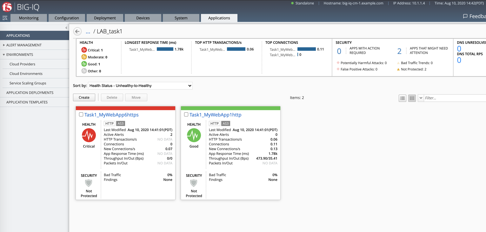

Lab 2.7: Perform lab 1 to 4 using Ansible
-----------------------------------------

.. note:: Estimated time to complete: **20 minutes**

.. include:: /accesslab.rst

Tasks
^^^^^

Connect via ``SSH`` to the system *Ubuntu Lamp Server*.

Execute the playbooks for each tasks.

.. warning:: Starting 7.0, BIG-IQ displays AS3 application services created using the AS3 Declare API as Unknown Applications.
             You can move those application services using the GUI, the `Move/Merge API`_ or create it directly into 
             Application in BIG-IQ using the `Deploy API`_ to define the BIG-IQ Application name.

.. _Move/Merge API: https://clouddocs.f5.com/products/big-iq/mgmt-api/latest/ApiReferences/bigiq_public_api_ref/r_as3_move_merge.html
.. _Deploy API: https://clouddocs.f5.com/products/big-iq/mgmt-api/latest/ApiReferences/bigiq_public_api_ref/r_as3_deploy.html

- Task 1: HTTP Application Service::

    # cd /home/f5/f5-ansible-bigiq-as3-demo
    # ./cmd_bigiq_as3_apps_creation.sh as3_bigiq_task01_create_http_app.json paula

  Connect as **paula** and check on BIG-IQ the application has been correctly created.

|

- Task 2: HTTPS Offload::

    # cd /home/f5/f5-ansible-bigiq-as3-demo
    # ./cmd_bigiq_as3_apps_creation.sh as3_bigiq_task02_create_https_app.json paula

  Connect as **paula** and check on BIG-IQ the application has been correctly created.

|

- Task 3a: HTTPS Application with Web Application Firewall::

    # cd /home/f5/f5-ansible-bigiq-as3-demo
    # ./cmd_bigiq_as3_apps_creation.sh as3_bigiq_task03a_create_waf_app.json paula

  Connect as **paula** and check on BIG-IQ the application has been correctly created.

|

- Task 3b: HTTPS Application with Web Application Firewall using an External ASM policy::

    # cd /home/f5/f5-ansible-bigiq-as3-demo
    # ./cmd_bigiq_as3_apps_creation.sh as3_bigiq_task03b_create_waf_ext_policy_app.json paula

  Connect as **paul** and check on BIG-IQ the application has been correctly created.

|

- Task 4: Generic Services::

    # cd /home/f5/f5-ansible-bigiq-as3-demo
    # ./cmd_bigiq_as3_apps_creation.sh as3_bigiq_task04_create_generic_app.json paul

  Connect as **paul** and check on BIG-IQ the application has been correctly created.

|

- Task 5a: Add a HTTPS Application to existing HTTP AS3 Declaration (using POST)::

    # cd /home/f5/f5-ansible-bigiq-as3-demo
    # ./cmd_bigiq_as3_apps_creation.sh as3_bigiq_task05a_modify_post_http_app.json paul

  Connect as **paula** and check on BIG-IQ the application has been correctly created.

|

- Task 6: Create custom HTTP AS3 Template on BIG-IQ::

    # cd /home/f5/f5-ansible-bigiq-as3-demo
    # ./ansible_helper ansible-playbook /ansible/bigiq_as3_task06_create_template.yml -i /ansible/hosts

  Connect as **david** and check on BIG-IQ the AS3 template has been correctly created.

  Login on BIG-IQ, go to Applications tab, then Application Templates. Look at the custom template created previous through the API.

  |lab-3-1|

  .. warning:: AS3 Templates cannot be created through BIG-IQ UI but only using the API in 6.1.
               Go to `Module 3`_ for more details on how to create a AS3 Template using the UI start BIG-IQ 7.0.

  .. _Module 3: ../module3/module3.html

  You can see the Template in JSON format if you click on it.

  |lab-3-2|

|

- Task 7: Admin set RBAC for **Oliva** on BIG-IQ

  Let's update now Oliva's service catalog.

  Login on BIG-IQ as **david** go to the System tab, Role Management, Roles, CUSTOM ROLES, Application Roles, select **Applicator Creator AS3** 
  and the custom role linked to the custom HTTP template previously created. Remove the **default** template from the allowed list. 
  Click **Save & Close**.

  |lab-3-3|

|

- Task 8: Deploy the HTTP Application Service using a Custom Template::

    # cd /home/f5/f5-ansible-bigiq-as3-demo
    # ./cmd_bigiq_as3_apps_creation.sh as3_bigiq_task08_create_http_app.json olivia

  Connect as **olivia** and check on BIG-IQ the application has been correctly created.

  |lab-3-4|

|

- Move Task1 application services into a single Application on BIG-IQ::

    # cd /home/f5/f5-ansible-bigiq-as3-demo
    # ./ansible_helper ansible-playbook /ansible/bigiq_as3_move_apps.yml -i /ansible/hosts

  Connect as **david** and check on BIG-IQ the application has been correctly created.

  .. warning:: If you want Paula to access the new Application called LAB_task1, David will need to assign the role ``LAB_task1 Manager``

  |lab-3-5|

|

- Task 9: Delete Task1 with their AS3 application services::

    # cd /home/f5/f5-ansible-bigiq-as3-demo
    # ./cmd_bigiq_as3_apps_creation.sh as3_bigiq_task09_delete_task1_app.json david

  Connect as **david** on BIG-IQ.

  Here, we empty the tenant/partition Task1. This should remove those partitions from BOS-vBIGIP01.termmarc.com. The relevant Apps 
  should also disappear from BIG-IQ. 

.. |lab-3-1| image:: ../pictures/module2/lab-3-1.png
   :scale: 60%
.. |lab-3-2| image:: ../pictures/module2/lab-3-2.png
   :scale: 60%
.. |lab-3-3| image:: ../pictures/module2/lab-3-3.png
   :scale: 60%
.. |lab-3-4| image:: ../pictures/module2/lab-3-4.png
   :scale: 60%
