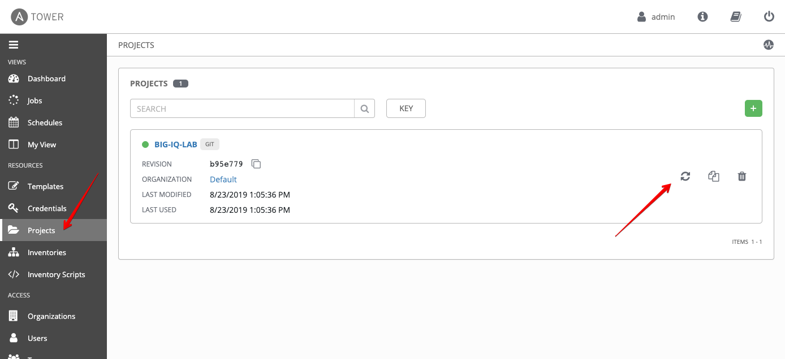
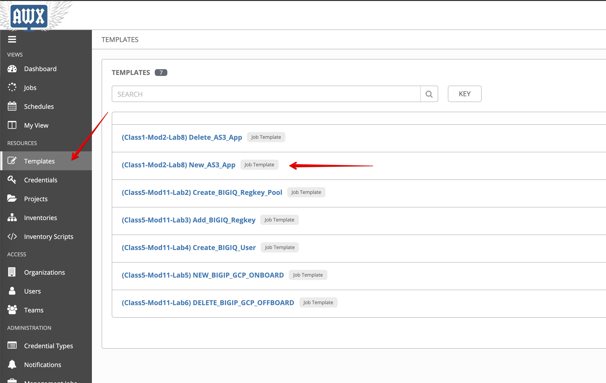
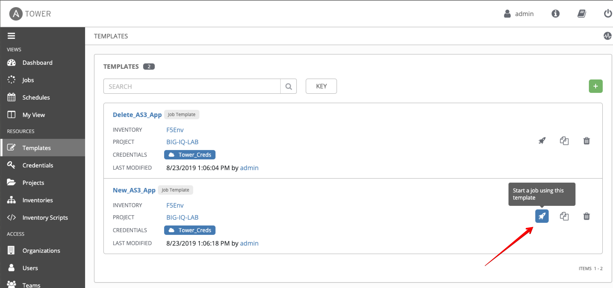
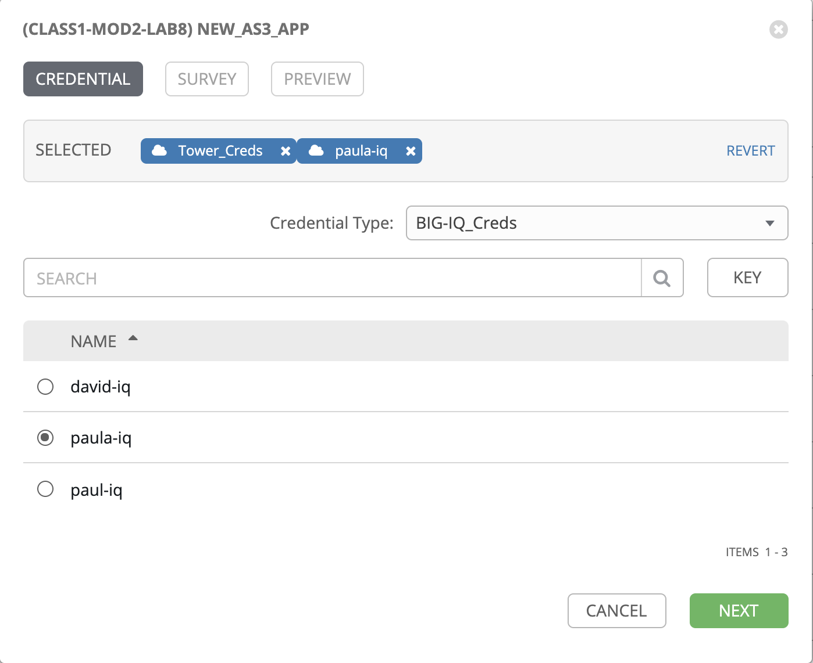
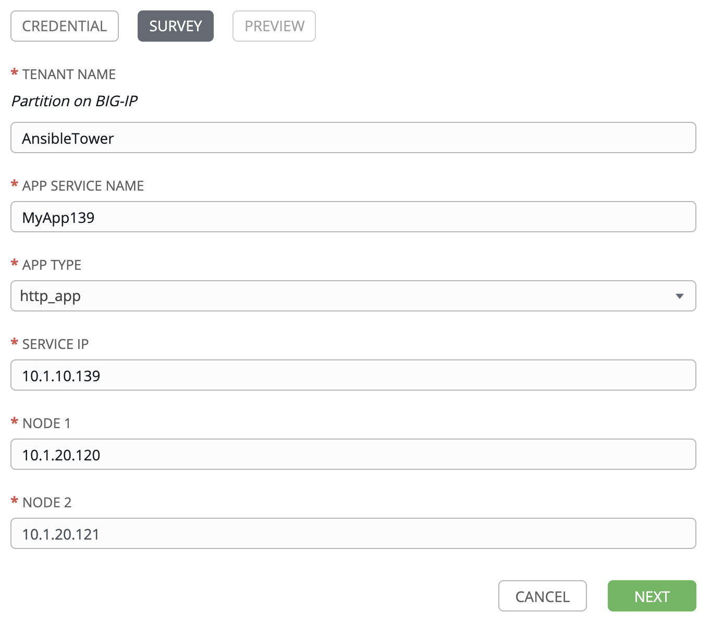
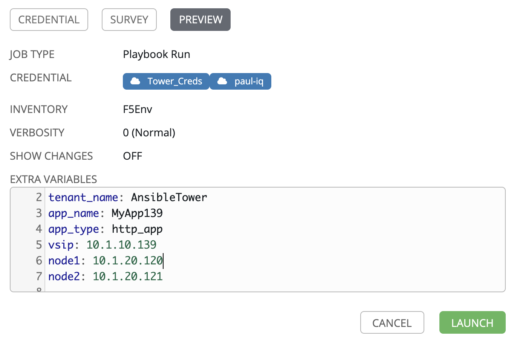
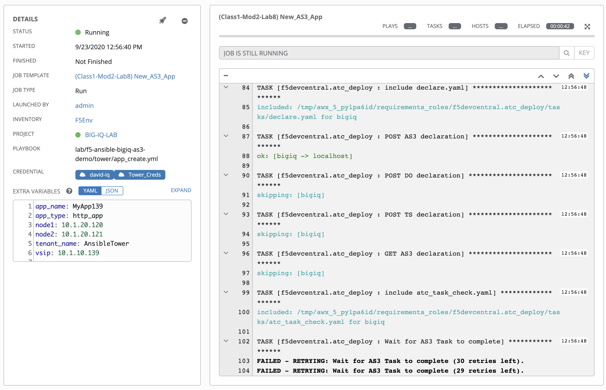
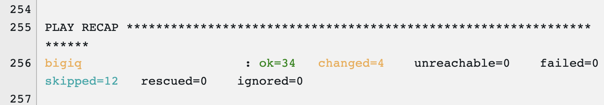
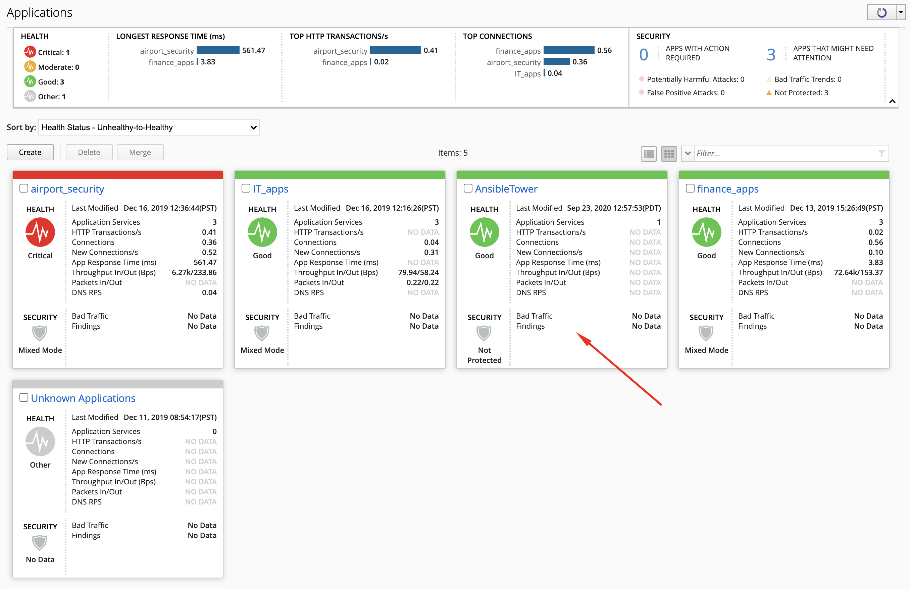
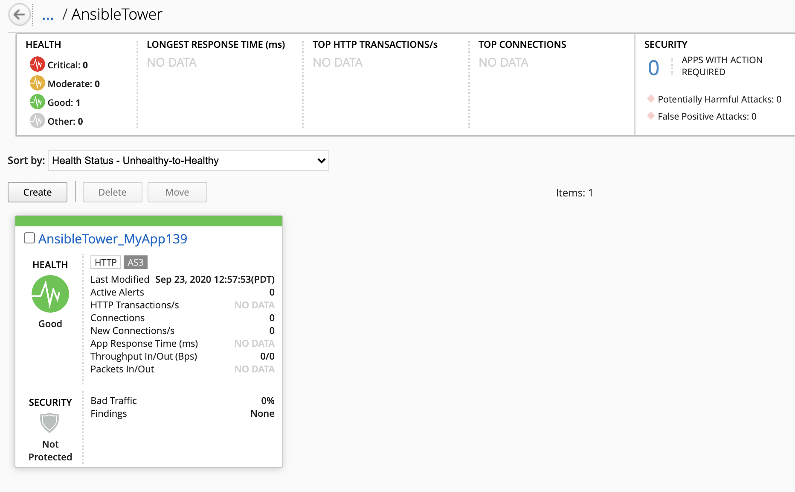

Lab 2.8: AS3 Application Creation using AWX/Ansible Tower and BIG-IQ
--------------------------------------------------------------------

Click on the *AWX (Ansible Tower)* button on the system *Ubuntu Lamp Server* in UDF.
Use ``admin/purple123`` to authenticate.

.. image:: ../pictures/module2/lab-8-1.png
  :scale: 70%
  :align: center

1. Navigate to the **Projects** page and click on the refesh button to get the latest version of the templates.

2. Navigate to the **Templates** page and review ``New_AS3_App``

Make sure the **PLAYBOOK** ``lab/f5-ansible-bigiq-as3-demo-7.0.0/tower/app_create.yml`` is selected.

.. image:: ../pictures/module2/lab-8-4.png
  :scale: 70%
  :align: center

You can go on the `GitHub repository`_ and check review the playbooks and Jinja2 templates.

.. _GitHub repository: https://github.com/f5devcentral/f5-big-iq-lab/tree/develop/lab/f5-ansible-bigiq-as3-demo-7.0.0/tower

3. Back on the **Templates** page, next to the *New_AS3_App* template, click on the *Start a job using this template*.

4. **CREDENTIAL**: Select ``BIG-IQ Creds`` as **Credential Type**. Then select ``paula-iq``.

5. **SURVEY**: Enter below information regarding your application service definition.

+------------+-------------------------------+
| APP NAME   | MyAppDeployedWithAnsibleTower |
+------------+-------------------------------+
| APP TYPE   | http_app or waf_app           |
+------------+-------------------------------+
| SERVICE IP | 10.1.10.124                   |
+------------+-------------------------------+
| NODES      | 10.1.20.120 and 10.1.20.121   |
+------------+-------------------------------+

6. **PREVIEW**: Review the summary of the template deployment, then click on **LAUNCH**.

7. Follow the JOB deployment of the Ansible playbook.

.. note:: The *FAILED - RETRYING* messages are expected as the playbook runs into a LOOP to check the AS3 task completion 
          and will show failed until loop isn't completed.

8. When the job is completed, check the PLAY RECAP and make sure there are no failed.

9. Logon on **BIG-IQ** as **paula**, go to Application tab and check the application is displayed and analytics are showing.

.. warning:: Starting 7.0, BIG-IQ displays AS3 application services created using the AS3 Declare API as Unknown Applications.
             You can move those application services using the GUI, the `Move/Merge API`_ or create it directly into 
             Application in BIG-IQ using the `Deploy API`_ to define the BIG-IQ Application name.

.. _Move/Merge API: https://clouddocs.f5.com/products/big-iq/mgmt-api/latest/ApiReferences/bigiq_public_api_ref/r_public_api_references.html
.. _Deploy API: https://clouddocs.f5.com/products/big-iq/mgmt-api/latest/ApiReferences/bigiq_public_api_ref/r_public_api_references.html

Select ``Unknown Applications`` Application, select ``MyAppDeployedWithAnsibleTower_M...`` Application Service and look HTTP traffic analytics.

10. Repeat the same steps to delete the application services using the ``Delete_AS3_App`` template.