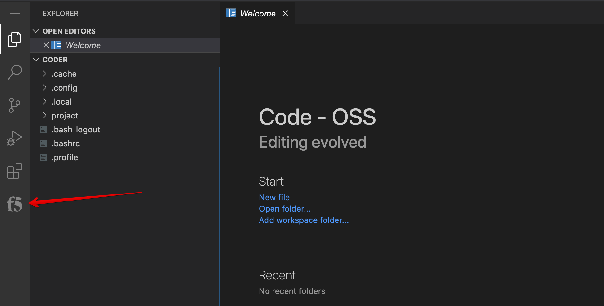
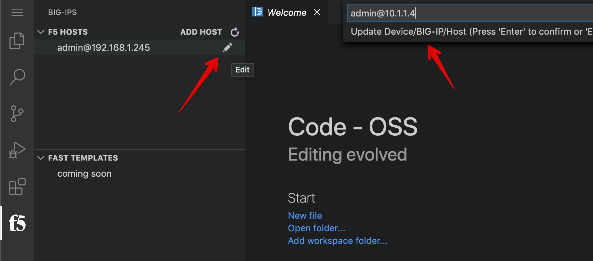
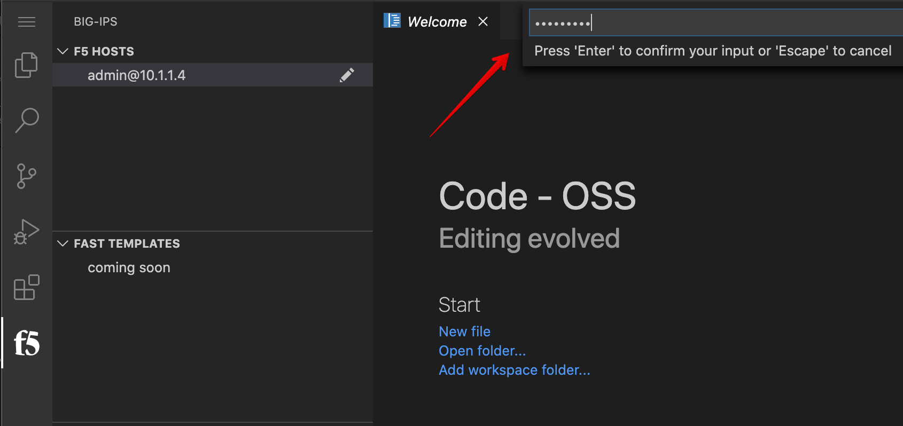
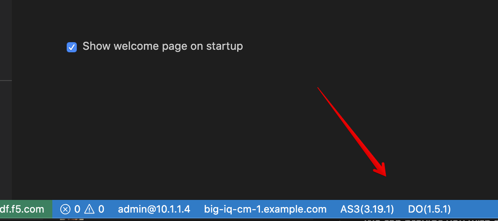
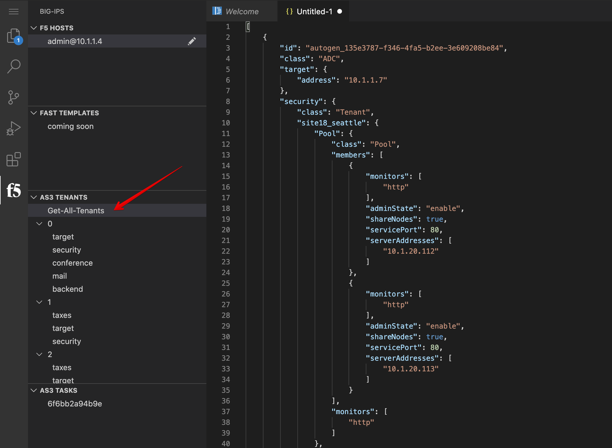
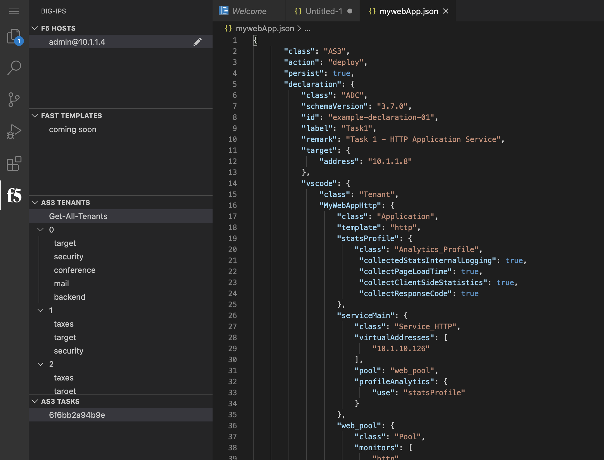
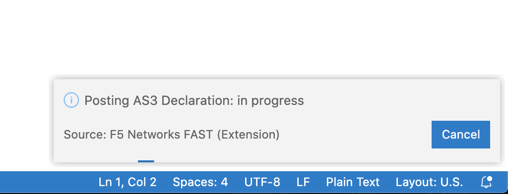
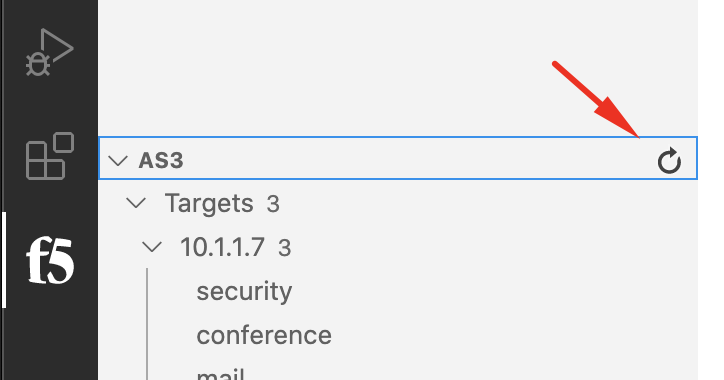
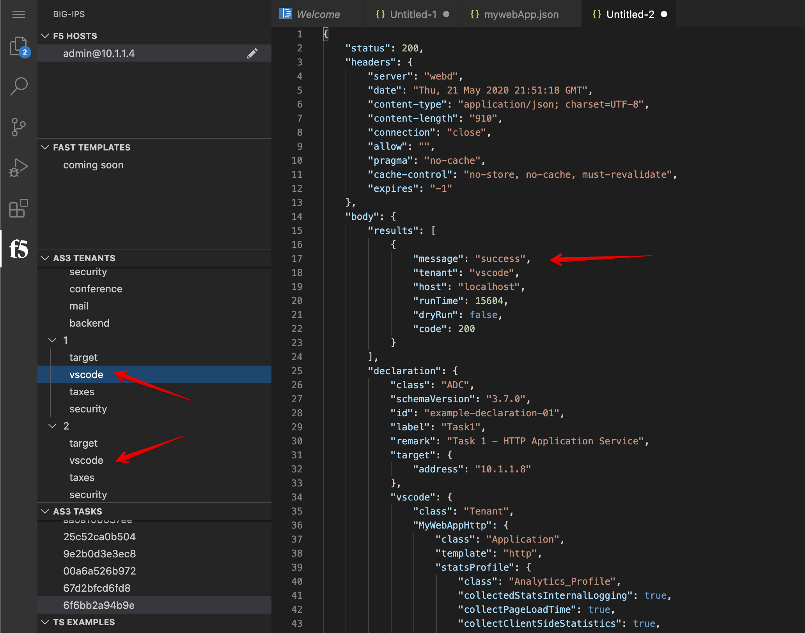
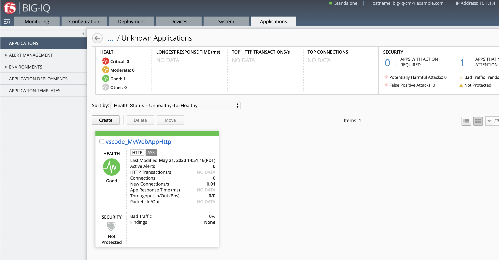

Lab 2.9: AS3 Application Service deployment from Visual Studio Code using BIG-IQ
--------------------------------------------------------------------------------

.. note:: Estimated time to complete: **10 minutes**

In this lab, we are going to use the `F5 Networks FAST extension`_ in Visual Studio code and
use it to deploy an AS3 Application Service on a BIG-IP through BIG-IQ.

.. _F5 Networks FAST extension: https://marketplace.visualstudio.com/items?itemName=DumpySquare.vscode-f5-fast

.. include:: /accesslab.rst

Tasks
^^^^^

1. Click on the *Visual Studio Code* button on the system *Ubuntu Lamp Server* in the lab environment.
Use ``purple123`` to authenticate.

2. Click on the **F5** logo on the left menu in the Visual Code Studio window.

3. Edit the host and set BIG-IQ IP address: ``10.1.1.4``. Press enter.

4. Click on the host and enter the admin's password ``purple123``.

5. Once connected to the BIG-IQ, you can see the DO and AS3 version at the bottom of the window.

6. Under AS3, expand **Targets**. 
   This will show you all the devices and the AS3 Application Services in each tenant (partition on BIG-IP).

7. Let's now deploy a new AS3 Spplication Service. Open a new tab and copy/past below AS3 declaration:

.. code-block:: yaml
   :linenos:

   {
       "class": "AS3",
       "action": "deploy",
       "persist": true,
       "declaration": {
           "class": "ADC",
           "schemaVersion": "3.7.0",
           "id": "example-declaration-01",
           "label": "Task1",
           "remark": "Task 1 - HTTP Application Service",
           "target": {
               "address": "10.1.1.8"
           },
           "vscode": {
               "class": "Tenant",
               "MyWebAppHttp": {
                   "class": "Application",
                   "template": "http",
                   "statsProfile": {
                       "class": "Analytics_Profile",
                        "collectedStatsInternalLogging": true,
                        "collectPageLoadTime": true,
                        "collectClientSideStatistics": true,
                        "collectResponseCode": true
                   },
                   "serviceMain": {
                       "class": "Service_HTTP",
                       "virtualAddresses": [
                           "10.1.10.126"
                       ],
                       "pool": "web_pool",
                       "profileAnalytics": {
                           "use": "statsProfile"
                       }
                   },
                   "web_pool": {
                       "class": "Pool",
                       "monitors": [
                           "http"
                       ],
                       "members": [
                           {
                               "servicePort": 80,
                               "serverAddresses": [
                                   "10.1.20.110",
                                   "10.1.20.111"
                               ],
                               "shareNodes": true
                           }
                       ]
                   }
               }
           }
       }
   }

  
8. Then, press F1 or cntrl+shift+p to open the extension command line. Type ``F5-AS3`` and select ``F5-AS3: Post Declaration``.

You should see a progress window showing in the bottom right.

9. Wait few seconds, and refresh the AS3 Tenants Tree 

9. The task restult opens in a new tab when the AS3 Application Service creation is completed.
   The tenant used ``vscode`` is also now showing in the AS3 Tenants Tree.

10. Now, login on BIG-IQ as **david**, go to Applications tab and check the application is displayed and analytics are showing.

.. warning:: Starting 7.0, BIG-IQ displays AS3 application services created using the AS3 Declare API as Unknown Applications.
             You can move those application services using the GUI, the `Move/Merge API`_, `bigiq_move_app_dashboard`_ F5 Ansible Galaxy role 
             or create it directly into Application in BIG-IQ using the `Deploy API`_ to define the BIG-IQ Application name.

.. _Move/Merge API: https://clouddocs.f5.com/products/big-iq/mgmt-api/latest/ApiReferences/bigiq_public_api_ref/r_as3_move_merge.html
.. _Deploy API: https://clouddocs.f5.com/products/big-iq/mgmt-api/latest/ApiReferences/bigiq_public_api_ref/r_as3_deploy.html
.. _bigiq_move_app_dashboard: https://galaxy.ansible.com/f5devcentral/bigiq_move_app_dashboard

