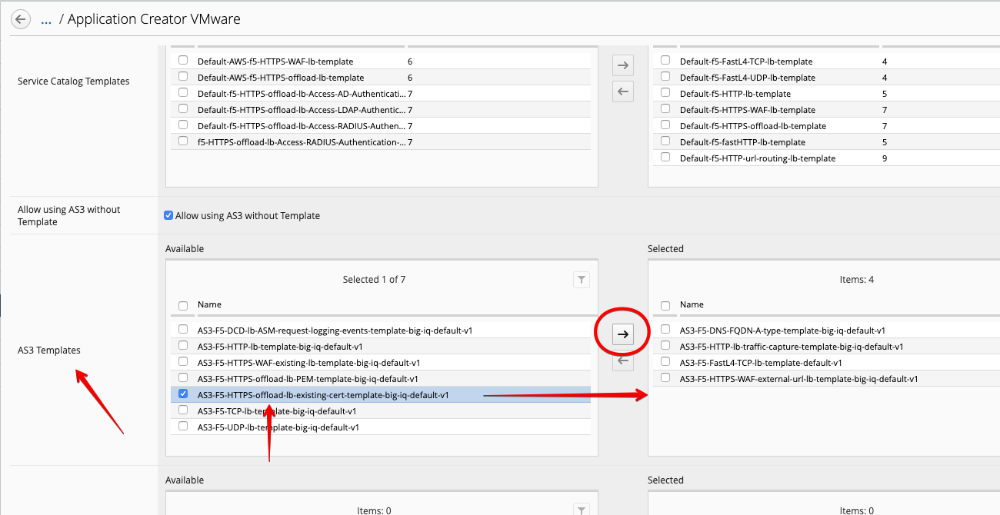
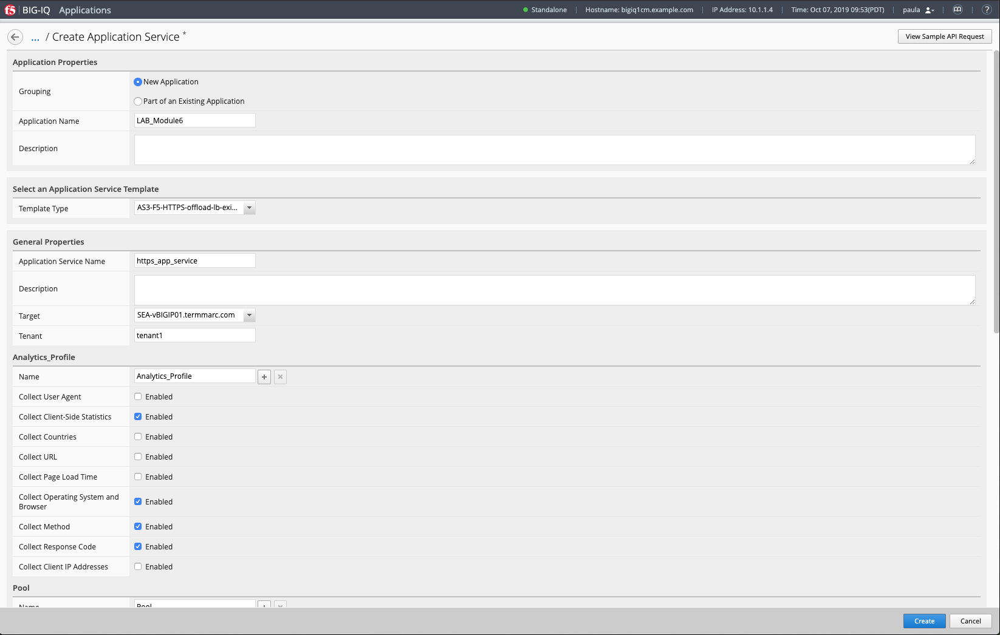
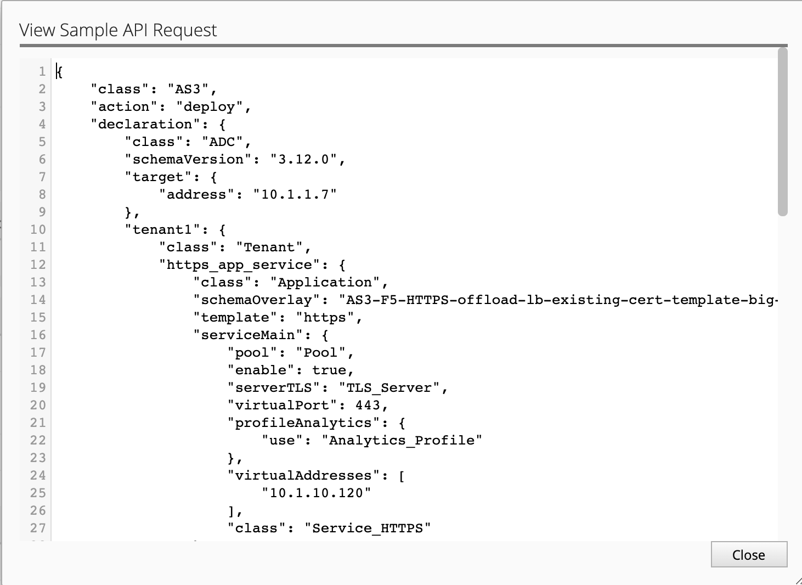
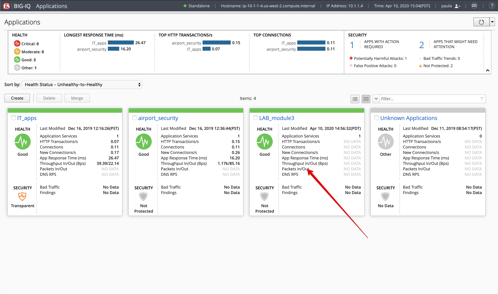
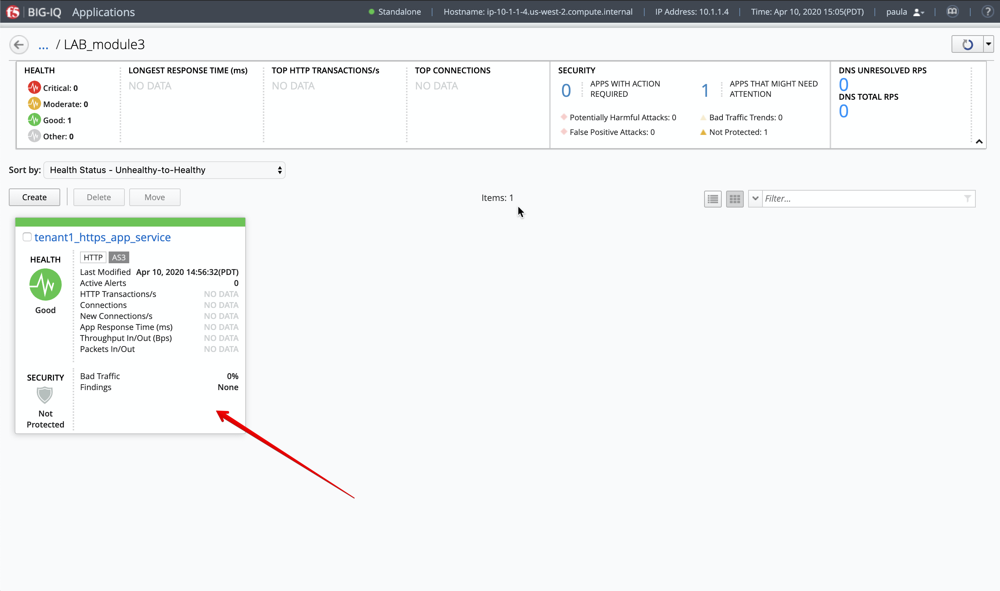
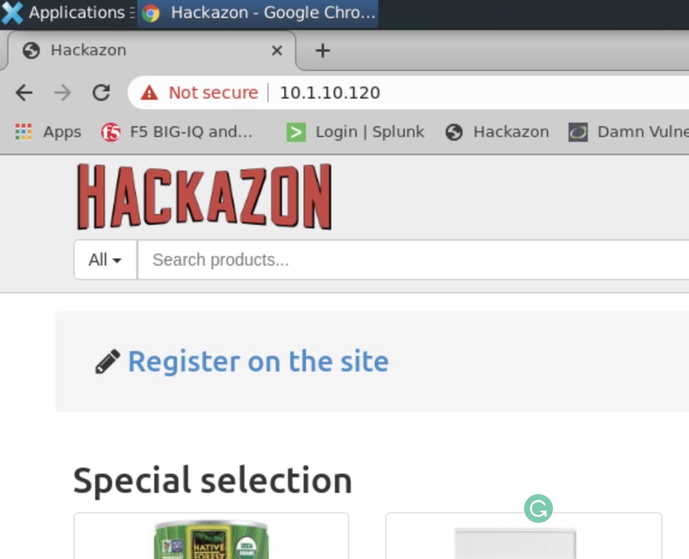

Lab 3.2: Application Service creation using AS3 through BIG-IQ GUI
------------------------------------------------------------------

HTTPS Service using AS3 through GUI
^^^^^^^^^^^^^^^^^^^^^^^^^^^^^^^^^^^

1. Log in as **paula** in BIG-IQ.

2. Select **Create Application** to **Create an Application Service**

+---------------------------------------------------------------------------------------------------+
| Application properties:                                                                           |
+---------------------------------------------------------------------------------------------------+
| * Grouping = New Application                                                                      |
| * Application Name = ``LAB_module3``                                                              |
| * Description = ``My first AS3 template deployment through a GUI``                                |
+---------------------------------------------------------------------------------------------------+
| Select an Application Service Template:                                                           |
+---------------------------------------------------------------------------------------------------+
| * Template Type = Select ``AS3-F5-HTTPS-offload-lb-existing-cert-template-big-iq-default [AS3]``  |
+---------------------------------------------------------------------------------------------------+

.. warning:: If we want **paula** to deploy this template, we first need to have those templates assigned to her via an administrator. 

3. Logout as **paula** and login to BIG-IQ as **david**. (if asked: Leave site? Select: Leave)

4. Select **Applications > Application Templates** and notice the ‘Published’ templates.
   The template **paula** wants to use is listed as a ‘Published’ template.

.. image:: ../pictures/module3/lab-2-1.png
  :scale: 60%
  :align: center

5. Go to **System > Role Management > Roles** and select **Application Roles** under the **CUSTOM ROLES** section.
   Here you will see the collection of the Custom Application Roles. 

.. image:: ../pictures/module3/lab-2-2.png
  :scale: 60%
  :align: center

6. **paula** is assigned to the exiting ``Application Creator VMware`` custom role. Select it and scroll down to AS3 Templates.
   As you can see, **paula** does not have permission to deploy an AS3 application using ``AS3-F5-HTTPS-offload-lb-existing-cert-template``.

7. Select ``AS3-F5-HTTPS-offload-lb-existing-cert-template-big-iq-default-<version>`` AS3 Template and 
   click the arrow to get it in the **'Selected'** section. Then, select **Save & Close**.

.. warning:: Manually select and remove the ``undefined [API only]`` entries from the Selected column if needed.

8. Logout as **david** and log back in as **paula** and click **Create** application.

9. Select Create Application to Create an Application Service:

+----------------------------------------------------------------------------------------------------+
| Application properties:                                                                            |
+----------------------------------------------------------------------------------------------------+
| * Grouping = New Application                                                                       |
| * Application Name = ``LAB_module3``                                                               |
| * Description = ``My first AS3 template deployment through a GUI``                                 |
+----------------------------------------------------------------------------------------------------+
| Select an Application Service Template:                                                            |
+----------------------------------------------------------------------------------------------------+
| * Template Type = Select ``AS3-F5-HTTPS-offload-lb-existing-cert-template-big-iq-default [AS3]``   |
+----------------------------------------------------------------------------------------------------+
| General Properties:                                                                                |
+----------------------------------------------------------------------------------------------------+
| * Application Service Name = ``https_app_service``                                                 |
| * Target = ``SEA-vBIGIP01.termmarc.com``                                                           |
| * Tenant = ``tenant1``                                                                             |
+----------------------------------------------------------------------------------------------------+
| Analytics_Profile. Keep default                                                                    |
+----------------------------------------------------------------------------------------------------+
| Pool                                                                                               |
+----------------------------------------------------------------------------------------------------+
| * Members: ``10.1.20.120``, port ``80``                                                            |
| * Members: ``10.1.20.121``, port ``80``                                                            |
+----------------------------------------------------------------------------------------------------+
| Service_HTTPS                                                                                      |
+----------------------------------------------------------------------------------------------------+
| * Virtual addresses: ``10.1.10.120``                                                               |
+----------------------------------------------------------------------------------------------------+
| Certificate. Keep default                                                                          |
+----------------------------------------------------------------------------------------------------+
| TLS_Server. Keep default                                                                           |
+----------------------------------------------------------------------------------------------------+

10. Go to View Sample API Request in the right upper corner and select it. You will have a full AS3 declaration schema, 
    scroll through it and hit close when done.
	

	
11. Click **Create**.
  
12. Check the Application ``LAB_module3`` has been created.

.. note:: If not visible, refesh the page.

13.	Select ``LAB_module3`` Application. You will notice ``LAB_module3`` acts as a group of Application Services where underneath 
multiple services can be grouped. The next window will show you that a new Application Service has been created named: ``tenant1_https_app_service``.

14.	Now, let's look on the BIG-IP and verify the Application is correctly deployed in partition ``tenant1``.
Logon to ``SEA-vBIGIP01.termmarc.com`` BIG-IP from lab environment. Select the partition ``tenant1`` and look at the objects created on the BIG-IP.

.. image:: ../pictures/module3/lab-2-8.png
  :scale: 60%
  :align: center

15.	You can testing the application sercice by open a browser in the Ubuntu Jumphost and type the Virtual Server IP address ``10.1.10.120``.
    
16. Back on the BIG-IQ as **paula**, select ``tenant1_https_app_service`` Application Service and look HTTP traffic analytics.

  
.. note:: An HTTP traffic generator is running on the Jumphost.
