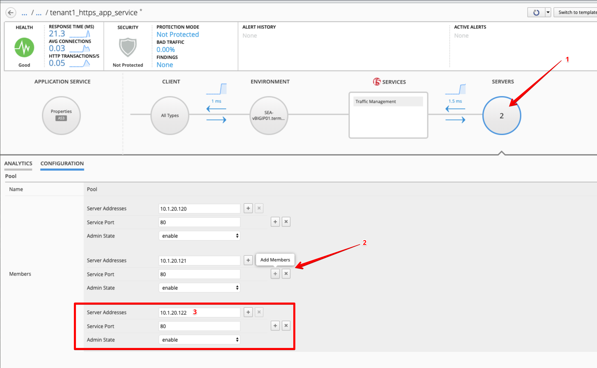
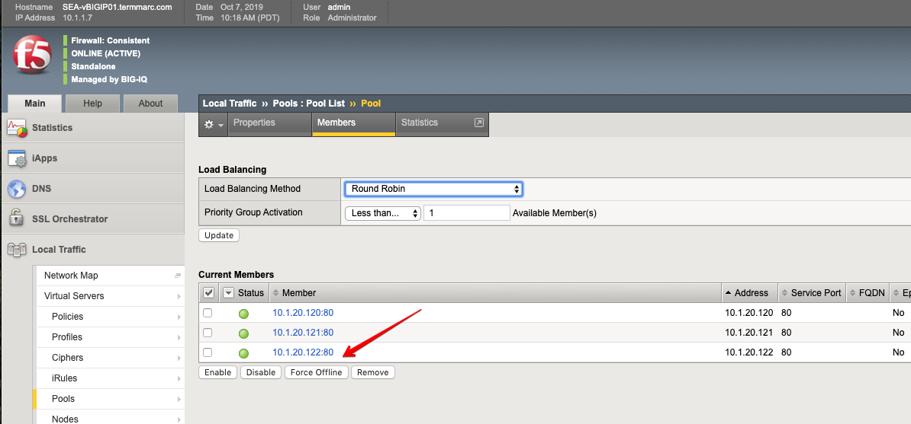

Lab 3.3: Application modification
---------------------------------

Through the GUI and when allowed, the application owner is able to make small modifications.

1. In ``tenant1_https_app_service``, select Servers and Configuration and add a Pool Member.

* Click the + next to Server Addresses and add: ``10.1.20.122``.

* Click **Save & Close**.

2. Check ``SEA-vBIGIP01.termmarc.com`` (partition ``tenant1``) Local Traffic > Pools and find **Pool**.
   It will have tenant1/https_app_service as the partition/path (or use search). Select Pool and go to members.

3. Now back to the BIG-IQ and ``tenant1_https_app_service`` application and select **Application Service > Configuration** and
   scroll down in the AS3 declaration and find that the schema has added the second pool member.

.. image:: ../pictures/module3/lab-3-3.png
  :align: center
  :scale: 70

Through the API you can’t modify the application service once deployed. With AS3 via the GUI you can.
Remember, that through the API you would do a redeploy to add additional services.
From the flipside, the GUI only allows you to modify what has been permitted (made 'editable') when the template was created.
