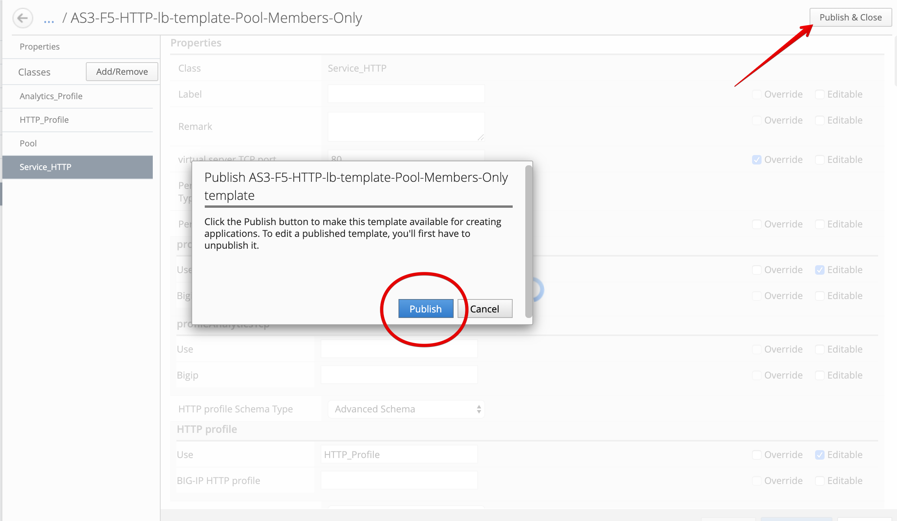
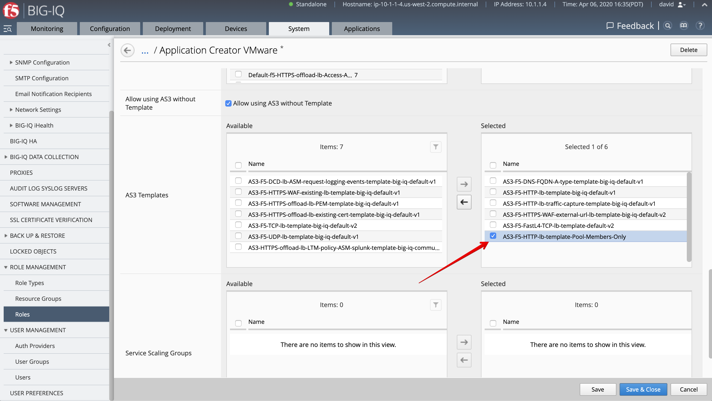
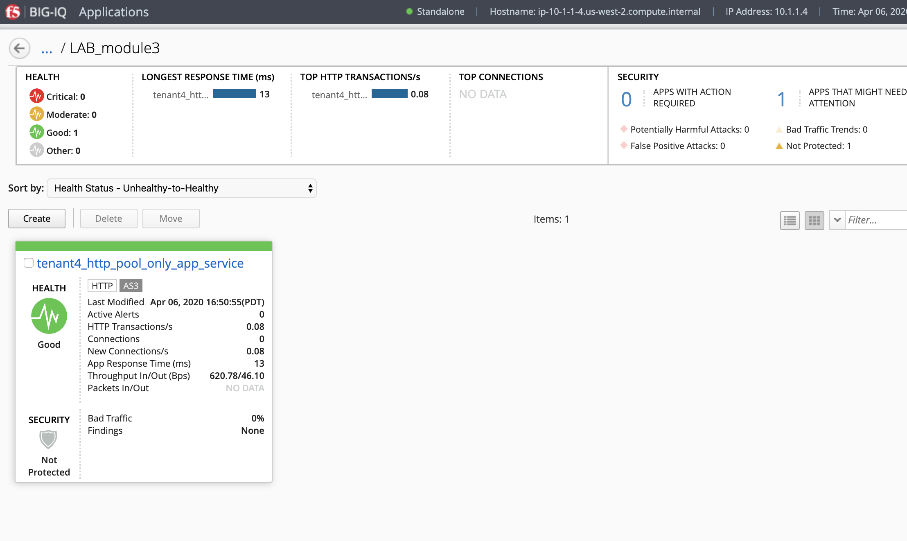
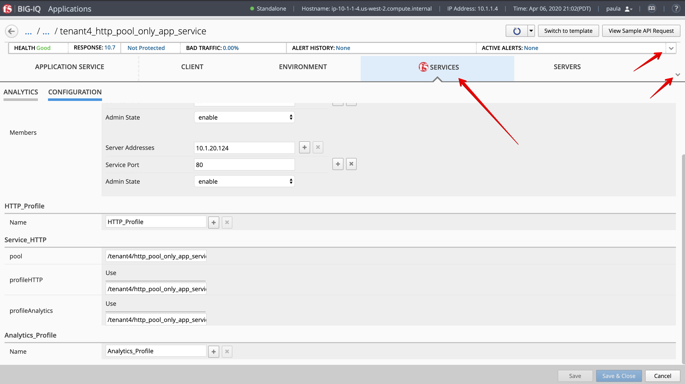
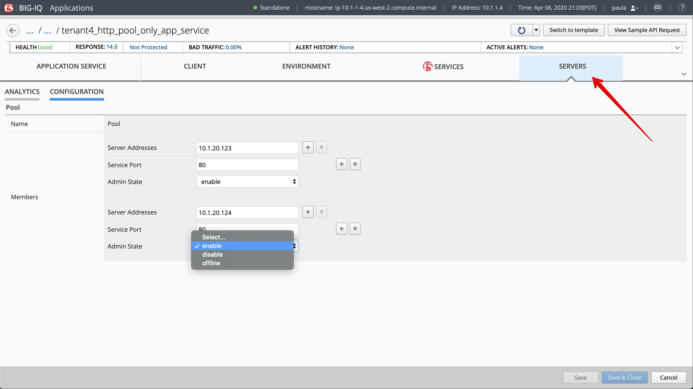

Lab 3.4: Limit Pool Member access only with AS3 Template through BIG-IQ GUI
---------------------------------------------------------------------------

.. include:: /accesslab.rst

Workflow
^^^^^^^^

1. **David** creates the AS3 template and allow only Pool Members server IP and Port.
2. **David** assigns the AS3 template to Paula.
3. **Paula** creates her application service using the template given by **david**.

AS3 template creation (David)
^^^^^^^^^^^^^^^^^^^^^^^^^^^^^

1. Login as **david** and Go to the Applications tab > Applications Templates and 
   select ``AS3-F5-HTTP-lb-template-big-iq-default-<version>`` and press **Clone**.

2. Give the cloned template a name: ``AS3-F5-HTTP-lb-template-Pool-Members-Only`` and click Clone.

.. image:: ../pictures/module3/lab-4-1.png
  :scale: 40%
  :align: center

3. First, set a tenant name and select option Override. In this example, we set ``tenant4``.
   Note the tenant will be the partition used on BIG-IP to deploy the application service using this template.

.. image:: ../pictures/module3/lab-4-2.png
  :scale: 40%
  :align: center

4. Then, click on the ``HTTP_Profile`` class, change the 2 properties for the Fallback Redirect and status codes to Override.
   Click on Save.

.. image:: ../pictures/module3/lab-4-3.png
  :scale: 40%
  :align: center

5. Change to the ``Service_HTTP`` class, and change the virtual server TCP port property to Override.

.. warning:: Do not change from Editable to Override for any Pointers (starting with **Use**) such as Analytics_Profile, HTTP_Profile and Pool pointers.
             Those needs to always set to Editable.

.. image:: ../pictures/module3/lab-4-4.png
  :scale: 40%
  :align: center

Set the Virtual Address property to ``10.1.10.122`` and change to Override. Click on Save.

.. image:: ../pictures/module3/lab-4-5.png
  :scale: 40%
  :align: center

6. Select the Analytics_Profile class and make sure none of the properties are set to Editable.

7. Review the Pool Class but do not change anything. Notice the Server addresses, Service port and Admin State
   are set to Editable.

8. At the top right of the AS3 template editor, click on Publish & Close to save and publish the template.

9. Before **paula** can use this AS3 template, **david** needs to update her role.
   Use the previous steps in `Lab 3.2`_ to add AS3 Template ``AS3-F5-HTTP-lb-template-Pool-Members-Only`` to ``Application Creator VMware`` custom role
   assigned to **paula**.

.. _Lab 3.2: ./lab2.html

AS3 application service deployment (Paula)
^^^^^^^^^^^^^^^^^^^^^^^^^^^^^^^^^^^^^^^^^^

1. Login as **paula** and select previously created ``LAB_module3`` Application and click **Create**.
  
2. Click **Create** to create an Application Service:

+---------------------------------------------------------------------------------------------------+
| Application properties:                                                                           |
+---------------------------------------------------------------------------------------------------+
| * Grouping = Part of an Existing Application                                                      |
| * Application Name = ``LAB_module3``                                                              |
+---------------------------------------------------------------------------------------------------+
| Select an Application Service Template:                                                           |
+---------------------------------------------------------------------------------------------------+
| * Template Type = Select ``AS3-F5-HTTP-lb-template-Pool-Members-Only [AS3]``                      |
+---------------------------------------------------------------------------------------------------+
| General Properties:                                                                               |
+---------------------------------------------------------------------------------------------------+
| * Application Service Name = ``http_pool_only_app_service``                                       |
| * Target = ``SEA-vBIGIP01.termmarc.com``                                                          |
+---------------------------------------------------------------------------------------------------+
| Pool                                                                                              |
+---------------------------------------------------------------------------------------------------+
| * Members: ``10.1.20.123``, port ``80``                                                           |
| * Members: ``10.1.20.124``, port ``80``                                                           |
+---------------------------------------------------------------------------------------------------+
| HTTP_Profile. Keep default.                                                                       |
+---------------------------------------------------------------------------------------------------+
| Service_HTTP. Keep default.                                                                       |
+---------------------------------------------------------------------------------------------------+
| Analytics_Profile. Keep default.                                                                  |
+---------------------------------------------------------------------------------------------------+

3. Click **Create**.

4. Check the application service ``http_pool_only_app_service`` has been created under Application ``LAB_module3``.

5. Collapse the top and middle banner. Select F5 Services and Configuration and confirm Paula can only update the Pool Members.

6. Under Servers, Paula can update her Pool Members Server Addresses, Service Port and Admin state as needed.

