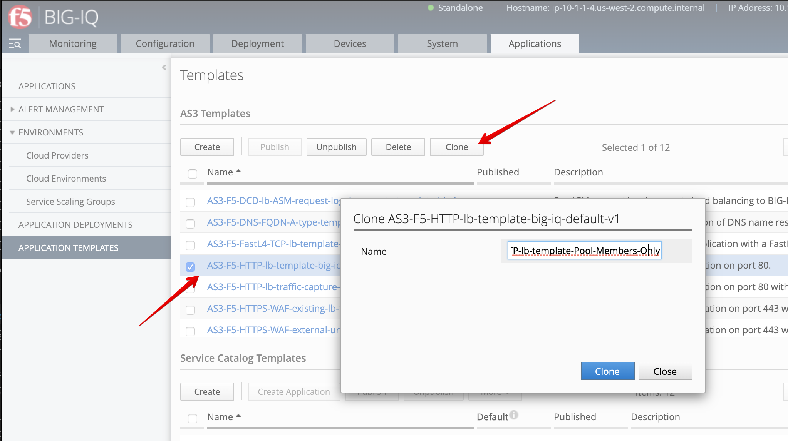
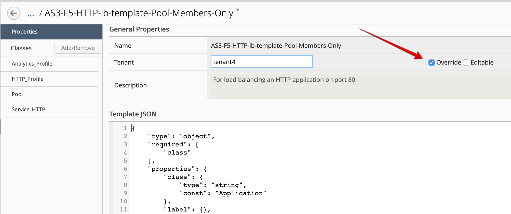
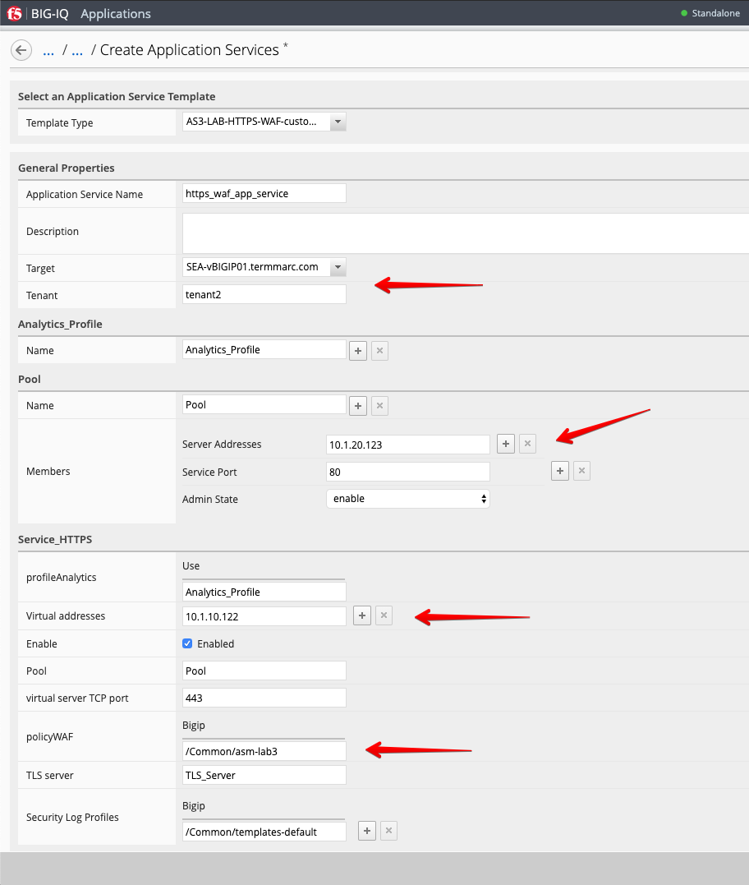
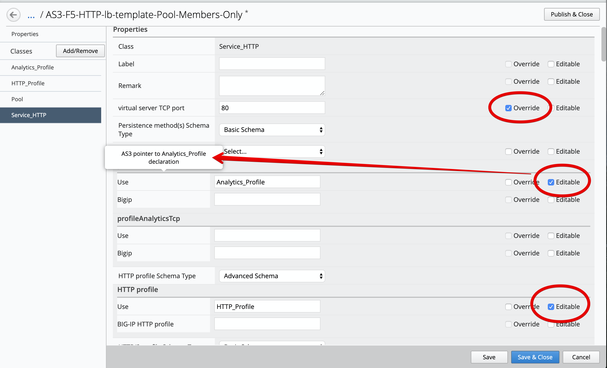

Lab 3.4: Create Custom AS3 template and deploy
----------------------------------------------
Until now we used a default AS3 template out-of-the-box (available on https://github.com/f5devcentral/f5-big-iq) 
for deploying an application service. It is a good practice to clone the default AS3 templates and use them more 
tailored to your custom needs.

1. Logon as David and go to the Application > Application Templates and 
   select ``AS3-F5-HTTPS-WAF-existing-lb-template-big-iq-default-<version>`` and press **Clone**.

2. Give the Cloned template a name: ``AS3-LAB-HTTPS-WAF-custom-template`` and click Clone.

3. Open the template ``AS3-LAB-HTTPS-WAF-custom-template`` and select the ``Analytics_Profile`` AS3 class.
   Change to Override the Properties ``Collect Client-Side Statistics``, as well as ``Collect URL`` and ``Collect User Agent``.

.. note:: ``Response Code``, ``User Method`` and ``Operating System and Brower`` are already enabled by default in the AS3 schema.
    
5. Click **Save & Close**.

6. Select ``AS3-LAB-HTTPS-WAF-custom-template`` and click **Publish**.

7. Before **Paula** can use this AS3 template, David needs to update her role.
   Use the previous steps in lab 6.2 to add AS3 Template ``AS3-LAB-HTTPS-WAF-custom-template`` to ``Application Creator VMware`` custom role
   assigned to **Paula**.

8.	Login as Paula and select previously created ``LAB_module3`` Application and click **Create**.
  
9. Select Create Application to Create an Application Service:

+---------------------------------------------------------------------------------------------------+
| Application properties:                                                                           |
+---------------------------------------------------------------------------------------------------+
| * Grouping = Part of an Existing Application                                                      |
| * Application Name = ``LAB_module3``                                                              |
| * Description = ``My second AS3 template deployment through a GUI``                               |
+---------------------------------------------------------------------------------------------------+
| Select an Application Service Template:                                                           |
+---------------------------------------------------------------------------------------------------+
| * Template Type = Select ``AS3-LAB-HTTPS-WAF-custom-template [AS3]``                              |
+---------------------------------------------------------------------------------------------------+
| General Properties:                                                                               |
+---------------------------------------------------------------------------------------------------+
| * Application Service Name = ``https_waf_app_service``                                            |
| * Target = ``SEA-vBIGIP01.termmarc.com``                                                          |
| * Tenant = ``tenant2``                                                                            |
+---------------------------------------------------------------------------------------------------+
| Analytics_Profile. Keep default                                                                   |
+---------------------------------------------------------------------------------------------------+
| Pool                                                                                              |
+---------------------------------------------------------------------------------------------------+
| * Members: ``10.1.20.123``                                                                        |
+---------------------------------------------------------------------------------------------------+
| Service_HTTPS                                                                                     |
+---------------------------------------------------------------------------------------------------+
| * Virtual addresses: ``10.1.10.122``                                                              |
| * policyWAF: ``/Common/asm-lab3``                                                                 |
+---------------------------------------------------------------------------------------------------+
| Certificate. Keep default                                                                         |
+---------------------------------------------------------------------------------------------------+
| TLS_Server. Keep default                                                                          |
+---------------------------------------------------------------------------------------------------+

11. Click **Create**.

12. Check the Application Service ``https_waf_app_service`` has been created under Application ``LAB_module3``.

13.	Now, let's look on the BIG-IP  and verify the Application is correctly deployed in partition ``tenant2``.
    Logon to ``SEA-vBIGIP01.termmarc.com`` BIG-IP from UDF. Select the partition ``tenant2`` and look at the objects created on the BIG-IP.

 .. image:: ../pictures/module3/lab-4-5.png
  :align: center
  
 * Notice that new ``https_waf_app_service`` comes with a redirect.
 * Select the HTTPS VS, Select Security and hit Policies. Application Security Policy is Enabled and the Log Profile has a Security_Log_Profile selected.
 * Go to Security > Application Security > Security Policies and select WAF_Policy to get more detail of the deployed application security policy. 
 * The enforced WAF policy is taken from a Github repository which contains F5 WAF ready templates: https://github.com/f5devcentral/f5-asm-policy-templates, 
   please use the URL to get yourself known to other available WAF ready templates.

.. image:: ../pictures/module3/lab-4-5.png
  :align: center

13.	Back to the BIG-IQ and logged in as **Paula**, select ``tenant2_https_waf_app_service``. What is the enforced Protection Mode?
