Lab 3.6: Deploy a WAF with BIG-IQ and AS3 using an ASM policy on BIG-IP
-----------------------------------------------------------------------

.. note:: Estimated time to complete: **25 minutes**

.. include:: /accesslab.rst

Workflow
^^^^^^^^

1. **Larry** creates the ASM policy in transparent mode on the BIG-IQ and deploy on the BIG-IP(s).
2. **David** creates the AS3 template and reference ASM policy created by **Larry** in the template.
3. **David** assigns the AS3 template to Paula.
4. **Paula** creates her application service using the template given by **david**.
5. After **Paula** does the necessary testing of her application, she reaches to Larry.
6. **Larry** reviews the ASM learning and deploy the ASM policy changes on the BIG-IP(s) and set the policy to blocking mode.
7. They all go for happy hour.

Prerequisites
^^^^^^^^^^^^^

1. First make sure your device has ASM module discovered and imported 
for **SEA-vBIGIP01.termmarc.com** under Devices > BIG-IP DEVICES.

2. Check if the **Web Application Security** service is Active 
under System > BIOG-IQ DATA COLLECTION > BIG-IQ Data Collection Devices.

ASM Policy creation (Larry)
^^^^^^^^^^^^^^^^^^^^^^^^^^^

Let's first deploy the default Advance WAF policy and Security Logging Profile available in **BIG-IQ** to **SEA-vBIGIP01.termmarc.com**.

1. Login to BIG-IQ as **larry** by opening a browser and go to: ``https://10.1.1.4``

2. Go to Configuration > Security > Web Application Security > Policies and clone the policy called ``templates-default``
and name it as ``templates-default-cloned``.

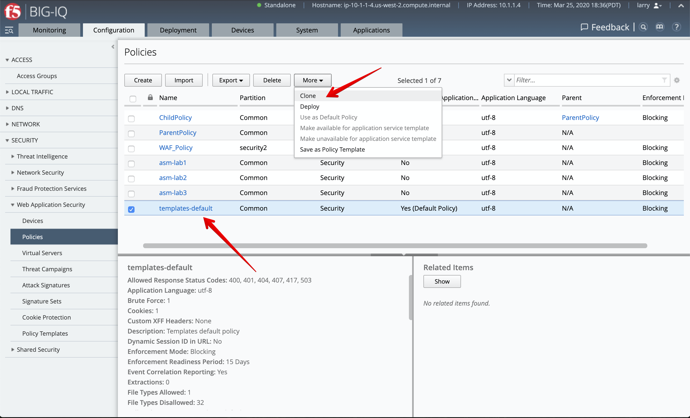

.. image:: ../pictures/module3/lab-5-1b.png
  :scale: 40%
  :align: center

3. Select ``templates-default-cloned`` and change **Enforcement Mode** to ``transparent`` under POLICY BUILDING > Settings, then click on **Save & Close**.
  
.. image:: ../pictures/module3/lab-5-1c.png
  :scale: 40%
  :align: center

4. Under Virtual Servers, click on the ``inactive`` virtual server attached to **SEA-vBIGIP01.termmarc.com**.

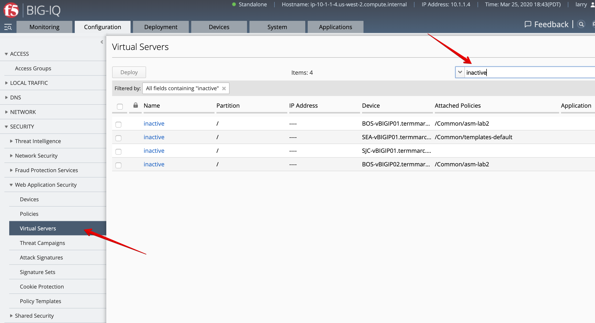

5. Select the ``/Common/templates-default-cloned``, then click on **Save & Close**.

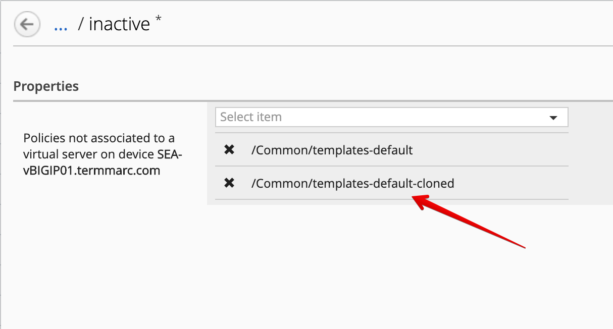

6. Notice the policy is now attached to the ``inactive`` virtual servers.

Select the ``inactive`` virtual servers attached to **SEA-vBIGIP01.termmarc.com**, click on Deploy.

.. image:: ../pictures/module3/lab-5-4.png
  :scale: 40%
  :align: center

7. The deployment window opens. Type a name, select ``Deploy immediately`` for the Method.

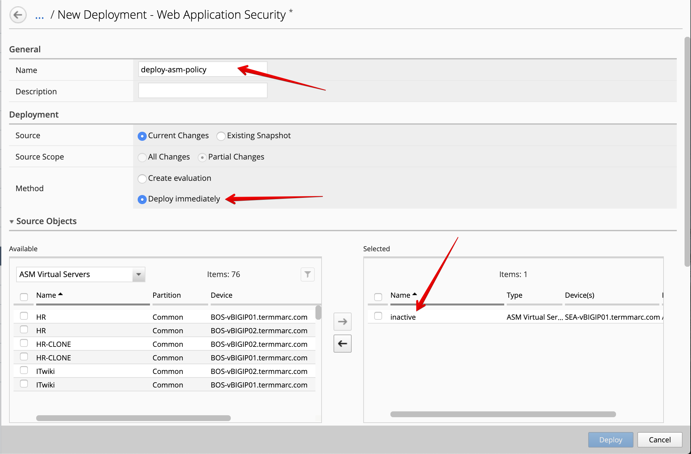

Under the Target Device(s) section, click on ``Find Relevant Devices``
and select the **SEA-vBIGIP01.termmarc.com**. Then, click on Deploy.

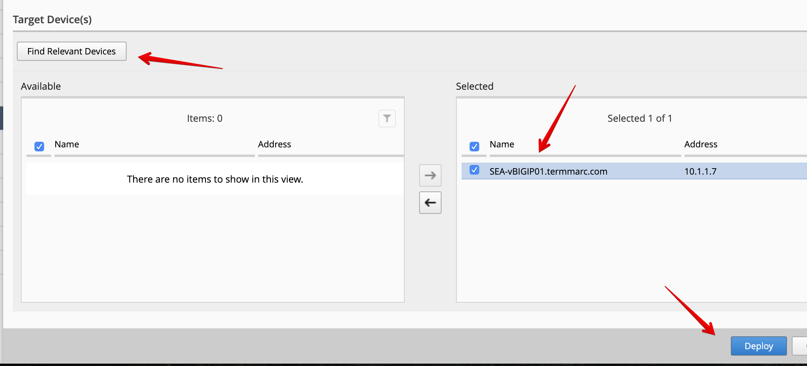

8. Confirm the deployment information, click on Deploy.

.. image:: ../pictures/module3/lab-5-7.png
  :scale: 40%
  :align: center

9. Wait for the deployment to complete.

.. image:: ../pictures/module3/lab-5-8.png
  :scale: 40%
  :align: center

Once the deployment is completed, you confirm the changes by clicking on *view**.

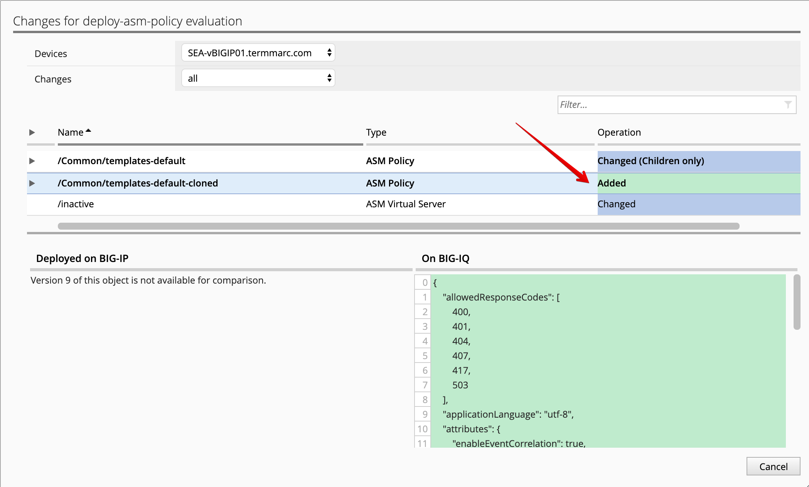

10. Deploy the default BIG-IQ Security Logging Profile so the ASM events are being sent correctly to BIG-IQ DCD.

.. note:: This step is only for your information as it's already perform in this lab.

Under configuration tab, SECURITY, Shared Security, Logging Profiles. ``templates-default`` 
is the default Security Logging Profile available on BIG-IQ.

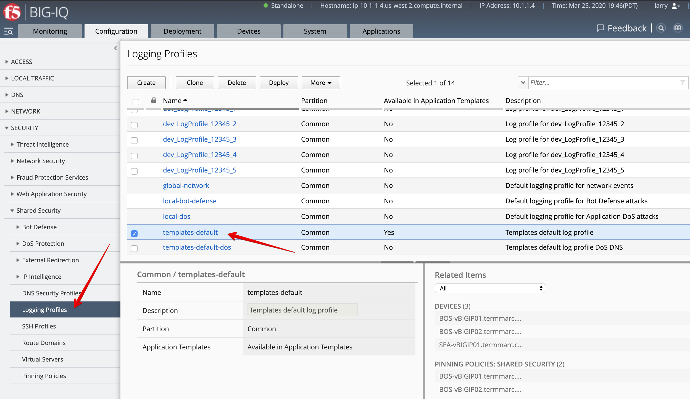

11. Under Pinning Policies, click on the **SEA-vBIGIP01.termmarc.com** device.

Confirm the logging profile has been added under Logging Profiles.

.. image:: ../pictures/module3/lab-5-11.png
  :scale: 40%
  :align: center

.. note:: More information `Managing Logging Profiles in Shared Security`_.

.. _Managing Logging Profiles in Shared Security: https://techdocs.f5.com/en-us/bigiq-7-1-0/big-iq-security/managing-logging-profiles-in-shared-security.html

AS3 WAF template creation (David)
^^^^^^^^^^^^^^^^^^^^^^^^^^^^^^^^^

Until now we used a default AS3 template out-of-the-box (available on https://github.com/f5devcentral/f5-big-iq) 
for deploying an application service. It is a good practice to clone the default AS3 templates and use them more 
tailored to your custom needs.

1. Login as **david** and Go to the Applications tab > Applications Templates and 
   select ``AS3-F5-HTTPS-WAF-existing-lb-template-big-iq-default-<version>`` and press **Clone**.

2. Give the cloned template a name: ``AS3-LAB-HTTPS-WAF-custom-template`` and click Clone.

.. image:: ../pictures/module3/lab-5-12.png
  :scale: 40%
  :align: center

3. Open the template ``AS3-LAB-HTTPS-WAF-custom-template`` and select the ``Analytics_Profile`` AS3 class.
   Change to Override the Property ``Collect Client-Side Statistics``, 
   as well as ``Collect URL`` and ``Collect User Agent``.

.. image:: ../pictures/module3/lab-5-13a.png
  :scale: 40%
  :align: center

.. note:: ``Response Code``, ``User Method`` and ``Operating System and Browser`` are already enabled by default in the AS3 schema.

4. Now, select the ``Service_HTTPS`` AS3 class.
   Change to the property ``bigip`` under policyWAF to ``/Common/templates-default-cloned``.
   Make sure the property is set to Editable.

.. note:: If you want to hide the ASM policy in the template, you can set the property to Override (only starting BIG-IQ 7.1, see BIG-IQ 7.0 Release note #811013).

.. image:: ../pictures/module3/lab-5-13b.png
  :scale: 40%
  :align: center

5. Click **Save & Close**.

6. Select ``AS3-LAB-HTTPS-WAF-custom-template`` and click **Publish**.

7. Before **paula** can use this AS3 template, **david** needs to update her role.
   Use the previous steps in `Lab 3.2`_ to add AS3 Template ``AS3-LAB-HTTPS-WAF-custom-template`` to ``Application Creator VMware`` custom role
   assigned to **paula**.

.. _Lab 3.2: ./lab2.html

AS3 WAF application service deployment (Paula)
^^^^^^^^^^^^^^^^^^^^^^^^^^^^^^^^^^^^^^^^^^^^^^

Now both Advance WAF policy and Security Logging Profile are available on BIG-IP and AS3 WAF template 
available on BIG-IQ, let's create the WAF application service using AS3 & BIG-IQ.

1. Login as **paula** and select previously created ``LAB_module3`` Application and click **Create**.
  
2. Click **Create** to create an Application Service:

+---------------------------------------------------------------------------------------------------+
| Application properties:                                                                           |
+---------------------------------------------------------------------------------------------------+
| * Grouping = Part of an Existing Application                                                      |
| * Application Name = ``LAB_module3``                                                              |
| * Description = ``My second AS3 template deployment through a GUI``                               |
+---------------------------------------------------------------------------------------------------+
| Select an Application Service Template:                                                           |
+---------------------------------------------------------------------------------------------------+
| * Template Type = Select ``AS3-LAB-HTTPS-WAF-custom-template [AS3]``                              |
+---------------------------------------------------------------------------------------------------+
| General Properties:                                                                               |
+---------------------------------------------------------------------------------------------------+
| * Application Service Name = ``https_waf_app_service``                                            |
| * Target = ``SEA-vBIGIP01.termmarc.com``                                                          |
| * Tenant = ``tenant2``                                                                            |
+---------------------------------------------------------------------------------------------------+
| Analytics_Profile. Keep default.                                                                  |
+---------------------------------------------------------------------------------------------------+
| Pool                                                                                              |
+---------------------------------------------------------------------------------------------------+
| * Members: ``10.1.20.123``                                                                        |
+---------------------------------------------------------------------------------------------------+
| Service_HTTPS                                                                                     |
+---------------------------------------------------------------------------------------------------+
| * Virtual addresses: ``10.1.10.122``                                                              |
| * policyWAF: ``/Common/templates-default-cloned``                                                 |
| * Security Log Profiles: ``/Common/templates-default``                                            |
+---------------------------------------------------------------------------------------------------+
| Certificate. Keep default.                                                                        |
+---------------------------------------------------------------------------------------------------+
| TLS_Server. Keep default.                                                                         |
+---------------------------------------------------------------------------------------------------+

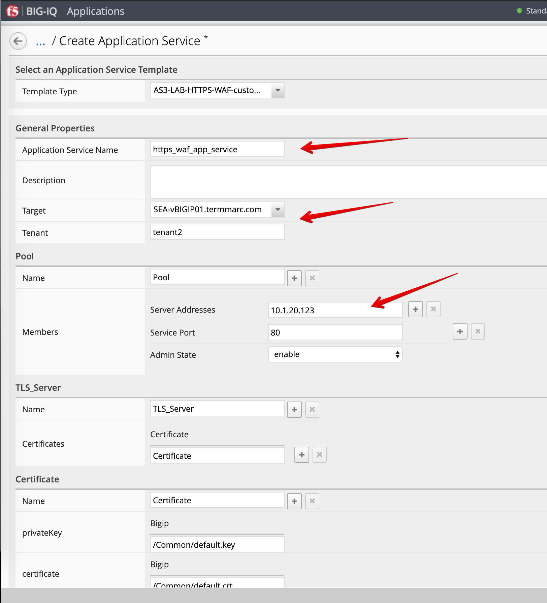

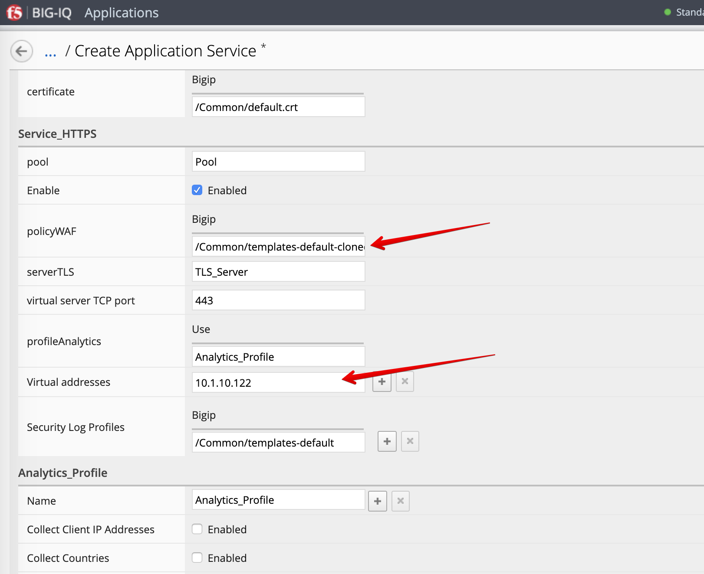

3. Click **Create**.

4. Check the application service ``https_waf_app_service`` has been created under Application ``LAB_module3``.

.. image:: ../pictures/module3/lab-5-15.png
  :scale: 40%
  :align: center

5. Now, let's look on the BIG-IP  and verify the application is correctly deployed in partition ``tenant2``.
    
6. Login to ``SEA-vBIGIP01.termmarc.com`` BIG-IP from lab environment. Select the partition ``tenant2`` and look at the objects created on the BIG-IP.

 .. image:: ../pictures/module3/lab-5-16.png
  :scale: 40%
  :align: center
  
7. Notice that new ``https_waf_app_service`` comes with a redirect. Select the HTTPS VS, Select Security and 
hit Policies. Application Security Policy is Enabled and the Log Profile has a templates-default selected.
 
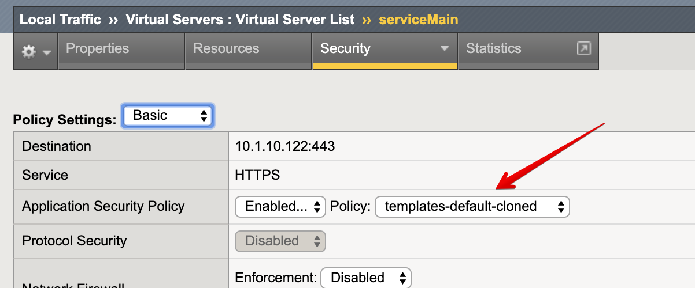

8. Back to the BIG-IQ and logged in as **paula**, select ``tenant2_https_waf_app_service``. What is the enforced Protection Mode?

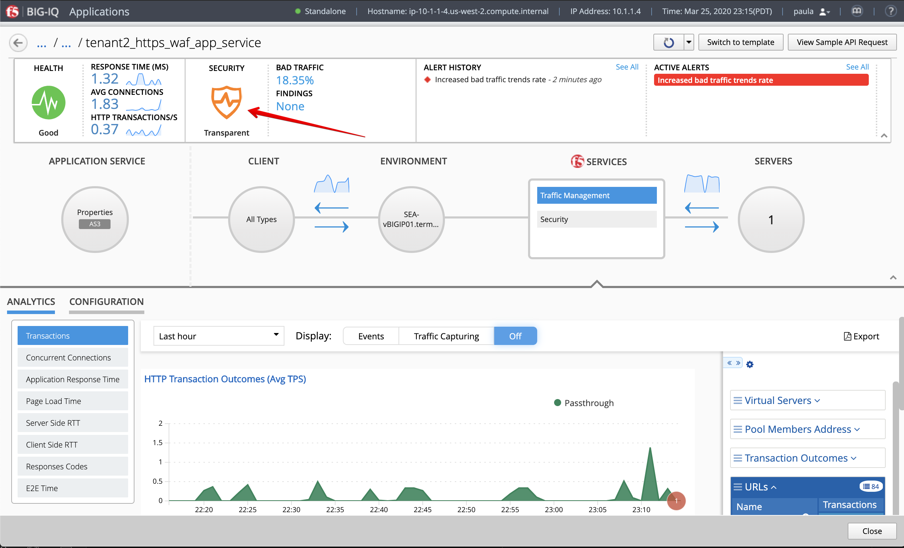

9. From the lab environment, launch a remote desktop session to have access to the Ubuntu Desktop.

Open Chrome and navigate to the following URL: ``https://10.1.10.122``.

.. image:: ../pictures/module3/lab-5-19.png
  :scale: 40%
  :align: center

10. Paula does the necessary testing of her application, she reach to Larry.

.. note:: There are traffic generator sending good and bad traffic from the Lamp server in the lab.

11. Paula can update application service health alert rules by clicking on the Health Icon on the top left of the Application Dashboard.

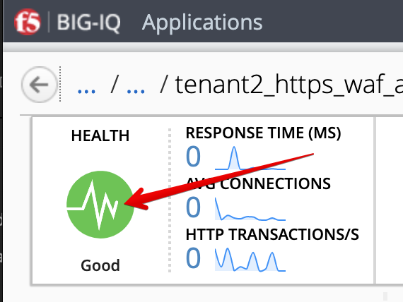

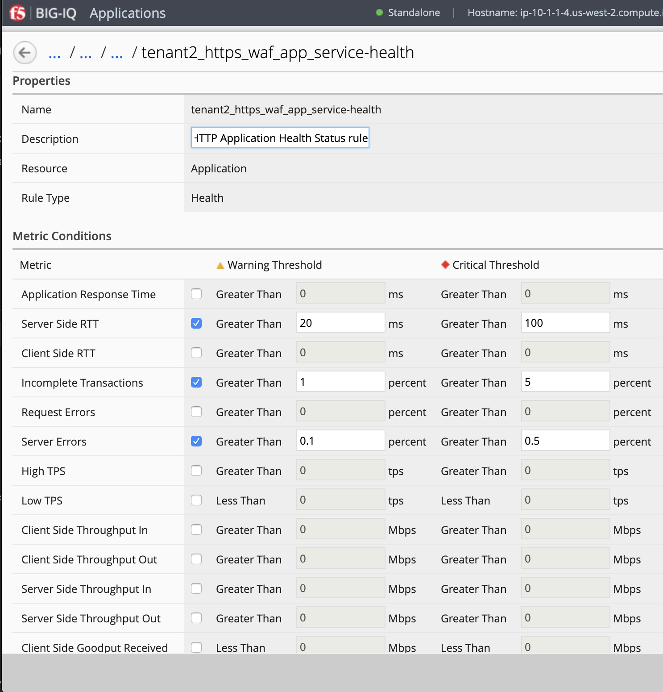

ASM Policy Learning review and Dashboard/Events (Larry & Paula)
^^^^^^^^^^^^^^^^^^^^^^^^^^^^^^^^^^^^^^^^^^^^^^^^^^^^^^^^^^^^^^^

1. Login as **larry** and go to Configuration > Security > Web Application Security > Policies.

2. Select ``templates-default-cloned`` and navigate under POLICY BUILDING > Suggestions and review the learning.

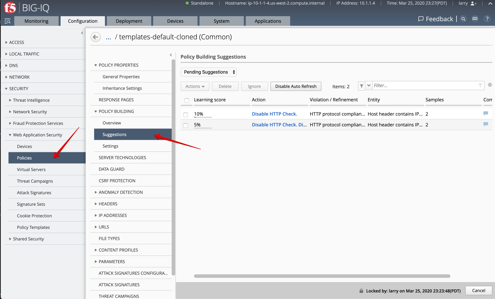

3. Accept necessary suggestions.

.. image:: ../pictures/module3/lab-5-22.png
  :scale: 40%
  :align: center

.. note:: In case the app is deployed on a BIG-IP HA pair, the learning is not sync unless the failover group is set to automatic or the centrally builder feature is used.

4. Navigate under POLICY BUILDING > Settings, change **Enforcement Mode** to ``blocking`` then click on **Save & Close**.

.. image:: ../pictures/module3/lab-5-23.png
  :scale: 40%
  :align: center

5. Select the ``templates-default-cloned``, click on Deploy to deploy the changes (same as previously done).

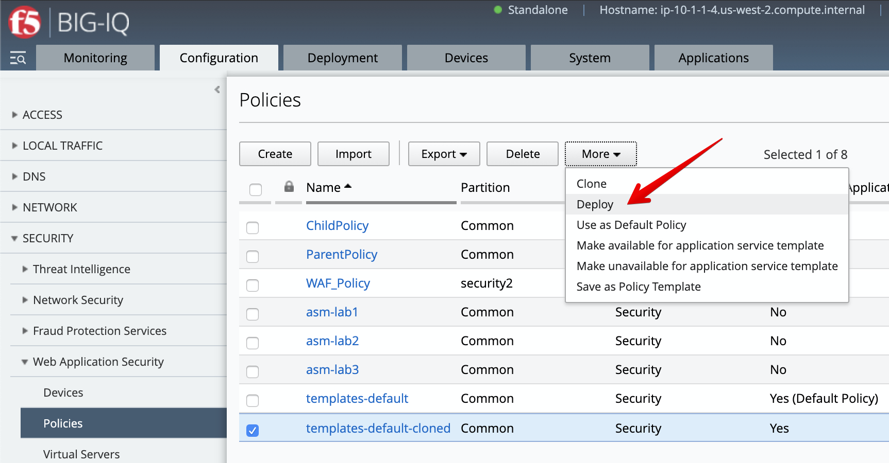

6. Let's generate some bad traffic, connect on the Ubuntu Lamp Server server and launch the following script::

    /home/f5/traffic-scripts/generate_http_bad_traffic.sh

7. Check ASM type of attacks by navigating under Monitoring > EVENTS > Web Application Security > Event Logs > Events

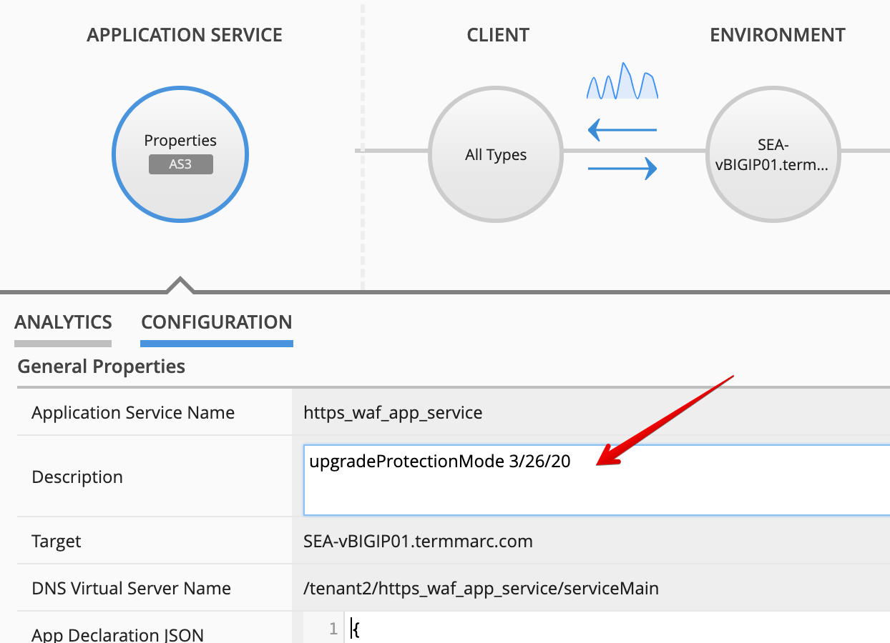

8. Login as **paula** and select previously created ``LAB_module3`` Application, then click on ``https_waf_app_service``.

9. In 7.x, the protection mode isn't automatically updated on the Application Dashboard. 

Under Properties, select CONFIGURATION, then add ``upgradeProtectionMode 3/26/20`` in the Description 
field and click Save.

10. In Application Dashboard, navigate to the Security Statistics and notice the Malicious Transactions.

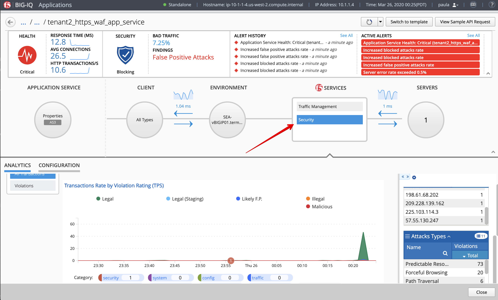

11. Stop the bad traffic script, connect on the Ubuntu Lamp Server server and CTRL+C.

.. note:: Try navigating to ``https://10.1.10.122/cal.exe`` from Chrome on the Lamp server.