Lab 3.6: AS3 Switch Template: add a Firewall Policy to an existing Application Service
--------------------------------------------------------------------------------------

Workflow
^^^^^^^^

1. **Paula** creates her application service using the template given by **david**.
2. **Larry** create the AFM policy (Advanced Firewall Manager).
3. **David** clone the template used by Paula and add firewall policy to it.
4. **David** assigns the new AS3 template to Paula.
5. **Paula** use the switch template functionality to move her app service to the new template.
6. **Larry** looks at the Firewall dashboard available on BIG-IQ.

Prerequisites
^^^^^^^^^^^^^

1. First make sure your device has AFM module discovered and imported 
for **SEA-vBIGIP01.termmarc.com** under Devices > BIG-IP DEVICES.

2. Check if the **AFM Statistics Collection** Statistics Collection is turned on
for **SEA-vBIGIP01.termmarc.com** under Devices > BIG-IP DEVICES.

3. Check if the **Network Security** service is Active 
under System > BIOG-IQ DATA COLLECTION > BIG-IQ Data Collection Devices.

AS3 Application Service Deployment (Paula)
^^^^^^^^^^^^^^^^^^^^^^^^^^^^^^^^^^^^^^^^^^

Follow `Lab 3.2`_ to deploy the application service as Paula.

.. _Lab 3.2: ./lab2.html

AFM Policy creation (Larry)
^^^^^^^^^^^^^^^^^^^^^^^^^^^

Let's first create and deploy the AFM policy in **BIG-IQ** to **SEA-vBIGIP01.termmarc.com**.

1. Login to BIG-IQ as **larry** by opening a browser and go to: ``https://10.1.1.4``

2. Go to Configuration > Security > Network Security > Network Firewall > Firewall Policies and
   create a new policy called ``module3lab6_fw_policy``.

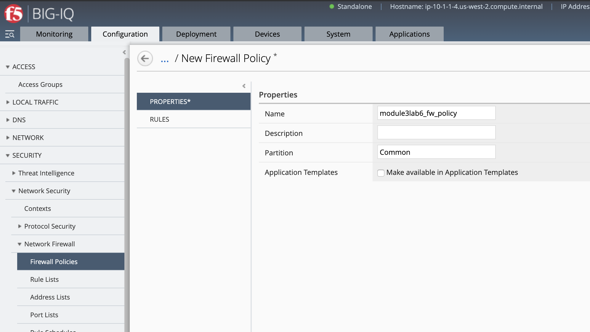

Under Rules, create the 1st rule allowing traffic to destination port 443 and 80, protocol TCP, action ``accept``.

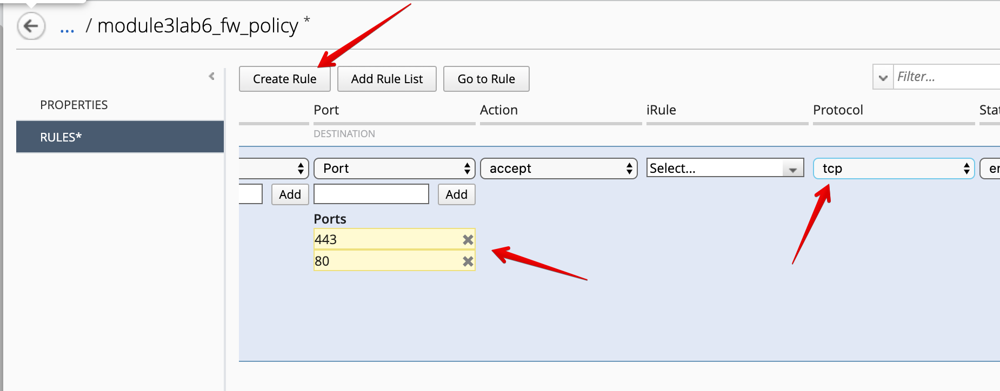

Name the Rule (here we call it http) and click on **Update** to save it.

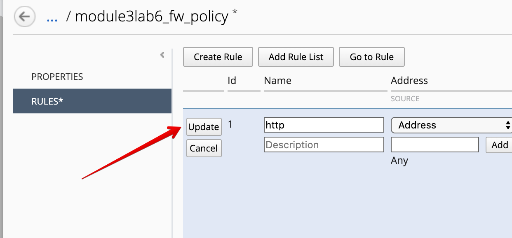

Create the 2nd rule rejecting all traffic, set destination address to ``0.0.0.0/0``, action ``reject``.

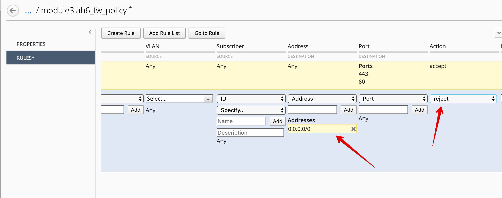

Click on **Save & Close**.

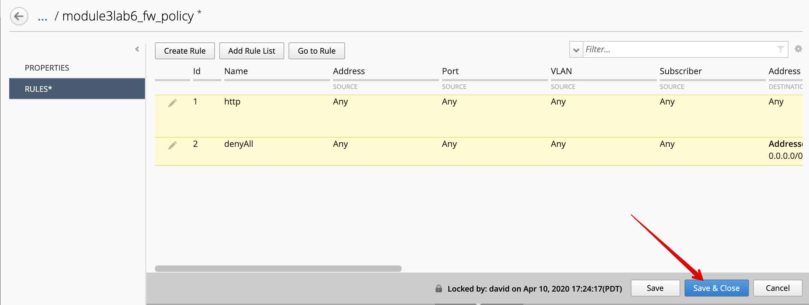

3. Under Pinning Policies, click on the **SEA-vBIGIP01.termmarc.com** device.

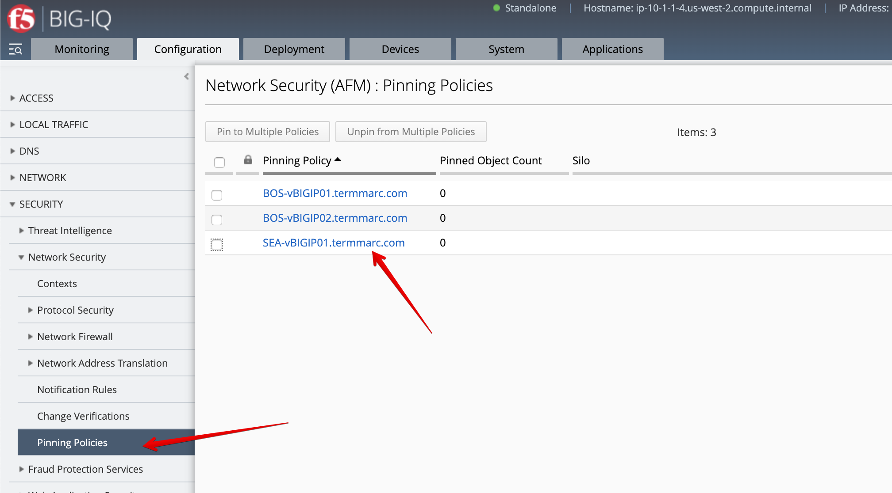

Select the ``/Common/module3lab6_fw_policy`` and add it to the device, then click on **Save & Close**.

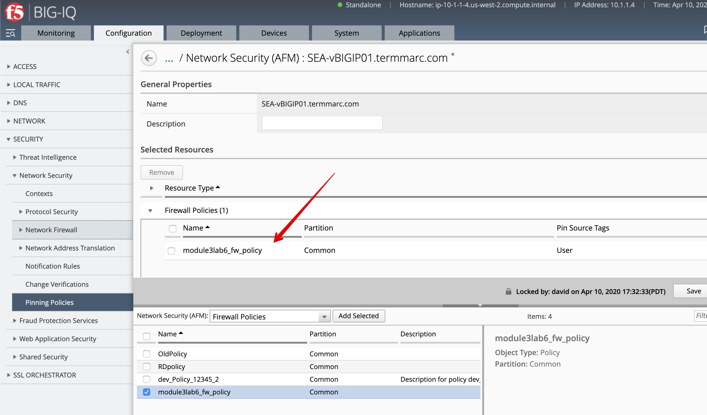

4. Select the ``/Common/module3lab6_fw_policy``, click on Deploy.

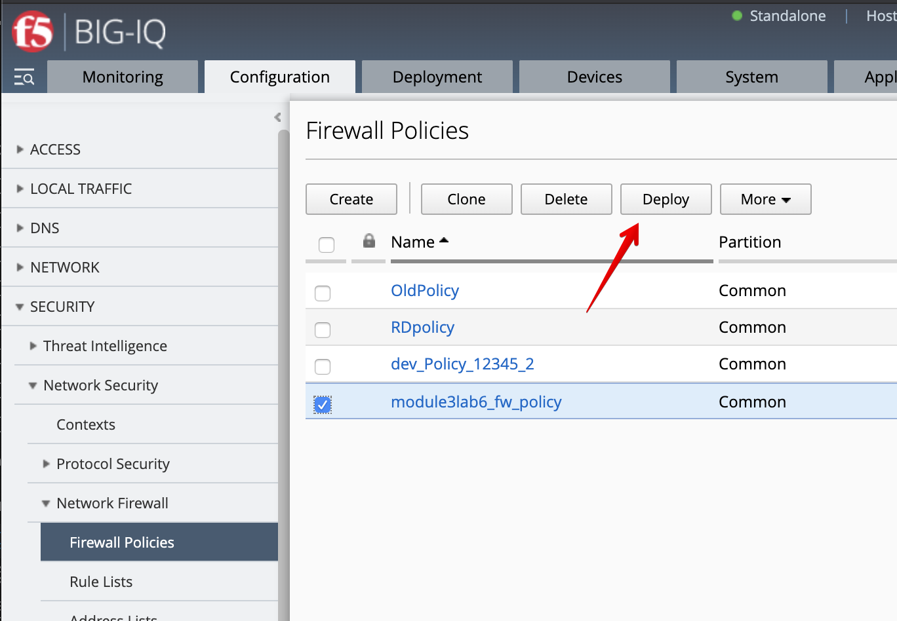

The deployment window opens. Type a name, select ``Deploy immediately`` for the Method.

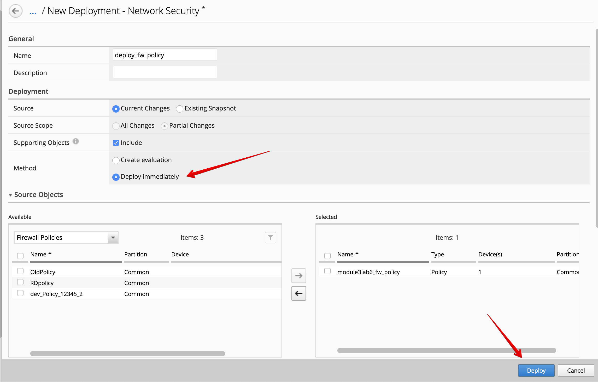

Under the Target Device(s) section, click on ``Find Relevant Devices``
and select the **SEA-vBIGIP01.termmarc.com**. Then, click on Deploy.

AS3 clone template to add firewall rules (David)
^^^^^^^^^^^^^^^^^^^^^^^^^^^^^^^^^^^^^^^^^^^^^^^^

1. Login as **david** and go to the Application > Application Templates and 
   select ``AS3-F5-HTTPS-offload-lb-existing-cert-template-big-iq-default-<version>`` and press **Clone**.

2. Give the cloned template a name: ``AS3-LAB-HTTPS-custom-firewall-template`` and click Clone.

3. Open the template you just cloned and select the ``Service_HTTPS`` AS3 class.
   Set property ``Firewall policy (enforced)`` to ``/Common/module3lab6_fw_policy`` and change it to Override.

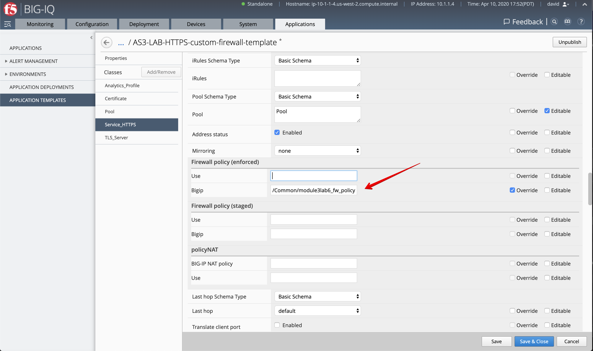

.. note:: The firewall policy will be hidden from the application owner, Paula, as we set the policy with option Override.

4. Click **Save & Close**.

5. Select ``AS3-LAB-HTTPS-WAF-custom-template`` and click **Publish**.

6. Before **paula** can use this AS3 template, **david** needs to update her role.
   Use the previous steps in `Lab 3.2`_ to add AS3 Template ``AS3-LAB-HTTPS-custom-firewall-template`` to ``Application Creator VMware`` custom role
   assigned to **paula**.

.. _Lab 3.2: ./lab2.html

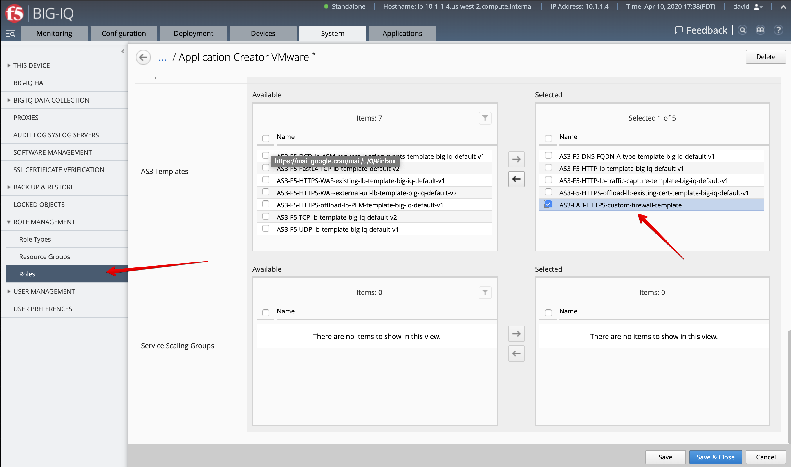

.. warning:: Manually select and remove the ``undefined [API only]`` entries from the Selected column if needed.

AS3 Application Service Update using Switch Template (Paula)
^^^^^^^^^^^^^^^^^^^^^^^^^^^^^^^^^^^^^^^^^^^^^^^^^^^^^^^^^^^^

Now AFM policy is available on BIG-IP and new AS3 HTTPS firewall template 
available on BIG-IQ, let's use the switch template feature to add 
the firewall policy to Paula's existing application service.

1. Login as **paula** and select previously created ``https_app_service`` Application Service 
   under ``LAB_module3`` (created in `Lab 3.2`_).

.. _Lab 3.2: ./lab2.html

2. In order to save the properties of the Application Service, click on the top right corner of the dashboard,
   click on **View Sample API Request** and save the API call in a text editor.

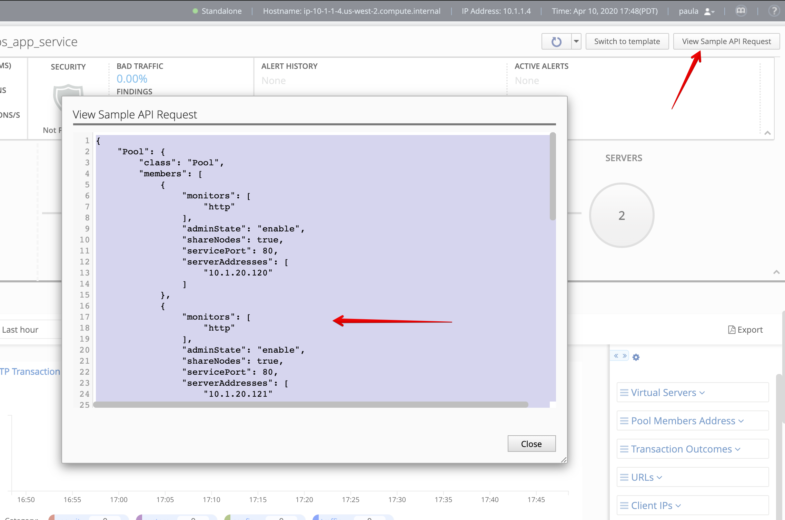

3. Then click on **Switch to template**/

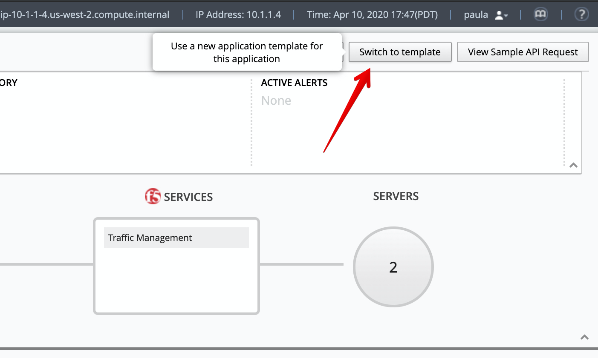

4. Select ``AS3-LAB-HTTPS-custom-firewall-template`` for Template Type.
Using the information saved in step 2, fill necessary fields (Server Addresses, Virtual Server Addresses).

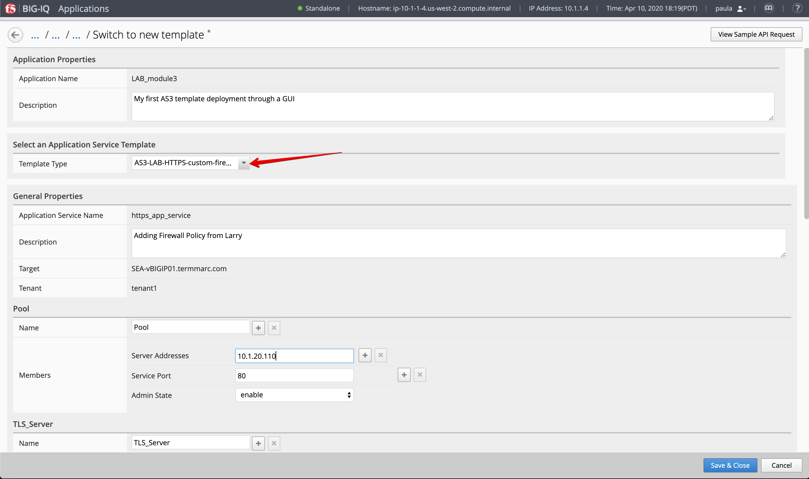

5. Now, let's change the virtual server port to ``444`` instead of 443.

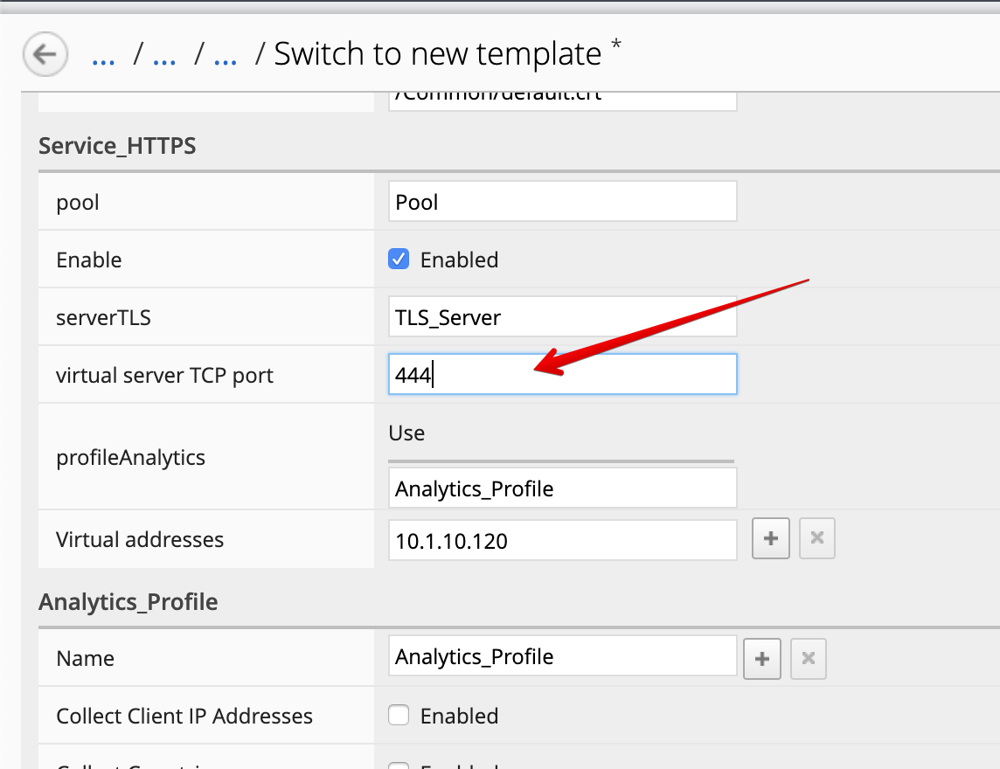

6. Click **Save & Close**.

7.	Now, let's look on the BIG-IP and verify the Firewall policy has been correctly applied to the Application Service.
Login to ``SEA-vBIGIP01.termmarc.com`` BIG-IP from lab environment. 
Select the partition ``tenant1`` and look at the security resources attached to the virtual server ``ServiceMain``.

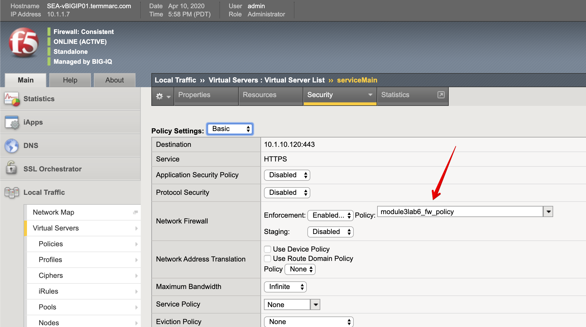

8. From the lab environment, launch a xRDP/noVNC session to have access to the Ubuntu Desktop. 
To do this, in your lab environment, click on the *Access* button
of the *Ubuntu Lamp Server* system and select *noVNC* or *xRDP*.

.. note:: Modern laptops with higher resolutions you might want to use 1440x900 and once XRDP is launched Zoom to 200%.

Open a terminal and run the following commands:

.. code::

    f5student@ip-10-1-1-5:~$ nmap -F 10.1.10.120
    Starting Nmap 7.80 ( https://nmap.org ) at 2020-04-11 01:12 UTC
    Nmap scan report for site20.example.com (10.1.10.120)
    Host is up (0.00036s latency).
    Not shown: 98 filtered ports
    PORT    STATE  SERVICE
    80/tcp  open   http
    444/tcp closed snpp

    Nmap done: 1 IP address (1 host up) scanned in 1.73 seconds

    f5student@ip-10-1-1-5:~$ curl -k https://10.1.10.120:444
    curl: (7) Failed to connect to 10.1.10.120 port 444: Connection refused

Notice the port 444 shows closed and when trying to run a curl against the virtual IP address on port 444, it shows connection refused.

Run above commands few times, then go back to the BIG-IQ Application Dashboard and 
change the ``virtual server TCP port`` back to ``443``.

Back on the Ubuntu Jump host on the terminal, and run the following commands:

.. code::

    f5student@ip-10-1-1-5:~$ nmap -F 10.1.10.120
    Starting Nmap 7.80 ( https://nmap.org ) at 2020-04-11 01:23 UTC
    Nmap scan report for site20.example.com (10.1.10.120)
    Host is up (0.00037s latency).
    Not shown: 98 filtered ports
    PORT    STATE SERVICE
    80/tcp  open  http
    443/tcp open  https

    Nmap done: 1 IP address (1 host up) scanned in 1.74 seconds

    f5student@ip-10-1-1-5:~$ curl -s -k https://10.1.10.120:443 | tail -3
    setTimeout(f5_cspm.wait_perf_data,100);return;},go:function(){var chunk=window.document.cookie.split(/\s*;\s*/);for(var i=0;i<chunk.length;++i){var pair=chunk[i].split(/\s*=\s*/);if(pair[0]=='f5_cspm'&&pair[1]=='1234')
    {var d=new Date();d.setTime(d.getTime()-1000);window.document.cookie='f5_cspm=;expires='+d.toUTCString()+';path=/;';setTimeout(f5_cspm.wait_perf_data,100);}}}}
    f5_cspm.go();}());</script>

Notice now the port 443 shows open and when trying to run a curl against the virtual IP address on port 443, 
the page is loading correctly and showing in the terminal. Run above commands few times.

AFM Policy Dashboard (Larry)
^^^^^^^^^^^^^^^^^^^^^^^^^^^^

1. Login as **larry** and go to Monitoring > Dashboards > AFM > ACL Enforced.
Acknowledge the various attempts made by Paula when trying to reach her Application Services on port 444 and port 443.

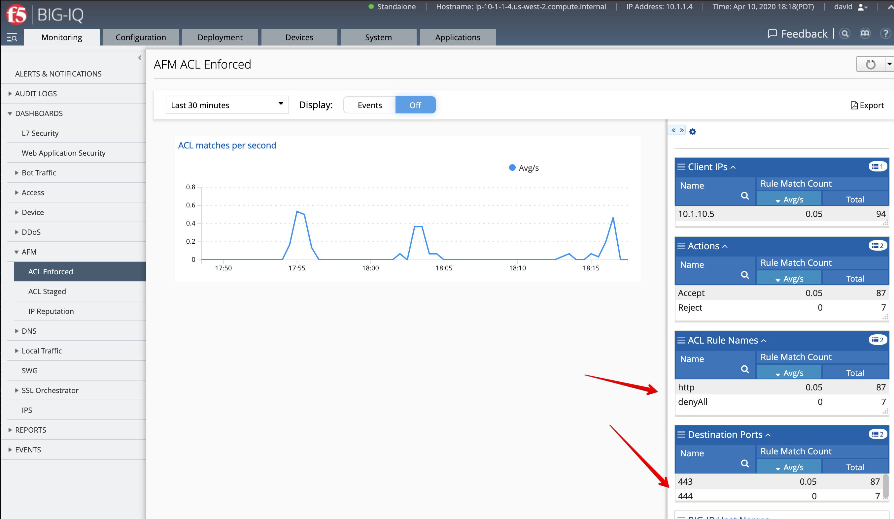