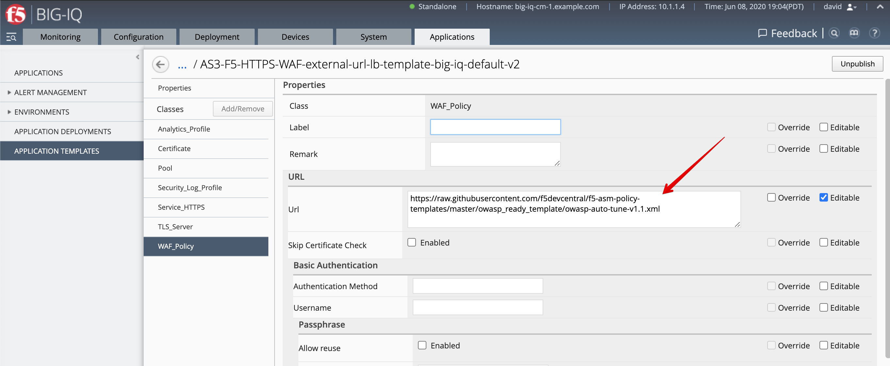
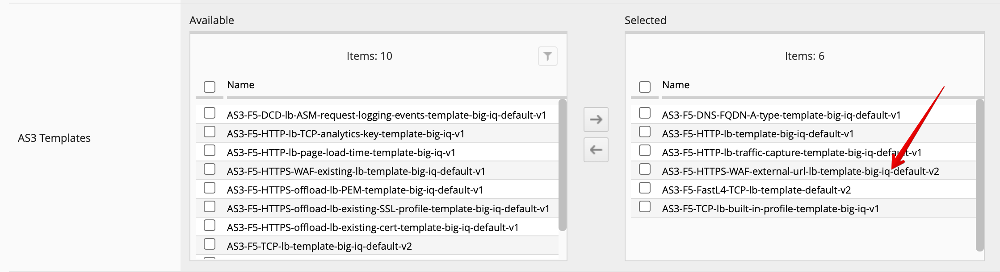
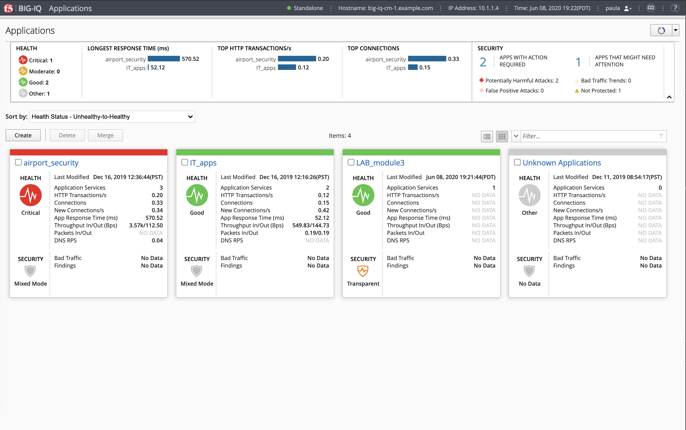
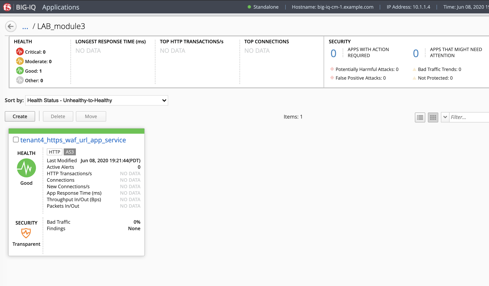
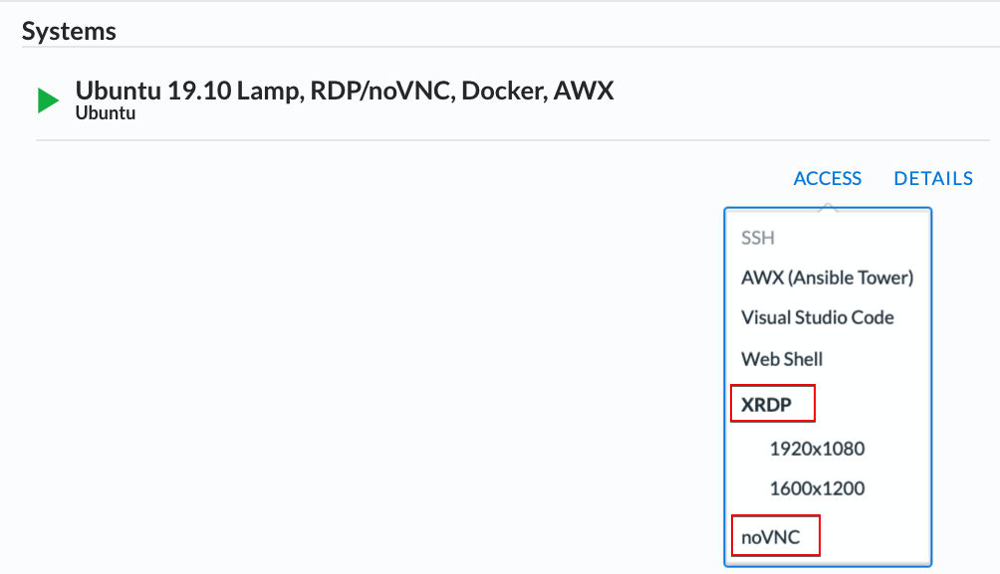
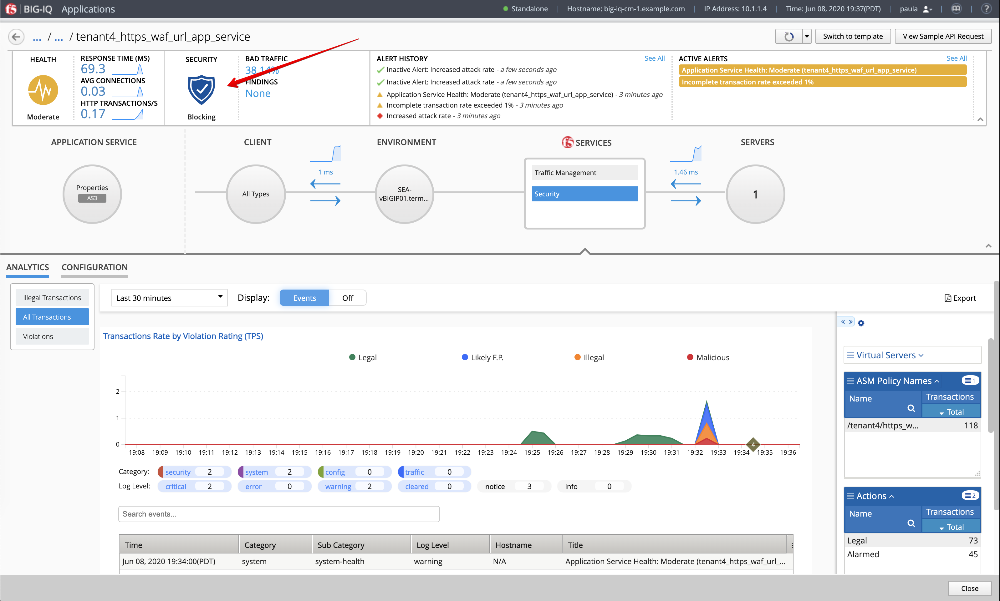
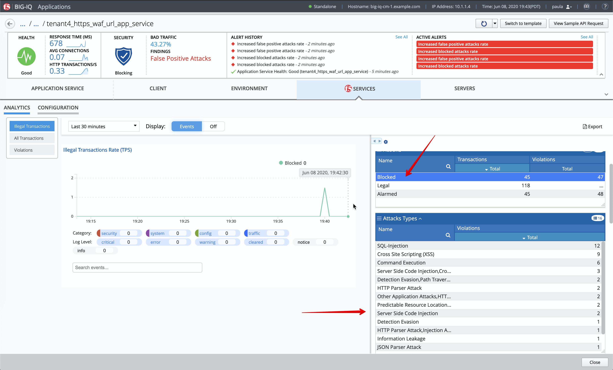

Lab 3.7: Deploy a WAF with BIG-IQ and AS3 using an ASM policy on GitHub
-----------------------------------------------------------------------

Workflow
^^^^^^^^

1. **Larry** upload the ASM policy in transparent mode on GitHub.
2. **David** creates the AS3 template and reference ASM policy URL created by **Larry** using URL.
3. **David** assigns the AS3 template to Paula.
4. **Paula** creates her application service using the template given by **david**.
5. **Paula** test her application and change the policy to blocking mode from her application dashboard.

Prerequisites
^^^^^^^^^^^^^

1. First make sure your device has ASM module discovered and imported 
for **SEA-vBIGIP01.termmarc.com** under Devices > BIG-IP DEVICES.

2. Check if the **Web Application Security** service is Active 
under System > BIOG-IQ DATA COLLECTION > BIG-IQ Data Collection Devices.

ASM Policy creation (Larry)
^^^^^^^^^^^^^^^^^^^^^^^^^^^

In this lab, we are going to use the ASM templates available on the `F5 devcentral GitHub repository`_. 

.. _F5 devcentral GitHub repository: https://github.com/f5devcentral/f5-asm-policy-templates/tree/master/owasp_ready_template

We are going to use the WAF policy template called ``owasp-auto-tune-v1.1.xml``.

AS3 WAF template creation (David)
^^^^^^^^^^^^^^^^^^^^^^^^^^^^^^^^^

1. Login as **david** and Go to the Applications tab > Applications Templates and 
   select ``AS3-F5-HTTPS-WAF-external-url-lb-template-big-iq-default-<version>``.

.. image:: ../pictures/module3/lab-7-1.png
  :scale: 40%
  :align: center

2. Select the ``WAF_Policy`` AS3 class. Look at the URL of the WAF policy stored on GitHub.

2. Before **paula** can use this AS3 template, **david** needs to update her role.
   Use the previous steps in `Lab 3.2`_ to make sure AS3 Template ``AS3-F5-HTTPS-WAF-external-url-lb-template-big-iq-default`` 
   is assigned to ``Application Creator VMware`` custom role used by **Paula**.

.. _Lab 3.2: ./lab2.html

.. image:: ../pictures/module3/lab-7-3.png
  :scale: 40%
  :align: center

AS3 WAF application service deployment (Paula)
^^^^^^^^^^^^^^^^^^^^^^^^^^^^^^^^^^^^^^^^^^^^^^

Now let's create the WAF application service using AS3 & BIG-IQ.

1. Login as **paula** and select previously created ``LAB_module3`` Application and click **Create**.
  
2. Click **Create** to create an Application Service:

.. image:: ../pictures/module3/lab-7-5.png
  :scale: 40%
  :align: center

+---------------------------------------------------------------------------------------------+
| Application properties:                                                                     |
+---------------------------------------------------------------------------------------------+
| * Grouping = Part of an Existing Application                                                |
| * Application Name = ``LAB_module3`                                                         |
+---------------------------------------------------------------------------------------------+
| Select an Application Service Template:                                                     |
+---------------------------------------------------------------------------------------------+
| * Template Type = Select ``AS3-F5-HTTPS-WAF-external-url-lb-template-big-iq-default [AS3]`` |
+---------------------------------------------------------------------------------------------+
| General Properties:                                                                         |
+---------------------------------------------------------------------------------------------+
| * Application Service Name = ``https_waf_url_app_service``                                  |
| * Target = ``SEA-vBIGIP01.termmarc.com``                                                    |
| * Tenant = ``tenant4``                                                                      |
+---------------------------------------------------------------------------------------------+
| Pool                                                                                        |
+---------------------------------------------------------------------------------------------+
| * Members: ``10.1.20.123``                                                                  |
+---------------------------------------------------------------------------------------------+
| TLS_Server. Keep default.                                                                   |
+---------------------------------------------------------------------------------------------+
| WAF_Policy. Keep default.                                                                   |
+---------------------------------------------------------------------------------------------+
| Certificate                                                                                 |
+---------------------------------------------------------------------------------------------+
| * privateKey: `use the on from this example`_                                               |
| * certificate: `use the on from this example`_                                              |
+---------------------------------------------------------------------------------------------+
| Service_HTTPS                                                                               |
+---------------------------------------------------------------------------------------------+
| * Virtual addresses: ``10.1.10.126``                                                        |
+---------------------------------------------------------------------------------------------+
| Analytics_Profile. Keep default.                                                            |
+---------------------------------------------------------------------------------------------+
| Security_Log_Profile. Keep default.                                                         |
+---------------------------------------------------------------------------------------------+

.. _use the on from this example: https://clouddocs.f5.com/products/extensions/f5-appsvcs-extension/latest/userguide/examples.html#example-2-https-application

3. Click **Create**.

4. Check the application service ``https_waf_url_app_service`` has been created under Application ``LAB_module3``.

5. What is the enforced Protection Mode?

.. image:: ../pictures/module3/lab-7-8.png
  :scale: 40%
  :align: center

Test and enforcement mode update (Paula)
^^^^^^^^^^^^^^^^^^^^^^^^^^^^^^^^^^^^^^^^

1. From the lab environment, launch a remote desktop session to have access to the Ubuntu Desktop. 
To do this, in your lab environment, click on the *Access* button
of the *Ubuntu Lamp Server* system and select *noVNC* or *xRDP*.

.. note:: Modern laptops with higher resolutions you might want to use 1440x900 and once XRDP is launched Zoom to 200%.

|

2. Open Chrome and navigate to the following URL: ``https://10.1.10.126`` which open the web application protected by the WAF policy.

3. We are to install now the F5 WAF tester tool. Connect via ``SSH`` to the *Ubuntu Lamp Server* and execute:

.. code-block::

   f5student@ip-10-1-1-5:~$ sudo pip install git+https://github.com/f5devcentral/f5-waf-tester.git

   f5student@ip-10-1-1-5:~$ sudo f5-waf-tester --init
   [BIG-IP] Host []: 10.1.1.7   
   [BIG-IP] Username []: admin
   [BIG-IP] Password []: 
   ASM Policy Name []: /tenant4/https_waf_url_app_service/WAF_Policy
   Virtual Server URL []: https://10.1.10.126
   Blocking Regular Expression Pattern [ Your support ID is: (?P<id>\d+) ]: 
   Number OF Threads [25]: 
   [Filters] Test IDs to include (Separated by ',') []: 
   [Filters] Test Systems to include (Separated by ',') []: 
   [Filters] Test Attack Types to include (Separated by ',') []: 
   [Filters] Test IDs to exclude (Separated by ',') []: 
   [Filters] Test Systems to exclude (Separated by ',') []: 
   [Filters] Test Attack Types to exclude (Separated by ',') []: 

4. Now, let's launch an attack on this application service while the policy is in transparent mode. 

On the *Ubuntu Lamp Server*, run:

.. code-block::
   :emphasize-lines: 38,39

   f5student@ip-10-1-1-5:~$ sudo f5-waf-tester
   09-06-20 02:32:27 INFO Test 100000002/parameter failed
   09-06-20 02:32:27 INFO Test 100000002/url failed
   09-06-20 02:32:27 INFO Test 100000001/parameter failed
   09-06-20 02:32:27 INFO Test 100000001/header failed
   09-06-20 02:32:27 INFO Test 100000004/parameter failed
   09-06-20 02:32:27 INFO Test 100000006/parameter failed
   09-06-20 02:32:27 INFO Test 100000004/header failed
   09-06-20 02:32:27 INFO Test 100000007/url failed
   09-06-20 02:32:27 INFO Test 100000003/header failed
   09-06-20 02:32:27 INFO Test 100000005/header failed
   09-06-20 02:32:27 INFO Test 100000005/parameter failed
   09-06-20 02:32:27 INFO Test 100000002/header failed
   09-06-20 02:32:27 INFO Test 100000001/url failed
   09-06-20 02:32:27 INFO Test 100000006/header failed
   09-06-20 02:32:27 INFO Test 100000009/parameter failed
   09-06-20 02:32:27 INFO Test 100000010/request failed
   ...
      "100000024": {
         "CVE": "", 
         "attack_type": "Server Side Request Forgery", 
         "name": "SSRF attempt - Local network IP range 10.x.x.x", 
         "results": {
         "request": {
            "expected_result": {
               "type": "signature", 
               "value": "200020201"
            }, 
            "pass": false, 
            "reason": "Unknown, Maybe ASM Policy is not in blocking mode", 
            "support_id": ""
         }
         }, 
         "system": "All systems"
      }
   }, 
   "summary": {
      "fail": 48, 
      "pass": 0
   }

5. Back to the BIG-IQ and logged in as **paula**, let's look at the attack on the BIG-IQ Dashboard.

Under **F5 Services**, Security > Analytics > All Transactions

.. image:: ../pictures/module3/lab-7-9.png
  :scale: 40%
  :align: center

Violations:

.. image:: ../pictures/module3/lab-7-10.png
  :scale: 40%
  :align: center

6. Now, Paula change the WAF policy mode from Transparent to Blocking in order to apply L7 protection to her application.

Under **F5 Services**, Configuration, update Enforcement Mode to **Blocking**.

.. image:: ../pictures/module3/lab-7-11.png
  :scale: 40%
  :align: center

Notice the shield changing color in the BIG-IQ dashboard.

Wait for the current major and critical alerts to clear before moving to the next step.

.. image:: ../pictures/module3/lab-7-13.png
  :scale: 40%
  :align: center

7. Back on the *Ubuntu Lamp Server*, let's launch a second attack on this application service while the policy is in blocking mode. 

.. code-block::
   :emphasize-lines: 35,36

   f5student@ip-10-1-1-5:~$ sudo f5-waf-tester
   09-06-20 02:39:44 INFO Test 100000002/parameter pass
   09-06-20 02:39:44 INFO Test 100000003/parameter pass
   09-06-20 02:39:44 INFO Test 100000005/url pass
   09-06-20 02:39:44 INFO Test 100000004/header pass
   09-06-20 02:39:44 INFO Test 100000001/url pass
   09-06-20 02:39:44 INFO Test 100000005/parameter pass
   09-06-20 02:39:44 INFO Test 100000006/parameter pass
   09-06-20 02:39:44 INFO Test 100000006/header pass
   09-06-20 02:39:44 INFO Test 100000004/url pass
   09-06-20 02:39:44 INFO Test 100000001/header pass
   09-06-20 02:39:44 INFO Test 100000001/parameter pass
   09-06-20 02:39:44 INFO Test 100000003/header pass
   09-06-20 02:39:44 INFO Test 100000002/url pass
   ...
      "100000024": {
         "CVE": "", 
         "attack_type": "Server Side Request Forgery", 
         "name": "SSRF attempt - Local network IP range 10.x.x.x", 
         "results": {
         "request": {
            "expected_result": {
               "type": "signature", 
               "value": "200020201"
            }, 
            "pass": false, 
            "reason": "Attack Signature is not in the ASM Policy", 
            "support_id": ""
         }
         }, 
         "system": "All systems"
      }
   }, 
   "summary": {
      "fail": 3, 
      "pass": 45
   }

8. Notice after few seconds the BIG-IQ dashboard reporting the attack.

.. image:: ../pictures/module3/lab-7-14.png
  :scale: 40%
  :align: center

Expend the dimensions and filter on **Blocked** attack to see attacks being blocked by the WAF policy.

