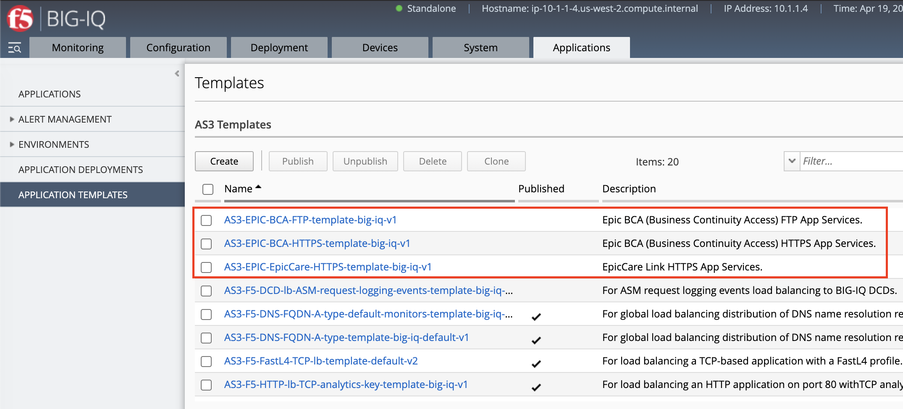
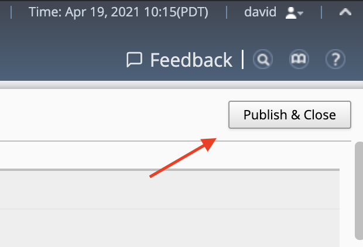
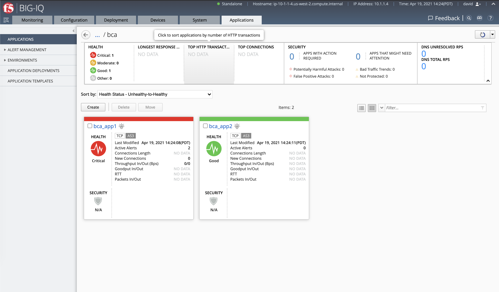

Lab 3.9: Build custom AS3 template with multiple monitors, iRule and Data Group
-------------------------------------------------------------------------------

.. note:: Estimated time to complete: **20 minutes**

In this lab, we are going to build a custom AS3 template using BIG-IQ template User Interface (UI). 
To use a real life example, we are going to build a template to deploy an F5 application service for one 
of the popular `Epic https://www.epic.com/about`_ application, the BCA (Business Continuity Access).

Here is the details of BIG-IP configuration for BCA:

The BCA will require the following components in the F5 BIG-IP:

- Server nodes
- Three health monitors
- Two pools for the nodes and monitors
- FTP, TCP and Fast L4 Profiles
- Whitelist iRules
- Data Group List
- TCP Profile
- Two virtual servers on port 21 and 443 ﴾with the same IP address﴿ to collect the pieces together

Because we are not going to use AS3 to define the BCA application services, we do not need to create each of those objects individually.
Indeed, we will create appropriate templates to define the application services, then use those templates to deploy the configuration on the BIG-IP.

.. warning:: You will need to use AS3.27 min to use those templates. More info on how to upgrade AS3 on BIG-IQ https://support.f5.com/csp/article/K54909607

.. include:: /accesslab.rst

Workflow
^^^^^^^^

1. Application Service Definition
2. Import Community AS3 templates
3. Deploy the FTP application service
4. Deploy the HTTPS application service

Application Service Definition
^^^^^^^^^^^^^^^^^^^^^^^^^^^^^^

In our example use case (Epic BCA app service), the app service is composed of 2 virtual servers on 2 different ports serving different part of the BCA application.
Because the 2 virtual servers are serving 2 different type of traffic, FTP and HTTPS, it makes sense to break the definition of this application services into 2 parts.

1. The FTP application service will use the ``Service_TCP`` AS3 object which represents a virtual server for TCP traffic.
2. The HTTPS application service in the BCA app context is using a ``Performance ﴾Layer 4﴿`` virtual server which translate into ``Service_L4`` AS3 object.

As it is not possible to define 2 different type of application services within the same BIG-IQ AS3 template, we will create 2 different templates which will define both services.

The first template will be an FTP app service template using the following AS3 classes:
    - ``Service_TCP`` defines the virtual IP address
    - ``Pool`` defines the pool and pool members
    - ``Monitor`` defines the FTP Health Monitor
    - ``TCP_profile`` defines custom TCP attributes (e.g. disable Nagle's algorithm and Slow-start)
    - ``Data_Group``defines which servers are allowed to access the BCA servers’ incoming directory using FTP
    - ``iRule`` prevents access to the BCA servers’ incoming report directory using FTP unless the connection comes from an authorized server
    - ``Analytics_TCP_Profile`` defining the Analytic profile use to collect TCP metric on the service

The second template will be an HTTPS/L4 app service template using the following AS3 classes:
    - ``Service_L4`` defining the virtual IP address
    - ``Pool`` defining the pool and pool members
    - ``Monitor`` defining the HTTPS Health monitors
    - ``Analytics_TCP_Profile`` defining the Analytic profile use to collect TCP metric on the service

For more information on how to define an Application Service with AS3, check the `How to compose an AS3 Declaration https://clouddocs.f5.com/products/extensions/f5-appsvcs-extension/latest/userguide/composing-a-declaration.html` 
and `many AS3 examples https://clouddocs.f5.com/products/extensions/f5-appsvcs-extension/latest/declarations` available on `F5 cloud docs https://clouddocs.f5.com/products/extensions/f5-appsvcs-extension/latest/`.

Import Community AS3 templates
^^^^^^^^^^^^^^^^^^^^^^^^^^^^^^

1. Let's first import the AS3 templates AS3-EPIC-BCA-HTTPS-template-big-iq and AS3-EPIC-BCA-FTP-template-big-iq available in the `community folder`_.
  Navigate under **Applications > Application Templates**, click **Import Templates** at the right top corner.

.. _community folder: https://github.com/f5devcentral/f5-big-iq/tree/7.1.0/f5-appsvcs-templates-big-iq/community

.. image:: ../pictures/module3/lab-9-1.gif
  :scale: 40%
  :align: center

2. Copy the instructions to import the templates and copy the scripts in BIG-IQ CLI.

.. image:: ../pictures/module3/lab-9-2.gif
  :scale: 40%
  :align: center

3. Once the import is completed, you will see the list of new templates available to use.

4. Before being able to use the templates, we will need to publish them. Select and publish AS3-EPIC-BCA-HTTPS-template-big-iq and AS3-EPIC-BCA-FTP-template-big-iq templates.

Deploy the FTP application service
^^^^^^^^^^^^^^^^^^^^^^^^^^^^^^^^^^

.. warning:: The goal of this lab is to illustrate how the BIG-IQ AS3 templates is working, you may need to update the example templates based on your need.

1. Click **Create** to create an Application Service and look for the template ``AS3-EPIC-BCA-FTP-template-big-iq-v1 [AS3]``.

Fill in information as below:

+----------------------------------------------------------------------------------------------------+
| Application properties:                                                                            |
+----------------------------------------------------------------------------------------------------+
| * Grouping = ``New Application``                                                                   |
| * Application Name = ``bca``                                                                       |
+----------------------------------------------------------------------------------------------------+
| Select an Application Service Template:                                                            |
+----------------------------------------------------------------------------------------------------+
| * Template Type = Select ``AS3-EPIC-BCA-FTP-template-big-iq-v1 [AS3]``                             |
+----------------------------------------------------------------------------------------------------+
| General Properties:                                                                                |
+----------------------------------------------------------------------------------------------------+
| * Application Service Name = ``app1``                                                              |
| * Target = ``SEA-vBIGIP01.termmarc.com``                                                           |
| * Tenant = ``bca``                                                                                 |
+----------------------------------------------------------------------------------------------------+
| Pool                                                                                               |
+----------------------------------------------------------------------------------------------------+
| * Members: ``10.1.20.122``, port ``80``                                                            |
+----------------------------------------------------------------------------------------------------+

.. image:: ../pictures/module3/lab-9-5.gif
  :scale: 40%
  :align: center

2. Extend the iRule field and replace ``/Tenant/App`` with the correct tenant & app ``/bca/app1``.

.. image:: ../pictures/module3/lab-9-6.gif
  :scale: 40%
  :align: center

3. The monitor defined needs a username and a password.

.. note:: In order to get the value of the Ciphertext, we convert the SSL key password (``secret``) using https://www.url-encode-decode.com/base64-encode-decode/
          More details on the AS3 Certificate class `here <https://clouddocs.f5.com/products/extensions/f5-appsvcs-extension/latest/refguide/schema-reference.html#certificate-passphrase>`_.

.. image:: ../pictures/module3/lab-9-7.gif
  :scale: 40%
  :align: center

4. Then copy the name of the Data Group defined in the iRule and paste it in the name of the Data Group object (Replace ``Data_Group`` with ``BCA_FTP_ServerList``).

Add also couple IP addresses with their network mask in the list.

.. image:: ../pictures/module3/lab-9-8.gif
  :scale: 40%
  :align: center

5. Finally, enter the virtual address ``10.1.10.123`` and click create. 

   Click on **View Sample API Request** in the right upper corner. 
   This will display the full AS3 declaration generated by BIG-IQ user interface.

.. image:: ../pictures/module3/lab-9-9.gif
  :scale: 40%
  :align: center

Deploy the HTTPS application service
^^^^^^^^^^^^^^^^^^^^^^^^^^^^^^^^^^^^

1. Once the 1st FTP app service has been created, navigate into the BCA application.
   Click **Create** to create an Application Service and look for the template ``AS3-EPIC-BCA-HTTPS-template-big-iq-v1 [AS3]``.

Fill in information as below:

+----------------------------------------------------------------------------------------------------+
| Application properties:                                                                            |
+----------------------------------------------------------------------------------------------------+
| * Grouping = ``New Application``                                                                   |
| * Application Name = ``bca``                                                                       |
+----------------------------------------------------------------------------------------------------+
| Select an Application Service Template:                                                            |
+----------------------------------------------------------------------------------------------------+
| * Template Type = Select ``AS3-EPIC-BCA-HTTPS-template-big-iq-v1 [AS3]``                           |
+----------------------------------------------------------------------------------------------------+
| General Properties:                                                                                |
+----------------------------------------------------------------------------------------------------+
| * Application Service Name = ``app2``                                                              |
| * Target = ``SEA-vBIGIP01.termmarc.com``                                                           |
| * Tenant = ``bca``                                                                                 |
+----------------------------------------------------------------------------------------------------+
| Pool                                                                                               |
+----------------------------------------------------------------------------------------------------+
| * Members: ``10.1.20.32``, port ``80``                                                            |
+----------------------------------------------------------------------------------------------------+

.. image:: ../pictures/module3/lab-9-10.gif
  :scale: 40%
  :align: center

2. Now, let's create a second monitor as showing below: ``Monitor1`` and ``Monitor2``. Don't forget to update the name of the monitors object below the Pool definition.

.. image:: ../pictures/module3/lab-9-11.gif
  :scale: 40%
  :align: center

5. Finally, enter the virtual address ``10.1.10.125`` and click create. 

.. image:: ../pictures/module3/lab-9-12.gif
  :scale: 40%
  :align: center

4. As a result, we have our 2 app services serving FTP and HTTPS traffic deploy on our BIG-IP and ready to serve traffic!

