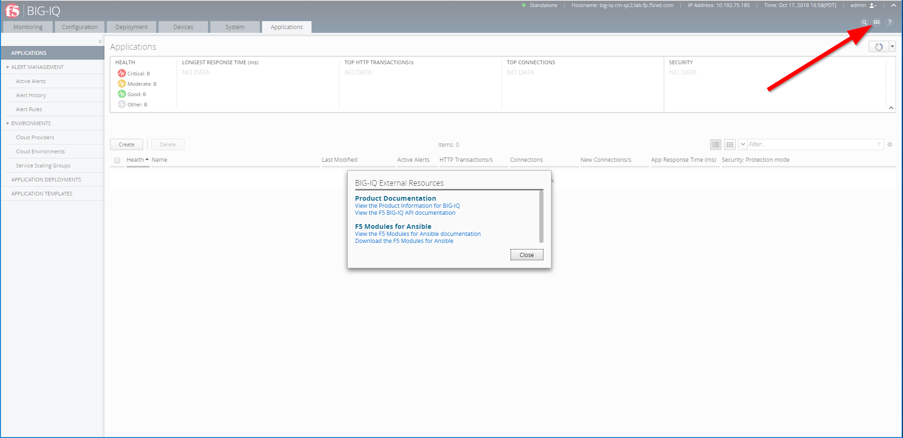

Module 3: BIG-IQ Application Deployment via API (v6.0 only)
===========================================================
.. warning:: Starting BIG-IQ 6.1, AS3 should be the preferred method to deploy application services programmatically through BIG-IQ. Go `here`_ if you are on 6.1 or later.

.. _here: ../module5/module5.html

- Create and Delete Application from Default-f5-HTTP-lb-template: **bigiq_application_http**
- Create and Delete Application from Default-f5-HTTPS-offload-lb-template: **bigiq_application_https_offload**
- Create and Delete Application from Default-f5-HTTPS-WAF-lb-template: **bigiq_application_https_waf**
- Create and Delete Application from Default-f5-fastHTTP-lb-template: **bigiq_application_fasthttp**
- Create and Delete Application from Default-f5-FastL4-TCP-lb-template: **bigiq_application_fastl4_tcp**
- Create and Delete Application from Default-f5-FastL4-UDP-lb-template: **bigiq_application_fastl4_udp**

More information on all `F5 Ansible Modules`_ (GitHub repository `Ansible F5 github`_)

.. _F5 Ansible Modules: https://clouddocs.f5.com/products/orchestration/ansible/devel/modules/list_of_all_modules.html
.. _Ansible F5 github: https://github.com/F5Networks/f5-ansible

.. warning:: Ansible 2.6+ only support App deployment on VMware environement. 

You can access the API & Ansible BIG-IQ documentations from the **BIG-IQ External Resources**:

|

In this module, we will learn how to see create and delete an application using Ansible Playbook, also look at an example of straight API payload from BIG-IQ UI.

.. toctree::
   :maxdepth: 1
   :glob:

   lab*
