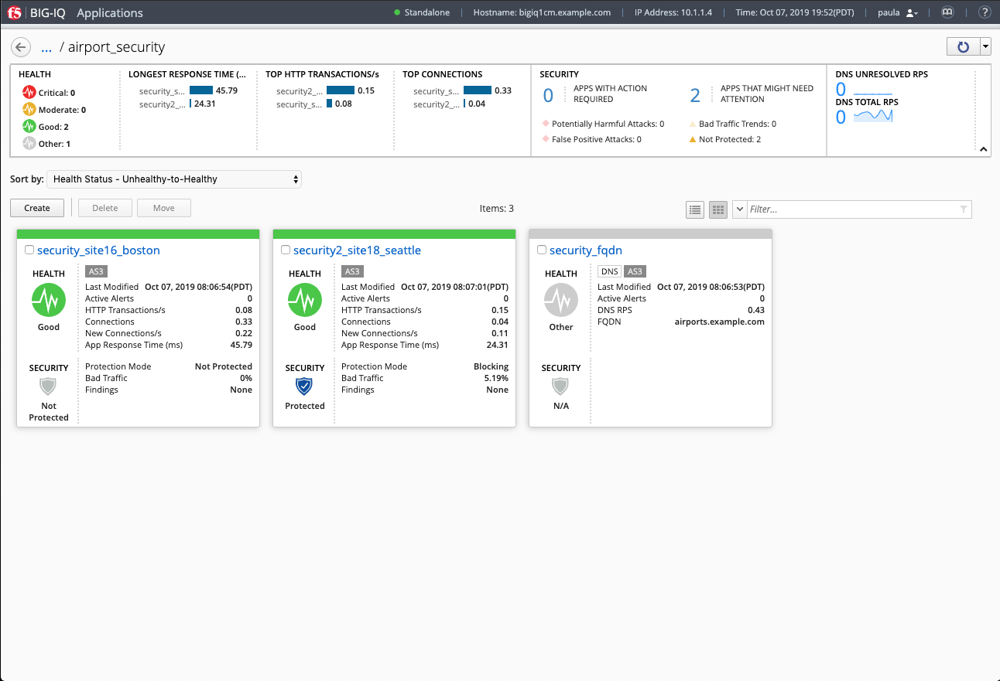
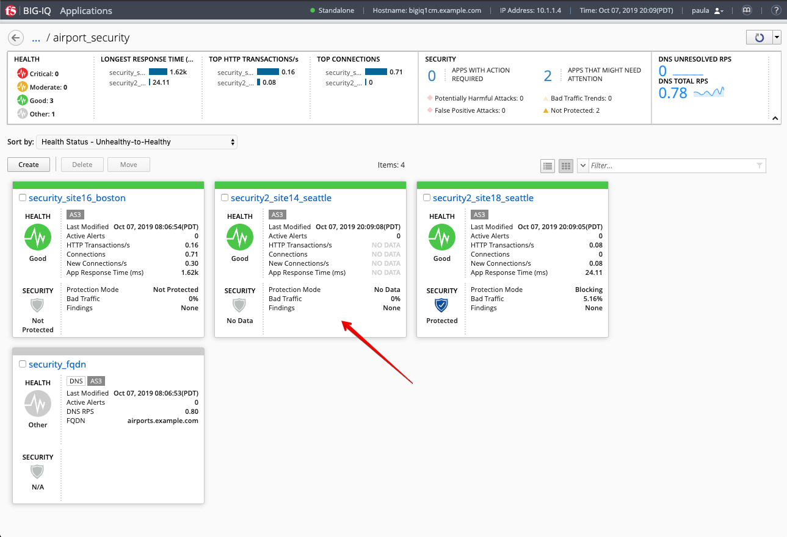
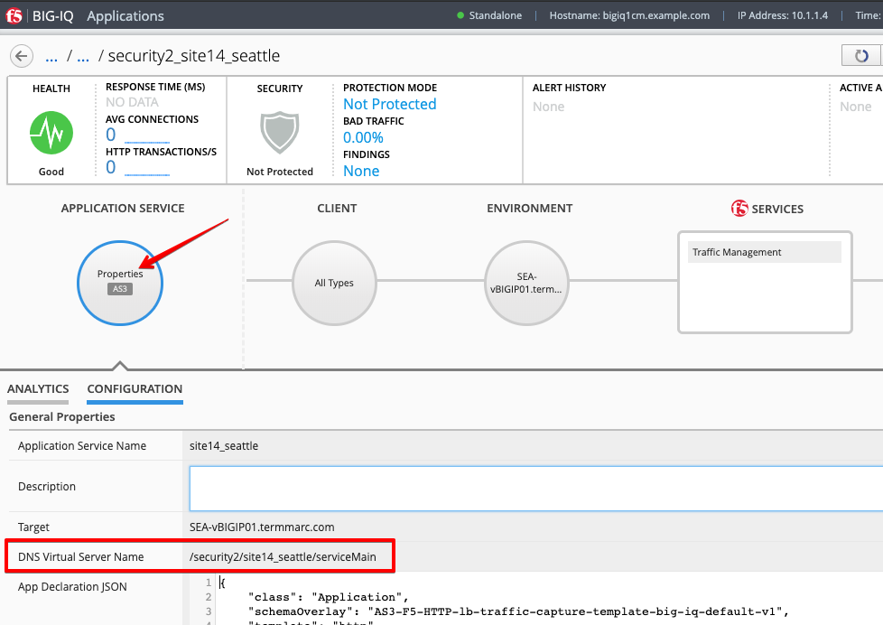
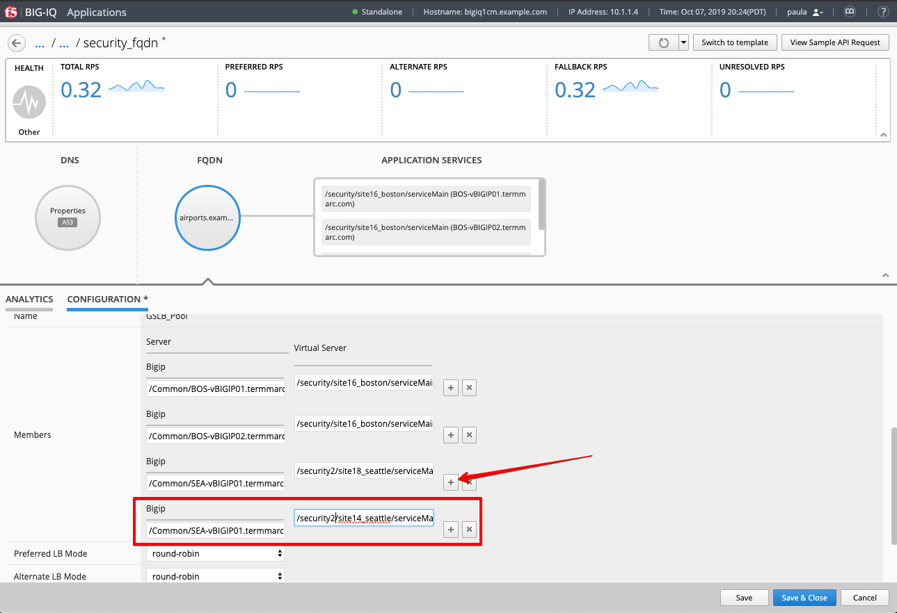
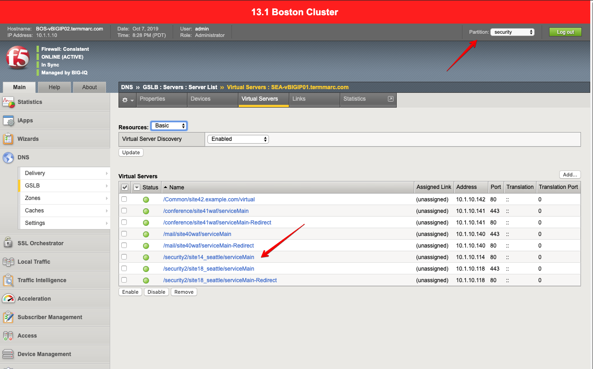
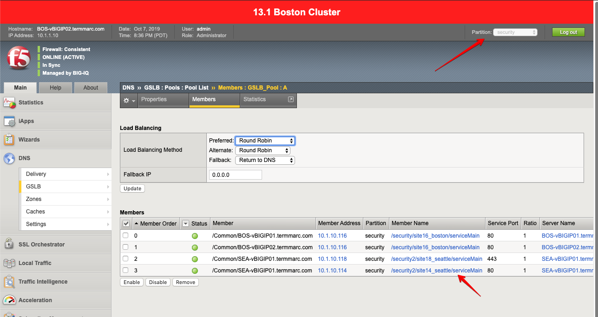

Lab 4.2: DNS Application Service Creation
-----------------------------------------

1. Connect as **paula**. Navigate to the ``airport_security`` Application.

This Application is composed of 3 Application Services:

- ``security_site16_boston``: Application Service serving a security app located in Boston.
- ``security2_site18_seattle``: Application Service serving a the same security app but located in Seattle.
- ``security_fqdn``: This the Wide-IP service serving the previous Application Services located in Boston and Seattle. 
  The FQDN for this Wide-IP is **airports.example.com**.

.. note:: A wide IP maps a fully-qualified domain name (FQDN) to one or more pools of virtual servers that host the content of a domain. 

2. Let's deploy a 3rd Application Service serving a the same security app also located in Seattle 
   as there is more demand in traffic in this part of the world. Select Create Application to Create an Application Service:

+----------------------------------------------------------------------------------------------------+
| Application properties:                                                                            |
+----------------------------------------------------------------------------------------------------+
| * Grouping = Part of an Existing Application                                                       |
| * Application Name = ``airport_security``                                                          |
| * Description = ``airports.example.com``                                                           |
+----------------------------------------------------------------------------------------------------+
| Select an Application Service Template:                                                            |
+----------------------------------------------------------------------------------------------------+
| * Template Type = Select ``AS3-F5-HTTP-lb-traffic-capture-template-big-iq-default [AS3]``          |
+----------------------------------------------------------------------------------------------------+
| General Properties:                                                                                |
+----------------------------------------------------------------------------------------------------+
| * Application Service Name = ``site14_seattle``                                                    |
| * Target = ``SEA-vBIGIP01.termmarc.com``                                                           |
| * Tenant = ``security2``                                                                           |
+----------------------------------------------------------------------------------------------------+
| Analytics_Profile. Keep default                                                                    |
+----------------------------------------------------------------------------------------------------+
| HTTP_Profile. Keep default                                                                         |
+----------------------------------------------------------------------------------------------------+
| Pool                                                                                               |
+----------------------------------------------------------------------------------------------------+
| * Members: ``10.1.20.120``                                                                         |
+----------------------------------------------------------------------------------------------------+
| Service_HTTP                                                                                       |
+----------------------------------------------------------------------------------------------------+
| * Virtual addresses: ``10.1.10.114``                                                               |
+----------------------------------------------------------------------------------------------------+

.. image:: ../pictures/module4/lab-2-2.png
  :scale: 70%
  :align: center

3. Once ``security_site14_seattle`` new Application Service has been created, you can see it on **Paula**'s application dashboard.

4. Click on the ``security_site14_seattle`` application services, then under Properties,
   look for the value of **DNS Virtual Server Name**.

5. Navigate back to the ``airport_security`` Application, under **FQND** > **CONFIGURATION** tab, scroll down and
   add the new Member and click on **Save & Close**.

+----------------+---------------------------------------+
| Bigip          | /Common/SEA-vBIGIP01.termmarc.com     |
+----------------+---------------------------------------+
| Virtual Server | /security2/site14_seattle/serviceMain |
+----------------+---------------------------------------+

Notice the new Application Service have been added under *APPLICATION SERVICES*.

.. image:: ../pictures/module4/lab-2-6.png
  :scale: 70%
  :align: center

6. Now, let's look on the BIG-IP and verify the Application is correctly deployed in partition ``security``.
   Logon to ``BOSvBIGIP01.termmarc.com`` BIG-IP from UDF. Select the partition ``security`` and look at 
   the objects created on the BIG-IP.

Under DNS > GSLB > Servers > Service List

Under DNS > GSLB > Pools > Pool List > GSLB_Pool > Members

