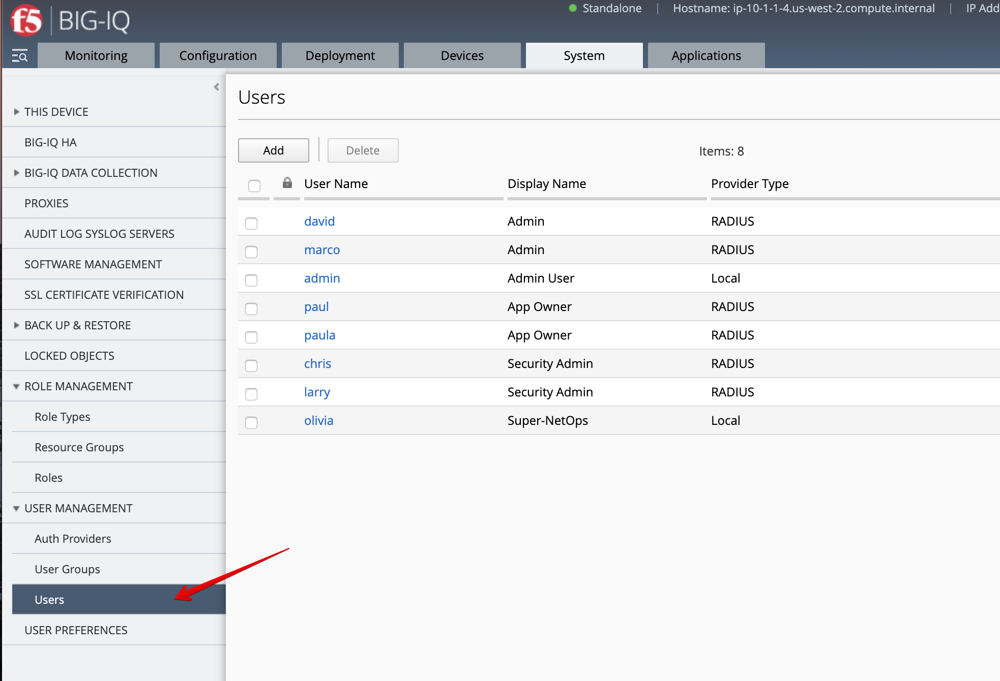
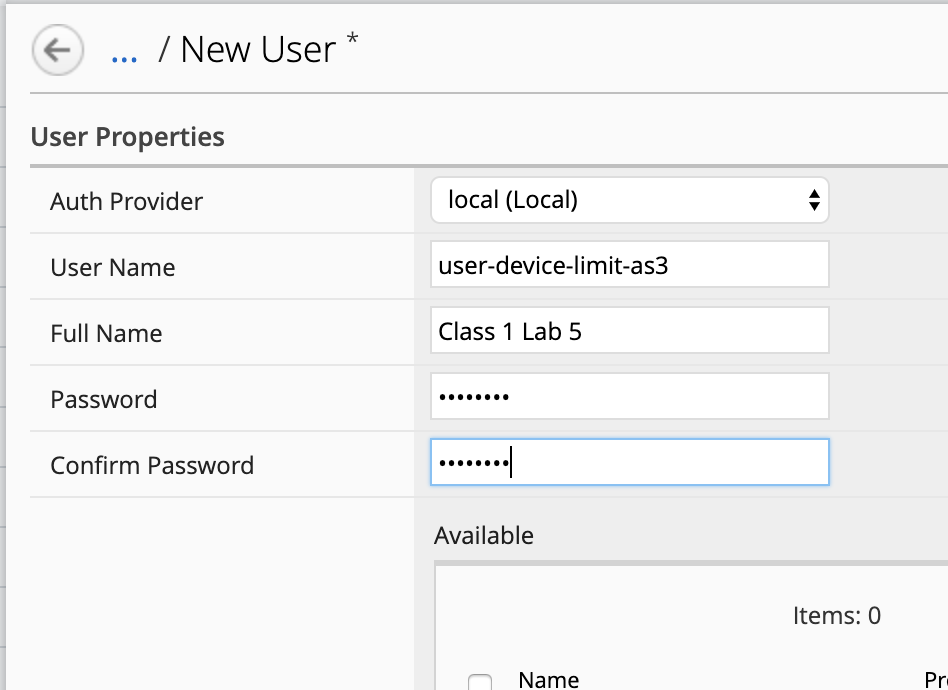
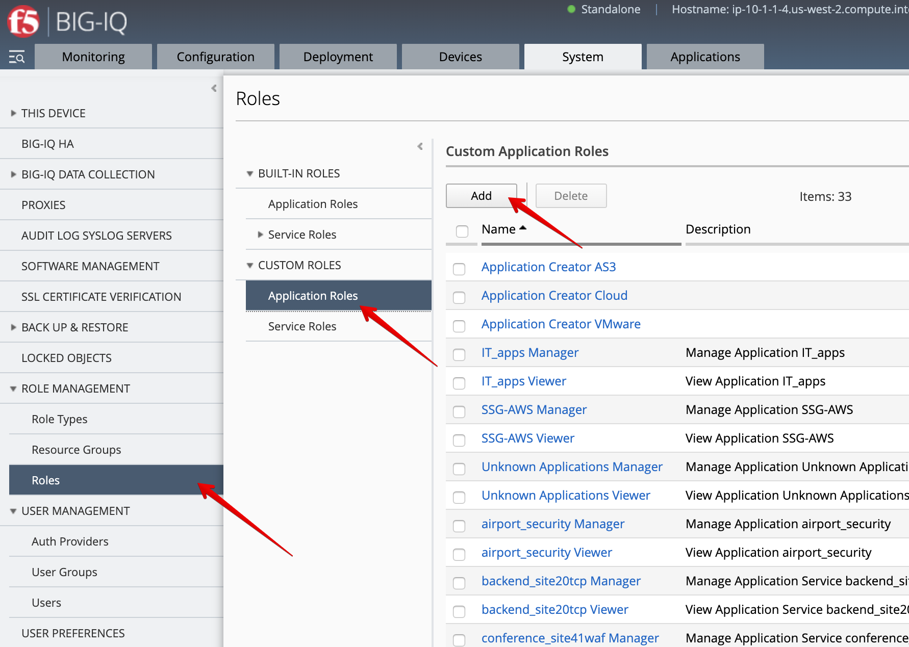
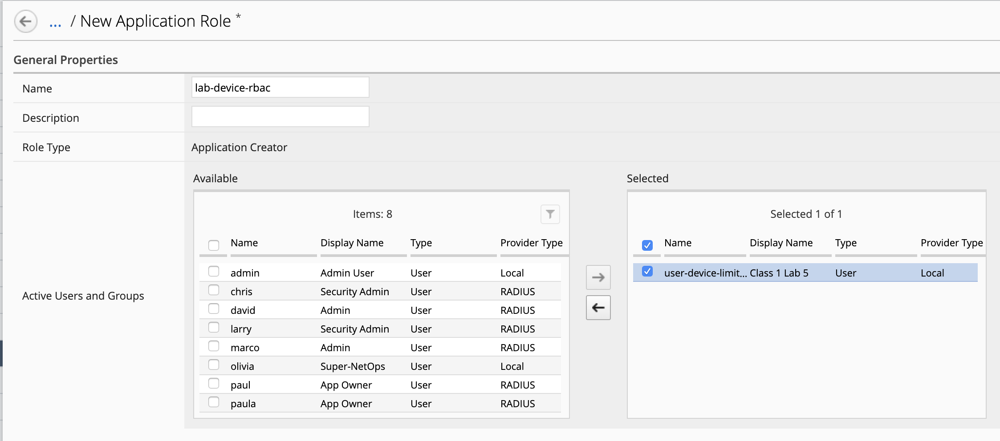
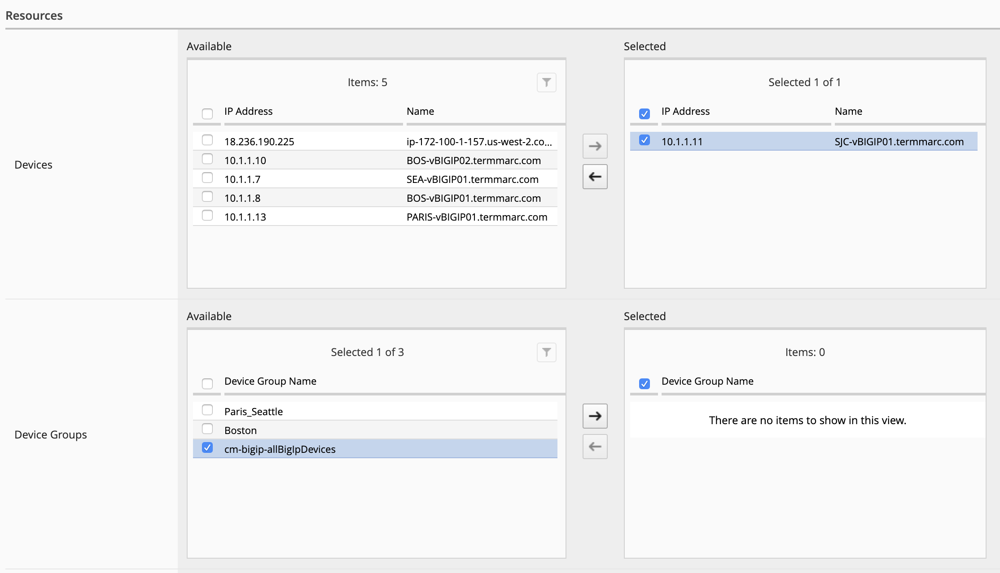
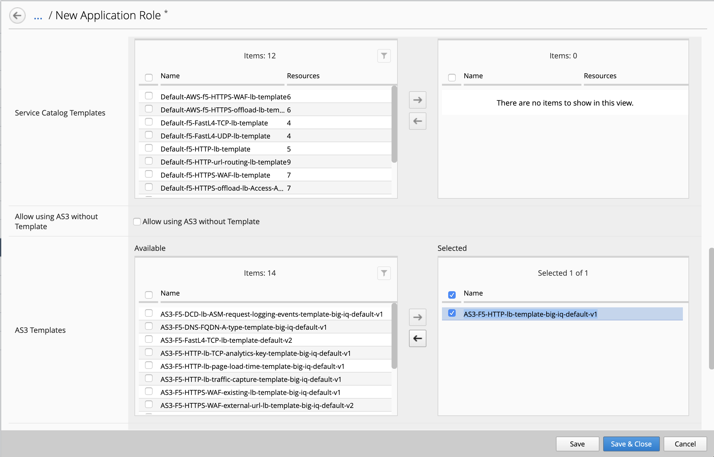
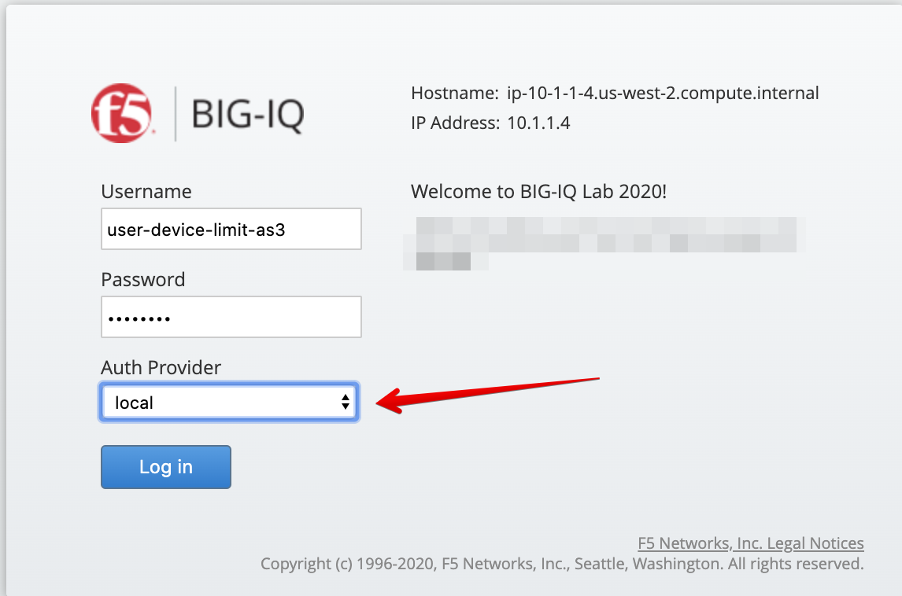
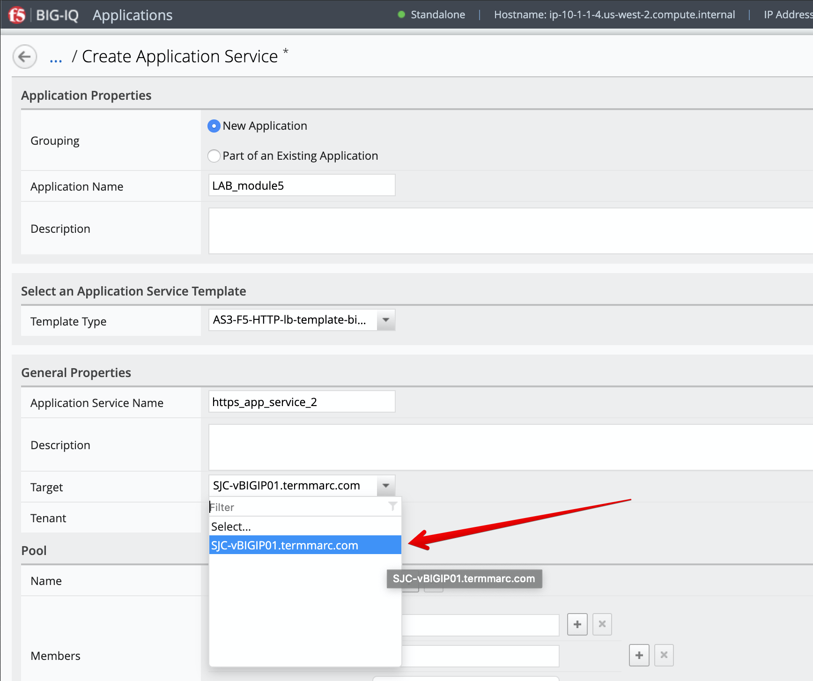
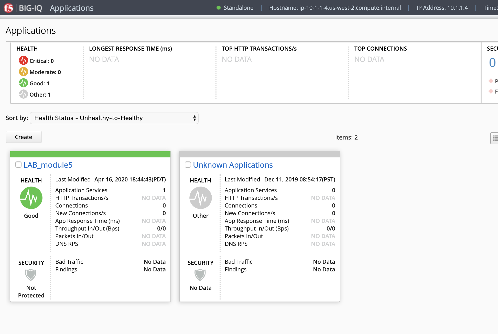
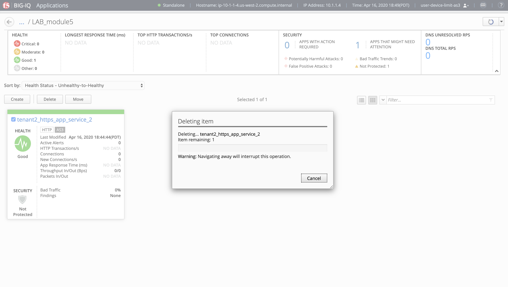

Module 5: Limit available devices for AS3 Application Services (new 7.1)
========================================================================

**[New 7.1.0]**

1. Login to BIG-IQ as **david** by opening a browser and go to: ``https://10.1.1.4``

2. Navigate to System > User Management > Users

3. Click on **Add** to create the user.

- User Name: ``user-device-limit-as3``
- Full Name: ``Class 1 Lab 5``
- Password: ``password``

Save & Close

4. Navigate to System > Role Management > Roles Custom

Roles > Application Roles

5. Click on **Add** and fill out below details to create the custom application role.

- Name: ``lab-device-rbac``
- Active Users and Groups: ``user-device-limit-as3``

- Devices: ``10.1.1.11 SJC-vBIGIP01.termmarc.com``
- Device Groups: *Empty*

- AS3 Templates: ``AS3-F5-HTTP-lb-template-big-iq-default-v1``

6. Logout as **david** and log back in as **user-device-limit-as3** and click **Create** application.

7. Select Create Application to Create an Application Service:

+----------------------------------------------------------------------------------------------------+
| Application properties:                                                                            |
+----------------------------------------------------------------------------------------------------+
| * Grouping = New Application                                                                       |
| * Application Name = ``LAB_module5``                                                               |
+----------------------------------------------------------------------------------------------------+
| Select an Application Service Template:                                                            |
+----------------------------------------------------------------------------------------------------+
| * Template Type = Select ``AS3-F5-HTTP-lb-template-big-iq-default [AS3]``                          |
+----------------------------------------------------------------------------------------------------+
| General Properties:                                                                                |
+----------------------------------------------------------------------------------------------------+
| * Application Service Name = ``https_app_service_2``                                               |
| * Target = ``SJC-vBIGIP01.termmarc.com``                                                           |
| * Tenant = ``tenant2``                                                                             |
+----------------------------------------------------------------------------------------------------+
| Analytics_Profile. Keep default                                                                    |
+----------------------------------------------------------------------------------------------------+
| Pool                                                                                               |
+----------------------------------------------------------------------------------------------------+
| * Members: ``10.1.20.124``, port ``80``                                                            |
| * Members: ``10.1.20.125``, port ``80``                                                            |
+----------------------------------------------------------------------------------------------------+
| Service_HTTP                                                                                       |
+----------------------------------------------------------------------------------------------------+
| * Virtual addresses: ``10.1.10.120``                                                               |
+----------------------------------------------------------------------------------------------------+
| HTTP_Profile. Keep default                                                                         |
+----------------------------------------------------------------------------------------------------+

Notice the user doesn't have access to the other BIG-IP available in the system.
	
8. Click **Create**.
  
9. Check the Application ``LAB_module5`` has been created.

.. note:: If not visible, refresh the page. It can take few seconds for the application service to appears on the dashboard.

10. Finally, remove the application service ``https_app_service_2`` and the application ``LAB_module5``.

