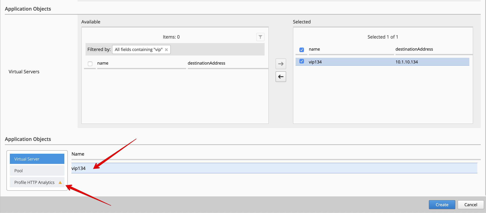
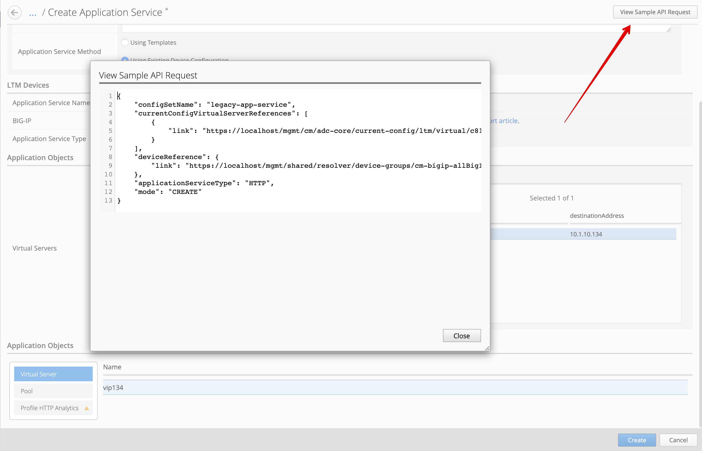
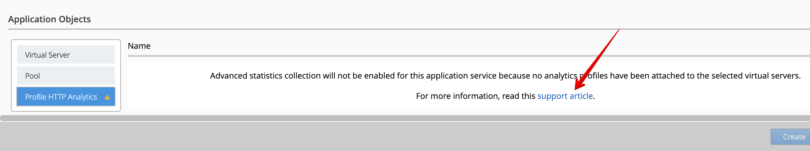
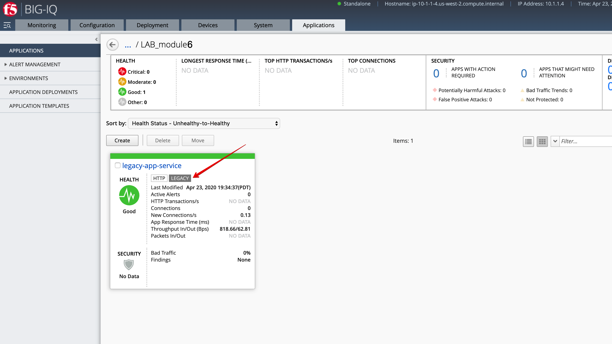
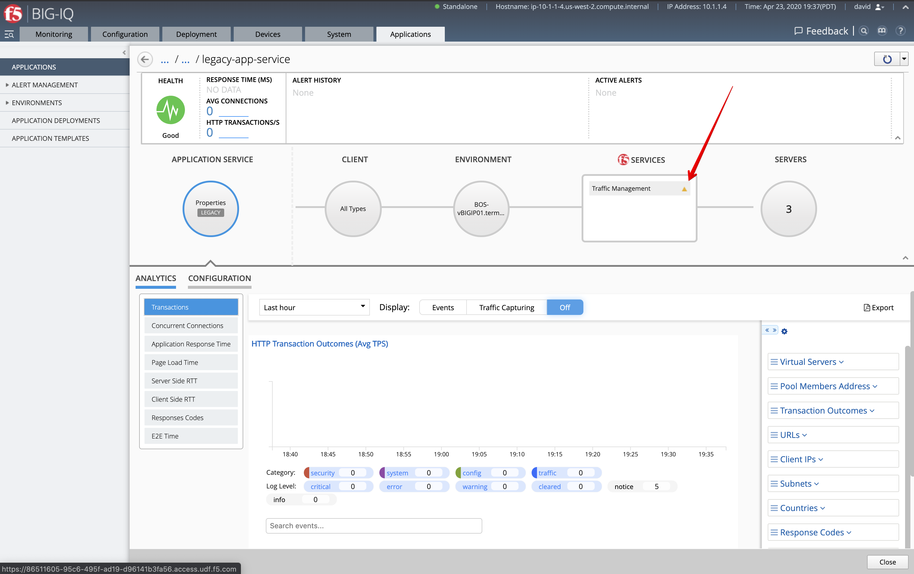

Lab 6.1: HTTP Legacy Application Creation
-----------------------------------------

In this lab you will add an existing legacy application (by choosing the virtual server(s) representing that application) 
to the Application dashboard. Note this will not "re-deploy" the application or change anything on the BIG-IP itself. 
Rather this will take the virtual server and all its child objects and group them together as an Application 
within the Application dashboard of BIG-IQ.

1. Login to BIG-IQ as **david** by opening a browser and go to: ``https://10.1.1.4``

2. Navigate to Applications > Applications. Click on **Create** to Create an Application Service:

.. image:: ../pictures/module6/lab-1-1.png
  :scale: 40%
  :align: center

Fill out the necessary fields.

+----------------------------------------------------------------------------------+
| Application properties:                                                          |
+----------------------------------------------------------------------------------+
| * Grouping = New Application                                                     |
| * Application Name = ``LAB_module6``                                             |
+----------------------------------------------------------------------------------+
| Application Service Method properties:                                           |
+----------------------------------------------------------------------------------+
| Select: Using Existing Device Configuration                                      |
+----------------------------------------------------------------------------------+
| General Properties:                                                              |
+----------------------------------------------------------------------------------+
| * Application Service Name = ``legacy-app-service``                              |
| * Target = ``BOS-vBIGIP01.termmarc.com``                                         |
| * Application Service Type = ``HTTP + TCP``                                      |
+----------------------------------------------------------------------------------+
| Virtual Servers: ``vip134``                                                      |
+----------------------------------------------------------------------------------+

Move *vip134* over to the **Selected** column and then scroll down.

.. image:: ../pictures/module6/lab-1-2.png
  :scale: 40%
  :align: center

.. note:: The warning you see below in the **Application Objects** section is informing you that you don't have an Analytics profile attached to the VIP, 
          this is required to collect HTTP analytics on BIG-IQ. You will create the application without the analytics
          profile, and then you will go back and add it later in the lab.

.. note:: You can add up to 5 Virtual IP addresses to a single Legacy Application Service.

3. Click on **View Sample API Request** in the right upper corner to see the API call
   which could be used to create this legacy application service on BIG-IQ using automation.

4. Go back to the list of objects and click on *Profile HTTP Analytics*.
   Notice the warning noting the Analytics profile is missing.

.. warning:: Review carefully `K02142132`_: Requirements and recommendations for creating a BIG-IQ application service with existing device configurations

.. _K02142132: https://support.f5.com/csp/article/K02142132

5. Click **Create**.
  
6. Check the Application ``LAB_module6`` has been created. Click on it to see the application.
   You should see an application called ``legacy-app-service``. Notice the label *LEGACY* is showing on the applications grid/tile.
   This is an indication that this application was not created with a template, and will be treated as a **legacy** 
   application.

Drill down into the application dashboard and notice no analytics are showing on the dashboard.
This is normal, the VIP does not have any analytics profiles attached to it! Hover over the warning icon in the **Traffic Management**
box under **F5 Services** to see the error.

