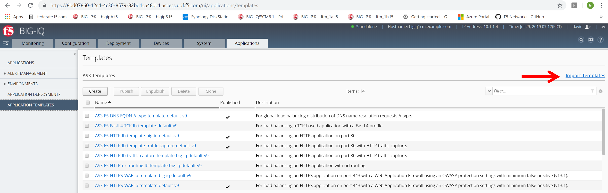

Lab 6.1: Importing AS3 templates
--------------------------------

Official documentation about AS3 via a GUI can be found: https://github.com/f5devcentral/f5-big-iq

From UDF, launch a Console/RDP session to have access to the Ubuntu Desktop. Go to Ubuntu Jumphost and select Details > XRDP and select the resolution of choice. (Tip: modern laptops with higher resolutions you might want to use 1440x900 and once XRDP is launched Zoom to 200%)

.. image:: ../pictures/module6/lab-1-1.png
  :align: center

View AS3 templates section
--------------------------
#. Logon to BIG-IQ by opening a browser and go to: 10.1.1.4

#. Go to Applications > Application Templates and review the top section which is titled “AS3 Templates”.

A new BIG-IQ v7.0 deployment will NOT include AS3 templates out of the box. If you want to start using AS3 templates which are provided by F5, then those AS3 templates can be found through the following link: https://github.com/f5devcentral/f5-big-iq

Import AS3 templates
--------------------
#. Select “Import Templates” at the right top corner.

#. Make yourself familiar with the Github page and understand which AS3 templates are available.

#. When the AS3 templates are already imported in BIG-IQ you don’t need to perform step 5, instead continue with step 6.

#. Use the provided instructions on the Github page to import the templates into BIG-IQ.

#. Walk through the provided templates and select them to understand the structure. If familiar with AS3 you will notice the structure. Otherwise go make sure you have gone through module 5 or visit: https://clouddocs.f5.com/products/extensions/f5-appsvcs-extension/latest/userguide/examples.html.
