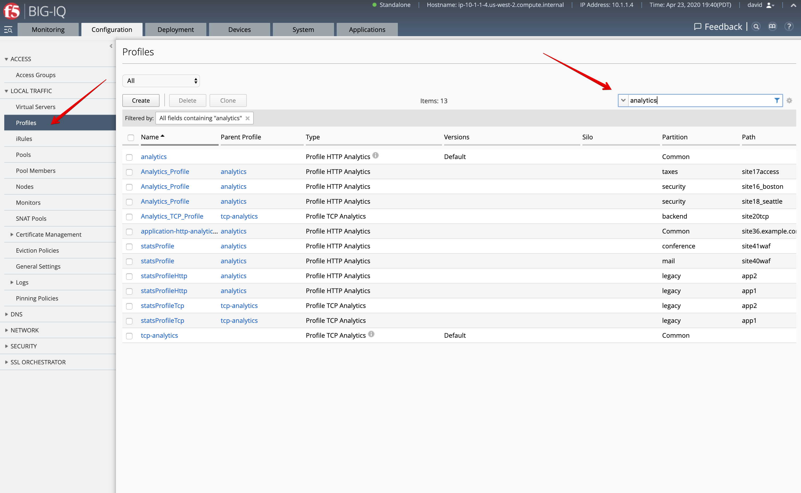
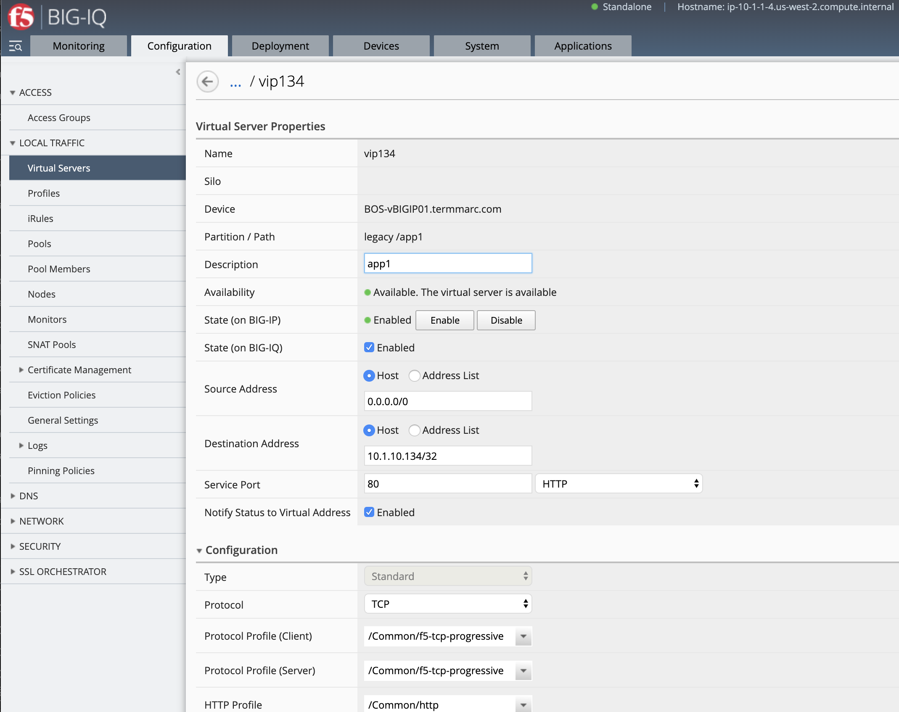
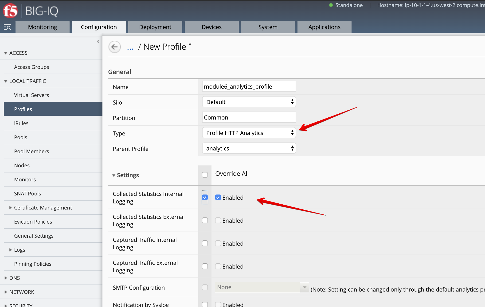
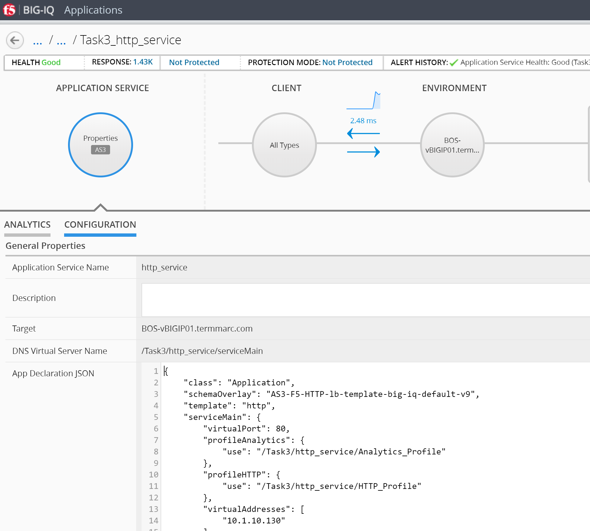
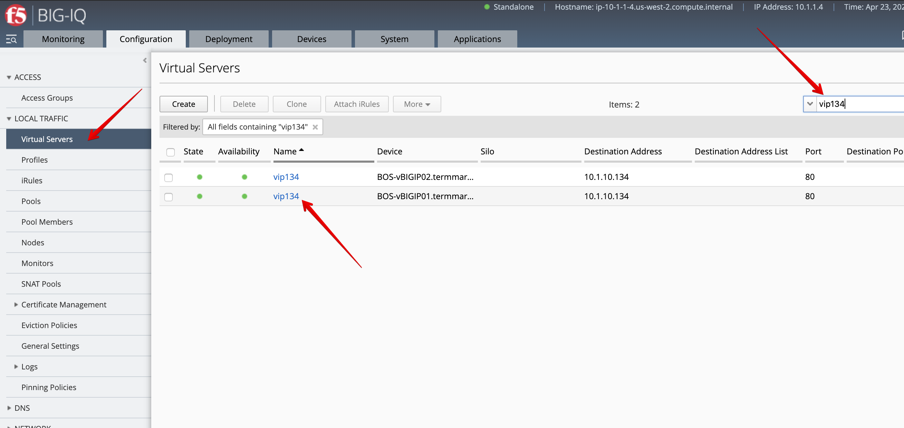
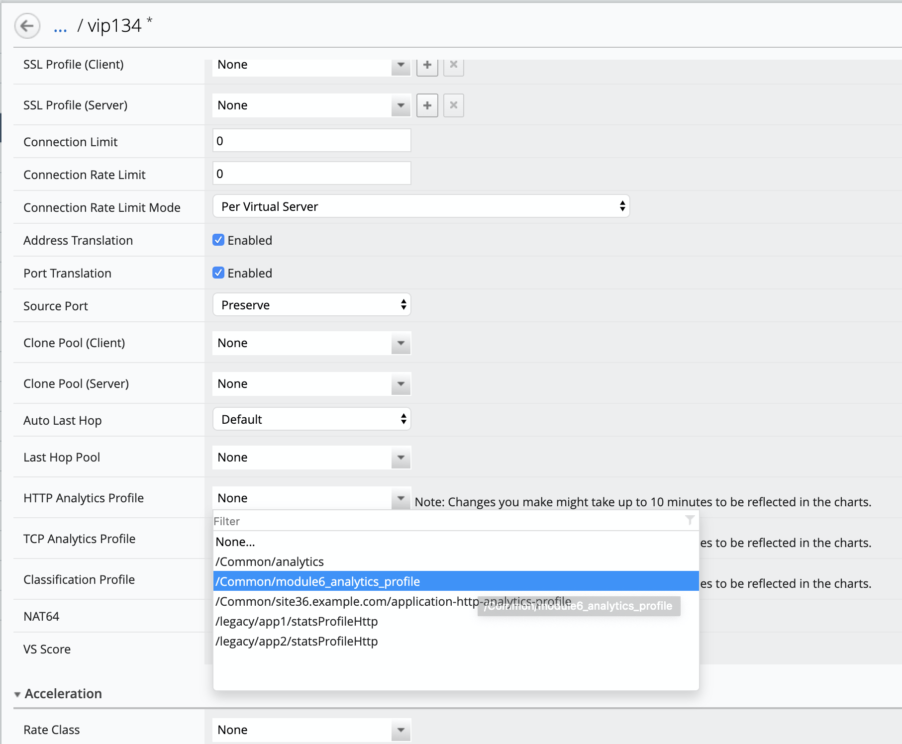
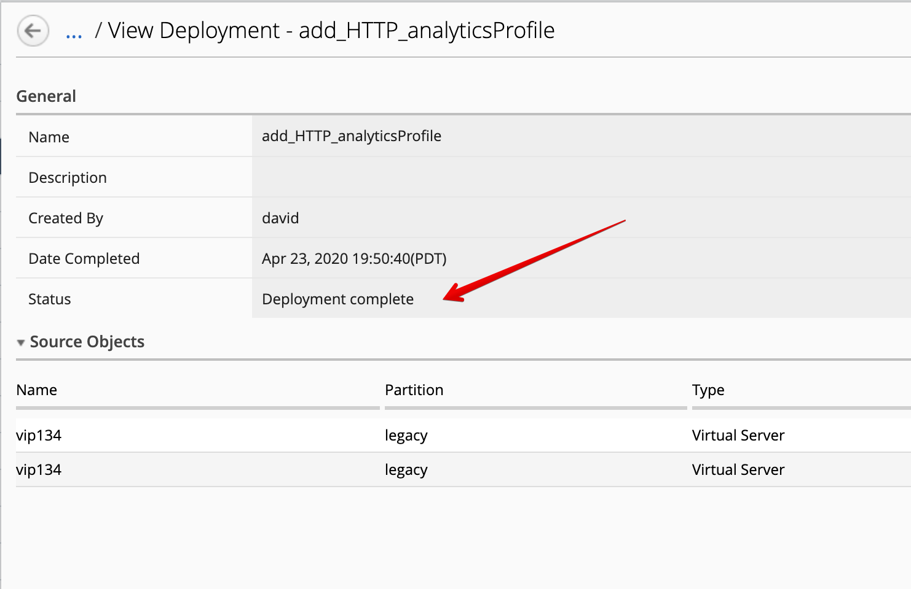
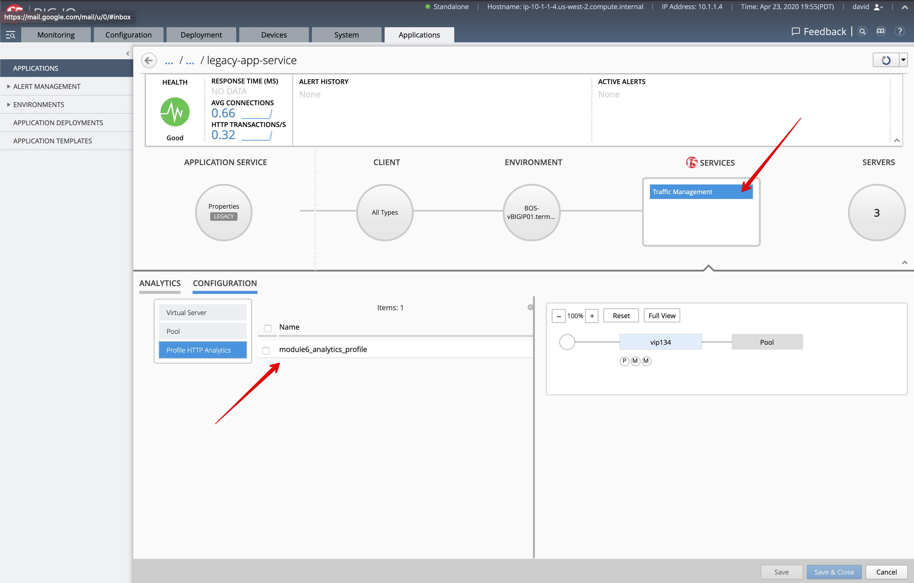
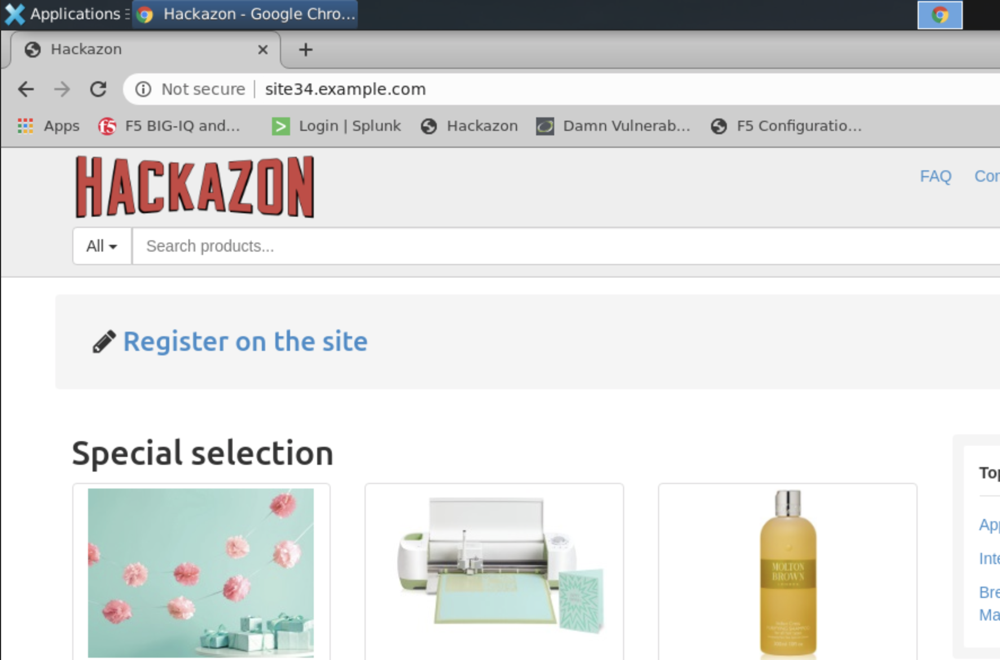
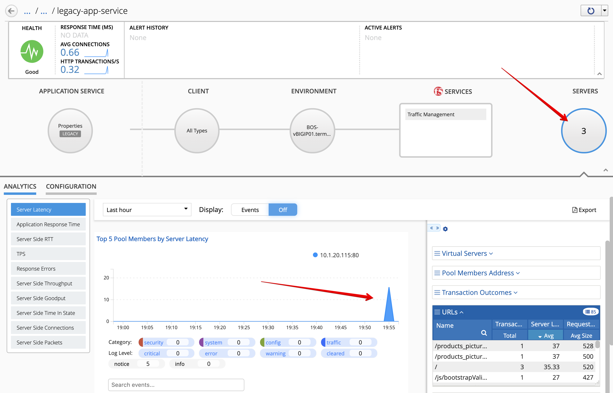

Lab 6.2: HTTP Analytics Profile Creation for Legacy
---------------------------------------------------

In this lab, David is going to create the HTTP analytics profile missing to allow the BIG-IP
to send HTTP analytics data to the BIG-IQ, which will be then showing on the Application Dashboard.

1. Go to **Configuration > Local Traffic > Profiles and filter all profile with **analytics** in their names.

2. Click on **Create**. User ``module6_analytics_profile`` as profile name, 
   Profile HTTP Analytics as Type, along with the option showing below.

**Save & Close**.

3. Go to **Configuration > Local Traffic > Virtual Servers and filter on ``vip134``.

4. Edit one of the VIP and attached the ``module6_analytics_profile``.

.. note:: You only need to do vip134 on BOS-vBIGIP01.termmarc.com.

Select the 2 VIPS and click on **Deploy**.

The deployment window opens. Type a name, select ``Deploy immediately`` for the Method.

Under the Target Device(s) section, click on ``Find Relevant Devices``
and select the **SEA-vBIGIP01.termmarc.com**. Then, click on Deploy.

.. image:: ../pictures/module6/lab-2-7.png
  :scale: 40%
  :align: center

Wait for the deployment to complete.

5. Back on the Application tab > Application, go back to the ``legacy-app-service``.
   Under Traffic Management > Configuration, notice the warning disappeared.

.. image:: ../pictures/module6/lab-2-9.png
  :scale: 40%
  :align: center

6. From the lab environment, launch a xRDP/noVNC session to have access to the Ubuntu Desktop. 
To do this, in your lab environment, click on the *Access* button
of the *Ubuntu Lamp Server* system and select *noVNC* or *xRDP*.

.. note:: Modern laptops with higher resolutions you might want to use 1440x900 and once XRDP is launched Zoom to 200%.

Open Chrome and Firefox and navigate on the website http\:\/\/site34.example.com.

.. note:: Accept the private certificates.

7. Back on BIG-IQ dashboard, notice the HTTP traffic starts to appear.

8. By the way, notice the new **Feedback* link to the top right?

