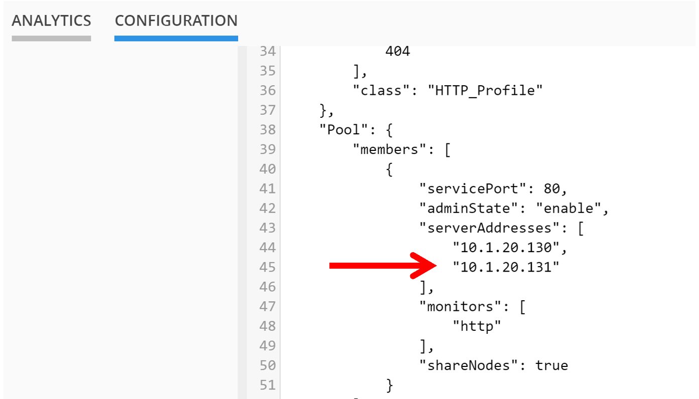
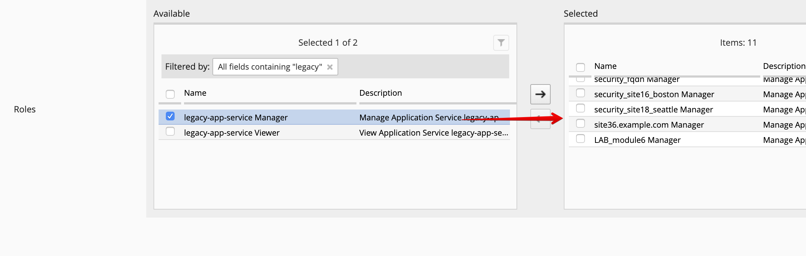
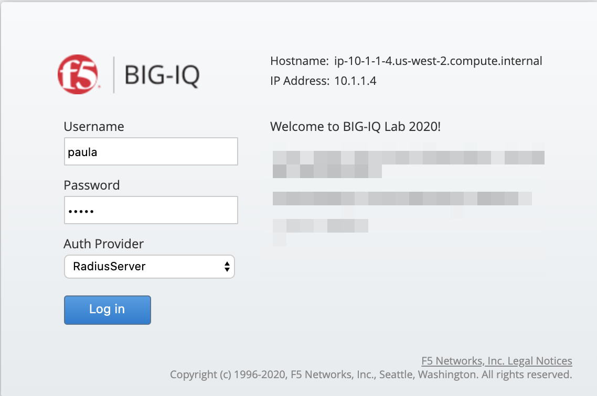
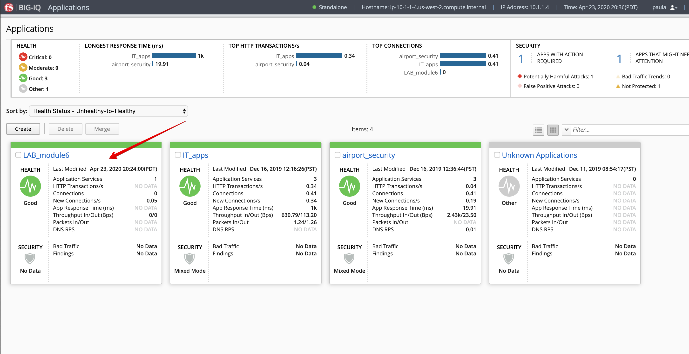
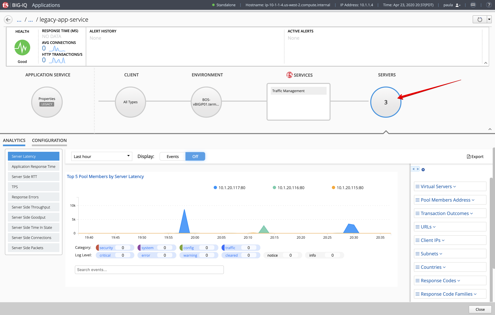
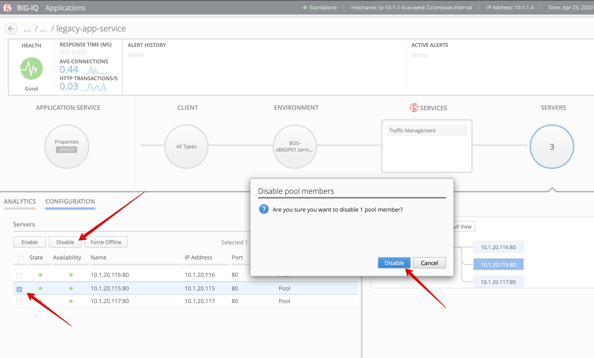
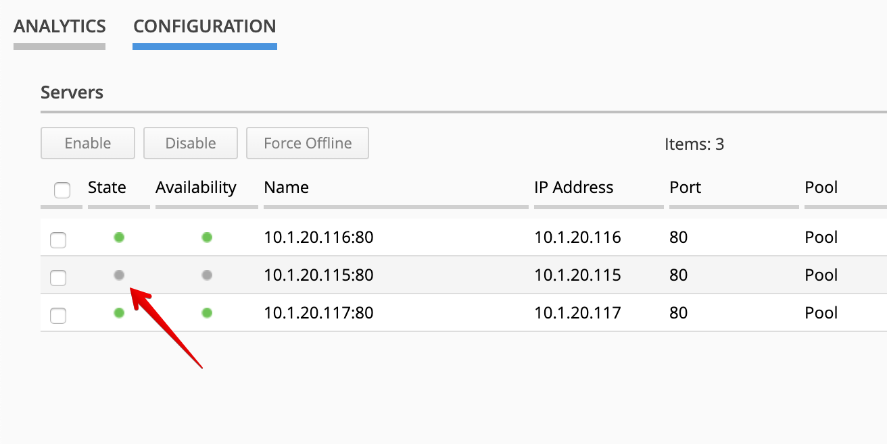

Lab 6.3: Legacy Application and RBAC: Paula workflow
----------------------------------------------------

.. note:: Estimated time to complete: **15 minutes**

.. include:: /accesslab.rst

Tasks
^^^^^

1. Login to BIG-IQ as **david**. 

2. Here we are going to add RBAC to the newly created legacy application. Go to **System > User Management > Users** and select **Paula**.

Add ``Lab_Module6 Manager`` Role as seen below.

Next add the ``legacy-app-service`` Role and then Click **Save & Close**.

3. Now logout from the **david** session and login to BIG-IQ as **paula**.

4. Select ``LAB_module6`` Application, then ``legacy-app-service`` Application Service.

5. You are now on the Paula's Application Services dashboard. Click on Servers on the right side of the screen.

6. Select Configuration and try to disable one of the Pool Member.

7. Confirm the pool member is disabled.

