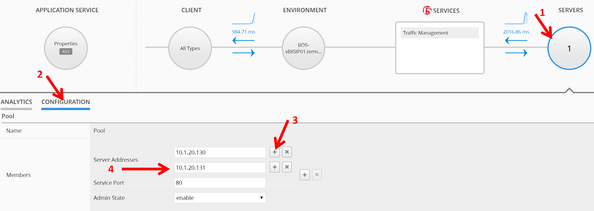

Lab 6.3: Legacy Application and RBAC: Paula workflow
----------------------------------------------------

Because the vip134 ``legacy-app-service`` was deployed on a cluster (see `known issue`_), 
we need to first re-create the Legacy Application Service ``legacy-app-service`` on BIG-IQ.
This is not needed on Standalone BIG-IP, but only on cluster.

.. _known issue: https://techdocs.f5.com/kb/en-us/products/big-iq-centralized-mgmt/releasenotes/related/relnote-supplement-big-iq-central-mgmt-7-1-0.html#A899789

1. Login to BIG-IQ as **david**.

Don't worry, the application service is only deleted on the BIG-IQ application dashboard, not on BIG-IP!

Follow `Lab 1`_  to re-create the legacy application service.

.. _Lab 1: ./lab1.html

2. Go to **System > User Management > Users and select **Paula**.

Add ``Lab_Module6 Manager`` Role.

.. image:: ../pictures/module6/lab-3-2.png
  :scale: 40%
  :align: center

Add ``legacy-app-service`` Role.

.. image:: ../pictures/module6/lab-3-3.png
  :scale: 40%
  :align: center

3. Login to BIG-IQ as **paula**.

.. image:: ../pictures/module6/lab-3-4.png
  :scale: 40%
  :align: center

4. Select ``LAB_module6`` Application, then ``legacy-app-service``.

.. image:: ../pictures/module6/lab-3-5.png
  :scale: 40%
  :align: center

5. You are now on the Paula's Application Service dashboard. Click on Server (to the right).

.. image:: ../pictures/module6/lab-3-6.png
  :scale: 40%
  :align: center

6. Select Configuration and disable one of the Pool Member.

.. image:: ../pictures/module6/lab-3-7.png
  :scale: 40%
  :align: center

7. Confirm the pool member is disabled.

.. image:: ../pictures/module6/lab-3-8.png
  :scale: 40%
  :align: center

