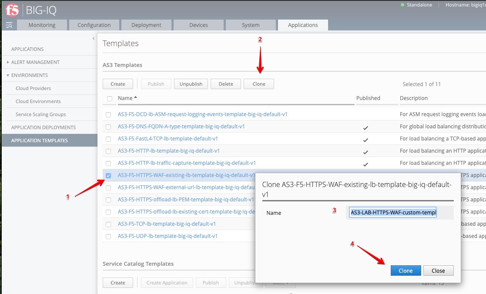
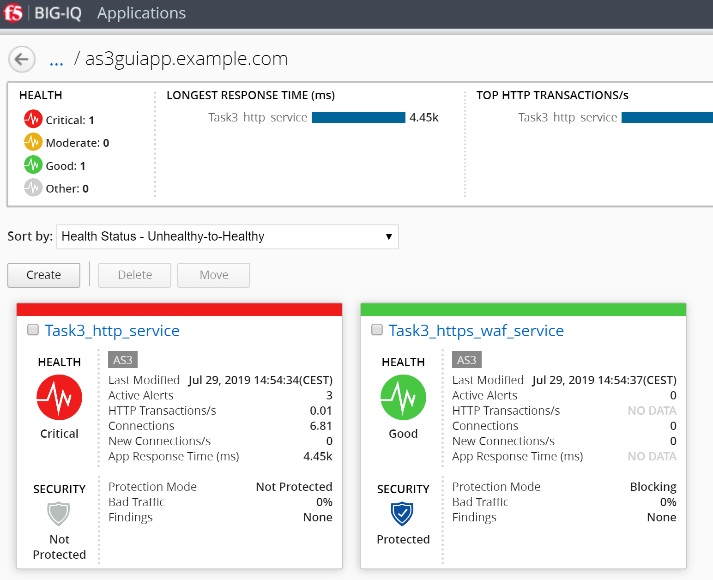
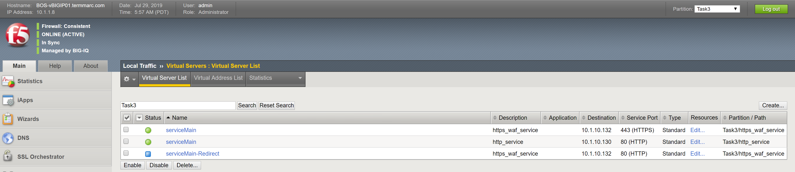
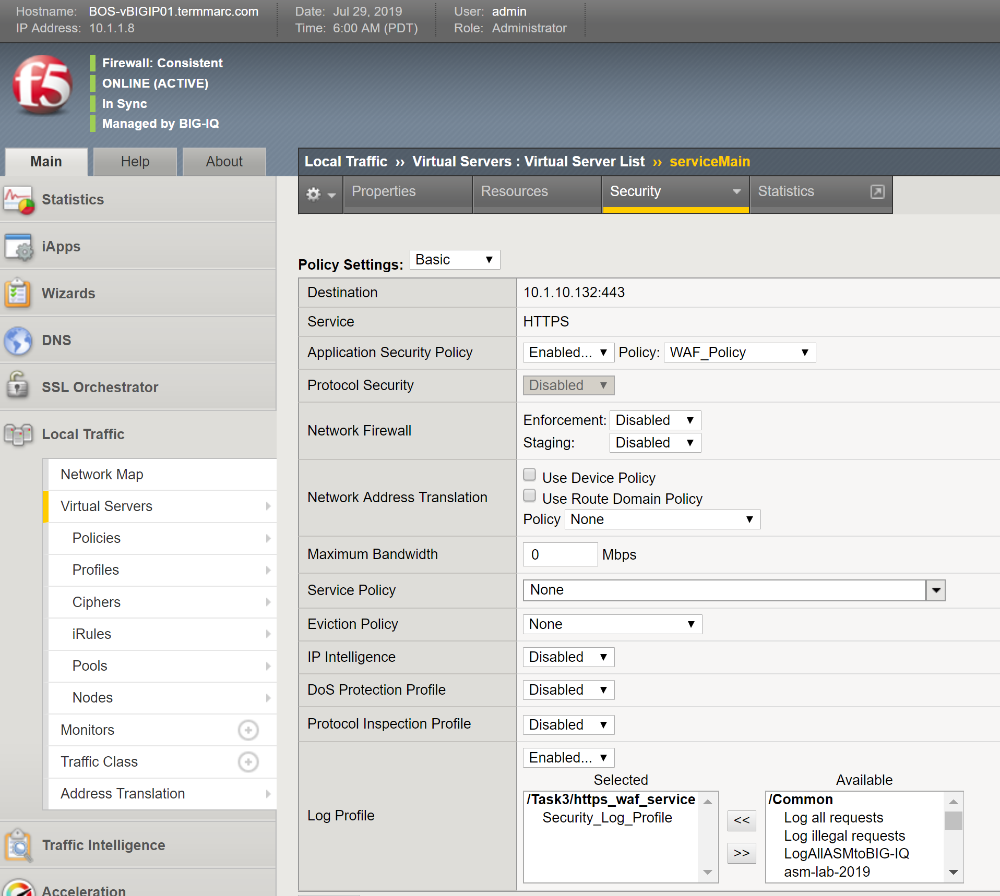

Lab 6.4: Create Custom AS3 template and deploy
----------------------------------------------
Until now we used a default AS3 template out-of-the-box for deploying an application service. It is a good practice to clone the default AS3 templates and use them more tailored to your custom needs.

1.	Logon as David and go to the Application > Application Templates and select ``AS3-F5-HTTPS-WAF-lb-template-big-iq-default-<version> [AS3]`` and press **Clone**.

2.	Give the Cloned template a name like: as3gui-https-waf-template and click Clone.

3.	Open the template ``as3guiapp-https-waf-template`` and select Certificate.

4.	Configure:
 
    PCS#12 certificate+key Options
    Certificate Schema Type: Object Schema

    Certificate
    BIG-IP component pathname: ``/Common/default.crt`` (select **editable**)
    privateKey Schema Type: Object Schema

    PrivateKey
    BIG-IP component pathname: ``/Common/default.key`` (select **editable**)
    
5.	Click **Save & Close**.

6.	Select ``as3gui-https-waf-template`` and click **Publish**.

7.	Before Paula can use this template, she needs it assigned. Use the steps in lab 6.2 to add AS3 Template ``as3guiapp-https-waf-template`` to application creator Paula.

8.	Login as Paula and double-click global application ``as3guiapp.example.com`` and click create application.

9.	Select the just created template “as3guiapp-https-waf-template” as the template type.

.. image:: ../pictures/module6/lab-4-2.png
  :align: center
  
10.	Select the just created template ``as3guiapp-https-waf-template`` as the template type.

    Configure the template as the following:
    General Properties
    Application Service Name: ``https_waf_service``
    Target: ``BOS-vBIGIP01.termmarc.com``
    Tenant: ``tenant1``

    Pool
    Members: ``10.1.20.122`` and ``10.1.20.123``
    
    Service_HTTPS
    Virtual addresses: ``10.10.1.121``

    We leave the rest of the template to its default, but notice the Certificate section, it contains the previous configured default certificate and key.

    The ``WAF_Policy`` has a URL path defined where the default WAF policy will be pulled from.

    The ``Secure_Log_Profile`` section comes with a pre-configured log server where illegal request are sent to.

11.	Click create.

12.	Check BOS-vBIGIP01.termmarc.com for the deployed configuration:

 * Select partition ``tenant1`` and search for ``https_waf_service``

 * Notice that new https_waf_service comes with a redirect.
 * Select the HTTPS VS, Select Security and hit Policies. Application Security Policy is Enabled and the Log Profile has a Security_Log_Profile selected.
 * Go to Security > Application Security > Security Policies and select WAF_Policy to get more detail of the deployed application security policy. 
 * The enforced WAF policy is taken from a Github repository which contains F5 WAF ready templates: https://github.com/f5devcentral/f5-asm-policy-templates, please use the URL to get yourself known to other available WAF ready templates.

13.	Back to the BIG-IQ and logged in as Paula, select Task3_https_waf_service. What is the enforced Protection Mode?
