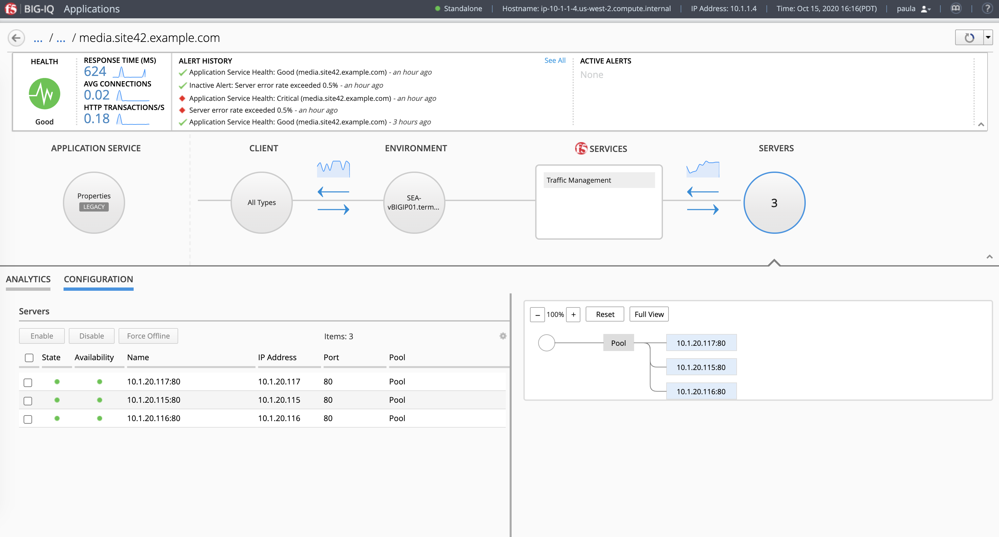
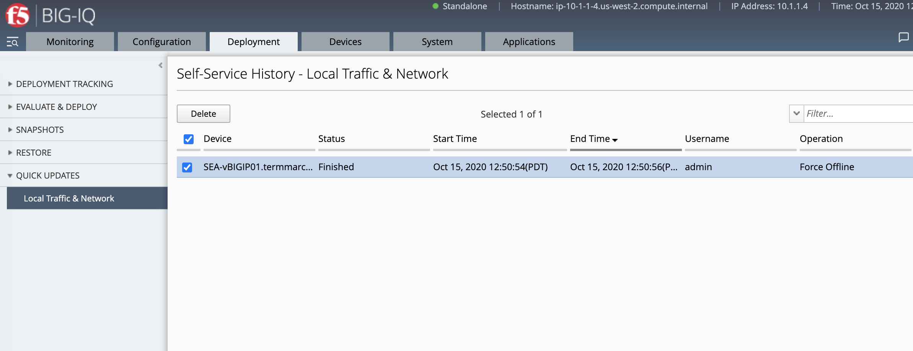
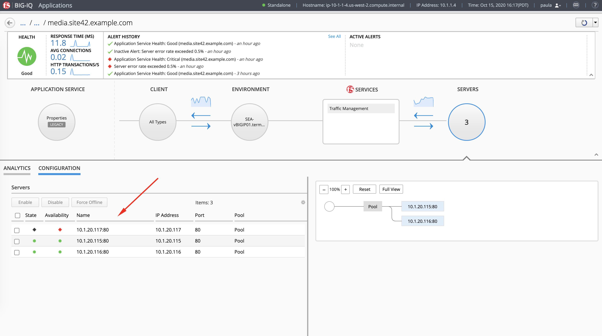

Lab 6.5: Disable/Enable Pool Member of a Legacy Application Service via the API
-------------------------------------------------------------------------------

.. note:: Estimated time to complete: **15 minutes**

In this lab, we are going to disable a pool member part of a legacy application service managed by BIG-IQ.

We are going to use the following BIG-IQ API:

- `Applications`_: API used to get the details of the legacy application service including the virtual server reference
- `Pool and Pool Members Management`_: API used to get the details of Pool objects linked to the virtual server
- `LTM/ADC Self-Service Task (enable/disable pool member)`_: API used to get the details of the pool member(s)/server(s)

.. _Applications: https://clouddocs.f5.com/products/big-iq/mgmt-api/v7.1.0/ApiReferences/bigiq_public_api_ref/r_adc_config_set_state.html?highlight=configset
.. _Pool and Pool Members Management: https://clouddocs.f5.com/products/big-iq/mgmt-api/v7.1.0/ApiReferences/bigiq_public_api_ref/r_pool_member_management_60.html
.. _LTM/ADC Self-Service Task (enable/disable pool member): https://clouddocs.f5.com/products/big-iq/mgmt-api/v7.1.0/ApiReferences/bigiq_public_api_ref/r_adc_self_service_60.html#get-mgmt-cm-adc-core-tasks-self-service

.. include:: /accesslab.rst

Open Chrome and Postman.

For Postman, click right and click on execute (wait ~2 minutes).

.. note:: If Postman does not open, open a terminal, type ``postman`` to open postman.

.. image:: ../../pictures/postman.png
    :align: center
    :scale: 60%

|

Using the declarative AS3 API, let's send the following BIG-IP configuration through BIG-IQ:

Using Postman select ``BIG-IQ Token (david)`` available in the Collections.
Press Send. This, will save the token value as **_f5_token**. If your token expires, obtain a new token by re-sending the ``BIG-IQ Token``

.. note:: The token timeout is set to 5 min. If you get the 401 authorization error, request a new token.

.. image:: ../pictures/module2/lab-1-1.png
    :align: center
    :scale: 60%

|

Find the Pool Member Reference
^^^^^^^^^^^^^^^^^^^^^^^^^^^^^^

1. Login to BIG-IQ as **paula** and navigate to **IT_apps > media.site42.example.com**. Select configuration and see the list of pool members related to this application service.

2. Open a RDP session to the system *Ubuntu Lamp Server*. Using Postman, use the **BIG-IQ Token (david)** collections to authenticate you on the BIG-IQ and save the token.
   If your token expires, obtain a new token by re-sending the ``BIG-IQ Token (david)``.

   .. warning:: The token timeout is set to 5 min. If you get the 401 authorization error, request a new token.

   Use the **BIG-IQ AS3 Declaration** Postman call and copy/paste the below URL using the GET method in order to retrieve 
   the Legacy Application **media.site42.example.co,m** details using the BIG-IQ API.
   Save the link after ``https://localhost/`` for the next query.

   ``GET https://10.1.1.4/mgmt/cm/global/config-sets?$filter=configSetName eq 'media.site42.example.com'``

.. code-block:: yaml
   :linenos:
   :emphasize-lines: 23

    {
        "totalItems": 1,
        "items": [
            {
                "id": "1d90f2b4-ab1e-3757-b4a2-0999055abf89",
                "kind": "cm:global:config-sets:configsetstate",
                "status": "CREATED",
                "selfLink": "https://localhost/mgmt/cm/global/config-sets/1d90f2b4-ab1e-3757-b4a2-0999055abf89",
                "generation": 82.0,
                "alertRuleName": "media.site42.example.com-health",
                "configSetName": "media.site42.example.com",
                "createDateTime": "2020-04-22T17:41:37.148Z",
                "lastConfigTime": "2020-04-22T17:41:37.148Z",
                "deviceReference": {
                    "link": "https://localhost/mgmt/shared/resolver/device-groups/cm-bigip-allBigIpDevices/dev..."
                },
                "lastUpdateMicros": 1.602771513789654E15,
                "applicationReference": {
                    "link": "https://localhost/mgmt/cm/global/global-apps/c671ad43-9420-354e-942a-d8b9d865e08c"
                },
                "applicationServiceType": "HTTP",
                "classicConfigReference": {
                    "link": "https://localhost/mgmt/cm/global/classic-configs/918b8779-1d1a-32a8-a3a7-7126902986ba"
                }
            }
        ],
        "generation": 26,
        "kind": "cm:global:config-sets:configsetcollectionstate",
        "lastUpdateMicros": 1602771516243558,
        "selfLink": "https://localhost/mgmt/cm/global/config-sets"
    }

3. Now, let's query the legacy app service details to get the virtual server details.
   
   ``GET /mgmt/cm/global/classic-configs/918b8779-1d1a-32a8-a3a7-7126902986ba``

.. code-block:: yaml
   :linenos:
   :emphasize-lines: 28

    {
        "id": "918b8779-1d1a-32a8-a3a7-7126902986ba",
        "kind": "cm:global:classic-configs:classicconfigstate",
        "name": "media.site42.example.com",
        "selfLink": "https://localhost/mgmt/cm/global/classic-configs/918b8779-1d1a-32a8-a3a7-7126902986ba",
        "machineId": "60bd5d38-dd9f-468b-a0f5-f3b78776b079",
        "generation": 1,
        "configObjects": [
            {
                ...
            },
            {
                ...
            },
            {
                ...
            },
            {
                ...
            },
            {
                ...
            }
        ],
        "lastUpdateMicros": 1587577297085824,
        "currentConfigVirtualServerReferences": [
            {
                "link": "https://localhost/mgmt/cm/adc-core/current-config/ltm/virtual/c100e548-106f-3476-b0f5-dacda18ae2e7"
            }
        ]
    }

4. Using the virtual server reference, do another GET on it. This call will give us the reference of the Pool Member attached to this virtual server.

   ``GET /mgmt/cm/adc-core/current-config/ltm/virtual/c100e548-106f-3476-b0f5-dacda18ae2e7``

.. code-block:: yaml
   :linenos:
   :emphasize-lines: 25

    {
        "id": "c100e548-106f-3476-b0f5-dacda18ae2e7",
        "kind": "cm:adc-core:current-config:ltm:virtual:adcvirtualstate",
        "mask": "255.255.255.255",
        "name": "vip142",
        "nat64": "disabled",
        "state": "enabled",
        "mirror": "disabled",
        "subPath": "app2",
        "gtmScore": 0,
        "policies": [],
        "selfLink": "https://localhost/mgmt/cm/adc-core/current-config/ltm/virtual/c100e548-106f-3476-b0f5-dacda18ae2e7",
        "partition": "legacy",
        "rateLimit": "disabled",
        "generation": 11,
        "ipProtocol": "tcp",
        "sourcePort": "preserve",
        "autoLasthop": "default",
        "description": "app2",
        "vlansEnabled": "disabled",
        "addressStatus": "yes",
        "poolReference": {
            "id": "ef21f8dd-c75d-328d-8f21-8816a76d8c1b",
            "kind": "cm:adc-core:current-config:ltm:pool:adcpoolstate",
            "link": "https://localhost/mgmt/cm/adc-core/current-config/ltm/pool/ef21f8dd-c75d-328d-8f21-8816a76d8c1b",
            "name": "Pool",
            "subPath": "app2",
            "partition": "legacy"
        },
        ...
    }

5. Finally, let's retrieve the Pool Members or Servers belonging to this Pool.

   ``GET /mgmt/cm/adc-core/current-config/ltm/pool/ef21f8dd-c75d-328d-8f21-8816a76d8c1b/members``

.. code-block:: yaml
   :linenos:
   :emphasize-lines: 9, 19, 29

    {
        "items": [
            {
                "id": "6bd14736-285f-3338-850d-ff2378817fc6",
                "kind": "cm:adc-core:current-config:ltm:pool:members:adcpoolmemberstate",
                "name": "10.1.20.117:80",
                "port": 80,
                "ratio": 1,
                "selfLink": "https://localhost/mgmt/cm/adc-core/current-config/ltm/pool/ef21f8dd-c75d-328d-8f21-8816a76d8c1b/members/6bd14736-285f-3338-850d-ff2378817fc6",
                "partition": "Common",
                ...
            },
            {
                "id": "a4040191-a157-332a-a3d4-c3ca91ff8be2",
                "kind": "cm:adc-core:current-config:ltm:pool:members:adcpoolmemberstate",
                "name": "10.1.20.115:80",
                "port": 80,
                "ratio": 1,
                "selfLink": "https://localhost/mgmt/cm/adc-core/current-config/ltm/pool/ef21f8dd-c75d-328d-8f21-8816a76d8c1b/members/a4040191-a157-332a-a3d4-c3ca91ff8be2",
                "partition": "Common",
                ...
            },
            {
                "id": "63c034a9-9369-3316-93d3-daa0e3a5d62d",
                "kind": "cm:adc-core:current-config:ltm:pool:members:adcpoolmemberstate",
                "name": "10.1.20.116:80",
                "port": 80,
                "ratio": 1,
                "selfLink": "https://localhost/mgmt/cm/adc-core/current-config/ltm/pool/ef21f8dd-c75d-328d-8f21-8816a76d8c1b/members/63c034a9-9369-3316-93d3-daa0e3a5d62d",
                "partition": "Common",
                ...
            }
        ],
        "generation": 1,
        "kind": "cm:adc-core:current-config:ltm:pool:members:adcpoolmembercollectionstate",
        "lastUpdateMicros": 1602785635862603,
        "selfLink": "https://localhost/mgmt/cm/adc-core/current-config/ltm/pool/ef21f8dd-c75d-328d-8f21-8816a76d8c1b/members"
    }

Force offline a Pool Member
^^^^^^^^^^^^^^^^^^^^^^^^^^^

1. Now, we are going to force-offline one of the pool member using the BIG-IQ API as the application team is planing to perform 
   an upgrade this specific application server ``10.1.20.117:80``. We are using the resrouceReference of the pool 
   member to perform the operation to force-offline and turn down this pool member on the F5 load balancer.

   ``POST /mgmt/cm/adc-core/tasks/self-service``

.. note:: Do not forget to replace ``current-config`` with ``working-config`` in the link.

          - **Working configuration** is the BIG-IP service configuration located on BIG-IQ. 
            This is the configuration you manage, edit, and deploy to your managed BIG-IP devices.
          - **Current configuration** is the BIG-IP service configuration running on a BIG-IP device, 
            which can be different than the working configuration on BIG-IQ if changes were made directly on that BIG-IP device.

.. code-block:: yaml
   :linenos:
   :emphasize-lines: 3

    {  
        "resourceReference":{
            "link":"https://localhost/mgmt/cm/adc-core/working-config/ltm/pool/ef21f8dd-c75d-328d-8f21-8816a76d8c1b/members/6bd14736-285f-3338-850d-ff2378817fc6"
        },
        "operation":"force-offline"
    }

Result:

.. code-block:: yaml
   :linenos:
   :emphasize-lines: 9

    {
        "resourceReference": {
            "link": "https://localhost/mgmt/cm/adc-core/working-config/ltm/pool/ef21f8dd-c75d-328d-8f21-8816a76d8c1b/members/6bd14736-285f-3338-850d-ff2378817fc6"
        },
        "operation": "force-offline",
        "id": "9bc4e08b-d7df-4051-9390-01d0be11bf0a",
        "status": "STARTED",
        ...
        "selfLink": "https://localhost/mgmt/cm/adc-core/tasks/self-service/9bc4e08b-d7df-4051-9390-01d0be11bf0a"
    }

2. Once the previous post is made, you can check the status by checking:

   ``GET /mgmt/cm/adc-core/tasks/self-service/c7d49112-5927-4c3f-b4d0-fff253494cf9``

.. code-block:: yaml
   :linenos:
   :emphasize-lines: 4

    {
        "id": "9bc4e08b-d7df-4051-9390-01d0be11bf0a",
        "kind": "cm:adc-core:tasks:self-service:selfservicetaskitemstate",
        "status": "FINISHED",
        "selfLink": "https://localhost/mgmt/cm/adc-core/tasks/self-service/9bc4e08b-d7df-4051-9390-01d0be11bf0a",
        "username": "admin",
        "operation": "force-offline",
        ...
    }

3. Login to BIG-IQ as **david** and navigate to **Deployment > Quick Updates > Local Traffic & Network** and notice the change is being tracked under the deployment tab.

4. Now logout from the **david** session and login to BIG-IQ as **paula** and notice the pool member ``10.1.20.117:80`` is down as desired.

