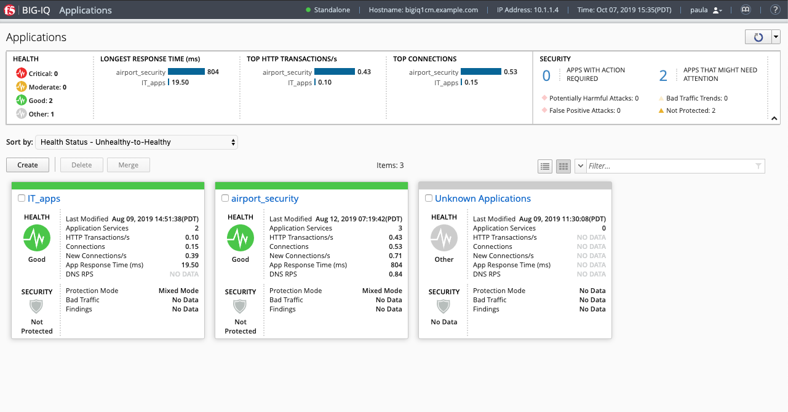
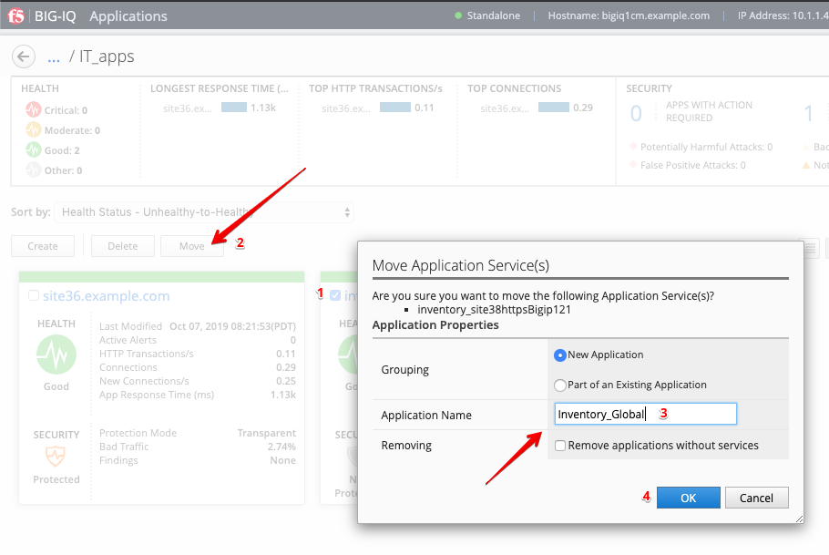

Lab 7.1: Move Application Services in BIG-IQ
--------------------------------------------

1. Connect as **paula**.

3 Applications are showing on the dashboard: ``IT_apps``, ``airport_security`` and ``Unknown Applications``.

.. warning:: Starting 7.0, BIG-IQ displays AS3 application services created using the AS3 Declare API as Unknown Applications.
             You can move those application services using the GUI, the `Move/Merge API`_ or create it directly into 
             Application in BIG-IQ using the `Deploy API`_ to define the BIG-IQ Application name.

.. _Move/Merge API: https://clouddocs.f5.com/products/big-iq/mgmt-api/latest/ApiReferences/bigiq_public_api_ref/r_public_api_references.html
.. _Deploy API: https://clouddocs.f5.com/products/big-iq/mgmt-api/latest/ApiReferences/bigiq_public_api_ref/r_public_api_references.html

2. Navigate into the ``IT_apps`` Application, select ``inventory_site38httpsBigip121`` Application Service and click on **Move**.
   A windwo opens. Select *New Application*, set ``Inventory_Global`` for the Application Name, then click **OK**.

3. The Application Service ``inventory_site38httpsBigip121`` is now under Application ``Inventory_Global``.

.. image:: ../pictures/module7/lab-1-3.png
  :scale: 70%
  :align: center

.. note:: This operation did not deployed or changed anything on the BIG-IP but only on the BIG-IQ.