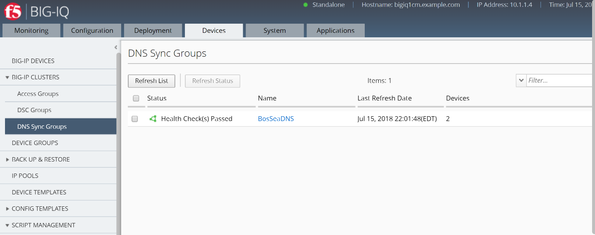
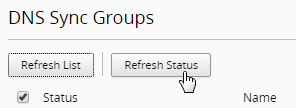
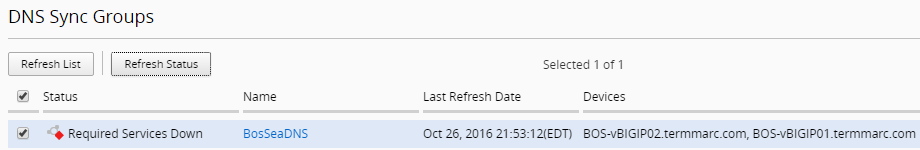
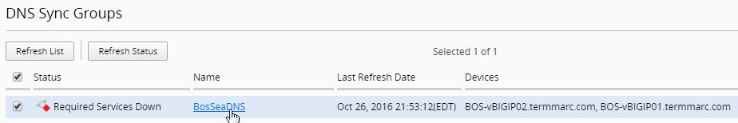
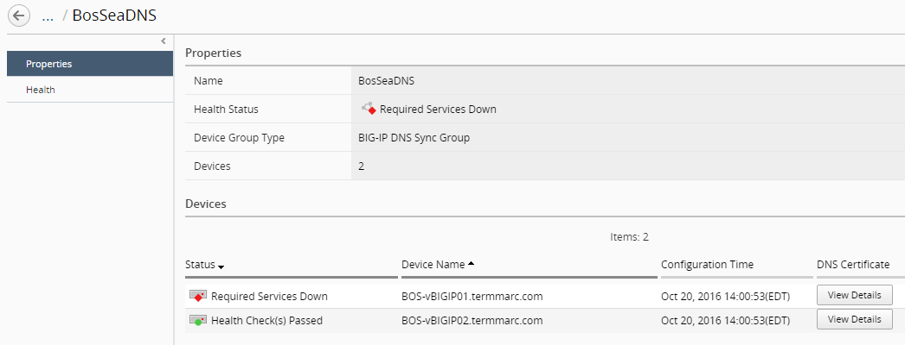
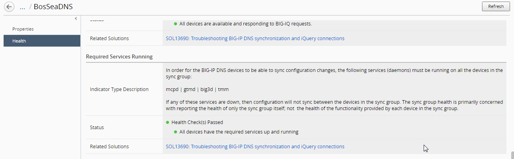

Lab 1.1: Check DNS Sync Group Health
------------------------------------

Before you can monitor the sync group health, you must add a BIG-IP
device configured in a DNS sync group to the BIG-IP Devices inventory
list, and import the LTM and DNS services. For the purpose of this lab,
the sync group on BIG-IP DNS devices are already properly configured.

When you use F5 BIG-IQ Centralized Management to manage your DNS sync
group, you can monitor the health status of the group. Sync group health
relies on complete alignment of a variety of device configuration
elements. Using BIG-IQ simplifies the process of determining the health
of your DNS sync groups.

At the top of the screen > click Devices.

On the left, click BIG-IP CLUSTERS > DNS Sync Groups.

The screen displays the list of DNS sync groups defined on this device. A health indicator icon and a message describe the status of each group.

|image0|

To view the general properties for a sync group, click the sync group name.

|image1|

The screen displays the properties for the selected group. This screen shows an overview of your DNS sync group health. Under Status, you can see the current state (for example, Required Services Down, or Health Check(s) Passed) for each device in the group.

To view the health for an individual sync group member, on the left click HEALTH.

|image2|

The Health screen displays detailed information for each factor that contributes to the health of a DNS sync group. Following a definition of each factor, a Status row provides additional detail.

For each indicator, the most serious issues impacting that indicator are listed first. Finally, if the status for a health indicator is not Health Check(s) Passed, the Recommended Action setting describes what you can do to correct the issue.

Now, we will introduce a problem in the DNS Sync Group to see how that appears in BIG-IQ.

Log into the command line of BOS-vBIGIP01 and run the following command.

|image3|

Return to the BIG-IQ GUI and select the status check box and then click the Refresh Status button to force a refresh.

|image4|

Review the Status for the sync group(s). (This may take a minute for it to show down)

|image5|

Click on the DNS Sync Group name to get more information

|image6|

Review the Properties of the DNS Sync Group 

|image7|

Click on the Health tab to get further information. Scroll down to find the problem. 
   
|image8|

Return to the shell for BIG-IP01 and restart gtmd. 

|image9|

12.	Return to the BIG-IQ DNS Sync Group page and click on Refresh Status button again, and verify that all indicators have returned to green.
   
|image10|

.. |image1| image:: media/image2.png
   :width: 6.50000in
   :height: 2.55833in
.. |image2| image:: media/image3.png
   :width: 6.50000in
   :height: 3.65625in
.. |image3| image:: media/image4.png
   :width: 5.48890in
   :height: 0.47911in

.. |image8| image:: media/image9.png
   :width: 6.50000in
   :height: 2.02708in
.. |image9| image:: media/image10.png
   :width: 5.96800in
   :height: 0.45828in
