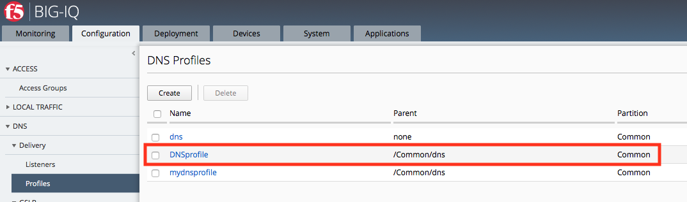
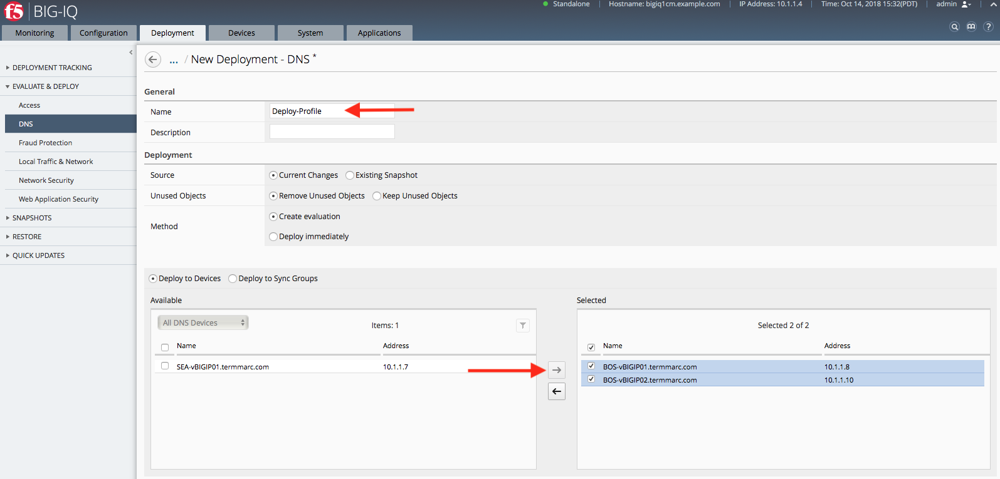
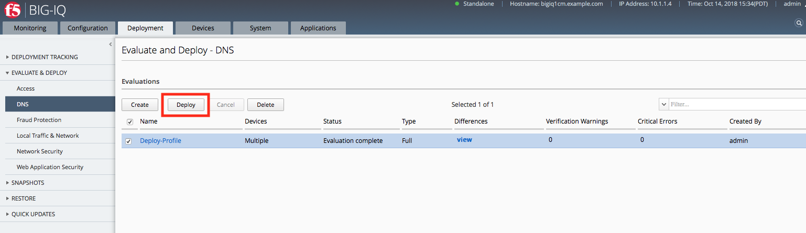
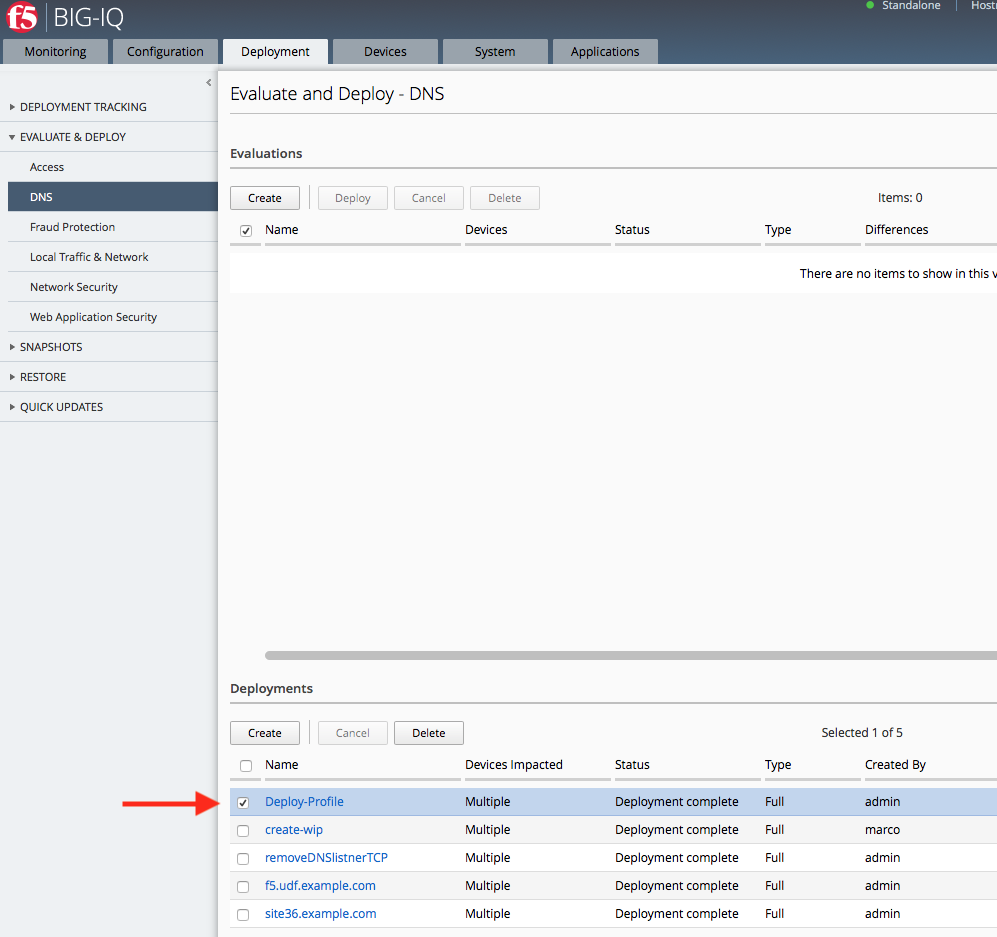

Lab 1.2: Managing DNS Profiles
------------------------------

A DNS profile allows you to configure various DNS attributes that a virtual server or DNS listener object applies to DNS traffic. For example, when you enable the DNS Express feature in the DNS profile, the BIG-IP system acts as an authoritative secondary DNS server, and performs actions such as zone transfers from multiple primary DNS servers or zone transfers from the local BIND server on the BIG-IP system.

You can view the DNS profiles you manage by navigating to "Configuration > DNS > Delivery > Profiles". From there, click "Create" to setup a new one, or click on an existing profile to edit it.

**Create a DNS profile**

You create a profile to configure various DNS attributes that a virtual server or DNS listener object can apply to DNS traffic.

At the top of the screen, click Configuration, then, on the left, click "DNS > Delivery > Profiles".

The screen displays the list of profiles defined on this device.

Click "Create".

The New Profile screen opens.

Type a Name for the DNS profile: **DNSprofile**

Select a Parent Profile from which this profile inherits settings: **/Common/dns**

.. image:: ../pictures/module1/module1_lab3_1.png
  :align: center
  :scale: 50%

Select the options you want to override from the parent DNS profile.

These options perform the same function as they do on a BIG-IP device.

Under DNS Features, check the **Use BIND Server on BIG-IP**, and select **Disabled**.

When your edits are complete, click **Save & Close**.

The system creates the new profile you specified and adds it to the list of profiles.

.. note:: When you edit a default profile, you cannot override the parent profile settings, because default profiles do not have a parent.

Since we intend to use this new Profile when we create a Listener, it's necessary to Deploy it to the devices ahead of the Listener deployment.

.. note:: When you attempt to deploy a Listener that references a Profile that doesn't exist on the target device, you will receive and error.

**Deploying your DNS Profile**

Navigate to the Pinning Policies menu.

.. image:: ../pictures/module1/module1_lab3_3.png
  :align: center
  :scale: 50%

Click the name of the first BOS BIG-IP.

.. image:: ../pictures/module1/module1_lab3_4.png
  :align: center
  :scale: 50%
  
Select the DNSprofile, and click Add Selected.
The Profile will appear in the list of Profiles pinned to this device.
When your edits are complete, click **Save & Close**.

**Repeat for the second BOS BIG-IP device**

We can now see that the BOS BIG-IP devices each have 3 Profiles pinned to them.

.. image:: ../pictures/module1/module1_lab3_5.png
  :align: center
  :scale: 50%
  
Now we need to deploy the Profile. 
Navigate to the Deployment tab and create a DNS Deployment.

.. image:: ../pictures/module1/module1_lab3_6.png
  :align: center
  :scale: 50%
  
Create a sensible name for the deployment and select both BOS BIG-IP devices.

  
After the evaluation completes, select the deployment and click Deploy.

  
Once the deployment finishes, it will be listed in the completed deployments.

  
Now the Profile is ready to be used in a Listener.
  