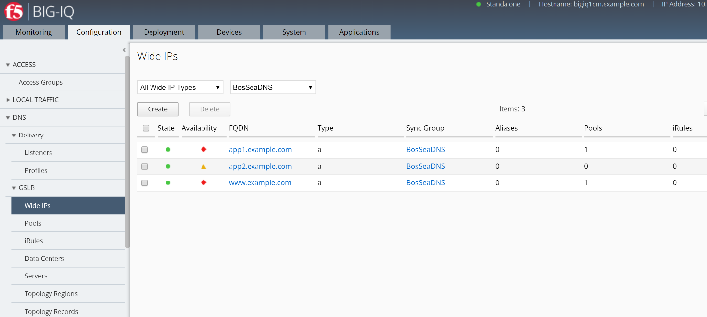
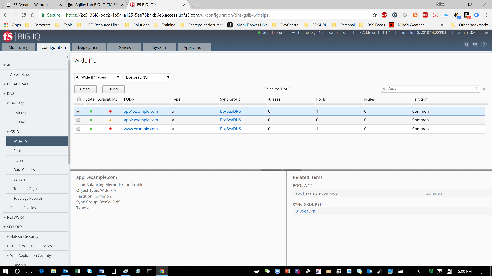

Lab 1.4: Managing permissions for GSLB Objects
----------------------------------------------

**View GSLB objects**

When you use F5 BIG-IQ Centralized Management to manage your DNS sync
group, you can view the GSLB objects that are defined on devices in the
sync group.

.. include:: /accesslab.rst

Tasks
^^^^^

1. At the top of the screen, click Configuration.

2. On the left, click DNS > GSLB, and then select the object type that you want to view.

|image19|

The screen displays a list of the selected object type that are defined on devices managed by this BIG-IQ system. For each object (except topology records or topology regions), icons describe the health status and availability.

3. To view overview information about a particular object, select the check box for that object.

An overview panel and a related items panel display for this object.

|image20|

4. To see a list of related items for a GSLB object:

a. Select the check box for that object.

b. In the Related Items panel, click Show.

|image21|

You can view the list of related items; and, for many of the items, you can click on a link to view properties for that item.

5. To view the general properties for a GSLB object, click the name of that object.

The screen displays the properties for the selected object.

|image22|

.. |image20| image:: media/image21.png
   :width: 6.49583in
   :height: 4.17083in

.. |image22| image:: media/image23.png
   :width: 6.49583in
   :height: 6.27083in