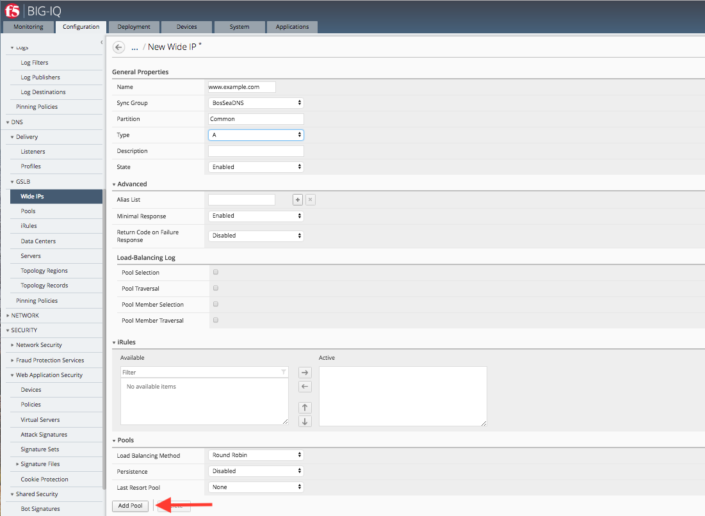
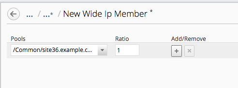
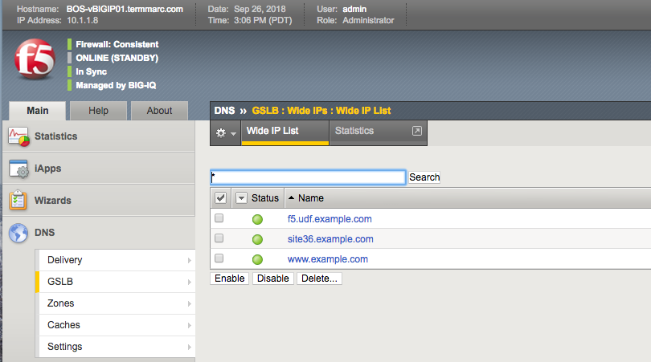

Lab 2.1: Creating a WIP for GSLB
---------------------------------
A wide IP (WIP) maps a fully-qualified domain name (FQDN) to one or more pools of virtual servers that host the content of a domain. When an LDNS issues a DNS name resolution for a wide IP, the configuration of the wide IP indicates which pools of virtual servers are eligible to respond to the request, and which load balancing methods BIG-IP DNS uses to select the pool.

For this lab, we will be creating a WIP to be used on the devices in the BosSeaDNS sync group.  The create a WIP, navigate to *Configuration* > *DNS* > *GSLB* > *Wide IPS* and click the *Create* Button.

.. image:: ../pictures/module2/Createwip_Step1.png
  :align: center
  :scale: 50%

In the *New Wide IP section, fill out the name (Must be a FQDN) with *www.example.com*. Next, select the BosSeaDNS sync group and define the type as *A* (leave the rest of the options as default). There are the same options you would see on the BIG-IP TMUI for creating a WIP. To go to the next step, click on the *Add Pool* button.

For the pool, click the dropdown button and select the */common/site36.example.com* Virtual server. An option let you select more than one pool by clicking on the *Add/Remove* button.

Click *Save and Close* and you are brought back to the *Create Wide IP* screen. Verify the settings are correct and click the *Save and Close* button. You should be brought back to the *Wide IP* screen and the newly created WIP should be there.

.. note:: The WIP will show up as "Waiting for initial data collection" until the configuration is pused to the BIG-IPs and they are able to run their health checks.

.. image:: ../pictures/module2/Createwip_Step4.png
  :align: center
  :scale: 50%

Next, navigate to *Deployment* > *Evaluate & Deploy* > *DNS* and click *Create* under *Deployments*

.. image:: ../pictures/module2/Createwip_Step5.png
  :align: center
  :scale: 50%

On the New Deployment screen, Name the change, select *Deploy immediatly*, *Deploy to Sync Groups* and choose *BosSeaDNS* > click *Deploy*

.. image:: ../pictures/module2/Createwip_Step6.png
  :align: center
  :scale: 50%

.. note:: A warning will pop up about deploying immediatly. Ignore the warning and click *Deploy*

.. image:: ../pictures/module2/Createwip_Step7.png
  :align: center
  :scale: 50%

When the deployment is complete, it will be listed under the *Deployments* section with the status.

.. image:: ../pictures/module2/Createwip_Step8.png
  :align: center
  :scale: 50%

To verify the configuration was done correctly, open the TMUI for one of the BosSeaDNS BIGIPs and navigate to *DNS* > *GSLB* > *Wide IPs* and the newly created www.example.com wip should be there with an available status.

.. note:: Lab complete
