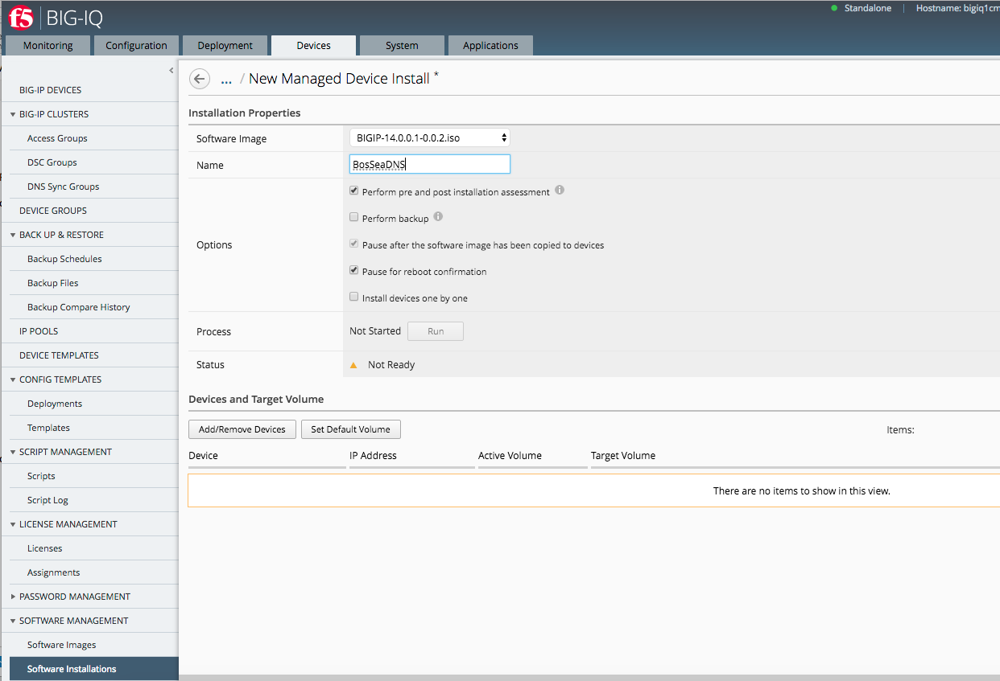
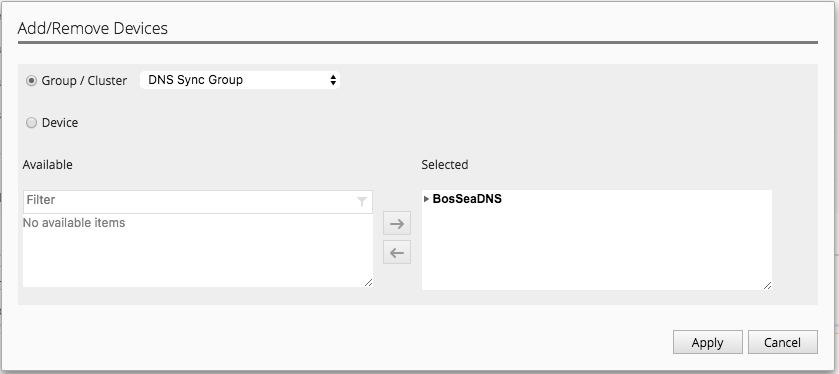
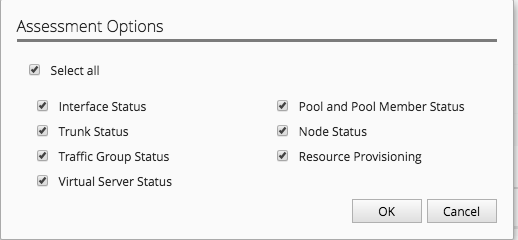
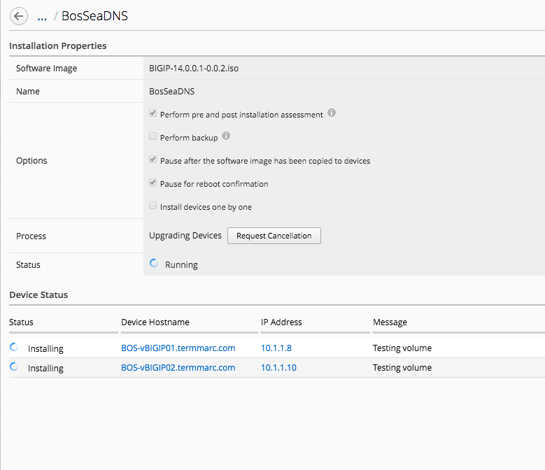
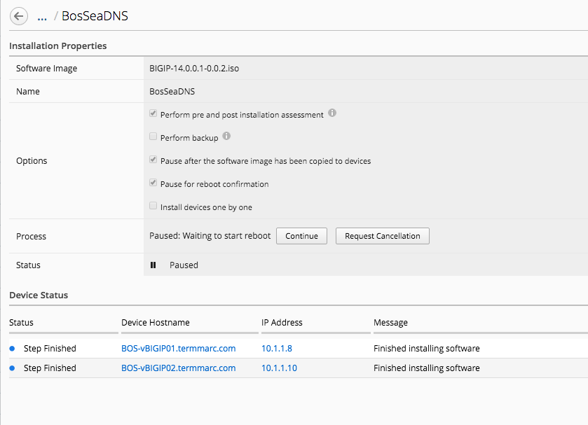
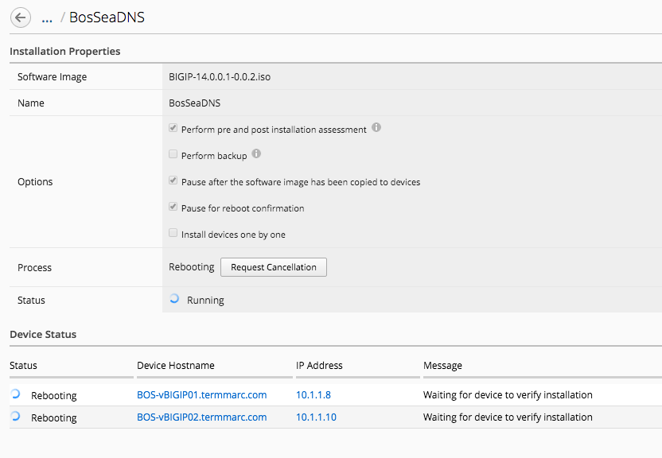
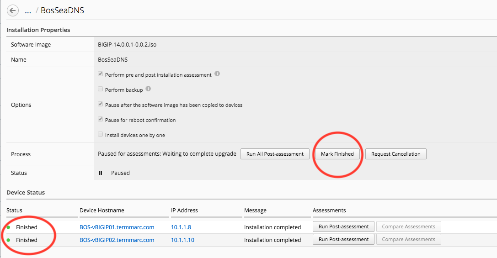
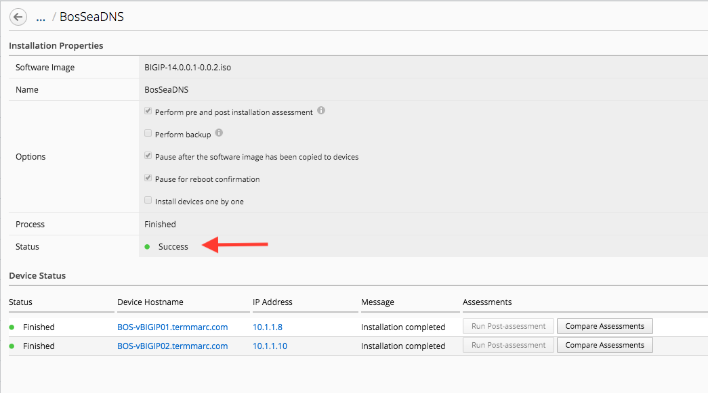
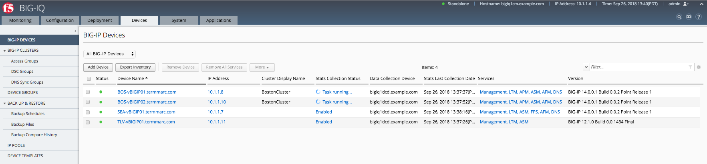

Module 3: Sync Group Management
===============================

.. note:: Estimated time to complete: **5 minutes**

.. include:: /accesslab.rst

Limitations
^^^^^^^^^^^
- Need an GSLB object pre-provision in BIG-IP prior adding any GSLB object from BIG-IQ
- All devices need to be on the same software version

Upgrade Sync Group
^^^^^^^^^^^^^^^^^^
Mannually upgrading BIG-IP DNS systems require specific preparation and configuration when upgrading from version 11.x, or later, to the new version software. BIG-IQ takes the complexity out of the upgrade process and does the Sync group preparation for you

In this lab, we will be upgrading the members of the BosSeaDNS Sync Group from 13.1.0.5 to 14.0.0.1.  This image has already been uploaded to the BIG-IQ, so that precess can be skipped. 

Navagate to *Devices* > *Software Installations* and click *New Managed Device Install*
From here, select the BIGIP-14.0.0.1-0.0.2.iso image.  

.. note:: There are many options for the install such as performing a backup but we will only select the following

Once that is filled out, choose the BosSeaDNS sync group by clicking the *Add/Remove Devices and chosing *Group / Cluster* > *DNS Sync Group*. 

You will now see both devices for the target and the run button will be actionable. Click the *Run* button.

.. image:: ../pictures/module3/Upgrade_Step3.png
  :align: center
  :scale: 50%

Because we chose to perform pre and post Installation assessment, the install will pause until it is ran. To run the Pre-assessment, click the button.

.. image:: ../pictures/module3/Upgrade_Step4.png
  :align: center
  :scale: 50%

It will prompt you on the objects you'd like to perfom the pre-assessment on. Select all and click *OK*.

The process will start and the status will change to *Running* and a Request Cancellation button will appear.

When the Installation is complete, the Status will shoe *Step Finished* and the Process will change to *Paused*. Click the *Continue* button to resume the upgrade.

At this point the BIG-IPs will be rebooted into the new image.  

When the process is done, the status will change to *Finished* and will pause until the *Marked Finished* button is clicked.

If the upgraded process has completed successfully, the process status will turn to *Finished* and the *Status* will display *Success*

To verify, navigate to *Devices* > *BIG-IP Devices* and check the version number.  It should now be BIG-IP 14.0.0.1 Build 0.0.2 Point Release 1

.. note:: Lab complete  
