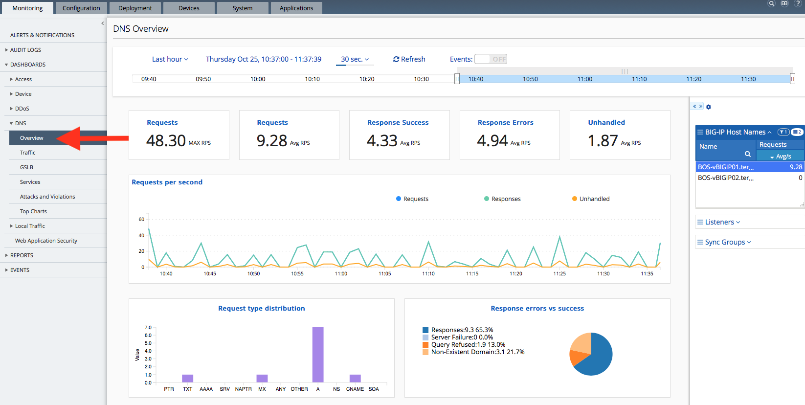
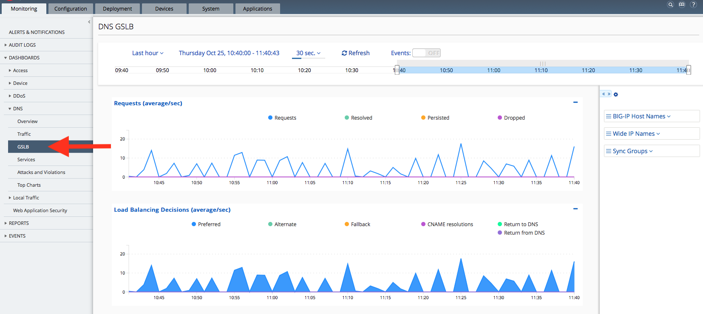
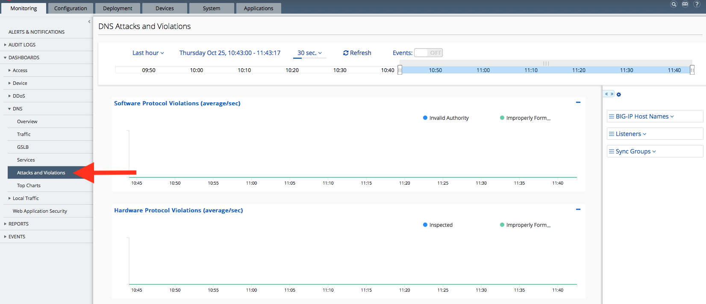
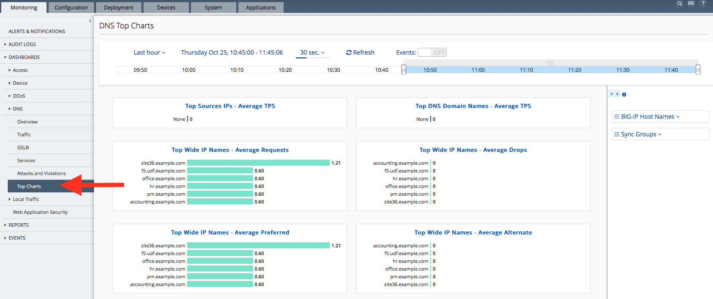

Module 4: DNS Analytics
=======================

.. note:: Estimated time to complete: **5 minutes**

This section of the lab is design to present an overview of the DNS statistics that are available in BIG-IQ. While not a complete customer scenario, the lab environment is built to provide some DNS traffic in order to populate the charts and graphs.

For this lab, the student is not asked to create any configuration, but rather just explore the information available.

.. include:: /accesslab.rst

Tasks
^^^^^

Navigate to *Monitoring* > *Dashboards* > *DNS* > *Overview* 
In this view, you can see a general view of DNS traffic. The panels on the right-hand side may be used to limit the view to a particular device, Listener, or Sync Group.

  
The Traffic tab shows 6 different charts that provide an aggregate view of DNS traffic and query types across all the BIG-IP DNS devices. It still possible to limit the scope of the charts to a particular device, Listener, or Sync group using the panel on the right.

.. image:: ../pictures/module4/Traffic.png
  :align: center
  :scale: 50%
  
The GSLB tab focuses on the Global Server Load Balancing function. The second chart is very useful in identifying potential GSLB decisions. If for example, there were a large number of Alternate selections it could indicate a problem.

  
The Services tab contains 7 different charts which essentially cover all the services which could be configured in a DNS Profile. Please scroll down to review them all. Again, some of these charts can be indicators of issues in the environment.

.. image:: ../pictures/module4/Services.png
  :align: center
  :scale: 50%
  
The charts on the Attacks and Violations tab indicate Protocol Violations found in both hardware and software. The Hardware Protocol Violations are only implemented on the B2250 blade at this time. And, since we aren't generating bad DNS traffic these charts are empty.

  
The Top Charts tab provides summary of top source IPs, Domain names, and Wide IP stats. Because of the limited implementation in the lab environment, there is limit information.

For Four panels titled “Top WideIP Names”
---------------------------------------------
    - These panes will show data only for BIG-IP devices where GTM/DNS has been enabled
    - Further details:
           - in BIG-IP, the WideIP object definition comes from the DNS module. If DNS were not 
             provisioned (installed) on that BIG-IP, there wouldn’t be any WideIPs for data to be 
             collected about, and those “Wide-IP” graphs wouldn’t be relevant.
           - in BIG-IP, “GTM” and “DNS” refer to the same module – BIG-IP renamed the “GTM” module to be “DNS”, 
             presumably as a more user-friendly name.  E.g., in BIG-IP’s System -> Resource Provisioning page, 
             the module is listed as “Global Traffic (DNS)” in the table, and the CPU/Disk/Memory 
             Resource Allocation bars near the top show its color with the label 

For two panels titled "Top Sources IPs – Average TPS" & "Top DNS Domain Names – Average TPS"
----------------------------------------------------------------------------------------------
    - They will NOT show any data for BIG-IP v12 devices (or lower)
    - They only show data for BIG-IP device version >=13.1.0.5
    - They will show data only if AVRD is provisioned
    - Further details:
          - IPs & Domain names are collected by AVR. AVR has to be provisioned (DoS provisioning 
            will likely also make it available, since AVR is embedded inside DoS and DoS serves also DNS activity).
          - Integration between AVR and BIG-IQ started only from BIG-IP version 13.1.0.5 (recommended 
            to use today 13.1.2).  If you use BIG-IP 12.1, BIG-IQ doesn’t get the AVR data.
          - There is tight integration between AVR & AFM. AVR is providing AFM many of its visibility 
            features.