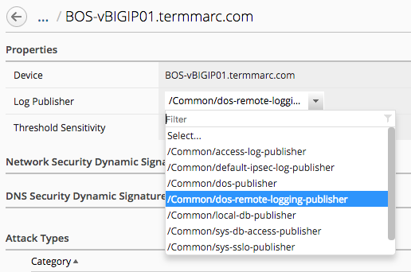
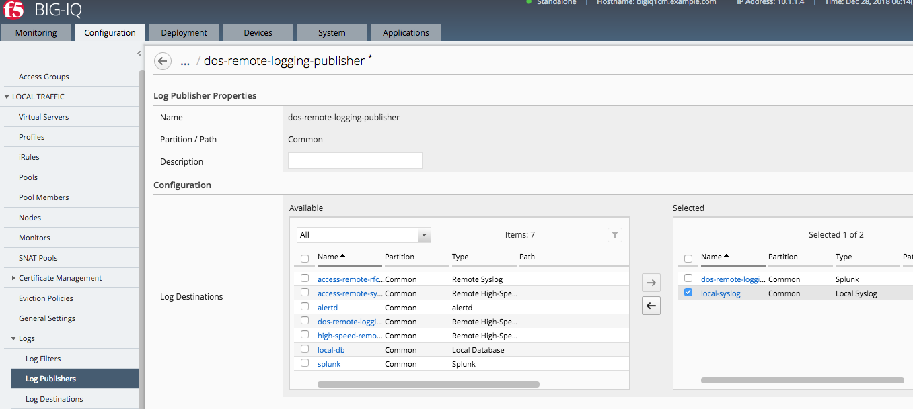

Lab 1.2: Configuring BIG-IP for DDoS Logging to BIG-IQ
------------------------------------------------------

BIG-IP uses logging profiles to format and send DoS log messages to one more destinations. Prior to BIG-IQ 6.0, this confifuration
was done using log destinations, publishers and creating profiles in multiple steps. 

BIG-IQ CM offers a quick way to create this profile, along with all the plumbing bits of a pool member, monitor etc... when using DCDs as the log destination. 

.. include:: /accesslab.rst

Tasks
^^^^^

.. note:: This procedure is near identical to lab 2.1.1 in *Class 7* which configures logging for AFM events. What is different is the service ports for log message desinations, so a DoS Publisher still is required in this use case. 

Begin by creating a Device DoS Log Publisher which can then be re-used for virtual server specific DoS publishing as needed.

1. Log into the BIG-IQ CM
2. Under *Configuration* > *Security* > *Shared Security* > *DoS Protection* > *Device DoS Configurations*, we see all Managed BIG-IPs with Device DoS Profiles
3. Select both *BOS-vBIGIP01*, and *BOS-vBIGIP02* and the *Configure DoS Logging* button will be enabled
4. Click this button to view the following pop up window 

.. image:: ../pictures/module1/dos-log-config.png
  :align: center
  :scale: 50%
  
  

6. Click *Continue* to have BIG-IQ create the objects and observe the pop up window: it outlines the objects being created that you can now view/browse in BIG-IQ. Since this was the Device DoS, only a new publisher has been created (not a profile as that Device DoS is a built in profile).  

7. Click on both *BOS* devices and notice that the publisher is now assigned to both Device DoS configurations: 

Logging publishers created by BIG-IQ use HSL to the DCD as the only log destination: no othe no other destinations are in the publisher by default. If local DB or syslog logging of DoS Events is desired for troubleshooting on the BIG-IP, the publisher be edited to include these destinations. Often local syslog is helpful: lets add that now. 

1. Under *Configuration > Local Traffic > Logs > Log Publishers*  select the newly created publisher *dos-remote-logging-publisher*
2. From here additional log destinations can be added: select and add *local-syslog*, then save and close changes

Finally the changes need to be deployed to the BIG-IPs in order to take affect. Since there is a combination of ADC object (new publisher) and Network Security objects (Device DoS change), the ADC deployment must be done first otherwise Network Security will **fail** due to missing the referenced LTM log profile. Device DoS settings can be viewed under Shared Security in the evaluation differences. 

1. Under *Deployment > Evaluate > Local Traffic* create a new Evalation for *BOS-vBIGIP01 and 02* and deploy the changes after optionally looking at the differences
2. Under *Deployment > Evaluate > Network Security* create a new Evalation for *BOS-vBIGIP01 and 02* and deploy the changes after optionally looking at the differences

