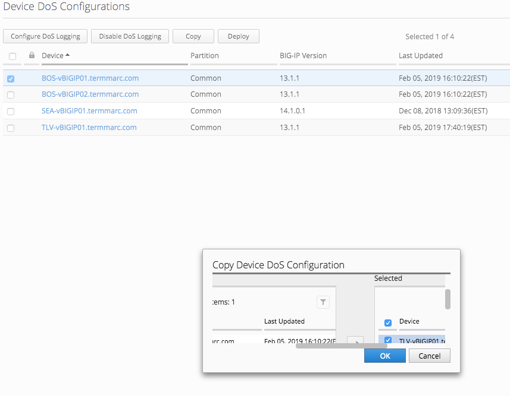

Lab 2.3: Managing Device DoS Profiles
-------------------------------------

.. note:: Estimated time to complete: **5 minutes**

.. include:: /accesslab.rst

Tasks
^^^^^

When managing multiple BIG-IPs with Device DoS Configurations, changing the settings and keeping all profiles in sync can be time consuming if multiple edits of profiles are needed. Another use case is when importing a new BIG-IP and the Device DoS profile needs to be changed from default. 

In BIG-IQ 6.1, the Device DoS Config from one device can be copied to one or more target devices which speeds up the sync process as well as provides protection against typos from multiple edits. 

Previously the Device DoS profile for the BOS cluster was updated. Now we will copy these settings to the SJC BIG-IP as it should be ugpraded and the same TMOS verison which is required for profile copy.

First, some housekeeping to enable AFM on SJC:

1. Use the Web Shell or SSH into the SJC BIG-IP
2. Provision afm: *tmsh modify sys provision afm level nominal*
3. Save changes: *tmsh save sys config*
4. After tmm reprovisions and SJC returns to an active state, discover and import AFM in BIG-IQ
5. Under *Devices* select the SJC BIG-IP and select the *Services* tab
6. Discover and Import *AFM*, choosing *BIG-IQ* for any conflict resolution if prompted

Now that SJC is a managed AFM device, the default Device DoS Profile can be set using the BOS settings we previously edited

1. Under *Configuration* > *Security* > *Shared Security* > *Device DoS Configurations*, Select one of the BOS BIG-IPs
2. With only one selected device, the *Copy* button is enabled
3. Click the *Copy* button
4. Using the Pop up Window, move the SJC BIG-IP (this window may be small and not re-siziable due to a bug) 

5. Select OK and the copy should complete successfully
6. Browse the SJC *Device Dos* configuration and the same settings for DNS Malformed and UDP Flood from BOS are now on SJC
7. Deploy the changes to SJC via *Shared Security* or *Network Security* 

