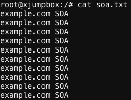
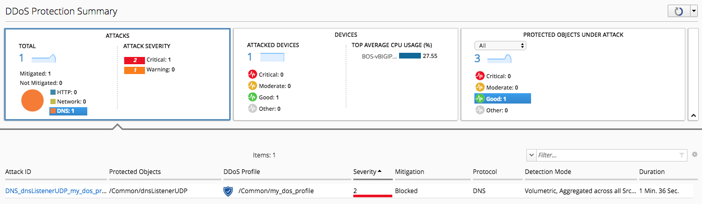

Lab 1.1: Generating Simple DDoS Attacks
---------------------------------------

With the DoS Profiles applied to the BIG-IP, we can now generate attack traffic that will be detected and mitigated. The Ubuntu host has several simple tools useful in generating packet and application based attacks such as hping3 and dnsperf. 

By logging DoS event massagesto the DCDs of BIG-IQ, both archived reporting and real time dashboards can be used to display attack and traffic information. The blueprint has some cron jobs that are generating background periodic attack traffic for additional logs and historical events. 

.. include:: /accesslab.rst

Tasks
^^^^^

First, generate an attack that will be handled by Device DoS:

1. Begin by launching a web shell to the Ubuntu host, and one shell to the active BOS BIG-IP
2. In the Ubuntu shell, launch a malformed packet attack: *hping3 --rand-source -i u2000 --udp -p 53 10.1.10.203*
3. In the BOS BIG-IP shell run: *tail -f /var/log/ltm*
4. Observe the log file until *DNS Malformed* device DoS Messages appear

.. note:: A handy CLI command to look at DoS stats quicker is to use the tmctl command and display individual columns. 
   This is the same data as *tmsh show sec dos device-config* and similar but can be quicker and more customized with *tmctl*
   
   Example: tmctl -w 300 -s vector_name,attack_detected,stats,stat_rate,stats_1m,drops,drops_rate dos_stat  | grep DNS

With the DoS Log messages (which appear since the DoS publisher includes local syslog from the previous configuration step), there is an active DoS Attack against for Malformed DNS at the device level. BIG-IQ has Visibilty for Netowrk and DNS DoS Events in multiple new screens. Lets explore these views!

1. Under *Monitoring* > *Dashboards* > *DDoS* > select *Protection Summary*
2. Select and observe the different data availabe on each of the 3 views: *Attacks*, *Devices*, and *Protected Objects Under Attack*
3. By Default this view is refreshing every 30 seconds: use the refresh animation/drop down in the top right to change

.. image:: ../pictures/module3/protection-summary.png
  :align: center
  :scale: 50%

- Attacks shows a view and relative severity of all current attacks
- Devices shows a view of all attacked devices and their relative health
- Protected Objects allow for viewing Applications and/or Virtual Server objects under DoS Protection (not Device DoS)

Clicking on each of these views allow for selection/deselection of many objects including Attack Types and criticality. Under Protected Objects there is no DNS object listed. Why is that? The reason is this attack is at the Device level: the DoS Profile on the protected object is not involved at this time. Lets now attack DNS VIP and exercise the applied DoS Profile.

1. On the Ubuntu host edit a new file using vi/vim: *vi soa.txt*
2. Add the following query to 10 lines: *example.com soa*
3. Save and exit, then cat the file to validate

4. Launch a DNS attack with dnsperf, 150 QPS for 600 seconds by typing this command: *dnsperf -s 10.1.10.203 -d soa.txt -Q 150 -l 600*
5. tail -f the *ltm* log file on the BOS BIG-IP
6. In BIG-IQ, observe the *Protection Summary* dashboard

If auto-refresh is still enabled at 30 seconds a new DoS Attack should be added within a few minutes. The attack is mitigated quickly on BIG-IP, and the initial view in BIG-IQ is near real time. Once the attack is recorded, statistics are also updated in near real time based on polling intervals. This attack is recorded differently as the Protected Object is highlighted.

Click the link for the Attack, and the details of the attack are now visible. With DNS attacks, query response type/volume provides more granular visibilty and reporting. During the attack the TPS graph will continue to update. Selecting specific time intervals brings up the zoom tool to change the view, or use the time scale sliders for the same effect. 

.. image:: ../pictures/module3/soa-attack-details.png
  :align: center
  :scale: 50%
