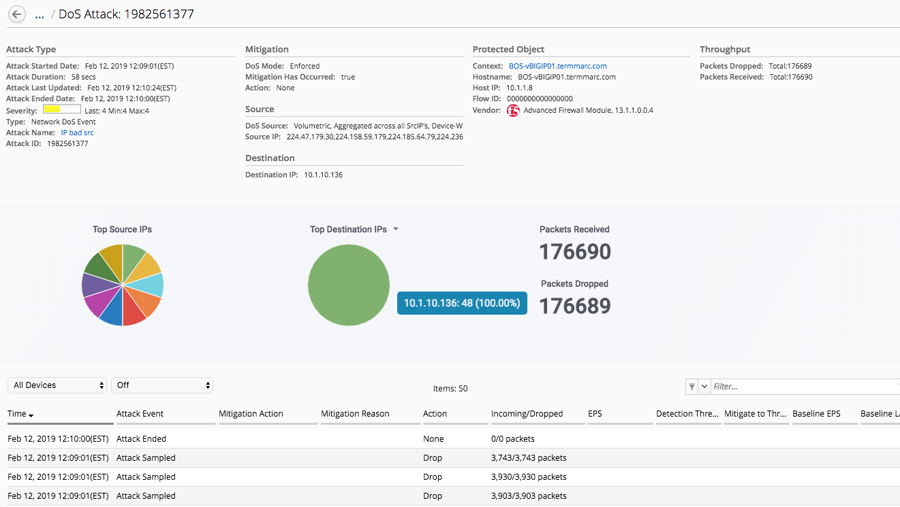
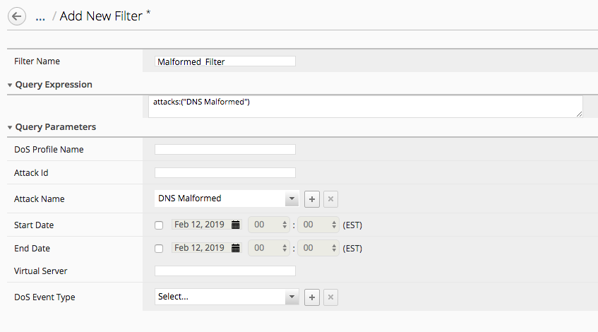

Lab 1.2: Additional DDoS Monitoring 
-----------------------------------

In addition to the DoS Dashboard, there are a few other methods to extract data/reporting information about 
DoS attacks in the Monitoring Tab. Using both *Reports* and *Events*, DoS attack details, events, logs, 
and graphs can be viewed and generated. In additon, filtering by device, attack types are avaialble to fine 
tune the data view. DoS Visibilty and reporting has been improved with each version, which overlaps and 
deprecates in some cases what can be generated on demand in the *Reports* tab. 

.. include:: /accesslab.rst

Tasks
^^^^^

Lets explore the DoS Events section:

1. Under *Monitoring* > *Events* > Select *DoS Summary*. This displays a summary of every dos event across the filters which can be a lot of entries
2. Filter by *Last Hour* and the *BOS* BIG-IP device to look only at recent attacks to that BIG-IP
3. Updated graphs are immedialy re-drawn with the filtered data summary as show below

.. image:: ../pictures/module3/dos-event-summary.png
  :align: center
  :scale: 50%

4. Click on one of the Attack IDs, and a detailed Attack Drilldown view is presented

Several other tabs are avaiable to display events, across different contexts such as Network (DoS), DNS/SIP (protocol specific) and Application (L7/ASM). These views can also be filtered by device and times to fine tune the view. Toggle through the views and you can see there is different data represented. While the *All DoS Attack Events* summarized data, *Network Events* has more details for each DoS attack. 

If the data viewed is not sufficent, filering can be used. The *Filters* tab allows for the creation of a custom Filter that may be used often. Once created, that filter name can be selected and applied to an event view on demand. 

1. Select *Filters* under DoS Events and click the *Add* button
2. Create a filter for only DNS Malformed events as shown below

3. Save and Close the Filter
4. Browse to the *All DoS Attack Events* tab and select *All Devices* which should display lots of events
5. In the Filter tab, select the left icon which exposes a pop up list of all Filters already defined and select the newly created filter
6. This will quicly apply the filter and display the filter name with the results below it

.. image:: ../pictures/module3/filtered-events.png
  :align: center
  :scale: 50%