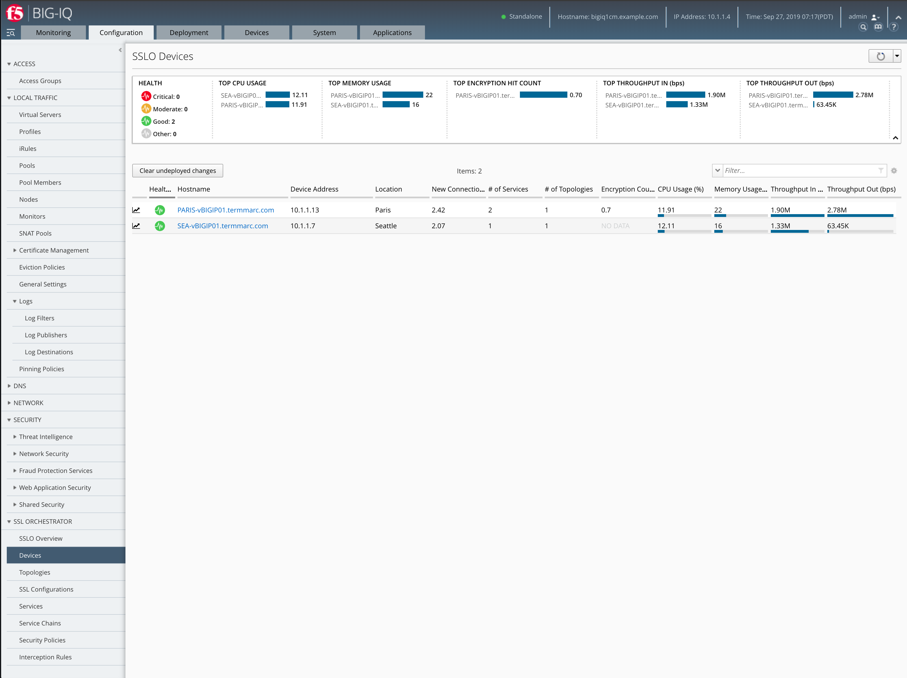
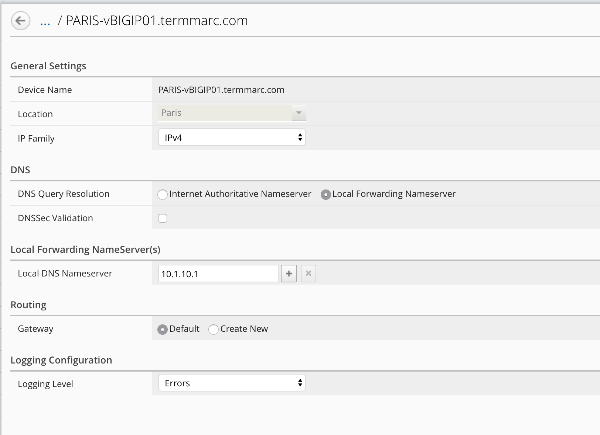

Lab 1.1: Review device discovery
--------------------------------

- Click on Configuration > SSL Orchestrator > Devices

.. note:: You can notice PARIS SSLo has a tag location "Paris" and SEA a tag location "Seattle". Each SSLo is independent and not connected to any other SSLo. All of them are in a different zone (or DMZ) with their own services. 
.. note:: In this lab, SSLo and services are located in the same network in order to simplify the architecutre and reduce the footprint. But let's assume the real use case where SSLo PARIS is located in Paris Datacenter, and SEA in Seattle Datacenter.

- Click on PARIS-vBIGIP01.termmarc.com and review the options

.. note:: You can notice configuration has been imported from SSLo device because we already set this settings on the box itself.

