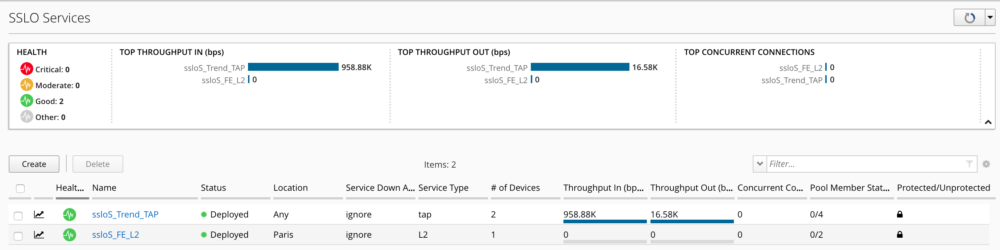
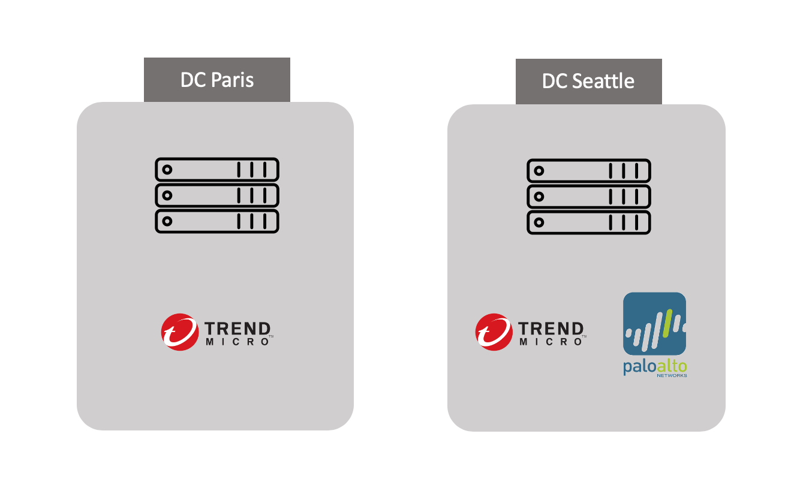
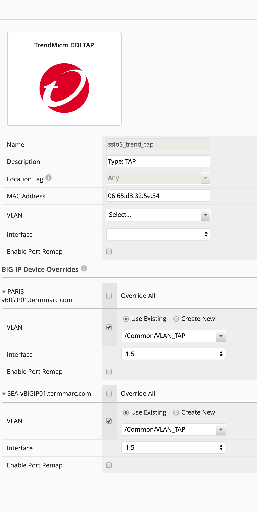
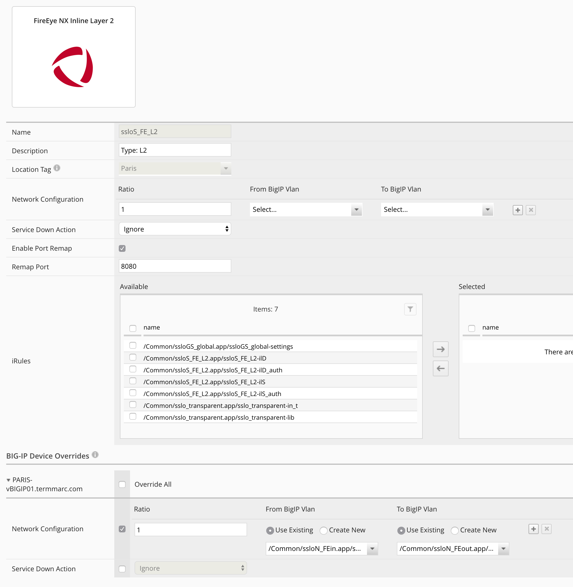

Lab 1.2: Review the security services
-------------------------------------

- Click on Configuration > SSL Orchestrator > Services

.. note:: 2 services are already running. In order to simplfy the lab architecture and to reduce the footprint, the Services are shared between both SSL orchestrators. In a real life, a customer would have different security devices per location.
.. note:: The Trend Micro TAP resource is a shared Security Service between Paris and Seattle. BIG-IQ will take care of the location tag in order to push the right network configuraiton to the right place. Fireeye is only located in Paris datacenter.

- Click on ssloS_Trend_TAP and then edit the service (click on the pencil icon)

.. note:: You can notice the location tag is Any. It means, BIG-IQ can push configuration to all SSLo (Paris and Seattle) regards this service. At the botton, you can notice the location specific configuration. Every SSLo can have a different network architecutre. In our lab, we created exactly the same interface names and VLAN names on both SSLo.

.. note:: In Paris DC, Trend is connected on port 1.5 and VLAN VLAN_TAP.
.. note:: In Seattle DC, Trend is connected on port 1.5 and VLAN VLAN_TAP.

Click Cancel.

- Click on ssloS_FE_L2 and then edit the service (click on the pencil icon)

.. note:: You can notice the location tag is Paris. It means, BIG-IQ can push configuration only to Paris SSLo regards this service. At the botton, you can notice the location specific configuration. Every SSLo can have a different network architecutre.
.. note:: You can notice for the Network Configuration "Use Existing". This is a result of the creation of the service. But when I created the service, I selected "Create New" and I specified the ports to use on SSLo in Paris DC.
