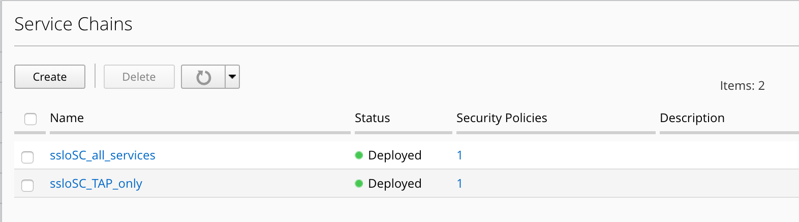
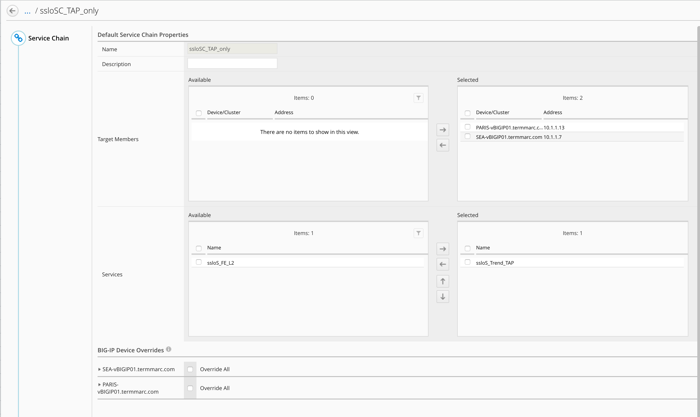
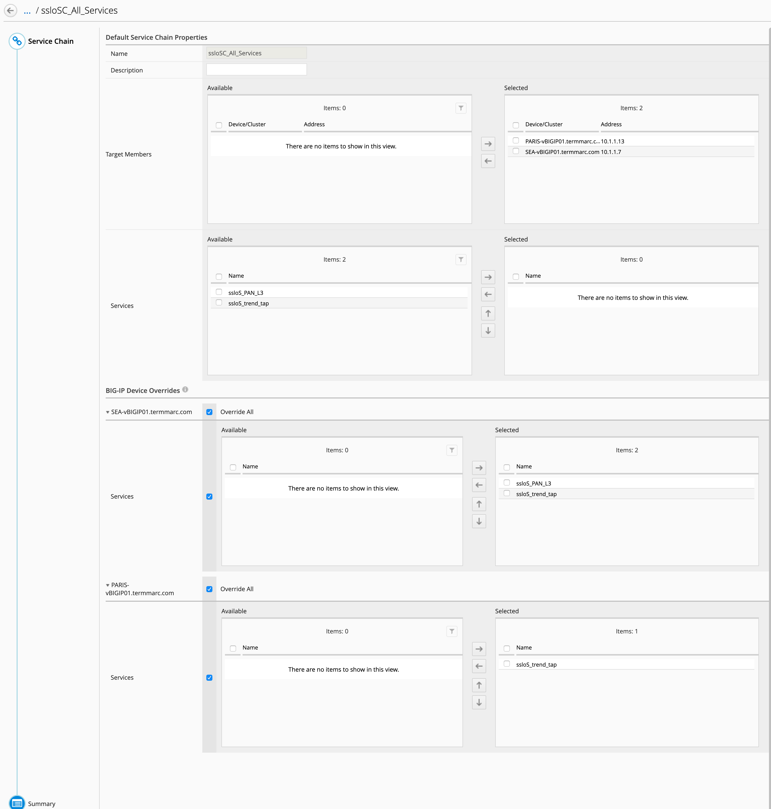

Lab 1.3: Review the service chains
----------------------------------

- Click on Configuration > SSL Orchestrator > Service Chains

.. note:: 2 service chains exist. One is TAP_only, and includes only Trend Micro service. The second one is "All Services" and includes PaloAlto and Trend Micro services.

- Click on ssloSC_TAP_Only and then edit the service (click on the pencil icon)

.. note:: You can notice both SSLo are selected and the Trend Micro service is selected. It means, this service chain will be deploy on both SSLo.

Click Cancel.

- Click on ssloSC_all_services and then edit the service (click on the pencil icon)

.. note:: This Service Chain is more complex. As you can see, both SSLo are selected, no service is selected. Instead, I use the Overriding menu at the bottom.
.. note:: In order to keep SSLo Security Policy consistant, I decided to use and create only one All_Services service chain, but with an exception for Paris. Paris doesn't have PaloAlto service, so I do not select PaloAlto for Paris SSLo. With this trick, I can use the same Service Chain for all SSLo in BIG-IQ and the same Security Policy refering to this Service Chain.
