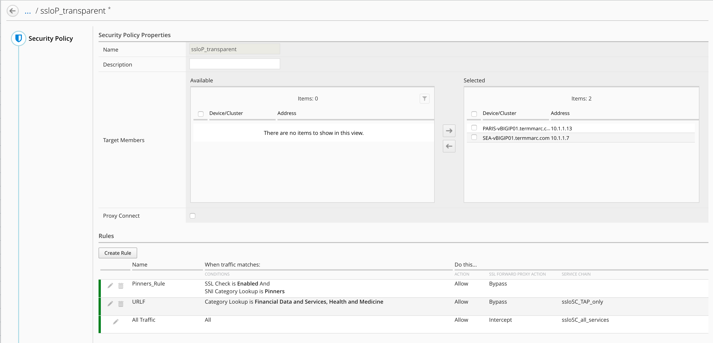

Lab 1.4: Review the security policy
------------------------------------

- Click on Configuration > SSL Orchestrator > Security Policies

- Click on ssloP_transapent and then edit the service (click on the pencil icon)

.. note:: You can notice both SSLo are selected. It means, this security policy will be deploy on both SSLo.

It is important to understand the demo policy expected in this lab.

- If traffic goes to a pinner destination --> bypass (do not decrypt) - This is the default rule in any SSLo policy.
- If traffic goes to Finance or Health website --> bypass (do not decrypt) --> send anyway to TAP_only  (Trend Micro)
- For the rest of the traffic --> intercept (decrypt) --> send traffic to All All_Services

.. note:: Gent reminder, All Services (Service chain) are different between Paris and Seattle (lab 1.3). In Paris "Rest of the traffic" will go to Fireeye and Trend, in Seattle "Rest of the traffic" will go to Trend only.

Click Cancel.

